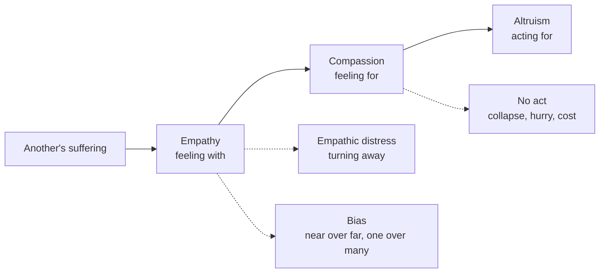

[[_Buddhism Index|Buddhism Index]] | [[Compassion]] | [[Merit]] | [[00 The Bodhisattva Vows]]

# Compassion, Altruism and Empathy

_Feeling with, feeling for, acting for — what contemplative traditions and the sciences say about how another's suffering becomes help given._

## The question this thread follows

Three words are routinely blurred. This thread keeps them apart:

- **Empathy** — sharing or understanding another's state while knowing it is _theirs_. Feeling **with**. It has an affective strand (resonance) and a cognitive strand (perspective-taking, or "theory of mind").
- **Compassion** — being moved by suffering together with the wish that it end. Feeling **for**.
- **Altruism** — a motive or act aimed at another's good, usually at some cost to oneself. Acting **for**.

Four questions follow:

1. Does empathy lead to compassion — or to distress and withdrawal?
2. What carries a person from the feeling to the act?
3. Does the motive behind the act matter, and can anyone tell?
4. Where does the chain break — and can practice mend it?

_The working model this note tests. Solid arrows are the path; dotted arrows are the three places it most often breaks. The model is Claude's framing, drawn from the sources below._

### The three at a glance

| | Empathy | Compassion | Altruism |
| --- | --- | --- | --- |
| **Core** | Resonating with or understanding another's state | Concern for suffering plus the wish to relieve it | Acting for another's good at a cost |
| **Nearest Buddhist term** | The "moving" (_kampana_) in _karuṇā_; _anukampā_; _muditā_ for joy | _karuṇā_; East Asian _jihi_ (慈悲) | _dāna_; the four ways of inclusion |
| **Typical brain signature** | Anterior insula and anterior/mid cingulate (shared with one's own pain) | Medial orbitofrontal cortex, ventral striatum, pregenual cingulate | Reward and valuation circuits; subgenual cingulate for costly giving |
| **Characteristic failure** | Distress, avoidance, parochial bias | Collapse in the face of numbers | Hurry, cost, reward-seeking |

---

## Key terms

| Term | Source | Working gloss |
| --- | --- | --- |
| _karuṇā_ | Pāli / Sanskrit | Compassion: the wish that a being be free of suffering; one of the four _brahmavihāras_ |
| _anukampā_ | Pāli | Sympathy, literally "trembling along with"; compassion expressed as action, above all as teaching |
| _muditā_ | Pāli / Sanskrit | Sympathetic joy — resonance with another's happiness |
| _mahākaruṇā_ | Sanskrit | Great compassion; in Mahāyāna, compassion joined to the vow to free all beings |
| _jihi_ (慈悲, loving-kindness and compassion) | Japanese | One compound for two qualities: 慈 _ji_ (_maitrī_) and 悲 _hi_ (_karuṇā_) |
| _dōji_ (同事, identity action) | Japanese, Dōgen | The fourth of the bodhisattva's ways of embracing beings: non-difference from self and other |
| _omoiyari_ (思いやり, considerate empathy) | Japanese | Sensing another's feelings and needs and acting on them unasked |
| _ceyin zhi xin_ (惻隱之心, heart of compassion) | Classical Chinese | Mencius's name for the spontaneous response to suffering, the sprout of humaneness |
| _Einfühlung_ | German, 1873 | "Feeling-into"; an aesthetic term rendered into English as "empathy" around 1908–09 |
| Emotional contagion | Psychology | Catching another's state _without_ knowing it is theirs — a precursor of empathy |
| Empathic concern / personal distress | Psychology | Other-oriented warmth versus self-oriented alarm when witnessing suffering |
| Altruism | French, 1850s | Coined by Auguste Comte as the opposite of egoism; used in a psychological and a biological sense |

---

## 1. Contemplative sources

### Early Buddhism — being moved, then moving

- **Compassion begins as being moved.** Buddhaghosa's word-gloss makes the empathic moment part of the definition: "When there is suffering in others it causes good people's hearts to be moved (_kampana_), thus it is compassion (_karuṇā_)."[^1]
- **Then it turns toward relief.** Its characteristic is promoting the allaying of suffering; its function is not bearing others' suffering; it shows itself as non-cruelty; it arises from seeing the helplessness of those overwhelmed by suffering. **"It succeeds when it makes cruelty subside and it fails when it produces sorrow."**[^1] Its _near enemy_ is grief rooted in household life; its _far enemy_ is cruelty. The near-and-far-enemy scheme is Buddhaghosa's commentarial systematisation; the popular line that "pity" is the near enemy is a later gloss, not his wording.
- **Anukampā moves outward.** The Buddha sends his first disciples out "for the welfare and happiness of the people, out of sympathy for the world" — the Pāli is _lokānukampāya_.[^2] Teaching is the altruistic act; _anukampā_ is its motive.
- **Karuṇā is cultivated inward.** ==In the \*brahmavihāra\* formula, the meditator spreads "a heart full of compassion" in every direction — "abundant, expansive, limitless, free of enmity and ill will."==[^3] The same formula is given for _muditā_, sympathetic joy: the tradition trains resonance with others' happiness as deliberately as with their pain.
- **Sharing another's condition is itself a practice.** The four ways of inclusion are "giving, kindly words, taking care, and equality" — _dāna, peyyavajja, atthacariyā, samānattatā_.[^4] The fourth, _samānattatā_, is treating others as on a level with oneself.

Harvey Aronson's study of the Pāli discourses is organised around the seam between sympathy as a motive for social action and the sublime attitudes as meditative cultivation.[^5]

### Mahāyāna — compassion made into a vow

- **Śāntideva turns perspective-taking into an argument.** In chapter 8 of the _Bodhicaryāvatāra_, the classic manual of [[Bodhicitta|bodhicitta]], pain is to be removed because it is pain; whose pain it is adds nothing. The chapter moves from meditation on the **equality of self and other** (8.90 onward) to their **exchange** (8.120 onward).[^6] This is cognitive empathy pushed to its limit — and the most explicitly _argued_ altruism in the Buddhist canon.
- **Lojong puts the exchange into the breath.** The mind-training literature, carrying the teaching on exchanging self and other that Atiśa brought from India, was consolidated in Chekawa's _Seven-Point Mind Training_ (twelfth century), the root text of _tonglen_ ("sending and taking"): breathing in others' suffering, breathing out one's own well-being.[^7] Tonglen deliberately invites resonance, but holds it inside a compassionate intention.
- **Compassion begins with hearing.** Avalokiteśvara's East Asian name — Chinese _Guanshiyin_ (觀世音), Japanese _Kanzeon_ (観世音) — means "Perceiver of the World's Sounds." In the _Lotus Sūtra_, when suffering beings call his name, "at once he will perceive the sound of their voices and they will all gain deliverance from their trials."[^8] Attention to the cry comes first; rescue follows.
- **East Asia fuses the two qualities.** In Chinese and Japanese Buddhism, _maitrī_ and _karuṇā_ become the single word _jihi_, glossed in the formula _bakku yoraku_ (抜苦与楽, removing suffering and giving happiness). The standard source for the division is the _Da zhidu lun_ (大智度論), attributed to Nāgārjuna.[^9]
- **Dōgen makes non-difference a method.** In 「菩提薩埵四摂法」(_Bodaisatta shishōbō_, The Bodhisattva's Four Methods of Guidance), a fascicle of the _Shōbōgenzō_, Dōgen takes up the same four ways of inclusion — _fuse_ (布施, giving), _aigo_ (愛語, loving speech), _rigyō_ (利行, beneficial action) and _dōji_ (同事, identity action). "Identity action means nondifference. It is nondifference from self, nondifference from others."[^10]

### Other traditions — the same question in different words

- **Mencius (fourth century BCE).** Anyone who suddenly sees a child about to fall into a well feels alarm and compassion — not to win favour with the parents, not for reputation, not to stop the crying. That response is the _sprout_ of _ren_ (仁, humaneness): real, universal, and small, needing cultivation to grow.[^11] He rules out the same self-serving motives that Batson's experiments later try to exclude.
- **The Good Samaritan (Luke 10:25–37).** Asked "who is my neighbour?", the parable answers with a stranger from a despised group who is moved with compassion — the Greek verb _splanchnizomai_ is rooted in the gut — and pays from his own purse.[^12] It later became a laboratory paradigm (section 3).
- **Omoiyari in Japanese social ethics.** Anthropological work treats _omoiyari_ — sensing what another feels and needs, and meeting it without being asked — as a central Japanese value.[^13] It is empathy defined by its outcome in considerate action.

---

## 2. Philosophy — naming the three

### Empathy — a young word for an old capacity

- **Sympathy by imagination (1759).** Adam Smith opens _The Theory of Moral Sentiments_: "How selfish soever man may be supposed, there are evidently some principles in his nature, which interest him in the fortune of others." Fellow-feeling arises "by changing places in fancy with the sufferer."[^14] What Smith called sympathy, psychology now calls empathy.
- **Born in aesthetics (1873).** Robert Vischer coined _Einfühlung_, "feeling-into," for the way a viewer feels into the forms of art and nature; Theodor Lipps developed it into a psychology of projection and inner imitation.[^15] English psychologists rendered it as "empathy" around 1908–09. Susan Lanzoni's history traces how the word later turned almost into its opposite: from projecting one's own feeling into a form, to setting one's own feelings aside to understand another accurately.[^16]
- **Phenomenology (1917).** Edith Stein, writing under Husserl, described empathy as its own kind of act: another's experience is given to me as _theirs_, present to me but not lived by me as mine — distinct from contagion or merging.[^17]
- **Eight senses.** Batson distinguishes eight phenomena that share the name — from knowing another's thoughts and feelings, to matching their posture, to feeling as they feel, to imagining how one would feel in their place, to feeling distress at their suffering, to feeling for them.[^18] Much disagreement about empathy is disagreement about which of these is meant.

### Compassion — a feeling that contains judgments

- **Schopenhauer (1840).** Compassion (_Mitleid_) is the sole source of moral worth; it rests on an intuitive identification of oneself with every striving and suffering being.[^19]
- **Nussbaum (2001).** Compassion requires three judgments: that the suffering is serious, that the sufferer does not deserve it, and that this person is part of one's circle of concern. Empathy is "a prominent route" to compassion but "uneven and very malleable" — easier for the similar and the near — so it is neither sufficient for compassion nor a reliable moral guide on its own.[^20]

### Altruism — the word and two arguments

- **The word.** Auguste Comte coined _altruisme_ in the early 1850s as a term in his "cerebral theory" and the central ideal of his atheistic Religion of Humanity; Thomas Dixon traces how it spread through Victorian Britain, including Herbert Spencer's broader use.[^21] That history is why "altruism" means a _motive_ to a psychologist and a _fitness cost_ to an evolutionary biologist.
- **A demand of reason.** Thomas Nagel argued that recognising oneself as one person among others, equally real, commits one to treating their reasons as reasons for oneself.[^22] Śāntideva's equality argument makes the same move more than a millennium earlier.
- **Without distance.** Peter Singer argued that if we can prevent something very bad without sacrificing anything of comparable moral importance, we ought to — and that distance makes no moral difference.[^23] Its structure is Mencius's child at the well with the well moved to another continent.

---

## 3. What the sciences say

### Empathy — a shared-representation core

- **Perception–action.** Preston and de Waal proposed that perceiving another's state activates one's own representations of that state, which in turn drive bodily and emotional responses.[^24] De Waal argues this mechanism is phylogenetically ancient, probably as old as mammals and birds, and grows from state-matching into concern and perspective-taking.[^25]
- **Affective, not sensory.** When people learned that a loved one in the same room was receiving pain, their anterior insula and rostral anterior cingulate responded as they did for their own pain, and more so in people scoring higher on empathy; the sensory parts of the pain network did not.[^26]
- **A robust core.** A meta-analysis of 32 coordinate-based and nine image-based fMRI studies found a consistent core of bilateral anterior insula and medial/anterior cingulate cortex for empathy for pain, overlapping with first-hand pain.[^27]
- **Feeling and knowing are different systems.** Meta-analyses separate affective empathy from cognitive empathy (perspective-taking) at the neural level.[^28] Socio-affective routes (empathy, compassion) and the socio-cognitive route (theory of mind) run on separable networks, joined by self–other distinction.[^29]
- **Four facets.** Davis's Interpersonal Reactivity Index splits empathy into perspective-taking, fantasy, empathic concern and personal distress. Personal distress — self-oriented alarm — was the facet most strongly linked to low self-esteem, poor interpersonal functioning and vulnerability.[^30]
- **The key line.** Singer and Klimecki define empathy as feeling _with_ someone while knowing the feeling is theirs; without that self–other distinction it is emotional contagion. Compassion is feeling _for_ someone — warmth, concern and the motivation to help.[^31] Empathy resonates with joy as well as pain.

### Roots — altruism evolved, and it appears early

- **Kin and reciprocity.** Hamilton showed how helping relatives can be favoured by selection; Trivers modelled help between non-kin and read sympathy, gratitude, trust and guilt as adaptations that regulate reciprocal exchange.[^32] [^33]
- **Compassion as a distinct emotion.** Goetz, Keltner and Simon-Thomas's review finds compassion has its own appraisals (tuned to undeserved suffering), its own caregiving signals, and an approach orientation, distinct from distress, sadness and love.[^34]
- **Early helping.** Children as young as 18 months readily help others reach their goals, with similar but less robust helping in young chimpanzees.[^35] External rewards _undermine_ the tendency.[^36]
- **The body's signature.** Compassion is associated with increased vagal activity and often lower heart rate — a settling, approach-oriented state rather than alarm.[^37]

### From empathy to helping — which part of empathy helps?

- **A modest link.** Eisenberg and Miller's meta-analysis found low-to-moderate positive relations between empathy and prosocial behaviour, varying with how empathy was measured.[^38]
- **The empathy–altruism debate.** In Batson's experiments, high-empathy observers helped a person receiving shocks even when they could easily leave.[^39] Cialdini's team replied that empathy brings personal sadness, and relieving it drives the help.[^40] Batson concluded that egoistic and altruistic helping both exist.[^41]
- **Concern, not distress.** Trait empathic concern — not trait personal distress — predicted costly altruism, supported by activity in ventral tegmental area, caudate and subgenual anterior cingulate, regions tied to attachment and caregiving.[^42]
- **Empathy can raise giving.** In a within-subject Dictator Game, an empathy induction substantially increased sharing, and the rise in empathy predicted over 40 per cent of the rise in sharing.[^43]
- **Two routes in.** Anterior insula encoded affective empathy for recipients and temporoparietal junction encoded perspective-taking; each predicted generous donations, weighted differently in different people.[^44]
- **Situation beats sermon.** In "From Jerusalem to Jericho," seminary students in a hurry were more likely to pass a slumped stranger; preparing a talk on the Good Samaritan made no significant difference.[^45]
- **Extraordinary altruists feel more, not less.** People who donated a kidney to a stranger showed greater right-amygdala volume and responsiveness to fearful faces[^46], greater self–other overlap in anterior insula for pain[^47], and generosity that reflects how their brains _value_ strangers' welfare — while loving-kindness training did not make controls more generous.[^48]

### The brain — giving registers as reward

- **Giving feels like receiving.** Anonymous donations to real charities engaged the mesolimbic reward system as receiving money did.[^49]
- **Altruistic and strategic giving differ.** Across 36 fMRI studies (1,150 participants), strategic giving showed more striatal activity; altruistic giving recruited subgenual anterior cingulate and posterior ventromedial prefrontal cortex.[^50]

### Training — empathy, compassion and perspective are different skills

- **Empathy training hurts; compassion training heals.** Training empathic resonance increased negative affect and insula–cingulate activity; subsequent compassion training reversed it, raised positive affect, and recruited a non-overlapping network in medial orbitofrontal cortex, ventral striatum and pregenual cingulate.[^51]
- **It matters what you practise.** In the ReSource Project (N = 332), compassion rose most after the socio-affective module, and theory of mind partly improved after the socio-cognitive module.[^52] Each module changed cortical thickness in different regions, tracking the matching behavioural gains.[^53]
- **Compassion training changes behaviour.** Two weeks of daily compassion practice increased altruistic redistribution of money to a stranger[^54]; brief meditation courses increased giving up a seat to a person in visible pain[^55], replicated with an active control — without improving empathic accuracy.[^56]
- **Meta-analyses.** Across 26 randomised trials, meditation had small-to-medium effects on self-reported (SMD 0.40) and observed (SMD 0.45) prosocial outcomes[^57]; compassion-based interventions raised compassion (d = 0.55) and well-being (d = 0.51), with a caveat about small samples.[^58]
- **Tonglen measured.** In 60 healthcare workers, 15 minutes of guided tonglen increased heart-rate variability, state compassion and affective responses to suffering.[^59]
- **Empathy for outsiders can be learned.** Receiving costly help from an out-group member produced a learning signal in anterior insula that predicted increased empathy for other out-group members; surprisingly few positive experiences were enough.[^60]

### Limits — where the chain breaks

- **People avoid empathy.** When they knew they would be asked for costly help, people chose not to hear an empathy-inducing appeal.[^61] Across 11 studies, people avoided empathy because it felt effortful and inefficacious; raising its perceived efficacy removed the avoidance.[^62] Zaki's review frames empathy as motivated: people approach or avoid it according to its costs and rewards.[^63]
- **Empathy is parochial.** Football fans' helping of an in-group member was predicted by anterior insula activity and empathic concern; refusing to help a rival fan was predicted by nucleus accumbens activity and negative evaluation.[^64]
- **Compassion collapses with numbers.** People often feel less for many victims than for one, especially when they expect to be asked for money and are skilled at regulating emotion — a motivated turning-down of feeling.[^65] The decline may begin with the second life.[^66] A meta-analysis of 41 studies found larger victim groups reduce helping mainly through lower anticipated good feeling and perceived impact, not reduced empathic concern.[^67] A preregistered replication with hypothetical donations found no identifiable-victim effect.[^68]
- **Against empathy?** Bloom argues empathy is narrow, innumerate and biased, and that compassion is the better guide.[^69] Work comparing effective altruists and kidney donors finds reasoning and empathy each predict impartial, effective altruism — most strongly together.[^70]
- **Brief empathy interventions often fail.** Five preregistered online studies (N = 4,776) found brief motivation-based interventions generally did not increase empathy or giving; telling people empathy is limited often _reduced_ it.[^71]
- **The warm glow is fragile.** Prosocial spending is linked to happiness across 136 countries[^72]; high-powered replications find the effect small and method-dependent[^73]; where choices could save a life, the boost reversed after a month.[^74]

---

## 4. Where the threads meet

_This section is Claude's synthesis, not a finding of any single source._

1. **Buddhaghosa already had the sequence.** His definition of _karuṇā_ runs empathy → compassion → action: the heart is moved (_kampana_), the aspect is allaying suffering, the function is not bearing others' pain. His failure condition — compassion "fails when it produces sorrow" — is the line Singer and Klimecki draw between empathic distress and compassion, fifteen centuries later.
2. **Empathy is a doorway, not a destination.** Resonance alone raises distress (empathy training, personal distress, empathy avoidance); resonance turned toward care produces warmth and helping (compassion training, empathic concern). Tonglen is a deliberate version of this turn: take the suffering in, send care out.
3. **There are two doors.** Affective resonance and perspective-taking are separate systems and separate trainings. Buddhist practice cultivates both: _mettā_, _karuṇā_ and _tonglen_ on the affective side; Śāntideva's equalising and exchanging on the cognitive side. ReSource's finding — that it matters what you practise — suggests a complete path needs both.
4. **Motive matters, and the brain partly registers it.** Mencius strips out reward and reputation; Batson and Cialdini fought over the same ground; rewards undermine toddlers' helping; strategic and altruistic giving recruit different circuits. The Chan distinction in Bodhidharma's reply to Emperor Wu — giving for return versus giving without — now has a neural analogue (see [[Merit]]).
5. **Scope is the hard problem, and empathy is where bias enters.** Empathy favours the near and the one; compassion collapses before the many. The _brahmavihāras_ are "immeasurable," and the Visuddhimagga's method extends them step by step until the barriers between self, dear, neutral and hostile persons break down.[^1] The nearest lab analogue is the finding that a few good experiences with out-group members widen empathy. No study yet shows compassion practice widening _scope_ rather than intensity.
6. **Honest gaps.** Loving-kindness training did not raise generosity in the kidney-donor study; brief empathy interventions often fail; the happiness of giving is small and may reverse; most training trials are small. The traditions never promised that giving would feel good.

## 5. Questions to carry forward

- _Einfühlung_ began as a theory of how a viewer feels into a form. What does the aesthetic origin of empathy offer an art or body-based practice?
- Is _dōji_ — non-difference from self and other — empathy, compassion, or something prior to the split between them?
- Does cultivating _muditā_ (resonance with joy) protect against empathic distress?
- Is the "taking in" of tonglen physiologically distinct from empathic distress? Early data suggest settling rather than arousal.
- Does a **vow** — a commitment made in advance (see [[00 The Bodhisattva Vows]]) — do measurable work that a feeling alone does not?
- Can any training widen **scope** (reduce compassion collapse and in-group bias), or only intensity?

---

## Sources at a glance

**Spiritual — primary texts:** _Vatthūpama Sutta_ (MN 7); _Dutiyamārapāsa Sutta_ (SN 4.5); _Saṅgaha Sutta_ (AN 4.32); Buddhaghosa, _Visuddhimagga_; Śāntideva, _Bodhicaryāvatāra_; Chekawa, _Seven-Point Mind Training_; _Lotus Sūtra_ ch. 25; _Da zhidu lun_; Dōgen, _Bodaisatta shishōbō_; _Mengzi_; Luke 10.

**Academic — humanities:** Aronson (1980); Smith (1759); Vischer (1873); Stein (1917/1989); Lanzoni (2018); Batson (2009); Schopenhauer, trans. Janaway (2009); Nussbaum (2001); Dixon (2008); Nagel (1970); Singer (1972); Lebra (1976); Buswell and Lopez (2014).

**Scientific — empathy:** Preston and de Waal (2002); de Waal (2008); Singer et al. (2004); Lamm et al. (2011); Kogler et al. (2020); Preckel et al. (2018); Davis (1983); Singer and Klimecki (2014); Zaki (2014); Shaw et al. (1994); Cameron et al. (2019); Hein et al. (2010, 2016); Tagesson et al. (2025).

**Scientific — evolution, development and motive:** Hamilton (1964); Trivers (1971); Goetz et al. (2010); Warneken and Tomasello (2006, 2009); Stellar et al. (2015); Eisenberg and Miller (1987); Batson et al. (1981); Cialdini et al. (1987); Batson and Shaw (1991); FeldmanHall et al. (2015); Klimecki et al. (2016); Tusche et al. (2016); Darley and Batson (1973).

**Scientific — altruism, training and limits:** Marsh et al. (2014); Brethel-Haurwitz et al. (2018); Rhoads et al. (2023); Moll et al. (2006); Cutler and Campbell-Meiklejohn (2019); Klimecki et al. (2014); Trautwein et al. (2020); Valk et al. (2017); Weng et al. (2013); Condon et al. (2013); Lim et al. (2015); Luberto et al. (2018); Kirby et al. (2017); Andreu et al. (2025); Cameron and Payne (2011); Västfjäll et al. (2014); Butts et al. (2019); Maier et al. (2024); Bloom (2017); Law et al. (2026); Aknin et al. (2013, 2020); Falk and Graeber (2020).

## To review

- 27 September 2026 · Visuddhimagga IX · the _karuṇā_ passages were checked against a reproduction of Ñāṇamoli's translation, not the BPS PDF; confirm paragraph numbers (§92 gloss, §94 characteristic, §§99–100 enemies)
- 27 September 2026 · Lebra, _Japanese Patterns of Behavior_ · _omoiyari_ discussion not located in the text; confirm chapter and wording
- 27 September 2026 · Stein, _On the Problem of Empathy_ · characterisation paraphrased from secondary literature; check against the ICS translation
- 27 September 2026 · Vischer 1873 · coinage confirmed via the _International Lexicon of Aesthetics_; place of publication not checked
- 27 September 2026 · Vanden Eynde, _Journal of Buddhist Ethics_ · volume and year not confirmed; Nussbaum chapter numbers from standard knowledge
- 27 September 2026 · _Da zhidu lun_ (T 1509) · the _jihi_ division is attributed from standard reference knowledge; passage and fascicle not checked
- 27 September 2026 · Buswell and Lopez, _Princeton Dictionary of Buddhism_ · print; entry not opened
- 27 September 2026 · Nagel, _The Possibility of Altruism_ · publisher page not opened
- 27 September 2026 · Kogler et al. 2020; Hein et al. 2016; Rhoads et al. 2023; Maier et al. 2024; Andreu et al. 2025; Tagesson et al. 2025; Law et al. 2026 · volume, issue, page or article numbers not all confirmed
- 27 September 2026 · Luke 10:33 _splanchnizomai_ · not checked against a critical Greek edition

## Attribution

Claude, Anthropic, claude-opus-5-5, conversation with author, 27 September 2026.

---

## References

[^1]: Buddhaghosa, _[The Path of Purification (Visuddhimagga)](https://www.accesstoinsight.org/lib/authors/nanamoli/PathofPurification2011.pdf)_, trans. Bhikkhu Ñāṇamoli (Kandy: Buddhist Publication Society, 2011), chap. IX; on compassion, §§92–100.

[^2]: _Dutiyamārapāsa Sutta_ (SN 4.5, "Māra's Snares (2nd)"), trans. Bhikkhu Sujato, [SuttaCentral](https://suttacentral.net/sn4.5/en/sujato). The same charge opens the mission of the first disciples in the Vinaya, Mahāvagga 1.11.

[^3]: _Vatthūpama Sutta_ (MN 7, "The Simile of the Cloth"), trans. Bhikkhu Sujato, [SuttaCentral](https://suttacentral.net/mn7/en/sujato).

[^4]: _Saṅgaha Sutta_ (AN 4.32, "Inclusion"), trans. Bhikkhu Sujato, [SuttaCentral](https://suttacentral.net/an4.32/en/sujato).

[^5]: Harvey B. Aronson, _[Love and Sympathy in Theravāda Buddhism](https://www.mlbd.in/products/love-and-sympathy-in-theravada-buddhism-harvey-b-aronson-9788120814035-8120814037)_ (Delhi: Motilal Banarsidass, 1980).

[^6]: Śāntideva, _[The Bodhicaryāvatāra](https://global.oup.com/academic/product/the-bodhicaryavatara-9780199540433)_, trans. Kate Crosby and Andrew Skilton (Oxford: Oxford University Press, 1996), 8.90–140.

[^7]: Thupten Jinpa, trans., _Mind Training: The Great Collection_, Library of Tibetan Classics 1 (Boston: Wisdom Publications, 2006).

[^8]: _The Lotus Sutra_, trans. Burton Watson (New York: [Columbia University Press](https://cup.columbia.edu/book/the-lotus-sutra/9780231081610/), 1993), chap. 25.

[^9]: _Da zhidu lun_ 大智度論 (T 1509); see Robert E. Buswell Jr. and Donald S. Lopez Jr., _The Princeton Dictionary of Buddhism_ (Princeton: Princeton University Press, 2014), s.v. "karuṇā."

[^10]: Dōgen, "The Bodhisattva's Four Methods of Guidance" (_Bodaisatta shishōbō_ 菩提薩埵四摂法), in _Treasury of the True Dharma Eye: Zen Master Dōgen's Shōbō Genzō_, ed. Kazuaki Tanahashi (Boston: Shambhala, 2010). Tanahashi's edition is a trade publication; cite it for the translation only.

[^11]: _Mengzi_ 2A6, in _Mengzi: With Selections from Traditional Commentaries_, trans. Bryan W. Van Norden (Indianapolis: Hackett, 2008).

[^12]: Luke 10:25–37 (NRSV); the verb at 10:33 is _splanchnizomai_.

[^13]: Takie Sugiyama Lebra, _[Japanese Patterns of Behavior](https://uhpress.hawaii.edu/title/japanese-patterns-of-behavior/)_ (Honolulu: University Press of Hawaii, 1976).

[^14]: Adam Smith, _The Theory of Moral Sentiments_ (1759), pt. I, sec. I, chap. 1, "[Of Sympathy](https://www.adamsmithworks.org/documents/chapter-i-of-sympathy)"; standard edition ed. D. D. Raphael and A. L. Macfie (Oxford: Clarendon Press, 1976).

[^15]: Robert Vischer, _Über das optische Formgefühl: Ein Beitrag zur Ästhetik_ (Leipzig, 1873); Theodor Lipps, _Ästhetik_, vol. 1 (Hamburg: Voss, 1903). See "[Aesthetic Empathy](https://lexicon.mimesisjournals.com/international_lexicon_of_aesthetics_item_detail.php?item_id=146)," _International Lexicon of Aesthetics_.

[^16]: Susan Lanzoni, _Empathy: A History_ (New Haven: Yale University Press, 2018); see also Lanzoni, "[The Origin of Empathy](https://yalebooks.yale.edu/2018/11/21/the-origin-of-empathy/)," Yale University Press blog, 21 November 2018.

[^17]: Edith Stein, _On the Problem of Empathy_, trans. Waltraut Stein, 3rd rev. ed., Collected Works of Edith Stein 3 (Washington, DC: ICS Publications, 1989).

[^18]: C. Daniel Batson, "[These Things Called Empathy: Eight Related but Distinct Phenomena](https://doi.org/10.7551/mitpress/9780262012973.003.0002)," in _The Social Neuroscience of Empathy_, ed. Jean Decety and William Ickes (Cambridge, MA: MIT Press, 2009), 3–15.

[^19]: Arthur Schopenhauer, "On the Basis of Morals," in _[The Two Fundamental Problems of Ethics](https://www.cambridge.org/core/books/two-fundamental-problems-of-ethics/9758A068C25B60B747A68CC9ADA5CC07)_, trans. and ed. Christopher Janaway (Cambridge: Cambridge University Press, 2009).

[^20]: Martha C. Nussbaum, _Upheavals of Thought: The Intelligence of Emotions_ (Cambridge: Cambridge University Press, 2001), chaps. 6–8; quoted phrases from Maria Vanden Eynde, "[Reflection on Martha Nussbaum's Work on Compassion from a Buddhist Perspective](https://blogs.dickinson.edu/buddhistethics/files/2010/04/eynd0301.pdf)," _Journal of Buddhist Ethics_.

[^21]: Thomas Dixon, _[The Invention of Altruism: Making Moral Meanings in Victorian Britain](https://www.thebritishacademy.ac.uk/publications/invention-altruism-making-moral-meanings-victorian-britain)_ (Oxford: Oxford University Press for the British Academy, 2008).

[^22]: Thomas Nagel, _The Possibility of Altruism_ (Oxford: Clarendon Press, 1970).

[^23]: Peter Singer, "[Famine, Affluence, and Morality](https://www.jstor.org/stable/2265052)," _Philosophy & Public Affairs_ 1, no. 3 (1972): 229–43.

[^24]: Stephanie D. Preston and Frans B. M. de Waal, "[Empathy: Its Ultimate and Proximate Bases](https://doi.org/10.1017/S0140525X02000018)," _Behavioral and Brain Sciences_ 25, no. 1 (2002): 1–20.

[^25]: Frans B. M. de Waal, "[Putting the Altruism Back into Altruism: The Evolution of Empathy](https://doi.org/10.1146/annurev.psych.59.103006.093625)," _Annual Review of Psychology_ 59 (2008): 279–300.

[^26]: Tania Singer et al., "[Empathy for Pain Involves the Affective but Not Sensory Components of Pain](https://doi.org/10.1126/science.1093535)," _Science_ 303, no. 5661 (2004): 1157–62.

[^27]: Claus Lamm, Jean Decety, and Tania Singer, "Meta-Analytic Evidence for Common and Distinct Neural Networks Associated with Directly Experienced Pain and Empathy for Pain," _NeuroImage_ 54, no. 3 (2011): 2492–502.

[^28]: Lydia Kogler et al., "Do I Feel or Do I Know? Neuroimaging Meta-Analyses on the Multiple Facets of Empathy," _Cortex_ (2020).

[^29]: Katrin Preckel, Philipp Kanske, and Tania Singer, "On the Interaction of Social Affect and Cognition: Empathy, Compassion and Theory of Mind," _Current Opinion in Behavioral Sciences_ 19 (2018): 1–6.

[^30]: Mark H. Davis, "[Measuring Individual Differences in Empathy: Evidence for a Multidimensional Approach](https://doi.org/10.1037/0022-3514.44.1.113)," _Journal of Personality and Social Psychology_ 44, no. 1 (1983): 113–26.

[^31]: Tania Singer and Olga M. Klimecki, "[Empathy and Compassion](https://doi.org/10.1016/j.cub.2014.06.054)," _Current Biology_ 24, no. 18 (2014): R875–78.

[^32]: W. D. Hamilton, "[The Genetical Evolution of Social Behaviour. I](https://doi.org/10.1016/0022-5193%2864%2990038-4)," _Journal of Theoretical Biology_ 7, no. 1 (1964): 1–16.

[^33]: Robert L. Trivers, "[The Evolution of Reciprocal Altruism](https://doi.org/10.1086/406755)," _Quarterly Review of Biology_ 46, no. 1 (1971): 35–57.

[^34]: Jennifer L. Goetz, Dacher Keltner, and Emiliana Simon-Thomas, "[Compassion: An Evolutionary Analysis and Empirical Review](https://doi.org/10.1037/a0018807)," _Psychological Bulletin_ 136, no. 3 (2010): 351–74.

[^35]: Felix Warneken and Michael Tomasello, "[Altruistic Helping in Human Infants and Young Chimpanzees](https://doi.org/10.1126/science.1121448)," _Science_ 311, no. 5765 (2006): 1301–3.

[^36]: Felix Warneken and Michael Tomasello, "The Roots of Human Altruism," _British Journal of Psychology_ 100, no. 3 (2009): 455–71.

[^37]: Jennifer E. Stellar et al., "Affective and Physiological Responses to the Suffering of Others: Compassion and Vagal Activity," _Journal of Personality and Social Psychology_ 108, no. 4 (2015): 572–85.

[^38]: Nancy Eisenberg and Paul A. Miller, "[The Relation of Empathy to Prosocial and Related Behaviors](https://doi.org/10.1037/0033-2909.101.1.91)," _Psychological Bulletin_ 101, no. 1 (1987): 91–119.

[^39]: C. Daniel Batson et al., "[Is Empathic Emotion a Source of Altruistic Motivation?](https://doi.org/10.1037/0022-3514.40.2.290)," _Journal of Personality and Social Psychology_ 40, no. 2 (1981): 290–302.

[^40]: Robert B. Cialdini et al., "Empathy-Based Helping: Is It Selflessly or Selfishly Motivated?," _Journal of Personality and Social Psychology_ 52, no. 4 (1987): 749–58.

[^41]: C. Daniel Batson and Laura L. Shaw, "Evidence for Altruism: Toward a Pluralism of Prosocial Motives," _Psychological Inquiry_ 2, no. 2 (1991): 107–22.

[^42]: Oriel FeldmanHall et al., "Empathic Concern Drives Costly Altruism," _NeuroImage_ 105 (2015): 347–56.

[^43]: Olga M. Klimecki et al., "[Empathy Promotes Altruistic Behavior in Economic Interactions](https://doi.org/10.1038/srep31961)," _Scientific Reports_ 6 (2016): 31961.

[^44]: Anita Tusche et al., "[Decoding the Charitable Brain: Empathy, Perspective Taking, and Attention Shifts Differentially Predict Altruistic Giving](https://doi.org/10.1523/JNEUROSCI.3392-15.2016)," _Journal of Neuroscience_ 36, no. 17 (2016): 4719–32.

[^45]: John M. Darley and C. Daniel Batson, "[‘From Jerusalem to Jericho’: A Study of Situational and Dispositional Variables in Helping Behavior](https://doi.org/10.1037/h0034449)," _Journal of Personality and Social Psychology_ 27, no. 1 (1973): 100–108.

[^46]: Abigail A. Marsh et al., "[Neural and Cognitive Characteristics of Extraordinary Altruists](https://doi.org/10.1073/pnas.1408440111)," _Proceedings of the National Academy of Sciences_ 111, no. 42 (2014): 15036–41.

[^47]: Kristin M. Brethel-Haurwitz et al., "Extraordinary Altruists Exhibit Enhanced Self–Other Overlap in Neural Responses to Distress," _Psychological Science_ 29, no. 10 (2018): 1631–41.

[^48]: Shawn A. Rhoads et al., "Neural Responses Underlying Extraordinary Altruists’ Generosity for Socially Distant Others," _PNAS Nexus_ 2 (2023).

[^49]: Jorge Moll et al., "[Human Fronto-Mesolimbic Networks Guide Decisions About Charitable Donation](https://doi.org/10.1073/pnas.0604475103)," _Proceedings of the National Academy of Sciences_ 103, no. 42 (2006): 15623–28.

[^50]: Jo Cutler and Daniel Campbell-Meiklejohn, "A Comparative fMRI Meta-Analysis of Altruistic and Strategic Decisions to Give," _NeuroImage_ 184 (2019): 227–41.

[^51]: Olga M. Klimecki et al., "[Differential Pattern of Functional Brain Plasticity After Compassion and Empathy Training](https://doi.org/10.1093/scan/nst060)," _Social Cognitive and Affective Neuroscience_ 9, no. 6 (2014): 873–79.

[^52]: Fynn-Mathis Trautwein et al., "[Differential Benefits of Mental Training Types for Attention, Compassion, and Theory of Mind](https://doi.org/10.1016/j.cognition.2019.104039)," _Cognition_ 194 (2020): 104039.

[^53]: Sofie L. Valk et al., "[Structural Plasticity of the Social Brain: Differential Change After Socio-Affective and Cognitive Mental Training](https://doi.org/10.1126/sciadv.1700489)," _Science Advances_ 3, no. 10 (2017): e1700489.

[^54]: Helen Y. Weng et al., "[Compassion Training Alters Altruism and Neural Responses to Suffering](https://doi.org/10.1177/0956797612469537)," _Psychological Science_ 24, no. 7 (2013): 1171–80.

[^55]: Paul Condon et al., "[Meditation Increases Compassionate Responses to Suffering](https://doi.org/10.1177/0956797613485603)," _Psychological Science_ 24, no. 10 (2013): 2125–27.

[^56]: Daniel Lim, Paul Condon, and David DeSteno, "[Mindfulness and Compassion: An Examination of Mechanism and Scalability](https://doi.org/10.1371/journal.pone.0118221)," _PLoS ONE_ 10, no. 2 (2015): e0118221.

[^57]: Christina M. Luberto et al., "A Systematic Review and Meta-analysis of the Effects of Meditation on Empathy, Compassion, and Prosocial Behaviors," _Mindfulness_ 9, no. 3 (2018): 708–24.

[^58]: James N. Kirby, Cassandra L. Tellegen, and Stanley R. Steindl, "[A Meta-Analysis of Compassion-Based Interventions: Current State of Knowledge and Future Directions](https://doi.org/10.1016/j.beth.2017.06.003)," _Behavior Therapy_ 48, no. 6 (2017): 778–92.

[^59]: Catherine I. Andreu et al., "Investigating the Psychophysiological Effects of Tonglen Compassion Meditation in Healthcare Workers," _Mindfulness_ (2025).

[^60]: Grit Hein et al., "How Learning Shapes the Empathic Brain," _Proceedings of the National Academy of Sciences_ 113, no. 1 (2016): 80–85.

[^61]: Laura L. Shaw, C. Daniel Batson, and R. Matthew Todd, "Empathy Avoidance: Forestalling Feeling for Another in Order to Escape the Motivational Consequences," _Journal of Personality and Social Psychology_ 67, no. 5 (1994): 879–87.

[^62]: C. Daryl Cameron et al., "Empathy Is Hard Work: People Choose to Avoid Empathy Because of Its Cognitive Costs," _Journal of Experimental Psychology: General_ 148, no. 6 (2019): 962–76.

[^63]: Jamil Zaki, "[Empathy: A Motivated Account](https://doi.org/10.1037/a0037679)," _Psychological Bulletin_ 140, no. 6 (2014): 1608–47.

[^64]: Grit Hein et al., "[Neural Responses to Ingroup and Outgroup Members’ Suffering Predict Individual Differences in Costly Helping](https://doi.org/10.1016/j.neuron.2010.09.003)," _Neuron_ 68, no. 1 (2010): 149–60.

[^65]: C. Daryl Cameron and B. Keith Payne, "[Escaping Affect: How Motivated Emotion Regulation Creates Insensitivity to Mass Suffering](https://doi.org/10.1037/a0021643)," _Journal of Personality and Social Psychology_ 100, no. 1 (2011): 1–15.

[^66]: Daniel Västfjäll et al., "[Compassion Fade: Affect and Charity Are Greatest for a Single Child in Need](https://doi.org/10.1371/journal.pone.0100115)," _PLoS ONE_ 9, no. 6 (2014): e100115.

[^67]: Marcus M. Butts et al., "Helping One or Helping Many? A Theoretical Integration and Meta-Analytic Review of the Compassion Fade Literature," _Organizational Behavior and Human Decision Processes_ 151 (2019): 16–33.

[^68]: Maximilian Maier et al., "Revisiting and Rethinking the Identifiable Victim Effect: Replication and Extension of Small, Loewenstein, and Slovic (2007)," _Collabra: Psychology_ 10, no. 1 (2024).

[^69]: Paul Bloom, "[Empathy and Its Discontents](https://doi.org/10.1016/j.tics.2016.11.004)," _Trends in Cognitive Sciences_ 21, no. 1 (2017): 24–31.

[^70]: K. F. Law et al., "Reasoning and Empathy Are Not Competing but Complementary Features of Altruism," _PNAS Nexus_ (2026).

[^71]: Alexander Tagesson et al., "Brief Empathy Interventions Online Can Decrease but Not Increase Empathic Tendencies," _Communications Psychology_ (2025).

[^72]: Lara B. Aknin et al., "Prosocial Spending and Well-Being: Cross-Cultural Evidence for a Psychological Universal," _Journal of Personality and Social Psychology_ 104, no. 4 (2013): 635–52.

[^73]: Lara B. Aknin et al., "Does Spending Money on Others Promote Happiness? A Registered Replication Report," _Journal of Personality and Social Psychology_ 119, no. 2 (2020): e15–26.

[^74]: Armin Falk and Thomas Graeber, "[Delayed Negative Effects of Prosocial Spending on Happiness](https://doi.org/10.1073/pnas.1914324117)," _Proceedings of the National Academy of Sciences_ 117, no. 12 (2020): 6463–68.
