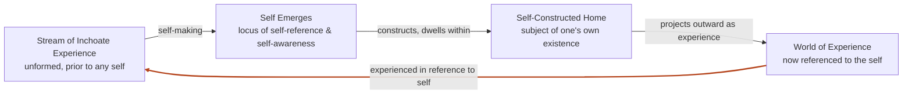

In _The Buddhist Unconscious_, William Waldron frames selfhood as an ongoing construction rather than a given.[^1] A self, on this account, stabilizes out of what was formerly a stream of inchoate experience into a relatively stable locus of self-reference and self-awareness, complete with its own regulated cognitive and affective processes.[^1] Waldron calls this one of the most remarkable achievements of biological evolution, and perhaps the most fundamental human technology.[^1]

Once built, the self does not stay in the background. It becomes the point every later experience gets routed through: our entire world of experience is experienced in reference to this self-wrought self.[^2] Man, the self-making creature, constructs the subject of his own existence and then dwells within his self-constructed home.[^2]

## Reading the cycle

The diagram traces Waldron's account as a closed loop rather than a line, since the self does not simply appear and then hold still, it keeps regenerating the conditions of its own experience. Raw, unformed experience gives rise to a self through self-making, an evolutionary process that condenses a stable locus of self-reference and self-awareness out of the stream. That self then constructs a home to dwell in, a subject of its own existence, and projects a world outward from that dwelling. The loop closes when the world so projected returns, now experienced strictly in reference to the self that made it, the mechanism that keeps the self current, since each new experience gets read back through the reference point the self already built.

## Footnotes

[^1]: William S. Waldron, _The Buddhist Unconscious: The Ālaya-vijñāna in the Context of Indian Buddhist Thought_ (London: RoutledgeCurzon, 2003), 2. [Zotero library entry](zotero://select/library/items/UY8KXLFT); [PDF annotation](zotero://open-pdf/library/items/9JCMV4V9?page=19\&annotation=CQQNIDCM).
[^2]: Waldron, _The Buddhist Unconscious_, 2. [PDF annotation](zotero://open-pdf/library/items/9JCMV4V9?page=19\&annotation=WZMJ9E97).
