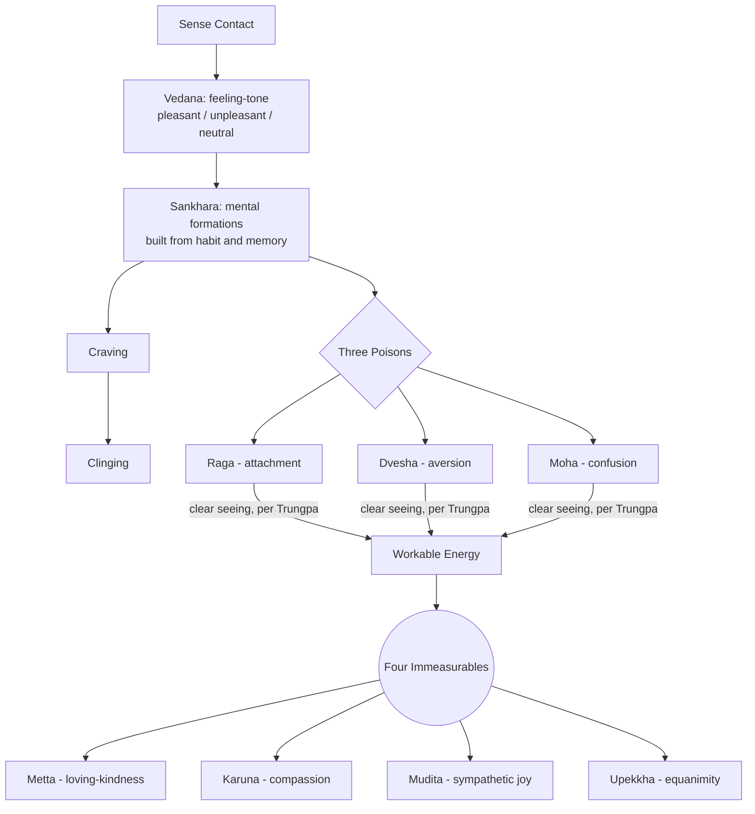
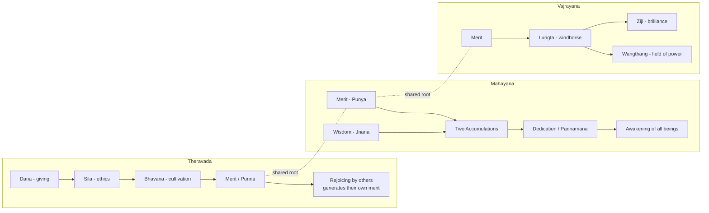

[[_Buddhism Index]] | [[Merit]] | [[_Shinsei]]

# Emotion and Merit Across Buddhist Traditions

A synthesis of two working threads — the arising of emotion (material for [[_Shinsei]]) and the workings of [[Merit]] — set against a timeline of the major traditions, each holding both threads in its own way.

## A Timeline of the Major Traditions

| Period | Tradition | Region | Key Marker |
|---|---|---|---|
| circa fifth century BCE | Early Buddhism / Pali Canon | North India | Life of the historical Buddha; oral transmission of the suttas[^1] |
| third century BCE onward | Theravada | Sri Lanka, later Southeast Asia | Mahinda's mission to Sri Lanka; the Pali Canon fixed in writing, first century BCE[^5] |
| first century BCE to first century CE | Mahayana | India | Early Mahayana sutras circulate; the bodhisattva vow becomes central[^3] |
| fourth to fifth century CE | Abhidharma scholasticism | India | Vasubandhu systematizes karma and merit theory[^4] |
| fifth to sixth century CE | Chan / [[Zen]] | China | Bodhidharma's arrival; the exchange with Emperor Wu |
| seventh to eighth century CE | Vajrayana / [[Tantric\|Tantra]] | India, Tibet | Tantric texts consolidate; Shantideva composes the _Bodhicaryavatara_, eighth century, Nalanda[^3] |
| pre-Buddhist through Buddhist absorption | Tibetan cosmology of lungta | Tibet | Life-force / windhorse concept predates Buddhism and is later folded into merit theory[^10] |
| twentieth century | Shambhala teachings reach the West | Tibet to United States | Chögyam Trungpa brings _wangthang_, _ziji_, and _lungta_ into English-language teaching[^8] |
| twentieth to twenty-first century | Contemplative neuroscience | United States | Richard Davidson and the Mind and Life dialogues bring meditation research into conversation with the Dalai Lama[^11] |

## Diagram One — The Arising of Emotion

This traces the sequence behind the Shinsei soft-edge language: contact gives rise to the first feeling-tone, feeling-tone builds into formations, formations can harden toward craving and clinging, or — when met with clear seeing — the same raw energy becomes workable and moves toward the four cultivated states.[^6]

## Diagram Two — Merit and Energy Across Vehicles

See [[Merit]] for the full doctrinal detail behind each branch.

## Early Buddhism and the Pali Canon (circa Fifth Century BCE)

The oldest layer of the tradition frames emotion through the five aggregates (_skandhas_). Vedana, the raw feeling-tone, arises at the instant of sense contact; sankhara, the fuller emotional formations, build on top of it through habit and interpretation.[^6] Merit in this earliest layer already carries its classical three-part structure — giving, ethical conduct, and meditative cultivation — stated as a list in the _Puññakiriyavatthu Sutta_.[^1]

## Theravada Tradition (Third Century BCE to Present)

Theravada carries the Pali material forward and gives it a strong lay dimension through the field of merit (_puññakkhetta_) and merit transfer to deceased relatives, rooted in the _Tirokudda Kanda_.[^2] See [[Hungry Ghosts]] for the scriptural background.

## Mahayana Tradition (First Century BCE to Present)

Mahayana widens the twelve links of dependent origination and the vedana-to-sankhara sequence into a path where emotion and merit both become material for awakening. [[00 The Bodhisattva Vows|The bodhisattva vow]] makes dedicating merit toward every being's awakening central,[^3] and the two accumulations — merit paired with wisdom — become the joint engine of the path.

## Chan and Zen Tradition (Fifth to Sixth Century CE to Present)

The Bodhidharma–Emperor Wu exchange gives [[Zen]] its sharpest early statement on merit — see [[Merit]] for the full exchange. It pairs naturally with the vedana/sankhara material: both point toward staying close to direct experience over settling into fixed conceptual shapes.

## Vajrayana Tradition (Seventh to Eighth Century CE to Present)

Vajrayana gives merit its clearest energetic reading through _lungta_, _wangthang_, and _ziji_ — full detail in [[Merit]] and [[Esoteric Buddhism]]. Canonical Abhidharma taxonomy keeps merit (_puṇya_, an ethical-karmic category) and subtle-body winds (_rlung_, a physiological category worked with directly in completion-stage tantra) as separate tracks, meeting only at an advanced point in tantric practice.[^9]

## Emotion Across the Traditions — Shared Threads

**Vedana, the first feeling-tone.** The instant of sense contact carries a pleasant, unpleasant, or neutral charge, prior to any elaborated emotion.[^6] A useful visual: vedana as the first wash of color meeting a canvas, sankhara as the shapes and edges that accumulate around it.

**Dependent origination as a moving chain.** The twelve links trace feeling into craving into clinging, a process held together by conditions — comparable to weather systems forming and dissolving, closer to an event than to a fixed object.

**The three poisons and their transformation.** Attachment, aversion, and confusion are the root afflictive emotions. Chögyam Trungpa's teaching reframes them as raw energy that becomes workable and beautiful once seen clearly — material to work with directly, the way reiki treats energy as something to channel.[^12]

**The ocean and its waves.** Thich Nhat Hanh's image places each emotion as a wave and awareness as the ocean holding every wave.[^13] A steady ground stays continuous while turbulence rises and falls across it.

**The storehouse consciousness.** Yogacara philosophy names _alaya-vijnana_, a storehouse holding the seeds of every past action and emotional pattern, ready to ripen again when conditions allow.[^14] Present emotional experience surfaces from stored energy rather than arriving invented fresh in the moment.

**The four immeasurables.** Loving-kindness, compassion, sympathetic joy, and equanimity give a positive emotional vocabulary to cultivate deliberately, alongside the work of meeting afflictive states.

## Scientific Bridges

Lisa Feldman Barrett's theory of constructed emotion holds that emotion is built in the moment from interoceptive sensation and learned concepts, a picture that maps closely onto the vedana-to-sankhara sequence.[^15] Richard Davidson's research at the Center for Healthy Minds, developed partly through the Mind and Life Institute's dialogues with the Dalai Lama, has measured shifts in emotional regulation and neural patterns of well-being through sustained meditation practice, giving the meditation side of this material an empirical anchor alongside the philosophical one.[^11]

## Footnotes

[^1]: Puññakiriyavatthu Sutta (Anguttara Nikaya 8.36), trans. Bhikkhu Bodhi, _The Numerical Discourses of the Buddha_ (Wisdom Publications). Also on SuttaCentral: [AN 8.36, Bodhi](https://suttacentral.net/an8.36/en/bodhi); [AN 8.36, Sujato](https://suttacentral.net/an8.36/en/sujato).
[^2]: Tirokudda Kanda (Khuddakapatha 7 / Petavatthu 1.5), trans. Thanissaro Bhikkhu, [Access to Insight](https://www.accesstoinsight.org/tipitaka/kn/pv/index.html).
[^3]: _The Way of the Bodhisattva_ (Bodhicaryavatara), Shantideva, trans. Padmakara Translation Group, Shambhala Classics, revised edition. [Shambhala](https://www.shambhala.com/the-way-of-the-bodhisattva-1660.html).
[^4]: _Abhidharmakośabhāṣyam_, Vasubandhu, trans. Louis de La Vallée Poussin / Leo M. Pruden, Asian Humanities Press, 4 vols.
[^5]: Rupert Gethin, _The Foundations of Buddhism_ (Oxford University Press, 1998); James Egge, _Religious Giving and the Invention of Karma in Theravada Buddhism_ (RoutledgeCurzon, 2002).
[^6]: Rupert Gethin, _The Foundations of Buddhism_ (Oxford University Press, 1998), on the five aggregates; Samyutta Nikaya (Pali Canon), discourses on the aggregates.
[^8]: Chögyam Trungpa, _Shambhala: The Sacred Path of the Warrior_ (Shambhala Publications); [Jamyang London — Windhorse and the Energy of Good Fortune](https://jamyang.co.uk/windhorse-and-the-energy-of-good-fortune/).
[^9]: [Study Buddhism — The Main Features of Tantra](https://studybuddhism.com/en/advanced-studies/vajrayana/tantra-theory/the-main-features-of-tantra).
[^10]: Samten G. Karmay, "The Wind-Horse and the Well-Being of Man," in _The Arrow and the Spindle_, Vol. I (Kathmandu: Mandala Book Point, 1998).
[^11]: Richard J. Davidson and Antoine Lutz, "Buddha's Brain: Neuroplasticity and Meditation," _IEEE Signal Processing Magazine_, 2008; Mind and Life Institute dialogues with the Dalai Lama.
[^12]: Chögyam Trungpa, _Cutting Through Spiritual Materialism_ (Shambhala, 1973).
[^13]: Thich Nhat Hanh, _No Mud, No Lotus_ (Parallax Press, 2014).
[^14]: William S. Waldron, _The Buddhist Unconscious: The Alaya-vijnana in the Context of Indian Buddhist Thought_ (Routledge, 2003).
[^15]: Lisa Feldman Barrett, _How Emotions Are Made_ (Houghton Mifflin Harcourt, 2017).

---

_AI attribution: Claude, Anthropic, claude-sonnet-4-6, conversation with author, 11 September 2026._
