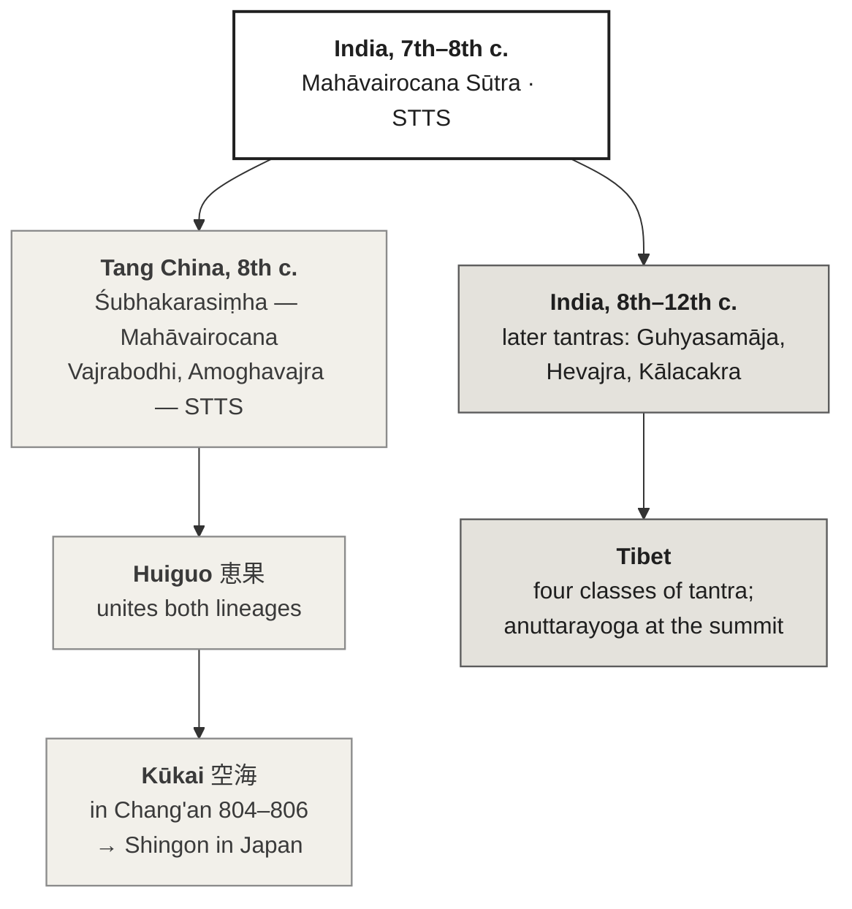

[[Esoteric Buddhism]] | [[_Buddhism Index|Buddhism Index]] | [[Shingon]] | [[Vajrayana Subtle Body]]

_Source: Claude, Anthropic, claude-opus-5.5, conversation with author, 24 September 2026._

# Shingon and Vajrayāna

Shingon is often described as "Japanese Vajrayāna," as if it were a Japanese extension of Tibetan Buddhism. It is not. The two are **siblings from one Indian parent**, separated early. Shingon carries forward an earlier stage of Indian tantra that reached China in the eighth century; Tibetan Vajrayāna was built mostly on the later tantras that followed. Where they meet, they meet in India, not in Tibet.

---

## 1. Is "extension" the right word?

Three facts settle the framing.

- **Same root texts.** Shingon rests on two scriptures: the _Mahāvairocana Sūtra_ (大日経, _Dainichikyō_) and the _Vajraśekhara_ (金剛頂経, _Kongōchōkyō_), whose core is the _Sarvatathāgatatattvasaṃgraha_ (STTS). Both also exist in Tibetan translation.[^1]
- **Earlier layer.** In India and Tibet the _Mahāvairocana Sūtra_ was classed as a _caryā_ ("performance") tantra, the second of what became the standard Tibetan four classes. In Tibet it was largely superseded by the STTS and the literature that grew from it — the yoga and _anuttarayoga_ tantras. In East Asia the same text stayed at the centre, and in Japan it underlies Shingon doctrine and practice.[^2]
- **No later layer.** The _anuttarayoga_ tantras that shape Tibetan practice — Guhyasamāja, Hevajra, Kālacakra — were never established in Japan. So the whole apparatus described in [[Vajrayana Subtle Body]] (channels, winds, drops, completion stage) has no counterpart in Shingon.

"Extension" gets the direction wrong. A better picture is a river that splits: one branch flowed east through Tang China to Kūkai and stopped developing its scriptural base in the ninth century; the other kept flowing through India into Tibet and absorbed three more centuries of tantric composition.

---

## 2. The shared Indian texts

| Text | Japanese | Tibetan class | In Shingon | English translation |
| --- | --- | --- | --- | --- |
| _Mahāvairocana Sūtra_ / _Vairocanābhisaṃbodhi_ | 大日経 _Dainichikyō_ | Caryā (performance) | Basis of the Womb Realm mandala (胎蔵界, _Taizōkai_) | Hodge, from the Tibetan with Buddhaguhya's commentary;[^3] Giebel, from the Chinese (BDK) |
| _Sarvatathāgatatattvasaṃgraha_ (as _Vajraśekhara_) | 金剛頂経 _Kongōchōkyō_ | Yoga | Basis of the Diamond Realm mandala (金剛界, _Kongōkai_) | Giebel, _Adamantine Pinnacle Sutra_ (BDK)[^4] |

The Tibetan class for each text is its classification in Tibet. Shingon does not use the fourfold scheme; it treats the two scriptures as a pair, and the two mandalas as a pair (両界曼荼羅, _ryōkai mandara_).

Giebel's BDK volume places the _Adamantine Pinnacle Sūtra_ among the yoga tantras and the _Susiddhikara Sūtra_, also in the Shingon corpus, among the _kriyā_ ("action") tantras.[^4] Put together, Shingon's scriptural base covers the three lower Tibetan classes — kriyā, caryā and yoga — and none of the fourth.

---

## 3. The transmission

The eastern branch runs through three Indian masters in Tang China, Śubhakarasiṃha for the _Mahāvairocana_ line and Vajrabodhi and Amoghavajra for the STTS line, to Amoghavajra's disciple Huiguo, who held both. Kūkai (774–835) received both from Huiguo in Chang'an and returned to Japan in 806.[^5] Ryūichi Abé's point is worth keeping: Kūkai's lasting achievement was less the founding of a sect than a general theory of language grounded in the ritual speech of mantra.[^6]

The western branch took shape as the Tibetans tried to sort a flood of new Indian texts arriving between the eighth and twelfth centuries. Jacob Dalton shows that the familiar four-class scheme was the outcome of that sorting, not a starting point.[^7]

---

## 4. What the two share

| Element | Shingon | Tibetan Vajrayāna |
| --- | --- | --- |
| Central buddha | Dainichi Nyorai 大日如来 (Mahāvairocana) | Vairocana — one of five buddha families; in the higher tantras often displaced by Akṣobhya or a yidam |
| Three mysteries | 三密 _sanmitsu_: body (mudrā), speech (mantra), mind (samādhi) | The same triad of body, speech and mind in all tantric sādhana |
| Mandala | Two Realms: Womb and Diamond | Hundreds of mandalas across the four classes |
| Initiation | 灌頂 _kanjō_ (abhiṣeka) | _dbang_ (abhiṣeka) |
| Fire ritual | 護摩 _goma_ | _sbyin sreg_ (homa) |
| Script of power | Siddhaṃ 悉曇 seed-syllables | Tibetan-script seed-syllables |
| Goal | 即身成仏 _sokushin jōbutsu_, buddhahood in this very body | Buddhahood in one lifetime, in the higher tantras |

Mudrā, mantra and mandala form the common vocabulary; the Brill handbook treats them together as the working core of East Asian esoteric practice.[^8]

The last row is the one to handle with care. Both traditions promise awakening in this life, but they get there by different machinery. Shingon works through ritual identification with the deity — body, speech and mind aligned with Dainichi's. The Tibetan higher tantras add a physiology: winds forced into the central channel, the drops, the clear light. Same promise; different engine.

---

## 5. What Shingon never received

- **The subtle-body physiology.** No channels, winds and drops; no completion stage; no _gtum mo_. See [[Vajrayana Subtle Body]].
- **Sexual yoga and consort practice.** These belong to the later tantras.
- **The wrathful yidam cycles** of the _anuttarayoga_ class — Cakrasaṃvara, Hevajra, Yamāntaka — as central practices.
- **Dzogchen and Mahāmudrā** as culminating views.

Shingon does have a body map of its own, but of a different kind. The five elements and their seed-syllables _A VA RA HA KHA_ make up the Buddha's body (see [[Kukai, the Letter A, and the Dragon Girl]]), and Shingon practice places those syllables on points of the practitioner's own body (see To review). It is a map of identification with the cosmos, not a map of circulation. That contrast is the sharpest single line between the two branches.

---

## 6. Kūkai's own taxonomy

Kūkai classified the Buddhist world his own way, and it does not match the Tibetan one.

- In the 『弁顕密二教論』(_Benkenmitsu nikkyōron_, Distinguishing Exoteric and Esoteric Teachings), the dividing line is _hosshin seppō_ (法身説法): in esoteric teaching the Dharma-body itself preaches.[^9]
- In the 『秘密曼荼羅十住心論』(_Himitsu mandara jūjūshinron_, Ten Stages of Mind), he ranks the schools as stages of mind, with esoteric teaching at the tenth.[^9]

The Tibetan scheme ranks _tantras_ by method. Kūkai ranks _teachings_ by how directly they disclose the Dharma-body. The two systems answer different questions.

---

## 7. The terminology problem

"Vajrayāna," "Tantric Buddhism," "Esoteric Buddhism" and 密教 (_mikkyō_) are not interchangeable.

- The Brill handbook opens with a methodological essay on exactly these terms, and treats esoteric Buddhism and the tantras in East Asia as a field of their own.[^8]
- Robert Sharf goes further. He argues that in Tang China "esoteric Buddhism" was not a self-conscious school, and that the category owes much to later Japanese sectarian scholarship read back onto China.[^10]

Practical rule for the vault: say **Shingon** or **mikkyō** for Japan, **Vajrayāna** for Tibet, and **esoteric Buddhism** for the whole family.

---

## 8. Science

No neuroscientific or physiological study of a specific Shingon practice (_ajikan_, _goma_, the _kaji_ rites) was found on 24 September 2026. The nearest empirical work concerns Tibetan practice, for example the tukdam EEG study discussed in [[Vajrayana Subtle Body]]. This is a real gap in the literature, not only in the vault.

On the historical side, Richard Payne notes that no materials clearly showing the origin of _ajikan_ before Kūkai have been found or analysed, and that some researchers think the use of _A_ as a meditation device arose from a Chinese or Japanese mistranslation of the _Mahāvairocana Sūtra_.[^11]

---

## Threads to follow

- **The five-element body and the subtle body.** Set Shingon's syllable-on-body placement beside the Tibetan wheels. What does each map claim to locate?
- **Vairocana in Tibet.** Where does he survive as a central figure in Tibetan practice, and what do those rites look like beside Shingon's?
- **Sokushin jōbutsu and the clear light.** Two claims of awakening in this life. Is the difference only in method, or also in what "buddhahood" means?
- **Kōya-san.** The practice side of this note needs a field visit, not only texts. See [[Koyasan]].

---

## To review

- 24 September 2026 · Kūkai's dates in Chang'an (804–806) and the Huiguo transmission (805) · standard dates; confirm against Abé, chap. 3, and Hakeda's introduction before citing a page.
- 24 September 2026 · The five-element syllables placed on the body (_gojirinkan_ 五字厳身観) · from general knowledge of Shingon practice; find a scholarly description (Yamasaki, or the 『密教大辞典』) before expanding §5.
- 24 September 2026 · 『密教大辞典』(_Mikkyō daijiten_, Hōzōkan) · the standard reference for Shingon terms; not opened.
- 24 September 2026 · Ronald M. Davidson, _Indian Esoteric Buddhism: A Social History of the Tantric Movement_ (Columbia University Press, 2002) · known title for the Indian background; publisher page not opened.
- 24 September 2026 · Payne, "Ajikan: Ritual and Meditation in the Shingon Tradition" (1998) · chapter title and volume taken from Payne's own later article; page range not confirmed.
- 24 September 2026 · Giebel, _The Vairocanābhisaṃbodhi Sutra_ (BDK, 2005) · already cited in the Kūkai note; BDK page mentions it, but the edition details were not re-checked here.

---

## Footnotes

[^1]: Rolf W. Giebel, "[Mahāvairocana Sūtra/Tantra](https://academic.oup.com/reference/62340/reference-article/554133371)," _Oxford Bibliographies in Buddhism_ (Oxford University Press, 2010), doi:10.1093/obo/9780195393521-0236.
[^2]: Ibid.
[^3]: Stephen Hodge, trans., _The Mahā-Vairocana-Abhisaṃbodhi Tantra, with Buddhaguhya's Commentary_ (London: RoutledgeCurzon, 2003).
[^4]: Rolf W. Giebel, trans., _Two Esoteric Sutras: The Adamantine Pinnacle Sutra and the Susiddhikara Sutra_, BDK English Tripiṭaka 29-II, 30-II (Berkeley: Numata Center for Buddhist Translation and Research, 2001); "[Two Esoteric Sutras](https://www.bdkamerica.org/product/two-esoteric-sutras/)," BDK America, accessed 24 September 2026.
[^5]: Yoshito S. Hakeda, trans., _Kūkai: Major Works_ (New York: Columbia University Press, 1972); Ryūichi Abé, _The Weaving of Mantra: Kūkai and the Construction of Esoteric Buddhist Discourse_ (New York: Columbia University Press, 1999).
[^6]: Abé, _Weaving of Mantra_; "[The Weaving of Mantra](https://cup.columbia.edu/book/the-weaving-of-mantra/9780231112871/)," Columbia University Press, accessed 24 September 2026.
[^7]: Jacob Dalton, "[A Crisis of Doxography: How Tibetans Organized Tantra during the 8th–12th Centuries](https://journals.ub.uni-heidelberg.de/index.php/jiabs/article/view/8959)," _Journal of the International Association of Buddhist Studies_ 28, no. 1 (2005): 115–181.
[^8]: Charles D. Orzech, Henrik H. Sørensen and Richard K. Payne, eds., _Esoteric Buddhism and the Tantras in East Asia_, Handbook of Oriental Studies, sec. 4, vol. 24 (Leiden: Brill, 2011); see the introduction, "Esoteric Buddhism and the Tantras in East Asia: Some Methodological Considerations," and Orzech and Sørensen, "Mudrā, Mantra, and Mandala."
[^9]: Hakeda, _Kūkai_.
[^10]: Robert H. Sharf, "[Appendix 1. On Esoteric Buddhism in China](https://doi.org/10.1515/9780824861940-011)," in _Coming to Terms with Chinese Buddhism: A Reading of the Treasure Store Treatise_ (Honolulu: University of Hawai'i Press, 2002), 263–278.
[^11]: Richard K. Payne, "The Shingon Ajikan, Meditation on the Syllable 'A': An Analysis of Components and Developments" (author's copy, [Matheson Trust](https://www.themathesontrust.org/papers/buddhism/Shingon_Ajikan_Meditation.pdf)); see also Payne, "Ajikan: Ritual and Meditation in the Shingon Tradition," in _Re-Visioning "Kamakura" Buddhism_, ed. Richard K. Payne, Kuroda Institute Studies in East Asian Buddhism (Honolulu: University of Hawai'i Press, 1998).

---

## Bibliography

Abé, Ryūichi. _The Weaving of Mantra: Kūkai and the Construction of Esoteric Buddhist Discourse_. New York: Columbia University Press, 1999.

Dalton, Jacob. "A Crisis of Doxography: How Tibetans Organized Tantra during the 8th–12th Centuries." _Journal of the International Association of Buddhist Studies_ 28, no. 1 (2005): 115–181.

Giebel, Rolf W. "Mahāvairocana Sūtra/Tantra." _Oxford Bibliographies in Buddhism_. Oxford University Press, 2010. doi:10.1093/obo/9780195393521-0236.

Giebel, Rolf W., trans. _Two Esoteric Sutras: The Adamantine Pinnacle Sutra and the Susiddhikara Sutra_. BDK English Tripiṭaka 29-II, 30-II. Berkeley: Numata Center for Buddhist Translation and Research, 2001.

Hakeda, Yoshito S., trans. _Kūkai: Major Works_. New York: Columbia University Press, 1972.

Hodge, Stephen, trans. _The Mahā-Vairocana-Abhisaṃbodhi Tantra, with Buddhaguhya's Commentary_. London: RoutledgeCurzon, 2003.

Orzech, Charles D., Henrik H. Sørensen, and Richard K. Payne, eds. _Esoteric Buddhism and the Tantras in East Asia_. Handbook of Oriental Studies, sec. 4, vol. 24. Leiden: Brill, 2011.

Payne, Richard K. "Ajikan: Ritual and Meditation in the Shingon Tradition." In _Re-Visioning "Kamakura" Buddhism_, edited by Richard K. Payne. Honolulu: University of Hawai'i Press, 1998.

Sharf, Robert H. _Coming to Terms with Chinese Buddhism: A Reading of the Treasure Store Treatise_. Honolulu: University of Hawai'i Press, 2002.

### Practitioner sources (limited scope)

Yamasaki, Taikō. _Shingon: Japanese Esoteric Buddhism_. Boston: Shambhala, 1988. — cite for the description of Shingon practice by a Shingon scholar-priest.

[[Nonduality Mandala by Dzongsar Jamyang Khyentse Rinpoche]] — a Tibetan teacher's reading of Vairocana; cite for his own teaching only.
