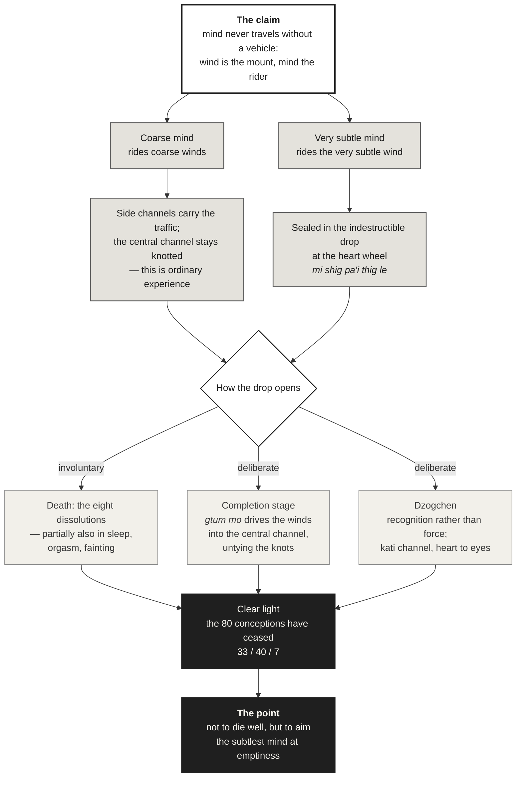

[[Mind]] | [[_Buddhism Index|Buddhism Index]] | [[Esoteric Buddhism]] | [[Subtle Body Across Traditions]] | [[Shingon and Vajrayana]]

_Source: Claude, Anthropic, claude-opus-5, conversation with author, 15 September 2026._

# Vajrayāna: The Subtle Body

Most Buddhist traditions decline the question of where mind sits in the body, or treat it as badly formed. Vajrayāna answers it. It gives a location, a mechanism, and a set of instructions for verifying both from the inside. Whatever else one makes of it, this is the most anatomically specific account of mind the Buddhist world produced — and it was built not from dissection but from what practitioners reported when the ordinary machinery of perception was progressively shut down.

---

## Three words

The whole system runs on three terms.

- **Channels** — _rtsa_ (Skt. _nāḍī_). The routes.
- **Winds** — _rlung_ (Skt. _prāṇa_, _vāyu_). What moves along them. Same _rlung_ as in [[Lungta]], windhorse.
- **Drops** — _thig le_ (Skt. _bindu_). What is carried, concentrated, and dissolved.[^1]

The move that matters philosophically is this: **mind never travels without a physical vehicle.** The standard image is a rider on a horse — mind is the rider, wind the mount, and they go nowhere separately. So the tradition is not saying that mind is _in_ the body the way a coin is in a box. It is saying that every level of mind, from the coarsest thought to the subtlest awareness, is paired with a corresponding level of wind, and the two arise and cease together. Locate the subtlest wind and you have located the subtlest mind. That is why the question has an address at all.

---

## The channels

Three run vertically.

- The **central channel** — _dbu ma_, Skt. _avadhūtī_ — from the crown down to a point below the navel, running in front of the spine.
- The **right** (_ro ma_, _rasanā_) and **left** (_rkyang ma_, _lalanā_), flanking it and coiling around it.

In ordinary life the two side channels carry the traffic and the central channel is constricted — knotted, in most descriptions, at the points where the side channels wrap it. This is not incidental. The constriction _is_ ordinary experience: dualistic, coarse, restless. Every completion-stage technique is in some sense an attempt to untie those knots and get the winds into the central channel, because that is what produces the shift in the level of mind.

From three, the system elaborates. Eight major channels branch from the heart in the cardinal and intermediate directions, each dividing into three, those 24 dividing further into 72, and so on to the conventional total of **72,000**.[^2] Some presentations add a fourth vertical channel behind the spine, _sdud bral ma_, "parted from demonic forces."[^3]

---

## The wheels

At five points the channels knot into hubs — _cakra_, "wheel," usually translated _channel-wheel_.

| Wheel | Location | Spokes |
|---|---|---|
| Great bliss | Crown | 32 |
| Enjoyment | Throat | 16 |
| Dharma | Heart | 8 |
| Emanation | Navel | 64 |
| Jewel | Secret place | (varies) |

The four upper wheels together account for the 120 principal channels.[^4]

Worth noticing: **the counts differ between tantras.** The _Hevajra Tantra_ gives four wheels with 64, eight, 16 and 32 petals; the later _Kālacakra Tantra_ gives six.[^5] This is not carelessness. Each system is a working map tuned to the practice it supports, the way a subway map and a topographic map of the same city are both correct and neither is a photograph. Reading the discrepancies as errors is the first wrong turn one can take with this material.

---

## The winds

**Five root winds:**

- _srog 'dzin_ — life-sustaining, seated at the heart
- _thur sel_ — downward-voiding
- _gyen rgyu_ — upward-moving
- _me mnyam_ — fire-accompanying or equally-abiding, seated at the navel
- _khyab byed_ — pervading

**Five branch winds** carry the five sense consciousnesses.[^6] This is where the system does real explanatory work rather than just mapping: each sense faculty rides a particular wind. Disturb the wind and you disturb the perception — which is the traditional account of why breath practice changes what and how you see, and why the dissolution sequence at death takes perception apart in a fixed order.

---

## The drops

Two drops are inherited at conception: a **white drop** from the father, lodged at the crown, and a **red drop** from the mother, lodged at the navel. These are the material basis of the body and of the fluids that sustain it.

Then there is the third one, and everything converges here.

At the heart wheel sits the **indestructible drop** — _mi shig pa'i thig le_. It is the two parental drops fused, white above and red below, conventionally described as about the size of a large mustard seed. It is sealed at conception and does not open until death: alone among the body's constituents, it persists unchanged for the whole of a life.[^7]

Inside it reside the **very subtle wind and the very subtle mind** — what the literature calls the _fundamental innate mind of clear light_, described by Jeffrey Hopkins as "the basis of all minds and all appearances."[^8]

That is the answer. If you press a Geluk scholar for coordinates, this is what you get: a point at the heart, mustard-seed sized, containing a wind and a mind that are two aspects of one thing, present from conception and released at death.

<svg version="1.1" id="Layer_1"
  xmlns="http://www.w3.org/2000/svg" xmlns:xlink="http://www.w3.org/1999/xlink" x="0px" y="0px" viewBox="0 0 820 1065"
  style="max-width:100%;height:auto;display:block;margin:1.5em auto;enable-background:new 0 0 820 1065;" xml:space="preserve">

<rect y="0" class="vajrayanasub-st0" width="820" height="1065"/>
<text transform="matrix(1 0 0 1 229.7773 44)" class="vajrayanasub-st1 vajrayanasub-st2 vajrayanasub-st3">The Vajrayāna Subtle Body</text>
<text transform="matrix(1 0 0 1 102.1333 68)" class="vajrayanasub-st4 vajrayanasub-st5 vajrayanasub-st6">Channels (rtsa), winds (rlung) and drops (thig le) — a body known in meditation, not in dissection</text>
<line class="vajrayanasub-st7" x1="120" y1="86" x2="700" y2="86"/>
<line class="vajrayanasub-st8" x1="400" y1="157" x2="400" y2="822"/>
<path class="vajrayanasub-st9" d="M400,205c-0.6,0.9-2.6,3.6-3.9,5.4c-1.3,1.8-2.6,3.6-3.8,5.4c-1.3,1.8-2.5,3.6-3.7,5.4
	c-1.2,1.8-2.4,3.6-3.5,5.4c-1.1,1.8-2.2,3.6-3.3,5.4c-1,1.8-2,3.6-2.9,5.4c-0.9,1.8-1.8,3.6-2.6,5.4c-0.8,1.8-1.5,3.6-2.2,5.4
	c-0.6,1.8-1.2,3.6-1.7,5.4s-0.9,3.6-1.3,5.4c-0.3,1.8-0.6,3.6-0.8,5.4c-0.2,1.8-0.3,3.6-0.3,5.4s0.1,3.6,0.3,5.4
	c0.2,1.8,0.4,3.6,0.8,5.4c0.3,1.8,0.8,3.6,1.3,5.4s1.1,3.6,1.7,5.4c0.7,1.8,1.4,3.6,2.2,5.4c0.8,1.8,1.7,3.6,2.6,5.4
	c0.9,1.8,1.9,3.6,2.9,5.4c1,1.8,2.1,3.6,3.3,5.4c1.1,1.8,2.3,3.6,3.5,5.4c1.2,1.8,2.5,3.6,3.7,5.4c1.3,1.8,2.6,3.6,3.8,5.4
	c1.3,1.8,2.6,3.5,3.9,5.4s2.6,4,3.9,6c1.3,2,2.6,4,3.8,6c1.3,2,2.5,4,3.7,6c1.2,2,2.4,4,3.5,6.1c1.1,2,2.2,4,3.3,6c1,2,2,4,2.9,6
	c0.9,2,1.8,4,2.6,6c0.8,2,1.5,4,2.2,6c0.6,2,1.2,4,1.7,6.1c0.5,2,0.9,4,1.3,6c0.3,2,0.6,4,0.8,6c0.2,2,0.3,4,0.3,6s-0.1,4-0.3,6
	c-0.2,2-0.4,4-0.8,6c-0.3,2-0.8,4-1.3,6c-0.5,2-1.1,4-1.7,6.1c-0.7,2-1.4,4-2.2,6c-0.8,2-1.7,4-2.6,6c-0.9,2-1.9,4-2.9,6
	c-1,2-2.1,4-3.3,6c-1.1,2-2.3,4-3.5,6.1c-1.2,2-2.5,4-3.7,6c-1.3,2-2.6,4-3.8,6c-1.3,2-2.6,4-3.9,6s-2.6,4.2-3.9,6.2
	c-1.3,2.1-2.6,4.2-3.8,6.2c-1.3,2.1-2.5,4.2-3.7,6.2c-1.2,2.1-2.4,4.2-3.5,6.2s-2.2,4.2-3.3,6.2c-1,2.1-2,4.2-2.9,6.2
	c-0.9,2.1-1.8,4.2-2.6,6.2c-0.8,2.1-1.5,4.2-2.2,6.2c-0.6,2.1-1.2,4.2-1.7,6.2s-0.9,4.2-1.3,6.2s-0.6,4.2-0.8,6.2
	c-0.2,2.1-0.3,4.2-0.3,6.2s0.1,4.2,0.3,6.2c0.2,2.1,0.4,4.2,0.8,6.2s0.8,4.2,1.3,6.2s1.1,4.2,1.7,6.2c0.7,2.1,1.4,4.2,2.2,6.2
	c0.8,2.1,1.7,4.2,2.6,6.2c0.9,2.1,1.9,4.2,2.9,6.2c1,2.1,2.1,4.2,3.3,6.2s2.3,4.2,3.5,6.2c1.2,2.1,2.5,4.2,3.7,6.2
	c1.3,2.1,2.6,4.2,3.8,6.2c1.3,2.1,2.6,4.2,3.9,6.2s2.6,3.9,3.9,5.8c1.3,2,2.6,3.9,3.8,5.8c1.3,1.9,2.5,3.9,3.7,5.8
	c1.2,1.9,2.4,3.9,3.5,5.8c1.1,2,2.2,3.9,3.3,5.8c1,1.9,2,3.9,2.9,5.8c0.9,1.9,1.8,3.9,2.6,5.8c0.8,2,1.5,3.9,2.2,5.8
	c0.6,1.9,1.2,3.9,1.7,5.8s0.9,3.9,1.3,5.8c0.3,2,0.6,3.9,0.8,5.8c0.2,1.9,0.3,3.9,0.3,5.8s-0.1,3.9-0.3,5.8c-0.2,2-0.4,3.9-0.8,5.8
	c-0.3,1.9-0.8,3.9-1.3,5.8s-1.1,3.9-1.7,5.8c-0.7,2-1.4,3.9-2.2,5.8c-0.8,1.9-1.7,3.9-2.6,5.8c-0.9,1.9-1.9,3.9-2.9,5.8
	c-1,2-2.1,3.9-3.3,5.8c-1.1,1.9-2.3,3.9-3.5,5.8c-1.2,1.9-2.5,3.9-3.7,5.8c-1.3,2-2.6,3.9-3.8,5.8c-1.3,1.9-3.3,4.9-3.9,5.8"/>
<path class="vajrayanasub-st10" d="M400,205c0.6,0.9,2.6,3.6,3.9,5.4c1.3,1.8,2.6,3.6,3.8,5.4c1.3,1.8,2.5,3.6,3.7,5.4c1.2,1.8,2.4,3.6,3.5,5.4
	c1.1,1.8,2.2,3.6,3.3,5.4c1,1.8,2,3.6,2.9,5.4c0.9,1.8,1.8,3.6,2.6,5.4c0.8,1.8,1.5,3.6,2.2,5.4c0.6,1.8,1.2,3.6,1.7,5.4
	s0.9,3.6,1.3,5.4c0.3,1.8,0.6,3.6,0.8,5.4c0.2,1.8,0.3,3.6,0.3,5.4s-0.1,3.6-0.3,5.4c-0.2,1.8-0.4,3.6-0.8,5.4
	c-0.3,1.8-0.8,3.6-1.3,5.4s-1.1,3.6-1.7,5.4c-0.7,1.8-1.4,3.6-2.2,5.4c-0.8,1.8-1.7,3.6-2.6,5.4c-0.9,1.8-1.9,3.6-2.9,5.4
	c-1,1.8-2.1,3.6-3.3,5.4c-1.1,1.8-2.3,3.6-3.5,5.4c-1.2,1.8-2.5,3.6-3.7,5.4c-1.3,1.8-2.6,3.6-3.8,5.4c-1.3,1.8-2.6,3.5-3.9,5.4
	s-2.6,4-3.9,6c-1.3,2-2.6,4-3.8,6c-1.3,2-2.5,4-3.7,6c-1.2,2-2.4,4-3.5,6.1c-1.1,2-2.2,4-3.3,6c-1,2-2,4-2.9,6c-0.9,2-1.8,4-2.6,6
	c-0.8,2-1.5,4-2.2,6c-0.6,2-1.2,4-1.7,6.1c-0.5,2-0.9,4-1.3,6c-0.3,2-0.6,4-0.8,6c-0.2,2-0.3,4-0.3,6s0.1,4,0.3,6c0.2,2,0.4,4,0.8,6
	c0.3,2,0.8,4,1.3,6c0.5,2,1.1,4,1.7,6.1c0.7,2,1.4,4,2.2,6c0.8,2,1.7,4,2.6,6c0.9,2,1.9,4,2.9,6c1,2,2.1,4,3.3,6
	c1.1,2,2.3,4,3.5,6.1c1.2,2,2.5,4,3.7,6c1.3,2,2.6,4,3.8,6c1.3,2,2.6,4,3.9,6s2.6,4.2,3.9,6.2c1.3,2.1,2.6,4.2,3.8,6.2
	c1.3,2.1,2.5,4.2,3.7,6.2c1.2,2.1,2.4,4.2,3.5,6.2s2.2,4.2,3.3,6.2c1,2.1,2,4.2,2.9,6.2c0.9,2.1,1.8,4.2,2.6,6.2
	c0.8,2.1,1.5,4.2,2.2,6.2c0.6,2.1,1.2,4.2,1.7,6.2s0.9,4.2,1.3,6.2s0.6,4.2,0.8,6.2c0.2,2.1,0.3,4.2,0.3,6.2s-0.1,4.2-0.3,6.2
	c-0.2,2.1-0.4,4.2-0.8,6.2s-0.8,4.2-1.3,6.2s-1.1,4.2-1.7,6.2c-0.7,2.1-1.4,4.2-2.2,6.2c-0.8,2.1-1.7,4.2-2.6,6.2
	c-0.9,2.1-1.9,4.2-2.9,6.2c-1,2.1-2.1,4.2-3.3,6.2s-2.3,4.2-3.5,6.2c-1.2,2.1-2.5,4.2-3.7,6.2c-1.3,2.1-2.6,4.2-3.8,6.2
	c-1.3,2.1-2.6,4.2-3.9,6.2s-2.6,3.9-3.9,5.8c-1.3,2-2.6,3.9-3.8,5.8c-1.3,1.9-2.5,3.9-3.7,5.8c-1.2,1.9-2.4,3.9-3.5,5.8
	c-1.1,2-2.2,3.9-3.3,5.8c-1,1.9-2,3.9-2.9,5.8c-0.9,1.9-1.8,3.9-2.6,5.8c-0.8,2-1.5,3.9-2.2,5.8c-0.6,1.9-1.2,3.9-1.7,5.8
	s-0.9,3.9-1.3,5.8c-0.3,2-0.6,3.9-0.8,5.8c-0.2,1.9-0.3,3.9-0.3,5.8s0.1,3.9,0.3,5.8c0.2,2,0.4,3.9,0.8,5.8c0.3,1.9,0.8,3.9,1.3,5.8
	s1.1,3.9,1.7,5.8c0.7,2,1.4,3.9,2.2,5.8c0.8,1.9,1.7,3.9,2.6,5.8c0.9,1.9,1.9,3.9,2.9,5.8c1,2,2.1,3.9,3.3,5.8
	c1.1,1.9,2.3,3.9,3.5,5.8c1.2,1.9,2.5,3.9,3.7,5.8c1.3,2,2.6,3.9,3.8,5.8c1.3,1.9,3.3,4.9,3.9,5.8"/>
<line class="vajrayanasub-st11" x1="400" y1="194" x2="400" y2="158"/>
<line class="vajrayanasub-st11" x1="402.1" y1="194.2" x2="409.2" y2="158.9"/>
<line class="vajrayanasub-st11" x1="404.2" y1="194.8" x2="418" y2="161.6"/>
<line class="vajrayanasub-st11" x1="406.1" y1="195.9" x2="426.1" y2="165.9"/>
<line class="vajrayanasub-st11" x1="407.8" y1="197.2" x2="433.2" y2="171.8"/>
<line class="vajrayanasub-st11" x1="409.1" y1="198.9" x2="439.1" y2="178.9"/>
<line class="vajrayanasub-st11" x1="410.2" y1="200.8" x2="443.4" y2="187"/>
<line class="vajrayanasub-st11" x1="410.8" y1="202.9" x2="446.1" y2="195.8"/>
<line class="vajrayanasub-st11" x1="411" y1="205" x2="447" y2="205"/>
<line class="vajrayanasub-st11" x1="410.8" y1="207.1" x2="446.1" y2="214.2"/>
<line class="vajrayanasub-st11" x1="410.2" y1="209.2" x2="443.4" y2="223"/>
<line class="vajrayanasub-st11" x1="409.1" y1="211.1" x2="439.1" y2="231.1"/>
<line class="vajrayanasub-st11" x1="407.8" y1="212.8" x2="433.2" y2="238.2"/>
<line class="vajrayanasub-st11" x1="406.1" y1="214.1" x2="426.1" y2="244.1"/>
<line class="vajrayanasub-st11" x1="404.2" y1="215.2" x2="418" y2="248.4"/>
<line class="vajrayanasub-st11" x1="402.1" y1="215.8" x2="409.2" y2="251.1"/>
<line class="vajrayanasub-st11" x1="400" y1="216" x2="400" y2="252"/>
<line class="vajrayanasub-st11" x1="397.9" y1="215.8" x2="390.8" y2="251.1"/>
<line class="vajrayanasub-st11" x1="395.8" y1="215.2" x2="382" y2="248.4"/>
<line class="vajrayanasub-st11" x1="393.9" y1="214.1" x2="373.9" y2="244.1"/>
<line class="vajrayanasub-st11" x1="392.2" y1="212.8" x2="366.8" y2="238.2"/>
<line class="vajrayanasub-st11" x1="390.9" y1="211.1" x2="360.9" y2="231.1"/>
<line class="vajrayanasub-st11" x1="389.8" y1="209.2" x2="356.6" y2="223"/>
<line class="vajrayanasub-st11" x1="389.2" y1="207.1" x2="353.9" y2="214.2"/>
<line class="vajrayanasub-st11" x1="389" y1="205" x2="353" y2="205"/>
<line class="vajrayanasub-st11" x1="389.2" y1="202.9" x2="353.9" y2="195.8"/>
<line class="vajrayanasub-st11" x1="389.8" y1="200.8" x2="356.6" y2="187"/>
<line class="vajrayanasub-st11" x1="390.9" y1="198.9" x2="360.9" y2="178.9"/>
<line class="vajrayanasub-st11" x1="392.2" y1="197.2" x2="366.8" y2="171.8"/>
<line class="vajrayanasub-st11" x1="393.9" y1="195.9" x2="373.9" y2="165.9"/>
<line class="vajrayanasub-st11" x1="395.8" y1="194.8" x2="382" y2="161.6"/>
<line class="vajrayanasub-st11" x1="397.9" y1="194.2" x2="390.8" y2="158.9"/>
<circle class="vajrayanasub-st12" cx="400" cy="205" r="47"/>
<line class="vajrayanasub-st13" x1="400" y1="324" x2="400" y2="288"/>
<line class="vajrayanasub-st13" x1="404.2" y1="324.8" x2="418" y2="291.6"/>
<line class="vajrayanasub-st13" x1="407.8" y1="327.2" x2="433.2" y2="301.8"/>
<line class="vajrayanasub-st13" x1="410.2" y1="330.8" x2="443.4" y2="317"/>
<line class="vajrayanasub-st13" x1="411" y1="335" x2="447" y2="335"/>
<line class="vajrayanasub-st13" x1="410.2" y1="339.2" x2="443.4" y2="353"/>
<line class="vajrayanasub-st13" x1="407.8" y1="342.8" x2="433.2" y2="368.2"/>
<line class="vajrayanasub-st13" x1="404.2" y1="345.2" x2="418" y2="378.4"/>
<line class="vajrayanasub-st13" x1="400" y1="346" x2="400" y2="382"/>
<line class="vajrayanasub-st13" x1="395.8" y1="345.2" x2="382" y2="378.4"/>
<line class="vajrayanasub-st13" x1="392.2" y1="342.8" x2="366.8" y2="368.2"/>
<line class="vajrayanasub-st13" x1="389.8" y1="339.2" x2="356.6" y2="353"/>
<line class="vajrayanasub-st13" x1="389" y1="335" x2="353" y2="335"/>
<line class="vajrayanasub-st13" x1="389.8" y1="330.8" x2="356.6" y2="317"/>
<line class="vajrayanasub-st13" x1="392.2" y1="327.2" x2="366.8" y2="301.8"/>
<line class="vajrayanasub-st13" x1="395.8" y1="324.8" x2="382" y2="291.6"/>
<circle class="vajrayanasub-st12" cx="400" cy="335" r="47"/>
<line class="vajrayanasub-st13" x1="400" y1="469" x2="400" y2="433"/>
<line class="vajrayanasub-st13" x1="407.8" y1="472.2" x2="433.2" y2="446.8"/>
<line class="vajrayanasub-st13" x1="411" y1="480" x2="447" y2="480"/>
<line class="vajrayanasub-st13" x1="407.8" y1="487.8" x2="433.2" y2="513.2"/>
<line class="vajrayanasub-st13" x1="400" y1="491" x2="400" y2="527"/>
<line class="vajrayanasub-st13" x1="392.2" y1="487.8" x2="366.8" y2="513.2"/>
<line class="vajrayanasub-st13" x1="389" y1="480" x2="353" y2="480"/>
<line class="vajrayanasub-st13" x1="392.2" y1="472.2" x2="366.8" y2="446.8"/>
<circle class="vajrayanasub-st14" cx="400" cy="480" r="47"/>
<line class="vajrayanasub-st15" x1="400" y1="619" x2="400" y2="583"/>
<line class="vajrayanasub-st15" x1="401.1" y1="619" x2="404.6" y2="583.2"/>
<line class="vajrayanasub-st15" x1="402.1" y1="619.2" x2="409.2" y2="583.9"/>
<line class="vajrayanasub-st15" x1="403.2" y1="619.5" x2="413.6" y2="585"/>
<line class="vajrayanasub-st15" x1="404.2" y1="619.8" x2="418" y2="586.6"/>
<line class="vajrayanasub-st15" x1="405.2" y1="620.3" x2="422.2" y2="588.5"/>
<line class="vajrayanasub-st15" x1="406.1" y1="620.8" x2="426.1" y2="590.9"/>
<line class="vajrayanasub-st15" x1="407" y1="621.5" x2="429.8" y2="593.7"/>
<line class="vajrayanasub-st15" x1="407.8" y1="622.2" x2="433.2" y2="596.8"/>
<line class="vajrayanasub-st15" x1="408.5" y1="623" x2="436.3" y2="600.2"/>
<line class="vajrayanasub-st15" x1="409.1" y1="623.9" x2="439.1" y2="603.9"/>
<line class="vajrayanasub-st15" x1="409.7" y1="624.8" x2="441.5" y2="607.8"/>
<line class="vajrayanasub-st15" x1="410.2" y1="625.8" x2="443.4" y2="612"/>
<line class="vajrayanasub-st15" x1="410.5" y1="626.8" x2="445" y2="616.4"/>
<line class="vajrayanasub-st15" x1="410.8" y1="627.8" x2="446.1" y2="620.8"/>
<line class="vajrayanasub-st15" x1="411" y1="628.9" x2="446.8" y2="625.4"/>
<line class="vajrayanasub-st15" x1="411" y1="630" x2="447" y2="630"/>
<line class="vajrayanasub-st15" x1="411" y1="631.1" x2="446.8" y2="634.6"/>
<line class="vajrayanasub-st15" x1="410.8" y1="632.2" x2="446.1" y2="639.2"/>
<line class="vajrayanasub-st15" x1="410.5" y1="633.2" x2="445" y2="643.6"/>
<line class="vajrayanasub-st15" x1="410.2" y1="634.2" x2="443.4" y2="648"/>
<line class="vajrayanasub-st15" x1="409.7" y1="635.2" x2="441.5" y2="652.2"/>
<line class="vajrayanasub-st15" x1="409.1" y1="636.1" x2="439.1" y2="656.1"/>
<line class="vajrayanasub-st15" x1="408.5" y1="637" x2="436.3" y2="659.8"/>
<line class="vajrayanasub-st15" x1="407.8" y1="637.8" x2="433.2" y2="663.2"/>
<line class="vajrayanasub-st15" x1="407" y1="638.5" x2="429.8" y2="666.3"/>
<line class="vajrayanasub-st15" x1="406.1" y1="639.2" x2="426.1" y2="669.1"/>
<line class="vajrayanasub-st15" x1="405.2" y1="639.7" x2="422.2" y2="671.5"/>
<line class="vajrayanasub-st15" x1="404.2" y1="640.2" x2="418" y2="673.4"/>
<line class="vajrayanasub-st15" x1="403.2" y1="640.5" x2="413.6" y2="675"/>
<line class="vajrayanasub-st15" x1="402.1" y1="640.8" x2="409.2" y2="676.1"/>
<line class="vajrayanasub-st15" x1="401.1" y1="641" x2="404.6" y2="676.8"/>
<line class="vajrayanasub-st15" x1="400" y1="641" x2="400" y2="677"/>
<line class="vajrayanasub-st15" x1="398.9" y1="641" x2="395.4" y2="676.8"/>
<line class="vajrayanasub-st15" x1="397.9" y1="640.8" x2="390.8" y2="676.1"/>
<line class="vajrayanasub-st15" x1="396.8" y1="640.5" x2="386.4" y2="675"/>
<line class="vajrayanasub-st15" x1="395.8" y1="640.2" x2="382" y2="673.4"/>
<line class="vajrayanasub-st15" x1="394.8" y1="639.7" x2="377.8" y2="671.5"/>
<line class="vajrayanasub-st15" x1="393.9" y1="639.2" x2="373.9" y2="669.1"/>
<line class="vajrayanasub-st15" x1="393" y1="638.5" x2="370.2" y2="666.3"/>
<line class="vajrayanasub-st15" x1="392.2" y1="637.8" x2="366.8" y2="663.2"/>
<line class="vajrayanasub-st15" x1="391.5" y1="637" x2="363.7" y2="659.8"/>
<line class="vajrayanasub-st15" x1="390.9" y1="636.1" x2="360.9" y2="656.1"/>
<line class="vajrayanasub-st15" x1="390.3" y1="635.2" x2="358.5" y2="652.2"/>
<line class="vajrayanasub-st15" x1="389.8" y1="634.2" x2="356.6" y2="648"/>
<line class="vajrayanasub-st15" x1="389.5" y1="633.2" x2="355" y2="643.6"/>
<line class="vajrayanasub-st15" x1="389.2" y1="632.2" x2="353.9" y2="639.2"/>
<line class="vajrayanasub-st15" x1="389" y1="631.1" x2="353.2" y2="634.6"/>
<line class="vajrayanasub-st15" x1="389" y1="630" x2="353" y2="630"/>
<line class="vajrayanasub-st15" x1="389" y1="628.9" x2="353.2" y2="625.4"/>
<line class="vajrayanasub-st15" x1="389.2" y1="627.8" x2="353.9" y2="620.8"/>
<line class="vajrayanasub-st15" x1="389.5" y1="626.8" x2="355" y2="616.4"/>
<line class="vajrayanasub-st15" x1="389.8" y1="625.8" x2="356.6" y2="612"/>
<line class="vajrayanasub-st15" x1="390.3" y1="624.8" x2="358.5" y2="607.8"/>
<line class="vajrayanasub-st15" x1="390.9" y1="623.9" x2="360.9" y2="603.9"/>
<line class="vajrayanasub-st15" x1="391.5" y1="623" x2="363.7" y2="600.2"/>
<line class="vajrayanasub-st15" x1="392.2" y1="622.2" x2="366.8" y2="596.8"/>
<line class="vajrayanasub-st15" x1="393" y1="621.5" x2="370.2" y2="593.7"/>
<line class="vajrayanasub-st15" x1="393.9" y1="620.8" x2="373.9" y2="590.9"/>
<line class="vajrayanasub-st15" x1="394.8" y1="620.3" x2="377.8" y2="588.5"/>
<line class="vajrayanasub-st15" x1="395.8" y1="619.8" x2="382" y2="586.6"/>
<line class="vajrayanasub-st15" x1="396.8" y1="619.5" x2="386.4" y2="585"/>
<line class="vajrayanasub-st15" x1="397.9" y1="619.2" x2="390.8" y2="583.9"/>
<line class="vajrayanasub-st15" x1="398.9" y1="619" x2="395.4" y2="583.2"/>
<circle class="vajrayanasub-st12" cx="400" cy="630" r="47"/>
<circle class="vajrayanasub-st16" cx="400" cy="770" r="47"/>
<circle class="vajrayanasub-st17" cx="400" cy="205" r="9"/>
<circle class="vajrayanasub-st18" cx="400" cy="630" r="9"/>
<path class="vajrayanasub-st19" d="M390,480c0-5.5,4.5-10,10-10s10,4.5,10,10H390z"/>
<path class="vajrayanasub-st20" d="M390,480c0,5.5,4.5,10,10,10s10-4.5,10-10H390z"/>
<line class="vajrayanasub-st21" x1="250" y1="205" x2="348" y2="205"/>
<text transform="matrix(1 0 0 1 112.7886 202)" class="vajrayanasub-st1 vajrayanasub-st2 vajrayanasub-st22">Great Bliss wheel</text>
<text transform="matrix(1 0 0 1 119.3027 219)" class="vajrayanasub-st4 vajrayanasub-st5 vajrayanasub-st23">crown · bde chen &apos;khor lo</text>
<line class="vajrayanasub-st21" x1="452" y1="205" x2="560" y2="205"/>
<text transform="matrix(1 0 0 1 568 202)" class="vajrayanasub-st24 vajrayanasub-st25 vajrayanasub-st26">32 spokes</text>
<text transform="matrix(1 0 0 1 568 219)" class="vajrayanasub-st4 vajrayanasub-st5 vajrayanasub-st23">seat of the white drop (father)</text>
<line class="vajrayanasub-st21" x1="250" y1="335" x2="348" y2="335"/>
<text transform="matrix(1 0 0 1 112.739 332)" class="vajrayanasub-st1 vajrayanasub-st2 vajrayanasub-st22">Enjoyment wheel</text>
<text transform="matrix(1 0 0 1 104.0918 349)" class="vajrayanasub-st4 vajrayanasub-st5 vajrayanasub-st23">throat · longs spyod &apos;khor lo</text>
<line class="vajrayanasub-st21" x1="452" y1="335" x2="560" y2="335"/>
<text transform="matrix(1 0 0 1 568 340)" class="vajrayanasub-st24 vajrayanasub-st25 vajrayanasub-st26">16 spokes</text>
<line class="vajrayanasub-st21" x1="250" y1="480" x2="348" y2="480"/>
<text transform="matrix(1 0 0 1 132.8818 477)" class="vajrayanasub-st1 vajrayanasub-st2 vajrayanasub-st22">Dharma wheel</text>
<text transform="matrix(1 0 0 1 127.6387 494)" class="vajrayanasub-st4 vajrayanasub-st5 vajrayanasub-st23">heart · chos kyi &apos;khor lo</text>
<line class="vajrayanasub-st21" x1="452" y1="480" x2="560" y2="480"/>
<text transform="matrix(1 0 0 1 568 477)" class="vajrayanasub-st24 vajrayanasub-st25 vajrayanasub-st26">8 spokes</text>
<text transform="matrix(1 0 0 1 568 494)" class="vajrayanasub-st4 vajrayanasub-st5 vajrayanasub-st23">seat of the indestructible drop</text>
<line class="vajrayanasub-st21" x1="250" y1="630" x2="348" y2="630"/>
<text transform="matrix(1 0 0 1 111.7974 627)" class="vajrayanasub-st1 vajrayanasub-st2 vajrayanasub-st22">Emanation wheel</text>
<text transform="matrix(1 0 0 1 120.2964 644)" class="vajrayanasub-st4 vajrayanasub-st5 vajrayanasub-st23">navel · sprul pa&apos;i &apos;khor lo</text>
<line class="vajrayanasub-st21" x1="452" y1="630" x2="560" y2="630"/>
<text transform="matrix(1 0 0 1 568 627)" class="vajrayanasub-st24 vajrayanasub-st25 vajrayanasub-st26">64 spokes</text>
<text transform="matrix(1 0 0 1 568 644)" class="vajrayanasub-st4 vajrayanasub-st5 vajrayanasub-st23">seat of the red drop (mother)</text>
<line class="vajrayanasub-st21" x1="250" y1="770" x2="348" y2="770"/>
<text transform="matrix(1 0 0 1 151.6511 767)" class="vajrayanasub-st1 vajrayanasub-st2 vajrayanasub-st22">Jewel wheel</text>
<text transform="matrix(1 0 0 1 85.4756 784)" class="vajrayanasub-st4 vajrayanasub-st5 vajrayanasub-st23">secret place · gsang ba&apos;i &apos;khor lo</text>
<line class="vajrayanasub-st21" x1="452" y1="770" x2="560" y2="770"/>
<text transform="matrix(1 0 0 1 568 767)" class="vajrayanasub-st24 vajrayanasub-st25 vajrayanasub-st26">spoke count varies</text>
<text transform="matrix(1 0 0 1 568 784)" class="vajrayanasub-st4 vajrayanasub-st5 vajrayanasub-st23">by tantra and lineage</text>
<text transform="matrix(1 0 0 1 568 512)" class="vajrayanasub-st27 vajrayanasub-st5 vajrayanasub-st23">life-sustaining wind (srog ’dzin) seated here</text>
<text transform="matrix(1 0 0 1 568 662)" class="vajrayanasub-st27 vajrayanasub-st5 vajrayanasub-st23">fire-accompanying wind (me mnyam) seated here</text>
<text transform="matrix(1 0 0 1 35.4331 135.1)" class="vajrayanasub-st4 vajrayanasub-st5 vajrayanasub-st23">the central channel is knotted at every wheel;</text>
<text transform="matrix(1 0 0 1 35.4331 146.9998)" class="vajrayanasub-st4 vajrayanasub-st5 vajrayanasub-st23">untying those knots is the whole of completion stage</text>
<text transform="matrix(1 0 0 1 35.4331 85.0392)" class="vajrayanasub-st28 vajrayanasub-st29">subtlest mind</text>
<line class="vajrayanasub-st7" x1="60" y1="852" x2="760" y2="852"/>
<text transform="matrix(1 0 0 1 60 878)" class="vajrayanasub-st1 vajrayanasub-st2 vajrayanasub-st30">The three channels</text>
<line class="vajrayanasub-st8" x1="62" y1="904" x2="104" y2="904"/>
<text transform="matrix(1 0 0 1 114 908)" class="vajrayanasub-st24 vajrayanasub-st25 vajrayanasub-st31">Central — dbu ma / avadhūtī</text>
<text transform="matrix(1 0 0 1 114 923)" class="vajrayanasub-st4 vajrayanasub-st5 vajrayanasub-st32">crown to below the navel, in front of the spine</text>
<line class="vajrayanasub-st33" x1="62" y1="938" x2="104" y2="938"/>
<text transform="matrix(1 0 0 1 114 942)" class="vajrayanasub-st24 vajrayanasub-st25 vajrayanasub-st31">Right — ro ma / rasanā</text>
<text transform="matrix(1 0 0 1 114 957)" class="vajrayanasub-st4 vajrayanasub-st5 vajrayanasub-st32">coils the central channel, knotting it at each wheel</text>
<line class="vajrayanasub-st34" x1="62" y1="972" x2="104" y2="972"/>
<text transform="matrix(1 0 0 1 114 976)" class="vajrayanasub-st24 vajrayanasub-st25 vajrayanasub-st31">Left — rkyang ma / lalanā</text>
<text transform="matrix(1 0 0 1 114 991)" class="vajrayanasub-st4 vajrayanasub-st5 vajrayanasub-st32">in ordinary life the side channels carry the traffic</text>
<circle class="vajrayanasub-st35" cx="645" cy="936" r="42"/>
<path class="vajrayanasub-st36" d="M615,936c0-16.6,13.4-30,30-30s30,13.4,30,30H615z"/>
<path class="vajrayanasub-st37" d="M615,936c0,16.6,13.4,30,30,30s30-13.4,30-30H615z"/>
<text transform="matrix(1 0 0 1 566.032 878)" class="vajrayanasub-st1 vajrayanasub-st2 vajrayanasub-st30">The indestructible drop</text>
<text transform="matrix(1 0 0 1 540.6793 996)" class="vajrayanasub-st4 vajrayanasub-st5 vajrayanasub-st32">mi shig pa’i thig le — white above, red below</text>
<text transform="matrix(1 0 0 1 545.5422 1010)" class="vajrayanasub-st4 vajrayanasub-st5 vajrayanasub-st32">sealed at conception, opened only at death</text>
<text transform="matrix(1 0 0 1 542.625 1024)" class="vajrayanasub-st27 vajrayanasub-st5 vajrayanasub-st32">the very subtle wind and mind reside inside</text>
<text transform="matrix(1 0 0 1 188.9739 518.1005)" class="vajrayanasub-st28 vajrayanasub-st29">subtlest mind</text>
</svg>

---

## Why the heart and not the head

Three reasons the tradition gives, none of them arbitrary:

**Continuity.** Everything else in the body is replaced, disturbed, or interrupted. The indestructible drop is not. A seat of mind that came and went with the body's fluctuations would not explain the continuity the tradition needs to explain — across sleep, across fainting, across death.

**Convergence.** The winds do not scatter at death. They gather, and they gather _there_. The heart is where the dissolution terminates, which makes it the floor of the system rather than one station among five.

**Depth.** The heart wheel is where the coarsest layers give out and the subtlest is exposed. Everything above it is machinery that can be switched off.

Note how far this is from the modern reflex that puts mind behind the eyes. And note that it is not the _tanden_ either — the _tanden_ (丹田, cinnabar field) sits at the navel wheel, one station lower, and belongs to a different project: rooting, breath, vitality, the organisation of effort. The two maps are not rivals and not the same map. That distinction is worth keeping sharp rather than collapsing into a general "energy centre" vocabulary.

---

## The dissolution at death

This is the part of the system with the most detail, because it is the part practitioners rehearse. Eight stages, each with an external sign and an internal one — the internal signs being what the dying person sees. See also [[Bardo]] and [[The Tibetan Book of the Dead]].

**The four elemental dissolutions:**

1. **Earth into water.** The body thins, loses strength, feels heavy. Internally: a **mirage**, like heat-shimmer over a plain.
2. **Water into fire.** Fluids dry — mouth, eyes, nose. Internally: **smoke**.
3. **Fire into wind.** Warmth leaves the body, digestion stops, the breath grows ragged. Internally: **fireflies**, or sparks scattered in soot.
4. **Wind into consciousness.** Outer breathing stops. Internally: a **guttering butter lamp**, which steadies into a clear flame.[^9]

Clinical death occurs around the fourth stage. The tradition considers the process to be only half finished.

**The four empties:**

5. **White appearance.** The winds above the heart enter the central channel; the white drop descends from the crown. The field of experience becomes a clear sky lit by moonlight. The 33 conceptions of aversion cease.
6. **Red increase.** The winds below enter; the red drop ascends from the navel. The sky turns to sunlight, coppery. The 40 conceptions of attachment cease.
7. **Black near-attainment.** The two drops meet at the heart and enclose the indestructible drop. Total darkness, and then unconsciousness. The remaining 7 conceptions cease.
8. **Clear light.** The indestructible drop opens. The very subtle mind stands alone, without object, without the eighty conceptions that constitute ordinary mental life.[^10]

The 80 conceptions divide 33 / 40 / 7 by the strength of their movement, and it is their cessation — not some addition — that lets the subtler levels show. As Hopkins puts it, "orgasm involves the ceasing of the grosser levels of consciousness and manifestation of the more subtle levels, as do going to sleep, ending a dream, sneezing, fainting, and dying."[^11] Subtlety here is subtraction.

The sequence then runs in reverse: clear light, near-attainment, increase, appearance, and outward into the intermediate state and a new body.

<svg xmlns="http://www.w3.org/2000/svg" viewBox="0 0 820 1148" font-family="Georgia, 'Times New Roman', serif" style="max-width:100%;height:auto;display:block;margin:1.5em auto">
<rect width="820" height="1148" fill="#fbf7ee"/>
<defs>
<filter id="blur"><feGaussianBlur stdDeviation="1.7"/></filter>
<filter id="smokef"><feTurbulence type="fractalNoise" baseFrequency="0.014 0.03" numOctaves="4" seed="11" result="t"/><feColorMatrix in="t" type="saturate" values="0"/><feComponentTransfer><feFuncR type="linear" slope="1.5" intercept="-0.28"/><feFuncG type="linear" slope="1.5" intercept="-0.28"/><feFuncB type="linear" slope="1.5" intercept="-0.28"/></feComponentTransfer></filter>
<filter id="smokef2"><feTurbulence type="fractalNoise" baseFrequency="0.05" numOctaves="3" seed="3" result="t"/><feColorMatrix in="t" type="saturate" values="0"/></filter>
<filter id="glow"><feGaussianBlur stdDeviation="6"/></filter>
<linearGradient id="gwhite" x1="0" y1="1" x2="0" y2="0"><stop offset="0" stop-color="#8e93a0"/><stop offset="0.55" stop-color="#d9dde5"/><stop offset="1" stop-color="#fbfcfe"/></linearGradient>
<linearGradient id="gred" x1="0" y1="1" x2="0" y2="0"><stop offset="0" stop-color="#5c1f14"/><stop offset="0.5" stop-color="#b03a2e"/><stop offset="1" stop-color="#e8a878"/></linearGradient>
<linearGradient id="gblack" x1="0" y1="1" x2="0" y2="0"><stop offset="0" stop-color="#050505"/><stop offset="1" stop-color="#22201e"/></linearGradient>
<radialGradient id="gclear" cx="0.5" cy="0.5" r="0.62"><stop offset="0" stop-color="#ffffff"/><stop offset="0.45" stop-color="#f6f4ee"/><stop offset="1" stop-color="#ddd8ca"/></radialGradient>
<radialGradient id="glamp" cx="0.5" cy="0.62" r="0.55"><stop offset="0" stop-color="#ffd9a0" stop-opacity="0.95"/><stop offset="1" stop-color="#ffd9a0" stop-opacity="0"/></radialGradient>
<clipPath id="c0"><rect x="318" y="150" width="156" height="74" rx="3"/></clipPath>
<clipPath id="c1"><rect x="318" y="256" width="156" height="74" rx="3"/></clipPath>
<clipPath id="c2"><rect x="318" y="362" width="156" height="74" rx="3"/></clipPath>
<clipPath id="c3"><rect x="318" y="468" width="156" height="74" rx="3"/></clipPath>
<clipPath id="c4"><rect x="318" y="574" width="156" height="74" rx="3"/></clipPath>
<clipPath id="c5"><rect x="318" y="680" width="156" height="74" rx="3"/></clipPath>
<clipPath id="c6"><rect x="318" y="786" width="156" height="74" rx="3"/></clipPath>
<clipPath id="c7"><rect x="318" y="892" width="156" height="74" rx="3"/></clipPath>
</defs>
<text x="410.0" y="46" text-anchor="middle" font-size="26" fill="#2b2b2b" font-weight="bold">The Dissolution at Death</text>
<text x="410.0" y="70" text-anchor="middle" font-size="14" fill="#6b6b6b" font-style="italic">Eight stages — four elemental dissolutions, then the four empties</text>
<text x="410.0" y="92" text-anchor="middle" font-size="11.5" fill="#a08a5a" font-style="italic">The winds gather to the heart. Subtlety here is subtraction — nothing is added, the coarse simply gives out.</text>
<line x1="60" y1="112" x2="760" y2="112" stroke="#c9a96e" stroke-width="1"/>
<text x="300" y="132" text-anchor="end" font-size="10.5" fill="#a08a5a" letter-spacing="1.5">WHAT DISSOLVES</text>
<text x="396.0" y="132" text-anchor="middle" font-size="10.5" fill="#a08a5a" letter-spacing="1.5">INNER SIGN</text>
<text x="496" y="132" font-size="10.5" fill="#a08a5a" letter-spacing="1.5">WHAT IS SEEN, WHAT CEASES</text>
<text x="42" y="196.0" font-size="27" fill="#c9a96e" font-weight="bold">1</text>
<text x="300" y="181.0" text-anchor="end" font-size="15" fill="#2b2b2b" font-weight="bold">Earth into water</text>
<text x="300" y="199.0" text-anchor="end" font-size="10.8" fill="#6b6b6b" font-style="italic">the body thins, loses strength, feels heavy</text>
<g clip-path="url(#c0)">
  <rect x="318" y="150" width="156" height="74" fill="#efeade"/>
  <g filter="url(#blur)">
  <polyline points="318.0 162.0 331.0 164.4 344.0 163.9 357.0 161.2 370.0 159.4 383.0 160.7 396.0 163.5 409.0 164.6 422.0 162.6 435.0 159.9 448.0 159.7 461.0 162.2 474.0 164.5" fill="none" stroke="#b9b09a" stroke-width="2.40"/>
  <polyline points="318.0 174.2 331.0 174.2 344.0 171.6 357.0 169.5 370.0 170.4 383.0 173.2 396.0 174.6 409.0 173.0 422.0 170.2 435.0 169.6 448.0 171.8 461.0 174.3 474.0 174.0" fill="none" stroke="#b9b09a" stroke-width="2.18"/>
  <polyline points="318.0 184.4 331.0 182.0 344.0 179.6 357.0 180.1 370.0 182.8 383.0 184.6 396.0 183.3 409.0 180.5 422.0 179.5 435.0 181.4 448.0 184.1 461.0 184.3 474.0 181.8" fill="none" stroke="#b9b09a" stroke-width="1.96"/>
  <polyline points="318.0 192.4 331.0 189.8 344.0 189.8 357.0 192.4 370.0 194.5 383.0 193.6 396.0 190.8 409.0 189.4 422.0 191.1 435.0 193.8 448.0 194.4 461.0 192.2 474.0 189.7" fill="none" stroke="#b9b09a" stroke-width="1.74"/>
  <polyline points="318.0 200.0 331.0 199.6 344.0 202.0 357.0 204.4 370.0 203.9 383.0 201.2 396.0 199.4 409.0 200.7 422.0 203.5 435.0 204.5 448.0 202.5 461.0 199.9 474.0 199.7" fill="none" stroke="#b9b09a" stroke-width="1.52"/>
  <polyline points="318.0 209.5 331.0 211.7 344.0 214.2 357.0 214.2 370.0 211.5 383.0 209.5 396.0 210.4 409.0 213.2 422.0 214.6 435.0 212.9 448.0 210.1 461.0 209.6 474.0 211.9" fill="none" stroke="#b9b09a" stroke-width="1.30"/>
  </g>
  </g>
  <rect x="318" y="150" width="156" height="74" rx="3" fill="none" stroke="#8a6d3b" stroke-width="1.1"/>
<text x="496" y="181.0" font-size="15" fill="#4a4a4a">Mirage</text>
<text x="496" y="199.0" font-size="10.8" fill="#6b6b6b" font-style="italic">heat-shimmer over a plain</text>
<text x="42" y="302.0" font-size="27" fill="#c9a96e" font-weight="bold">2</text>
<text x="300" y="287.0" text-anchor="end" font-size="15" fill="#2b2b2b" font-weight="bold">Water into fire</text>
<text x="300" y="305.0" text-anchor="end" font-size="10.8" fill="#6b6b6b" font-style="italic">fluids dry — mouth, eyes, nose</text>
<g clip-path="url(#c1)">
  <rect x="318" y="256" width="156" height="74" fill="#dedad0"/>
  <rect x="318" y="256" width="156" height="74" filter="url(#smokef)" opacity="0.82"/>
  <rect x="318" y="256" width="156" height="74" filter="url(#smokef2)" opacity="0.22"/>
  <rect x="318" y="256" width="156" height="74" fill="#bfb9ab" opacity="0.2"/>
  </g>
  <rect x="318" y="256" width="156" height="74" rx="3" fill="none" stroke="#8a6d3b" stroke-width="1.1"/>
<text x="496" y="287.0" font-size="15" fill="#4a4a4a">Smoke</text>
<text x="496" y="305.0" font-size="10.8" fill="#6b6b6b" font-style="italic">drifting, filling the field</text>
<text x="42" y="408.0" font-size="27" fill="#c9a96e" font-weight="bold">3</text>
<text x="300" y="393.0" text-anchor="end" font-size="15" fill="#2b2b2b" font-weight="bold">Fire into wind</text>
<text x="300" y="411.0" text-anchor="end" font-size="10.8" fill="#6b6b6b" font-style="italic">warmth leaves, digestion stops</text>
<g clip-path="url(#c2)">
  <rect x="318" y="362" width="156" height="74" fill="#1d1b18"/>
  <circle cx="417.8" cy="363.9" r="0.96" fill="#f0c169" opacity="0.57"/>
  <circle cx="432.9" cy="412.1" r="1.76" fill="#f0c169" opacity="0.50"/>
  <circle cx="383.8" cy="364.2" r="0.88" fill="#f0c169" opacity="0.73"/>
  <circle cx="322.1" cy="376.7" r="1.44" fill="#f0c169" opacity="0.75"/>
  <circle cx="352.4" cy="405.6" r="1.65" fill="#f0c169" opacity="0.45"/>
  <circle cx="443.7" cy="413.7" r="1.04" fill="#f0c169" opacity="0.54"/>
  <circle cx="467.3" cy="386.9" r="0.72" fill="#f0c169" opacity="0.50"/>
  <circle cx="450.2" cy="406.7" r="1.65" fill="#f0c169" opacity="0.85"/>
  <circle cx="401.7" cy="434.0" r="1.09" fill="#f0c169" opacity="0.75"/>
  <circle cx="447.4" cy="407.8" r="1.72" fill="#f0c169" opacity="0.77"/>
  <circle cx="427.9" cy="365.4" r="0.90" fill="#f0c169" opacity="0.61"/>
  <circle cx="330.4" cy="379.2" r="0.73" fill="#f0c169" opacity="0.60"/>
  <circle cx="417.2" cy="389.0" r="1.08" fill="#f0c169" opacity="0.57"/>
  <circle cx="359.6" cy="431.3" r="1.44" fill="#f0c169" opacity="0.79"/>
  <circle cx="344.7" cy="416.0" r="0.81" fill="#f0c169" opacity="0.66"/>
  <circle cx="472.4" cy="409.4" r="1.32" fill="#f0c169" opacity="0.83"/>
  <circle cx="449.5" cy="419.4" r="0.90" fill="#f0c169" opacity="0.47"/>
  <circle cx="367.2" cy="381.8" r="0.87" fill="#f0c169" opacity="0.97"/>
  <circle cx="454.7" cy="385.3" r="1.45" fill="#f0c169" opacity="0.67"/>
  <circle cx="460.7" cy="396.0" r="0.94" fill="#f0c169" opacity="0.59"/>
  <circle cx="405.6" cy="381.4" r="1.36" fill="#f0c169" opacity="0.94"/>
  <circle cx="380.3" cy="378.2" r="1.90" fill="#f0c169" opacity="0.73"/>
  <circle cx="332.2" cy="365.5" r="0.74" fill="#f0c169" opacity="0.80"/>
  <circle cx="441.6" cy="393.2" r="0.68" fill="#f0c169" opacity="0.66"/>
  <circle cx="473.4" cy="401.2" r="1.86" fill="#f0c169" opacity="0.92"/>
  <circle cx="319.8" cy="415.3" r="1.49" fill="#f0c169" opacity="0.75"/>
  <circle cx="359.6" cy="409.4" r="0.75" fill="#f0c169" opacity="0.69"/>
  <circle cx="388.8" cy="432.6" r="1.74" fill="#f0c169" opacity="0.59"/>
  <circle cx="396.1" cy="375.2" r="1.79" fill="#f0c169" opacity="0.93"/>
  <circle cx="364.6" cy="409.3" r="1.39" fill="#f0c169" opacity="0.53"/>
  <circle cx="437.0" cy="401.9" r="1.61" fill="#f0c169" opacity="0.74"/>
  <circle cx="318.1" cy="386.0" r="0.63" fill="#f0c169" opacity="0.96"/>
  <circle cx="455.1" cy="423.5" r="1.00" fill="#f0c169" opacity="0.48"/>
  <circle cx="455.0" cy="432.1" r="0.71" fill="#f0c169" opacity="0.72"/>
  <circle cx="328.8" cy="418.3" r="1.60" fill="#f0c169" opacity="0.52"/>
  <circle cx="392.1" cy="402.7" r="0.94" fill="#f0c169" opacity="0.93"/>
  <circle cx="384.0" cy="377.7" r="1.30" fill="#f0c169" opacity="0.85"/>
  <circle cx="349.4" cy="385.1" r="1.89" fill="#f0c169" opacity="0.81"/>
  <circle cx="386.3" cy="400.3" r="0.76" fill="#f0c169" opacity="0.57"/>
  <circle cx="370.7" cy="405.5" r="0.90" fill="#f0c169" opacity="0.57"/>
  <circle cx="329.1" cy="408.7" r="0.90" fill="#f0c169" opacity="0.95"/>
  <circle cx="452.1" cy="367.2" r="0.91" fill="#f0c169" opacity="0.82"/>
  <circle cx="351.4" cy="371.8" r="1.82" fill="#f0c169" opacity="0.76"/>
  <circle cx="391.7" cy="420.1" r="1.65" fill="#f0c169" opacity="0.55"/>
  <circle cx="333.1" cy="393.9" r="1.15" fill="#f0c169" opacity="0.71"/>
  <circle cx="431.7" cy="411.8" r="1.88" fill="#f0c169" opacity="0.50"/>
  <circle cx="380.8" cy="387.1" r="1.72" fill="#f0c169" opacity="0.59"/>
  <circle cx="347.7" cy="395.2" r="1.15" fill="#f0c169" opacity="0.60"/>
  <circle cx="357.0" cy="430.3" r="1.18" fill="#f0c169" opacity="0.92"/>
  <circle cx="403.9" cy="365.7" r="1.90" fill="#f0c169" opacity="0.91"/>
  <circle cx="469.2" cy="430.6" r="1.70" fill="#f0c169" opacity="0.54"/>
  <circle cx="393.8" cy="377.8" r="1.12" fill="#f0c169" opacity="0.48"/>
  <circle cx="377.1" cy="434.9" r="0.94" fill="#f0c169" opacity="0.88"/>
  <circle cx="389.0" cy="393.3" r="1.84" fill="#f0c169" opacity="1.00"/>
  <circle cx="404.7" cy="415.2" r="0.80" fill="#f0c169" opacity="0.61"/>
  <circle cx="469.1" cy="404.9" r="1.30" fill="#f0c169" opacity="0.86"/>
  <circle cx="326.9" cy="405.2" r="1.25" fill="#f0c169" opacity="0.92"/>
  <circle cx="342.6" cy="433.1" r="0.70" fill="#f0c169" opacity="0.55"/>
  <circle cx="410.8" cy="412.0" r="0.91" fill="#f0c169" opacity="0.52"/>
  <circle cx="456.9" cy="380.2" r="1.37" fill="#f0c169" opacity="0.79"/>
  <circle cx="383.4" cy="405.2" r="1.28" fill="#f0c169" opacity="0.96"/>
  <circle cx="349.9" cy="415.0" r="0.91" fill="#f0c169" opacity="0.67"/>
  <circle cx="422.8" cy="384.2" r="1.01" fill="#f0c169" opacity="0.86"/>
  <circle cx="329.3" cy="395.9" r="1.90" fill="#f0c169" opacity="1.00"/>
  <circle cx="329.4" cy="377.8" r="0.94" fill="#f0c169" opacity="0.96"/>
  <circle cx="455.4" cy="427.1" r="1.08" fill="#f0c169" opacity="0.54"/>
  <circle cx="448.1" cy="414.1" r="1.40" fill="#f0c169" opacity="0.99"/>
  <circle cx="420.0" cy="362.6" r="1.66" fill="#f0c169" opacity="0.61"/>
  <circle cx="421.5" cy="431.5" r="0.77" fill="#f0c169" opacity="0.51"/>
  <circle cx="334.7" cy="402.9" r="0.95" fill="#f0c169" opacity="0.78"/>
  </g>
  <rect x="318" y="362" width="156" height="74" rx="3" fill="none" stroke="#8a6d3b" stroke-width="1.1"/>
<text x="496" y="393.0" font-size="15" fill="#4a4a4a">Fireflies</text>
<text x="496" y="411.0" font-size="10.8" fill="#6b6b6b" font-style="italic">sparks scattered in soot</text>
<text x="42" y="514.0" font-size="27" fill="#c9a96e" font-weight="bold">4</text>
<text x="300" y="499.0" text-anchor="end" font-size="15" fill="#2b2b2b" font-weight="bold">Wind into consciousness</text>
<text x="300" y="517.0" text-anchor="end" font-size="10.8" fill="#6b6b6b" font-style="italic">outer breathing stops</text>
<g clip-path="url(#c3)">
  <rect x="318" y="468" width="156" height="74" fill="#17150f"/>
  <ellipse cx="396.0" cy="512" rx="34" ry="30" fill="url(#glamp)"/>
  <path d="M 396.0 530 C 385.0 514, 387.0 500, 396.0 486 C 405.0 500, 407.0 514, 396.0 530 Z" fill="#f2b950" opacity="0.92"/>
  <path d="M 396.0 526 C 391.0 516, 392.0 506, 396.0 497 C 400.0 506, 401.0 516, 396.0 526 Z" fill="#fdf0c8"/>
  <line x1="380.0" y1="530" x2="412.0" y2="530" stroke="#6b5a33" stroke-width="2"/>
  </g>
  <rect x="318" y="468" width="156" height="74" rx="3" fill="none" stroke="#8a6d3b" stroke-width="1.1"/>
<text x="496" y="499.0" font-size="15" fill="#4a4a4a">Guttering butter lamp</text>
<text x="496" y="517.0" font-size="10.8" fill="#6b6b6b" font-style="italic">which steadies into a clear flame</text>
<text x="42" y="620.0" font-size="27" fill="#c9a96e" font-weight="bold">5</text>
<text x="300" y="605.0" text-anchor="end" font-size="15" fill="#2b2b2b" font-weight="bold">White appearance</text>
<text x="300" y="623.0" text-anchor="end" font-size="10.8" fill="#6b6b6b" font-style="italic">winds above the heart enter the central</text>
<text x="300" y="637.0" text-anchor="end" font-size="10.8" fill="#6b6b6b" font-style="italic">channel; the white drop descends from the</text>
<text x="300" y="651.0" text-anchor="end" font-size="10.8" fill="#6b6b6b" font-style="italic">crown</text>
<g clip-path="url(#c4)">
  <rect x="318" y="574" width="156" height="74" fill="url(#gwhite)"/>
  </g>
  <rect x="318" y="574" width="156" height="74" rx="3" fill="none" stroke="#8a6d3b" stroke-width="1.1"/>
<text x="496" y="605.0" font-size="15" fill="#4a4a4a">Moonlight</text>
<text x="496" y="623.0" font-size="10.8" fill="#6b6b6b" font-style="italic">33 conceptions of aversion cease</text>
<text x="42" y="726.0" font-size="27" fill="#c9a96e" font-weight="bold">6</text>
<text x="300" y="711.0" text-anchor="end" font-size="15" fill="#2b2b2b" font-weight="bold">Red increase</text>
<text x="300" y="729.0" text-anchor="end" font-size="10.8" fill="#6b6b6b" font-style="italic">winds below enter; the red drop ascends from</text>
<text x="300" y="743.0" text-anchor="end" font-size="10.8" fill="#6b6b6b" font-style="italic">the navel</text>
<g clip-path="url(#c5)">
  <rect x="318" y="680" width="156" height="74" fill="url(#gred)"/>
  </g>
  <rect x="318" y="680" width="156" height="74" rx="3" fill="none" stroke="#8a6d3b" stroke-width="1.1"/>
<text x="496" y="711.0" font-size="15" fill="#4a4a4a">Sunlight, coppery</text>
<text x="496" y="729.0" font-size="10.8" fill="#6b6b6b" font-style="italic">40 conceptions of attachment cease</text>
<text x="42" y="832.0" font-size="27" fill="#c9a96e" font-weight="bold">7</text>
<text x="300" y="817.0" text-anchor="end" font-size="15" fill="#2b2b2b" font-weight="bold">Black near-attainment</text>
<text x="300" y="835.0" text-anchor="end" font-size="10.8" fill="#6b6b6b" font-style="italic">the two drops meet at the heart, enclosing the</text>
<text x="300" y="849.0" text-anchor="end" font-size="10.8" fill="#6b6b6b" font-style="italic">indestructible drop</text>
<g clip-path="url(#c6)">
  <rect x="318" y="786" width="156" height="74" fill="url(#gblack)"/>
  </g>
  <rect x="318" y="786" width="156" height="74" rx="3" fill="none" stroke="#8a6d3b" stroke-width="1.1"/>
<text x="496" y="817.0" font-size="15" fill="#4a4a4a">Darkness</text>
<text x="496" y="835.0" font-size="10.8" fill="#6b6b6b" font-style="italic">the remaining 7 conceptions cease</text>
<text x="42" y="938.0" font-size="27" fill="#c9a96e" font-weight="bold">8</text>
<text x="300" y="923.0" text-anchor="end" font-size="15" fill="#2b2b2b" font-weight="bold">Clear light</text>
<text x="300" y="941.0" text-anchor="end" font-size="10.8" fill="#6b6b6b" font-style="italic">the indestructible drop opens</text>
<g clip-path="url(#c7)">
  <rect x="318" y="892" width="156" height="74" fill="url(#gclear)"/>
  <circle cx="396.0" cy="929.0" r="20" fill="#ffffff" filter="url(#glow)"/>
  </g>
  <rect x="318" y="892" width="156" height="74" rx="3" fill="none" stroke="#8a6d3b" stroke-width="1.1"/>
<text x="496" y="923.0" font-size="15" fill="#4a4a4a">Clear light</text>
<text x="496" y="941.0" font-size="10.8" fill="#6b6b6b" font-style="italic">the very subtle mind alone, without</text>
<text x="496" y="955.0" font-size="10.8" fill="#6b6b6b" font-style="italic">object</text>
<line x1="36" y1="558" x2="784" y2="558" stroke="#b03a2e" stroke-width="1" stroke-dasharray="6 5" opacity="0.8"/>
<rect x="292.0" y="548" width="236" height="20" fill="#fbf7ee"/>
<text x="410.0" y="562" text-anchor="middle" font-size="11" fill="#b03a2e" font-style="italic">clinical death — and the process is half finished</text>
<path d="M 26 154 L 18 154 L 18 540 L 26 540" fill="none" stroke="#c9a96e" stroke-width="1"/>
<text x="13" y="347.0" text-anchor="middle" font-size="10.5" fill="#a08a5a" letter-spacing="1.2" transform="rotate(-90 13 347.0)">FOUR ELEMENTAL DISSOLUTIONS</text>
<path d="M 26 576 L 18 576 L 18 968 L 26 968" fill="none" stroke="#c9a96e" stroke-width="1"/>
<text x="13" y="772.0" text-anchor="middle" font-size="10.5" fill="#a08a5a" letter-spacing="1.2" transform="rotate(-90 13 772.0)">THE FOUR EMPTIES</text>
<line x1="60" y1="1032" x2="760" y2="1032" stroke="#c9a96e" stroke-width="1"/>
<path d="M 396.0 1096 L 396.0 1056 M 390.0 1064 L 396.0 1056 L 402.0 1064" fill="none" stroke="#8a6d3b" stroke-width="1.4"/>
<text x="410.0" y="1062" text-anchor="start" font-size="12" fill="#4a4a4a"><tspan x="500" dy="0">The sequence then runs in reverse — clear light, near-attainment,</tspan><tspan x="500" dy="16">increase, appearance — outward into the intermediate state.</tspan></text>
<text x="60" y="1062" font-size="12" fill="#4a4a4a"><tspan x="60" dy="0">Completion-stage practice rehearses this</tspan><tspan x="60" dy="16">sequence voluntarily, and conscious.</tspan></text>
<text x="410.0" y="1128" text-anchor="middle" font-size="10.5" fill="#6b6b6b" font-style="italic">The 80 conceptions divide 33 / 40 / 7 by the strength of their movement.</text>
</svg>

---

## Not a theory of dying

It would be a misreading to file this under eschatology. The dissolution sequence is a _map of a naturally occurring opportunity_, and the whole of completion-stage practice is an attempt to reach the same place voluntarily and conscious — through inner-heat practice (_gtum mo_), through dream and sleep yoga, through forcing the winds into the central channel and untying the knots at the heart.[^12]

The logic is direct. Realisation of emptiness by a coarse mind is weak; the same realisation held by the subtlest mind is overwhelmingly potent. So the practitioner is not rehearsing death in order to die well. They are trying to get the most powerful instrument in the system — the clear light mind — pointed at the one object that liberates.

The tradition also holds that accomplished practitioners can remain in the clear light _after_ clinical death, a state called _thugs dam_ (tukdam), during which the body is said not to decay in the ordinary way. This has actually been studied: a 2021 EEG investigation of Tibetan meditators in apparent tukdam found no detectable electroencephalographic activity in any case, while living controls showed the expected responses.[^13] A companion line of research has reported slowed postmortem decomposition. The honest summary is that the tradition's neurological claim, if it is making one, is unsupported so far, while the physical claim remains open. Both are worth holding without hurry.

---

## Dzogchen's different route

Dzogchen shares the vocabulary and shifts the emphasis. Here too _rigpa_ — pure awareness — is seated in the heart, but the practice is not primarily about driving winds through knots. It is about recognising what is already the case, and then letting it become visible.

The structural claim is that a channel runs from the heart to the eyes — in the Nyingma literature the _kati_ crystal-tube channel — so that what is present at the heart can manifest as light in the visual field. This is the anatomical premise beneath _thögal_, where the practitioner gazes at sky or sunlight and reports forms arising in stages. In the Bön tradition the system is organised as six lamps; in Longchenpa's Nyingma presentation, four.[^14] David Germano's study of the fourteenth-century synthesis remains the fullest scholarly treatment of how Dzogchen absorbed the tantric subtle body and then quietly rebuilt it around a different aim.[^15]

The terminology varies more here than in the Geluk material, and translations are less standardised. Treat specific channel names in this literature with more caution than the tantric ones.

---

## The shape of the argument

The two diagrams above show the anatomy and the sequence. This shows the logic they serve — why a tradition would build so detailed a map of the body in the first place, and why every route on it ends in the same place.

Two things the diagram makes visible that the prose buries. The three routes are not three doctrines competing — they are three ways into one state, which is why the traditions argue about method and not about destination. And the involuntary route is always running: the system's claim is that everyone passes through the clear light at death, and most of what practice adds is the capacity to be present for it.

---

## What kind of body this is

The caveat attached to the _tanden_ applies here with more force, and it deserves better than a disclaimer.

This is a body known in meditation. It is not a claim about what a scalpel finds. But the interesting thing is that **this was argued about inside the tradition**, not only from outside it. Janet Gyatso's history of early modern Tibetan medicine shows physicians working with two anatomies at once — the tantric channels invoked in their own writings, and the channels they actually used clinically — and increasingly willing to press empirical observation against scriptural authority, including against the _Four Treatises_ attributed to the Buddha himself.[^16] Desi Sangyé Gyatso, of all people, exemplifies that evidential turn. The tension is native.

So the right question is not _is it true_ in the sense a radiograph would settle. It is: **what is this a map of?** The most defensible answer is that it is a phenomenological map plus a set of instructions — a description of what reliably shows up, in what order, when attention is turned inward under specific and reproducible conditions, together with the techniques that produce those conditions. Judged that way, the mirage-smoke-fireflies-lamp sequence is a striking claim: that the collapse of perception has a _fixed grammar_, reported consistently across centuries and lineages. That is testable in principle, and more interesting than either credulity or dismissal.[^17]

---

## Threads to follow

- **Absent in Shingon.** None of this physiology reached Japan: Shingon's scriptures belong to the earlier tantra classes. Its body map places seed-syllables on the body rather than tracing winds through channels. See [[Shingon and Vajrayana]].
- **Navel against heart.** The _tanden_ and the heart wheel are different stations serving different projects. Where do the Japanese and Tibetan maps genuinely converge, and where does the convergence only look real because both use the word "centre"?
- **Bliss as instrument.** The four joys and the descent of the drop treat bliss as a cognitive tool — a state subtle enough to hold a realisation — rather than as a reward. That reframing is probably the most useful thing this literature offers to the bliss thread. Connects to _piti_ and _sukha_ in [[pleasure-and-ecstasy-notes|Pleasure and Ecstasy]].
- **心 and the heart.** Japanese _kokoro_ also locates mind at the heart. Worth testing rather than assuming: is that a shared insight, a shared inheritance from Chinese usage, or a coincidence of metaphor?
- **The eighty conceptions as a taxonomy.** A pre-modern classification of mental events by the _strength of their movement_, 33 / 40 / 7. As raw material for abstract imagery of inner states, this is unusually promising — and so is the dissolution sequence itself, which is already a gradient: shimmer, smoke, sparks, flame, moonlight, copper, black, clear.

---

## Footnotes

> Page numbers are left open where the source was consulted in summary rather than in print — fill from your own copies before this note goes anywhere.

[^1]: Tsenshap Serkong Rinpoche, "[The Six Yogas of Naropa: The Subtle Body, Voidness and Dependent Arising](https://studybuddhism.com/en/advanced-studies/vajrayana/tantra-advanced/introduction-to-the-six-yogas-of-naropa/six-yogas-of-naropa-the-subtle-body-voidness-and-dependent-arising)," Study Buddhism, accessed 15 September 2026.

[^2]: Ibid.

[^3]: Ibid.

[^4]: Ibid. The figure of 120 principal channels comprises the 32 at the crown, 16 at the throat, eight at the heart and 64 at the navel.

[^5]: "[Subtle body](https://encyclopediaofbuddhism.org/wiki/Subtle_body)," Encyclopedia of Buddhism, accessed 15 September 2026. Tertiary source — for the underlying scholarship see Samuel and Johnston, _Religion and the Subtle Body_, and Wayman, _Yoga of the Guhyasamājatantra_.

[^6]: Serkong Rinpoche, "The Subtle Body, Voidness and Dependent Arising."

[^7]: Lati Rinbochay and Jeffrey Hopkins, _Death, Intermediate State and Rebirth in Tibetan Buddhism_ (Ithaca, NY: Snow Lion, 1981).

[^8]: Jeffrey Hopkins, "[Death, Sleep, and Orgasm: Gateways to the Mind of Clear Light](https://dlbs.liberal.ntu.edu.tw/FULLTEXT/JR-JOCP/jc88033.htm)," _Journal of Chinese Philosophy_ 25 (1998): 245–261.

[^9]: Ecie Hursthouse, "[A Buddhist's Death](https://www.kurukulla.org/resources/Discovering_Buddhism/DB-DaR-Dissolution_of_Elements.pdf)" (Discovering Buddhism course material, Kurukulla Center), accessed 15 September 2026; cf. Lati Rinbochay and Hopkins, _Death, Intermediate State and Rebirth_.

[^10]: Hursthouse, "A Buddhist's Death"; Hopkins, "Death, Sleep, and Orgasm," 245–261.

[^11]: Hopkins, "Death, Sleep, and Orgasm."

[^12]: Tsongkhapa, _A Lamp to Illuminate the Five Stages: Teachings on Guhyasamāja Tantra_, trans. Gavin Kilty, ed. Thupten Jinpa, Library of Tibetan Classics 15 (Boston: Wisdom Publications, 2013).

[^13]: Dylan T. Lott et al., "[No Detectable Electroencephalographic Activity After Clinical Declaration of Death Among Tibetan Buddhist Meditators in Apparent Tukdam, a Putative Postmortem Meditation State](https://www.frontiersin.org/journals/psychology/articles/10.3389/fpsyg.2020.599190/full)," _Frontiers in Psychology_ 11 (2021): article 599190.

[^14]: Jean-Luc Achard, trans., _The Six Lamps: Secret Dzogchen Instructions of the Bön Tradition_ (Boston: Wisdom Publications, 2017).

[^15]: David Francis Germano, "Poetic Thought, the Intelligent Universe, and the Mystery of Self: The Tantric Synthesis of rDzogs Chen in Fourteenth Century Tibet" (PhD diss., University of Wisconsin–Madison, 1992).

[^16]: Janet Gyatso, _Being Human in a Buddhist World: An Intellectual History of Medicine in Early Modern Tibet_ (New York: Columbia University Press, 2015), chap. 4.

[^17]: Samuel and Johnston, _Religion and the Subtle Body_.

---

## Bibliography

Achard, Jean-Luc, trans. _The Six Lamps: Secret Dzogchen Instructions of the Bön Tradition_. Boston: Wisdom Publications, 2017.

Germano, David Francis. "Poetic Thought, the Intelligent Universe, and the Mystery of Self: The Tantric Synthesis of rDzogs Chen in Fourteenth Century Tibet." PhD diss., University of Wisconsin–Madison, 1992.

Gyatso, Janet. _Being Human in a Buddhist World: An Intellectual History of Medicine in Early Modern Tibet_. New York: Columbia University Press, 2015.

Hopkins, Jeffrey. "Death, Sleep, and Orgasm: Gateways to the Mind of Clear Light." _Journal of Chinese Philosophy_ 25 (1998): 245–261.

Hursthouse, Ecie. "A Buddhist's Death." Discovering Buddhism course material. Kurukulla Center. Accessed 15 September 2026.

Lati Rinbochay, and Jeffrey Hopkins. _Death, Intermediate State and Rebirth in Tibetan Buddhism_. Ithaca, NY: Snow Lion, 1981.

Lott, Dylan T., Tenzin Yeshi, Ngawang Norchung, Sonam Dolma, Ngawang Tsering, Nyima Jinpa, Tenzin Woser, et al. "No Detectable Electroencephalographic Activity After Clinical Declaration of Death Among Tibetan Buddhist Meditators in Apparent Tukdam, a Putative Postmortem Meditation State." _Frontiers in Psychology_ 11 (2021): article 599190.

Samuel, Geoffrey, and Jay Johnston, eds. _Religion and the Subtle Body in Asia and the West: Between Mind and Body_. London: Routledge, 2013.

Serkong Rinpoche, Tsenshap. "The Six Yogas of Naropa: The Subtle Body, Voidness and Dependent Arising." Study Buddhism. Accessed 15 September 2026.

Tsongkhapa. _A Lamp to Illuminate the Five Stages: Teachings on Guhyasamāja Tantra_. Translated by Gavin Kilty. Edited by Thupten Jinpa. Library of Tibetan Classics 15. Boston: Wisdom Publications, 2013.

Wayman, Alex. _Yoga of the Guhyasamājatantra: The Arcane Lore of Forty Verses_. Delhi: Motilal Banarsidass, 1977.
