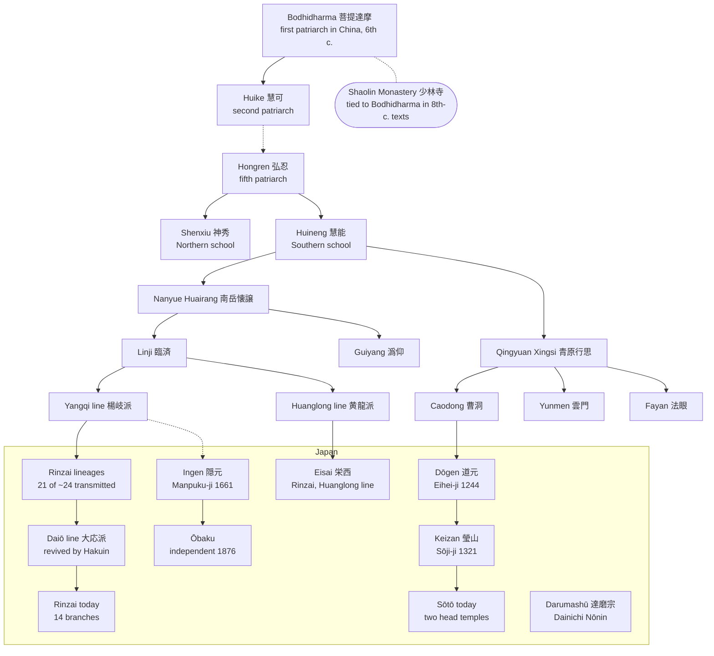

[[Buddhism Index]] | [[Zen]] | [[Zen Schools in Japan]] | [[Trusted Sources]]

# From Shaolin to Japan: A History of Zen

This note tells the history in two layers: the story the tradition tells about itself, and what historians can confirm. Every claim rests on a cited source; gaps are listed at the end.[^1] [^12] [^13]

## Lineage diagram

The diagram follows the traditional lineage as the tradition itself records it.[^1] Dashed lines mark links that historians treat as later construction or that compress several generations.[^2] [^3]

## 1. Bodhidharma and Shaolin: the founding story

- **The traditional account.** Zen looks to Bodhidharma (菩提達摩) as its first patriarch in China. He is said to have arrived in the sixth century and handed the wordless, mind-to-mind teaching (以心伝心, _ishin denshin_) and his robe to Huike (慧可), the second patriarch. This handing on of teaching and robe became the form every later Chan lineage took.[^1]
- **How it became a Shaolin story.** Meir Shahar traces how Bodhidharma came to be tied to the Shaolin Monastery on Mount Song in particular. The link appears only in early eighth-century texts, and Song-dynasty collections such as the _Jingde Record of the Transmission of the Lamp_ (1004) later added dramatic scenes, including Huike cutting off his arm in the snow.[^2]
- **How historians read it.** John McRae uses newly discovered manuscripts to reassess Chan's lineages and its stories of patriarchal succession, including how accounts of Bodhidharma's life grew over time. The legends show how later generations understood Chan, even where they do not record what happened.[^3] [^4]

## 2. Tang China: the patriarchs and the "five houses"

- **Northern and Southern schools.** Under the fifth patriarch, Hongren (弘忍), the lineage divided into Shenxiu's (神秀) Northern school and Huineng's (慧能) Southern school.[^1]
- **The five houses and seven schools** (五家七宗, _goke shichishū_). Huineng's heirs Nanyue Huairang and Qingyuan Xingsi founded two branches. The Linji and Guiyang houses came from Huairang; the Caodong, Yunmen and Fayan houses from Xingsi. Linji later divided into the Yangqi and Huanglong lines, making seven.[^1]
- **How historians read it.** McRae treats the neat Northern–Southern split as the traditional telling, and examines how Heze Shenhui (荷沢神会, 684–758) promoted the _Platform Sutra_ and built up the cult of Huineng as sixth patriarch.[^4]

## 3. Song China: the mature tradition

- **Growth and decline.** Chan flourished through the Tang and Song and slowly declined after the Yuan and Ming.[^1]
- **Two streams of practice.** Dahui Zonggao (大慧宗杲, 1089–1163) of the Yangqi line brought kōan practice (公案禅) to its developed form. It became one of the two great currents of Song Chan, alongside the "silent illumination" (黙照禅, _mokushō zen_) of the Caodong line — the direct ancestors of Japanese Rinzai and Sōtō.[^5]
- **Institutions.** McRae argues that the Song is where Chan's institutional dominance and characteristic forms took shape.[^3] [^4]

## 4. Kamakura and Muromachi Japan: transmission

- **Arrival.** From the twelfth century, Eisai (栄西) brought Rinzai (the Huanglong line) from Song China and Dōgen (道元) brought Sōtō; both became part of the new Buddhism of the Kamakura period.[^1]
- **An earlier movement.** Dainichi Nōnin's (大日能忍) Darumashū was described by Hōnen as a school that did not base itself on scripture.[^6] Its influence on Dōgen is studied by Faure.[^7]
- **Sōtō takes root.** Dōgen founded Daibutsu-ji in Echizen in 1244, renamed Eihei-ji two years later. In 1321 Keizan (瑩山) founded Sōji-ji in Noto.[^8]
- **Rinzai spreads.** By the end of the Muromachi period, about 24 Chan lineages had reached Japan, 21 of them Rinzai; all but Eisai's came from the Yangqi line. They spread through the Five Mountains (五山, _gozan_) networks of Kamakura and Kyoto.[^5] [^9]

## 5. Edo and Meiji Japan: the modern shape

- **Ōbaku.** The Ming master Ingen (隠元) arrived in 1654 and founded Manpuku-ji in Uji in 1661.[^10] Ōbaku brought the late-Ming practice of combining Zen with Pure Land devotion (禅浄双修) and was at times called "nembutsu Zen."[^1]
- **Hakuin.** Of the 21 Rinzai lineages, only the Daiō line (大応派) survives today, revived by Hakuin (白隠, 1685–1768).[^5] This is the line of [[Zazen for Beginners Transcript|Harada Roshi]] and Sogenji.
- **Meiji reorganisation.** The Fuke school (普化宗) was abolished by government order in 1871.[^11] In 1876 Ōbaku became formally independent of Rinzai.[^10]

## Timeline

| Period | Event | Source |
| --- | --- | --- |
| 6th c. | Bodhidharma arrives in China (traditional account) | [^1] |
| early 8th c. | Texts first tie Bodhidharma to Shaolin | [^2] |
| 1004 | _Jingde Record of the Transmission of the Lamp_ | [^2] |
| 1089–1163 | Dahui Zonggao develops kōan Chan | [^5] |
| 12th–13th c. | Eisai brings Rinzai, Dōgen brings Sōtō | [^1] |
| 1244 | Daibutsu-ji (later Eihei-ji) founded | [^8] |
| 1321 | Sōji-ji founded by Keizan | [^8] |
| 1654 / 1661 | Ingen arrives; Manpuku-ji founded | [^10] |
| 1685–1768 | Hakuin revives the Daiō line | [^5] |
| 1871 | Fuke school abolished | [^11] |
| 1876 | Ōbaku independent of Rinzai | [^10] |

## Not yet sourced

Left out until a citable source is found; logged in [[Trusted Sources#To review|To review]]:

- Dōgen's journey to China (traditionally 1223–27)
- Eisai's dates and his two journeys to China
- Chinese masters who settled in Japan, such as Lanxi Daolong (蘭溪道隆), founder of Kenchō-ji
- The intermediate patriarchs between Huike and Hongren, shown as a dashed line in the diagram

---

## Footnotes

[^1]: 林鳴宇, "[禅宗](https://jodoshuzensho.jp/daijiten/index.php/%E7%A6%85%E5%AE%97)," in 『新纂浄土宗大辞典』 (WEB edition, Jōdo Shū), accessed 21 September 2026.

[^2]: Meir Shahar, _The Shaolin Monastery: History, Religion, and the Chinese Martial Arts_ (Honolulu: University of Hawaiʻi Press, 2008), ch. 1. Page not yet checked in print; see [[Trusted Sources#To review|To review]].

[^3]: John R. McRae, _Seeing through Zen: Encounter, Transformation, and Genealogy in Chinese Chan Buddhism_ (Berkeley: University of California Press, 2003), https://doi.org/10.1525/9780520937079.

[^4]: Review of McRae, _Seeing through Zen_, [Project MUSE](https://muse.jhu.edu/article/196810/summary), accessed 21 September 2026; Peter D. Hershock, review of McRae, _Seeing through Zen_, [H-Buddhism](https://networks.h-net.org/node/6060/reviews/16030/hershock-mcrae-seeing-through-zen-encounter-transformation-and), August 2007.

[^5]: 林鳴宇, "[臨済宗](https://jodoshuzensho.jp/daijiten/index.php/%E8%87%A8%E6%B8%88%E5%AE%97)," in 『新纂浄土宗大辞典』 (WEB edition, Jōdo Shū), accessed 21 September 2026.

[^6]: "[達磨宗](https://jodoshuzensho.jp/daijiten/index.php/%E9%81%94%E7%A3%A8%E5%AE%97)," in 『新纂浄土宗大辞典』 (WEB edition, Jōdo Shū), accessed 21 September 2026.

[^7]: Bernard Faure, "The Daruma-shū, Dōgen, and Sōtō Zen," _Monumenta Nipponica_ 42, no. 1 (1987): 25–55, https://doi.org/10.2307/2385038.

[^8]: "[両大本山](https://www.sotozen-net.or.jp/soto/honzan)," SOTOZEN-NET, Sōtōshū Shūmuchō, accessed 21 September 2026. Official site: cite for the school's self-description only.

[^9]: Martin Collcutt, _Five Mountains: The Rinzai Zen Monastic Institution in Medieval Japan_ (Cambridge, MA: Harvard University Press, 1981).

[^10]: "[萬福寺について](https://www.obakusan.or.jp/about/)," Ōbaku head temple Manpuku-ji, accessed 21 September 2026. Official site: cite for the school's self-description only.

[^11]: 末木文美士, "普化宗," in 『日本大百科全書（ニッポニカ）』 (Tokyo: Shōgakukan), read via [Kotobank](https://kotobank.jp/word/%E6%99%AE%E5%8C%96%E5%AE%97-124229), accessed 21 September 2026.

[^12]: See also [[Zen Schools in Japan]] for the present-day structure of each school.

[^13]: Claude, Anthropic, claude-opus-5, history and diagram compiled from the sources above, conversation with author, 21 September 2026.
