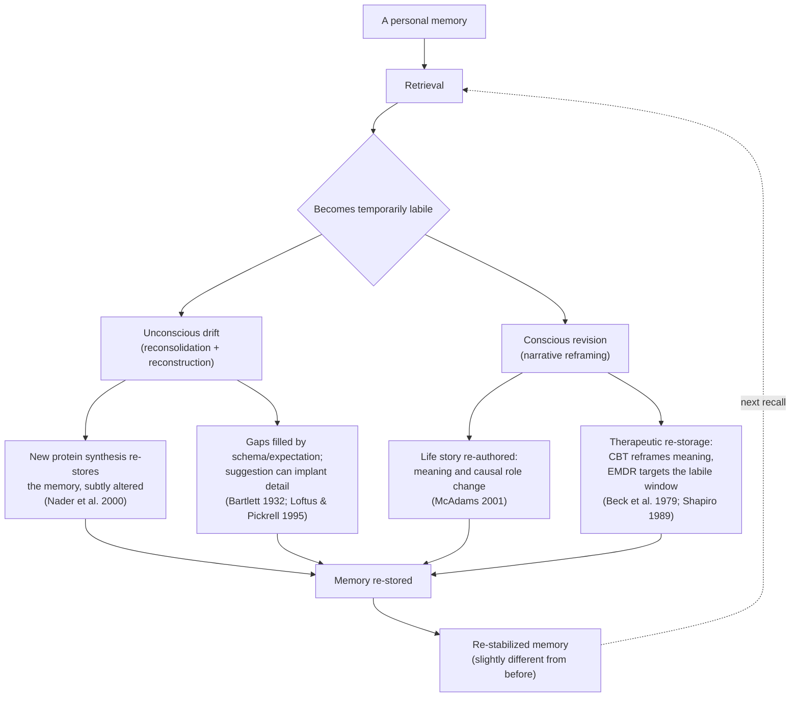

_Source: Claude, Anthropic, claude-sonnet-5, conversation with author, 9 September 2026._

[[Neuroplasticity]] - [[Consciousness]] - [[Mind]] - [[Life Timeline|timeline]] - [[Buddhism|Buddhism]]

# How Humans Rewrite Their Own Memories

Personal memory isn't a fixed recording that gets replayed on demand. It is reconstructed each time it's accessed, and ==that reconstruction is shaped by biology==, ==storytelling==, and — sometimes — deliberate effort. Four mechanisms account for most of how this happens. ^52c38e

## 1. Reconsolidation: recall makes memory unstable again

When a memory is retrieved, it doesn't stay in stable, long-term form the whole time it's being recalled. Retrieval returns it to a temporarily labile state, during which it must be re-stabilized (reconsolidated) through new protein synthesis in order to persist. ==While it's in that labile window, the memory can be strengthened, weakened, or updated with new information before it's re-stored.==

Karim Nader, Glenn Schafe, and Joseph LeDoux demonstrated this directly in fear-conditioned rats: blocking protein synthesis in the amygdala immediately after a memory was reactivated erased the fear memory, even though the same block had no effect on a memory that hadn't been reactivated.[^1] This was the finding that revived reconsolidation as a serious framework in neuroscience, and it's the mechanistic reason recall is not neutral — every time you revisit a memory, you reopen it for editing.

## 2. Reconstruction: memory was never a recording

Even before reconsolidation was understood at the molecular level, Frederic Bartlett's classic studies showed that ==people don't retrieve memories intact — they reconstruct them using schemas, or mental templates, filling gaps with what "must have" been true. Details drift toward what fits the rememberer's existing expectations and culture==.[^2]

Elizabeth Loftus and Jacqueline Pickrell showed how far this drift can go: by describing a plausible but entirely fabricated childhood event (getting lost in a shopping mall) alongside real family memories, they got roughly a quarter of participants to "recall" the false event, sometimes elaborating on it with invented sensory detail.[^3] ==Memory is constructive, not archival== — which means every recollection is, in a small way, an act of composition.

## 3. Narrative identity: curating the story, not just the facts

Beyond individual memories, people organize their life into an ongoing autobiographical story — selecting which events count as turning points, assigning them causes, and deciding what they mean about who the person is. Dan McAdams calls this ==narrative identity: an internalized, evolving life story that integrates the reconstructed past and imagined future to provide a sense of unity and purpose==.[^4]

This is where rewriting becomes most deliberate. ==The same event — a failed relationship, a professional setback — can be re-narrated over years from "something that happened to me" to "the beginning of something," without changing a single fact. The editing happens at the level of meaning and causal framing, not content.==

## 4. Deliberate revision: therapeutic reframing

Two well-established therapeutic approaches use these mechanisms on purpose.

==Cognitive therapy, developed by Aaron Beck and colleagues, works by identifying the automatic interpretation attached to a memory or belief and testing it against evidence, then substituting a more accurate or workable interpretation==.[^5] This targets the narrative layer — the meaning assigned to what happened.

Eye Movement Desensitization and Reprocessing (EMDR), introduced by Francine Shapiro, targets the reconsolidation window more directly: a person recalls a distressing memory (making it labile) while performing bilateral eye movements, and the memory is thought to be re-stored with reduced emotional charge.[^6] Whether or not the eye-movement component itself is the active ingredient remains debated, but the underlying logic — recall, then alter, then re-store — maps directly onto reconsolidation.

## A taxonomy of how memory drifts

Daniel Schacter organized the ways memory changes without conscious intent into seven categories — ==transience, absent-mindedness, blocking, misattribution, suggestibility, bias, and persistence== — arguing that most are the by-products of otherwise adaptive memory systems rather than simple flaws.[^7] "Bias," in particular, describes exactly the narrative-reframing process above: ==current knowledge and feelings systematically distorting recollection of the past==.

## Buddhist perspectives

Buddhist thought treats memory as central in a more literal way than the English word suggests, and reaches conclusions that echo — and sharpen — the science above.

### Sati: mindfulness as remembrance

The Pali term now translated "mindfulness," _sati_, shares its root with the Sanskrit _smṛti_ — memory, recollection. When right mindfulness (_sammā-sati_) appears in the Eightfold Path, it originally describes a trained capacity to hold the teaching in mind and recollect the nature of phenomena as they arise, not the secularized "present-moment awareness" the word is often flattened into today.[^8]

### Non-self and the mind-continuum

Without a fixed, unchanging self (_anattā_) to own a memory, ==Buddhist philosophy describes a person as a causal stream, \*citta-santāna\* — a mind-continuum, moment conditioning moment, the way a flame passed candle to candle is continuous without being the same flame==. Memory on this view is not retrieval from a store inside a self; it is one moment in the stream conditioning the next — which lines up with reconsolidation's picture of memory as reconstructed rather than replayed.[^9]

### The storehouse consciousness

Yogācāra philosophy proposed an ==eighth layer of consciousness==, the _ālaya-vijñāna_ or "storehouse consciousness": ==a substrate holding karmic seeds (\*bīja\*), impressions left by every action and experience, which ripen later as tendencies, dispositions, and memories. An event need not be consciously recalled to have left a seed shaping present perception and reaction==.[^10]

### Zen and the caution against habitual memory

Zen tends toward suspicion of memory rather than reverence for it. The instruction toward "beginner's mind" (_shoshin_) warns that memory calcifies perception, teaching the mind to see the present through the residue of the past rather than freshly.[^11]

### Deliberate recollection practices

Vajrayana and Theravada traditions also use memory as a technology rather than only warning against it: recollections of a teacher, a deity, or one's own death (_maraṇasati_, one of the traditional forty meditation objects) deliberately redirect what the mind habitually recurs to.[^12]

Across these threads runs a move that parallels cognitive therapy and narrative-identity work done secularly: the past cannot be erased, but the relationship to what arises from it can change — seeing a memory clearly without fusing with it, which these traditions treat as closer to liberation than to editing.

## Summary diagram

---

## Footnotes

[^1]: Karim Nader, Glenn E. Schafe, and Joseph E. LeDoux, "Fear Memories Require Protein Synthesis in the Amygdala for Reconsolidation after Retrieval," _Nature_ 406 (2000): 722–726.
[^2]: Frederic C. Bartlett, _Remembering: A Study in Experimental and Social Psychology_ (Cambridge: Cambridge University Press, 1932).
[^3]: Elizabeth F. Loftus and Jacqueline E. Pickrell, "The Formation of False Memories," _Psychiatric Annals_ 25, no. 12 (1995): 720–725.
[^4]: Dan P. McAdams, "The Psychology of Life Stories," _Review of General Psychology_ 5, no. 2 (2001): 100–122.
[^5]: Aaron T. Beck et al., _Cognitive Therapy of Depression_ (New York: Guilford Press, 1979).
[^6]: Francine Shapiro, "Efficacy of the Eye Movement Desensitization Procedure in the Treatment of Traumatic Memories," _Journal of Traumatic Stress_ 2, no. 2 (1989): 199–223.
[^7]: Daniel L. Schacter, _The Seven Sins of Memory: How the Mind Forgets and Remembers_ (Boston: Houghton Mifflin, 2001).
[^8]: Bryan Levman, "Putting Smṛti Back into Sati (Putting Remembrance Back into Mindfulness)," _Journal of the Oxford Centre for Buddhist Studies_ 17 (2019).
[^9]: Rupert Gethin, _The Foundations of Buddhism_ (Oxford: Oxford University Press, 1998).
[^10]: William S. Waldron, _The Buddhist Unconscious: The Ālaya-vijñāna in the Context of Indian Buddhist Thought_ (London: Routledge, 2003).
[^11]: Shunryū Suzuki, _Zen Mind, Beginner's Mind: Informal Talks on Zen Meditation and Practice_, ed. Trudy Dixon (New York: Weatherhill, 1970).
[^12]: Bhadantācariya Buddhaghosa, _The Path of Purification (Visuddhimagga)_, trans. Bhikkhu Ñāṇamoli (Kandy: Buddhist Publication Society, 1991).

## Bibliography

Bartlett, Frederic C. _Remembering: A Study in Experimental and Social Psychology_. Cambridge: Cambridge University Press, 1932.

Beck, Aaron T., A. John Rush, Brian F. Shaw, and Gary Emery. _Cognitive Therapy of Depression_. New York: Guilford Press, 1979.

Buddhaghosa, Bhadantācariya. _The Path of Purification (Visuddhimagga)_. Translated by Bhikkhu Ñāṇamoli. Kandy: Buddhist Publication Society, 1991.

Gethin, Rupert. _The Foundations of Buddhism_. Oxford: Oxford University Press, 1998.

Levman, Bryan. "Putting Smṛti Back into Sati (Putting Remembrance Back into Mindfulness)." _Journal of the Oxford Centre for Buddhist Studies_ 17 (2019).

Loftus, Elizabeth F., and Jacqueline E. Pickrell. "The Formation of False Memories." _Psychiatric Annals_ 25, no. 12 (1995): 720–725.

McAdams, Dan P. "The Psychology of Life Stories." _Review of General Psychology_ 5, no. 2 (2001): 100–122.

Nader, Karim, Glenn E. Schafe, and Joseph E. LeDoux. "Fear Memories Require Protein Synthesis in the Amygdala for Reconsolidation after Retrieval." _Nature_ 406 (2000): 722–726.

Schacter, Daniel L. _The Seven Sins of Memory: How the Mind Forgets and Remembers_. Boston: Houghton Mifflin, 2001.

Shapiro, Francine. "Efficacy of the Eye Movement Desensitization Procedure in the Treatment of Traumatic Memories." _Journal of Traumatic Stress_ 2, no. 2 (1989): 199–223.

Suzuki, Shunryū. _Zen Mind, Beginner's Mind: Informal Talks on Zen Meditation and Practice_. Edited by Trudy Dixon. New York: Weatherhill, 1970.

Waldron, William S. _The Buddhist Unconscious: The Ālaya-vijñāna in the Context of Indian Buddhist Thought_. London: Routledge, 2003.
