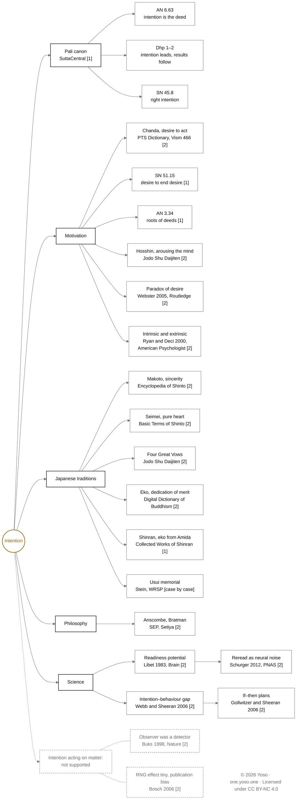

[[Practice]] | [[Essence]] | [[heart]] | [[quantum mechanics]] | [[Prayer]] | [[Bodhicitta]] | [[Karma]] | [[Compassion]] | [[Motivation]]

# Background

Intention revealed itself clearly around 2006, which became a focus of reflection, it is a concept that often is merged with compassion. This was my third tattoo, on the wrist, which has also become one of my seals. At the time of the realisation, intention manifested as the source of vibration before form.

In my current practice, Intention is dedicated to  [[Compassion]] and the well being of sentient beings.

How are we able to purify our intentions?

# Research: Intention

## Contents

- [[#Core Concepts at a Glance|Core Concepts at a Glance]]

1. [[#1. Intention Is the Deed|Intention Is the Deed]]
2. [[#2. Right Intention|Right Intention]]
3. [[#3. Mahāyāna — Intention Widened|Mahāyāna — Intention Widened]]
4. [[#4. Japan — Sincerity, Dedication, the Heart|Japan — Sincerity, Dedication, the Heart]]
5. [[#5. Motivation in Buddhism|Motivation in Buddhism]]
6. [[#6. Philosophy — What an Intention Is|Philosophy — What an Intention Is]]
7. [[#7. Science — Intention in the Brain and in Behaviour|Science — Intention in the Brain and in Behaviour]]
8. [[#8. Intention and the Physical World|Intention and the Physical World]]
9. [[#9. Summary Table|Summary Table]]
10. [[#10. Source Map|Source Map]]
11. [[#Questions to Carry|Questions to Carry]]
12. [Open Knowledge Maps](https://openknowledgemaps.org/map/820f218657b60bce0c85932fa896936b)

---

<div style="page-break-before: always;"></div>

## Core Concepts at a Glance

![[Other/Nodes/Liquid Reality/Intention/Intention Core Concepts Diagram v1.svg|640]]

_Figure 1. Core concepts of intention on the frame of AN 6.63 — source, roots, intention, expression and result — with the path that trains intention, how East Asian Buddhism widens it, how Shinto and Reiki purify the heart, and two modern lenses. Drawn from the sources in this note; every entry names its source (see footnotes)._

> [!note]- Mermaid version (live in Obsidian)
>
> ```mermaid
> %%{init: {"theme": "base", "themeVariables": {"primaryColor": "#ffffff", "primaryTextColor": "#111111", "primaryBorderColor": "#6f6f6f", "lineColor": "#6f6f6f", "clusterBkg": "#ffffff", "clusterBorder": "#6f6f6f", "fontFamily": "Noto Sans, Helvetica Neue, Arial, sans-serif"}}}%%
> %% Intention Core Concepts, Mermaid version · © 2026 Yoso · one.yoso.one · Licensed under CC BY-NC 4.0 · creativecommons.org/licenses/by-nc/4.0
> flowchart TB
>     subgraph SP["The chain · AN 6.63"]
>         direction LR
>         S1["01 · Source<br/>contact<br/>AN 6.63"]
>         S2["02 · Roots<br/>greed · hate · delusion,<br/>or contentment · love · understanding<br/>AN 3.34"]
>         I["03 · Intention<br/>cetanā, the deed itself<br/>AN 6.63"]
>         S3["04 · Expression<br/>body · speech · mind<br/>AN 6.63"]
>         S4["05 · Result<br/>in this life, the next, or later;<br/>suffering or happiness follows<br/>AN 6.63 · Dhp 1–2"]
>         S1 --> S2 --> I --> S3 --> S4
>     end
>
>     subgraph PA["The path · directing and releasing intention"]
>         direction LR
>         A1["Right intention<br/>sammā saṅkappa<br/>renunciation · good will · harmlessness<br/>SN 45.8"]
>         A2["Right effort<br/>generates enthusiasm (chanda),<br/>the desire to act<br/>SN 45.8 · PTS Dictionary"]
>         A3["Desire to end desire<br/>fades when the goal is reached<br/>SN 51.15"]
>         A4["Cessation<br/>when contact ceases, deeds cease;<br/>the practice: the noble eightfold path<br/>AN 6.63"]
>     end
>
>     subgraph W["Widened · the mind of awakening"]
>         direction LR
>         W1["Hosshin 発心<br/>arousing the mind that seeks awakening<br/>Jōdo Shū Daijiten"]
>         W2["Four Great Vows 四弘誓願<br/>beings, afflictions: without limit;<br/>teachings: inexhaustible<br/>Jōdo Shū Daijiten"]
>         W3["Ekō 回向<br/>merit turned to others; for Shinran,<br/>virtue directed by Amida<br/>DDB · Shinran"]
>     end
>
>     subgraph P["Purified · the sincere heart"]
>         direction LR
>         P1["Makoto 誠<br/>sincerity; a heart free of falsehood<br/>Encyclopedia of Shinto"]
>         P2["Seimei 清明<br/>a pure, cheerful heart:<br/>akaki kiyoki kokoro 明き清き心<br/>Basic Terms of Shinto"]
>         P3["Precepts in kokoro<br/>recited in gasshō, morning and evening<br/>Usui memorial (Stein)"]
>     end
>
>     subgraph L["Modern lenses"]
>         direction LR
>         L1["Philosophy of action<br/>a plan that commits (Bratman);<br/>the act is measured against it (Anscombe)<br/>SEP, “Intention”"]
>         L2["Psychology<br/>a strong intention does not guarantee action;<br/>if–then plans raise attainment<br/>Webb &amp; Sheeran 2006 · Gollwitzer &amp; Sheeran 2006"]
>     end
>
>     A1 ~~~ A2 ~~~ A3 ~~~ A4
>     W1 ~~~ W2 ~~~ W3
>     P1 ~~~ P2 ~~~ P3
>     L1 ~~~ L2
>     PA -- trains --> SP
>     SP ~~~ W
>     W ~~~ P
>     P ~~~ L
>     L ~~~ LIC["© 2026 Yoso · one.yoso.one · Licensed under CC BY-NC 4.0"]
>
>     classDef default fill:#ffffff,stroke:#6f6f6f,color:#111111
>     classDef gold fill:#ffffff,stroke:#926C0F,stroke-width:2px,color:#926C0F
>     classDef lic fill:#ffffff,stroke:#ffffff,color:#6f6f6f
>     class I gold
>     class LIC lic
>     linkStyle 12 stroke:#926C0F,stroke-width:2px
> ```

---

## 1. Intention Is the Deed

The early Buddhist teaching puts intention at the centre of karma. In the _Nibbedhika Sutta_ (AN 6.63) the Buddha says:

> It is intention that I call deeds. For after making a choice one acts by way of body, speech, and mind.
>
> _Cetanāhaṁ, bhikkhave, kammaṁ vadāmi. Cetayitvā kammaṁ karoti—kāyena vācāya manasā._[^2]

The sutta places this inside a frame of six things to be known about deeds:

> Deeds should be known. And their source, diversity, result, cessation, and the practice that leads to their cessation should be known.
>
> _Kammaṁ, bhikkhave, veditabbaṁ, kammānaṁ nidānasambhavo veditabbo, kammānaṁ vemattatā veditabbā, kammānaṁ vipāko veditabbo, kammanirodho veditabbo, kammanirodhagāminī paṭipadā veditabbā._[^2]

It answers each in turn: the source of deeds is contact; their result comes in this life, the next, or later; when contact ceases, deeds cease; and the practice that leads there is the noble eightfold path.[^2] Figure 1 follows this frame.

The Pali term is _cetanā_. Sujato's notes add a point that is easy to lose: "In popular culture, the consequence is often said to be _kamma_, but in early Buddhism, _kamma_ is the action that creates the consequence."[^3] Karma, on this teaching, is the intending act, not what comes back from it.

The first two verses of the _Dhammapada_ make the same point as a pair:

> Intention is the leader of things;
> intention is first, they’re made by intention.
> If with corrupt intent
> you speak or act,
> suffering follows you,
> like a wheel, the ox’s foot.
>
> Intention is the leader of things;
> intention is first, they’re made by intention.
> If with pure intent
> you speak or act,
> happiness follows you
> like a shadow that never leaves.
>
> _Manopubbaṅgamā dhammā,_
> _manoseṭṭhā manomayā;_
> _Manasā ce paduṭṭhena,_
> _bhāsati vā karoti vā;_
> _Tato naṁ dukkhamanveti,_
> _cakkaṁva vahato padaṁ._
> _Manopubbaṅgamā dhammā,_
> _manoseṭṭhā manomayā;_
> _Manasā ce pasannena,_
> _bhāsati vā karoti vā;_
> _Tato naṁ sukhamanveti,_
> _chāyāva anapāyinī._[^3]

Sujato translates _mano_ here as "intention" rather than "mind", and explains why: "_Mano_ here is the active aspect of mind, effectively meaning _kamma_. Translating as “mind” obscures the ethical reading in favor of an idealistic one, which given the remainder of the verse is unjustified."[^3] The verses describe a sequence — intention, then action, then consequence — and are about ethics, not about mind creating the world.

Buddhaghosa's commentaries later built a full moral psychology on this teaching. Maria Heim's study of Buddhaghosa, published by Oxford University Press, is the book-length treatment of how early Theravāda thought read intention and motivation.[^4]

## 2. Right Intention

The second factor of the eightfold path is _sammā saṅkappa_ — right intention, right resolve, or, in Sujato's rendering, right purpose. The _Vibhaṅga Sutta_ (SN 45.8) defines it:

> The purpose of renunciation, good will, and harmlessness.
>
> _Yo kho, bhikkhave, nekkhammasaṅkappo, abyāpādasaṅkappo, avihiṁsāsaṅkappo—_[^5]

Sujato's note explains the word: _saṅkappa_ often means "thought", but it names the direction in which the mind is applied, which is why it can also be translated "intention", "resolve" or "purpose". He ends: "This factor is the emotional counterpart of right view, ensuring that the path is motivated by love and compassion."[^5]

AN 6.63 adds a short verse that places the problem in the intention rather than in the world:

> Greedy intention is a person’s sensual pleasure.
> The world’s pretty things aren’t sensual pleasures.
> Greedy intention is a person’s sensual pleasure.
> The world’s pretty things stay just as they are,
> but the attentive remove desire for them.
>
> _Saṅkapparāgo purisassa kāmo,_
> _Nete kāmā yāni citrāni loke;_
> _Saṅkapparāgo purisassa kāmo,_
> _Tiṭṭhanti citrāni tatheva loke;_
> _Athettha dhīrā vinayanti chandanti._[^2]

"Intention" in the verse is _saṅkappa_; "desire" in the last line is _chanda_, the word §5 turns to. The verse bears on the Background's question of how intentions are purified: the world's things are left as they are, and the work is done on the intention.

## 3. Mahāyāna — Intention Widened

**Bodhicitta.** Mahāyāna widens intention from the single act to the orientation of a whole life. [[Bodhicitta]], the mind set on awakening for the sake of all beings, is itself an intention. Śāntideva's _Bodhicaryāvatāra_ divides it in two: the mind that aspires to awaken and the mind that sets out toward it, as the wish to go differs from going.[^6] The distinction parallels what the psychology in §7 measures: wishing is not yet doing.

**The vow.** The Four Great Vows, _shiguseigan_ or _shiguzeigan_ (四弘誓願), give that intention a form that is recited and renewed. In the Jōdo Shū wording their objects are without limit — sentient beings boundless (衆生無辺), afflictions boundless (煩悩無辺), teachings inexhaustible (法門無尽) — and the fourth vow is to realise unsurpassed awakening (無上菩提).[^7] Read this way, the vow sets a direction rather than a task that can be finished; see [[00 The Bodhisattva Vows]].

**Dedication.** In _ekō_ (回向, _pariṇāmanā_, dedication of merit), the scope of an act depends on where the dedicating mind turns it; the vault's Kokoro research reads this as making merit a function of intention as well as action.[^8] Shinran reverses the direction. In _Passages on the Pure Land Way_, Amida's directing of virtue to beings has two aspects, one for going forth to the Pure Land and one for returning to this world.[^9] For the Background's question these point two ways: purify intention by turning it outward to others (_ekō_), or recognise, with Shinran, that the turning comes from Amida and not from one's own effort. See [[Merit]] and [[Kokoro - Cultivation - Merit and Energy]].

## 4. Japan — Sincerity, Dedication, the Heart

**Makoto.** A Shinto virtue close to what the Background calls pure intention is _makoto_ (誠, sincerity). The _Encyclopedia of Shinto_ glosses it as sincerity, earnestness, or a heart free of falsehood, and calls it one of Shinto's cardinal virtues, with emphasis on it traceable to a court edict of 645.[^10] _Basic Terms of Shinto_ describes a related virtue, _seimei_ (清明), as purity and cheerfulness of heart, counts it with honesty among the most prized Shinto virtues, and treats it as the spiritual side of purification (_harae_); a pure, cheerful spirit is _akaki kiyoki kokoro_ (明き清き心).[^11] The vault's Kokoro essay reads this idiom as cultivation by removal — of what is false or dims the heart — rather than by accumulation.

**Reiki.** The memorial to Usui Mikao (1927) instructs that the five precepts be recited morning and evening in _seiza gasshō_, so as to engrave them in the heart-mind (_kokoro ni nen-zeshimu_).[^12] The vault's copy of the precepts gives the same instruction: join the hands, pray with the heart, say it in the mind and aloud; see [[0 The Reiki Principles - Gokai - 五戒]]. Yoso's note [[Gassho, Bowing and Intention]] makes a related move: if one is too shy to be seen bowing, the bow can be visualised in heart and mind as an intention toward the visible and invisible world.

**Dōgen.** Sōtō teaching holds practice and realisation to be one (_shushō ittō_).[^13] The vault's note [[Ritual vs Practice]] leaves open whether the attention the popular view asks for is something added to the sitting or the sitting itself.

## 5. Motivation in Buddhism

Buddhist texts have no single word for "motivation". Three ideas cover most of the ground: _chanda_, the desire to act; the roots from which deeds arise; and, in Mahāyāna, the arousing of the mind of awakening.

**Chanda — the desire to act.** The Pali Text Society's dictionary glosses _chanda_ as impulse, intention, resolution, will and wish, and lists it both as a virtue — striving after righteousness, ardent zeal — and as a vice close to lust (_rāga_) and sensual desire (_kāmacchanda_). It records that Buddhaghosa's _Visuddhimagga_ (466) explains the word as a term for "desire to act" (_kattu-kāmatā_).[^14] Sujato translates the same word as "desire" in SN 51.15 and as "enthusiasm" where it belongs to the bases of psychic power.[^15]

**Enthusiasm the path requires.** Right effort begins with _chanda_:

> It’s when a mendicant generates enthusiasm, tries, makes an effort, exerts the mind, and strives so that bad, unskillful qualities don’t arise.
>
> _Idha, bhikkhave, bhikkhu anuppannānaṁ pāpakānaṁ akusalānaṁ dhammānaṁ anuppādāya chandaṁ janeti vāyamati vīriyaṁ ārabhati cittaṁ paggaṇhāti padahati,_[^5]

**Desire to end desire.** In SN 51.15 the brahmin Uṇṇābha asks Ānanda what the spiritual life is for:

> “Worthy Ānanda, what’s the goal of leading the spiritual life under the ascetic Gotama?”
> “The goal of leading the spiritual life under the Buddha, brahmin, is to give up desire.”
>
> _“kimatthiyaṁ nu kho, bho ānanda, samaṇe gotame brahmacariyaṁ vussatī”ti?_
> _“Chandappahānatthaṁ kho, brāhmaṇa, bhagavati brahmacariyaṁ vussatī”ti._[^15]

Uṇṇābha objects:

> “This being the case, worthy Ānanda, the path is endless, not finite. For it’s not possible to give up desire by means of desire.”
>
> _“Evaṁ sante, bho ānanda, santakaṁ hoti no asantakaṁ. Chandeneva chandaṁ pajahissatīti—netaṁ ṭhānaṁ vijjati”._[^15]

Ānanda answers with a walk to the park. Uṇṇābha had the desire to go there, and when he arrived that desire faded. So too with one who has completed the path: "They formerly had the desire to attain perfection, but when they attained perfection the corresponding desire faded away."[^15] The desire that drives practice is part of the path, and it subsides when its goal is reached. David Webster's study of desire in the Pali canon starts from this "paradox of desire" and surveys the range of Pali terms for desire and desire's positive spiritual value.[^19]

**The roots of action.** AN 3.34 names what moves deeds in the first place:

> Greed, hate, and delusion are sources that give rise to deeds.
>
> _Lobho nidānaṁ kammānaṁ samudayāya, doso nidānaṁ kammānaṁ samudayāya, moho nidānaṁ kammānaṁ samudayāya._
>
> Contentment, love, and understanding are sources that give rise to deeds.
>
> _Alobho nidānaṁ kammānaṁ samudayāya, adoso nidānaṁ kammānaṁ samudayāya, amoho nidānaṁ kammānaṁ samudayāya._[^16]

Sujato renders _alobha_, _adosa_ and _amoha_ — literally non-greed, non-hate and non-delusion — as contentment, love and understanding.

**Hosshin — arousing the mind.** In Japanese Buddhism the start of practice is _hosshin_ (発心). The Jōdo Shū dictionary defines it as giving rise to the mind that seeks awakening (bodhicitta), and also as resolving to leave home and take ordination.[^17] Its fuller form, _hotsu bodaishin_ (発菩提心), corresponds to Sanskrit _cittotpāda_; the entry cites the teaching that the first arousing of this mind, the wish to carry others across before oneself, and final awakening are one.[^18] See §3 on bodhicitta.

**A scientific counterpart.** Self-determination theory distinguishes two kinds of motivation: "The term _extrinsic motivation_ refers to the performance of an activity in order to attain some separable outcome and, thus, contrasts with _intrinsic motivation_, which refers to doing an activity for the inherent satisfaction of the activity itself." (p. 71; [pdf](zotero://open-pdf/library/items/TLUAIU5P?page=4)).[^20] Ryan and Deci propose three innate psychological needs — competence, autonomy and relatedness — whose satisfaction supports self-motivation and well-being (p. 68).[^20] SDT is not a Buddhist theory and should not be equated with _chanda_ or craving, but it gives a tested vocabulary for acting from the activity itself versus acting for a separate outcome.

## 6. Philosophy — What an Intention Is

The _Stanford Encyclopedia of Philosophy_ entry on intention begins with its three guises — intending something for the future, the intention with which one acts, and acting intentionally — and cites Elizabeth Anscombe's observation that the word is not simply ambiguous across them.[^21]

Two positions from that literature bear directly on practice:

- **Intention as plan and commitment.** For Michael Bratman, intentions are plans we are disposed to keep without reconsidering, and they feed our further planning; a desire, even the strongest, need not commit us to act.[^21]
- **Intention as practical knowledge.** For Anscombe, when an act fails to match the intention and no mistaken belief is involved, the error lies in the performance, not in a judgment.[^21] Read for tattooing: a line that goes astray is a failure of the hand, not of the design.

Philosophers still disagree whether intention is a mental state that causes action, or a way of already being under way in the action itself.[^21]

## 7. Science — Intention in the Brain and in Behaviour

**The readiness potential.** Libet and colleagues (1983) found that brain activity preceding a freely voluntary, self-initiated movement began at least several hundred milliseconds before the time people reported for their conscious intention to act.[^22] Schurger, Sitt and Dehaene (2012) offered a different reading: when there is no cue for when to move, the moment the decision threshold is crossed is largely set by spontaneous neural fluctuations, and averaging trials time-locked to the movement makes those fluctuations look like a gradual build-up.[^23] Both studies concern simple movements timed at will, not considered decisions.

**The intention–behaviour gap.** Across 47 experiments that raised the strength of people's intentions, a medium-to-large change in intention (d = 0.66) produced only a small-to-medium change in behaviour (d = 0.36).[^24]

**If–then plans.** Gollwitzer and Sheeran begin:

> Holding a strong goal intention (“I intend to reach _Z_!”) does not guarantee goal achievement, because people may fail to deal effectively with self-regulatory problems during goal striving.
>
> (p. 69; [pdf](zotero://open-pdf/library/items/MRHBANF9?page=1))[^25]

Their meta-analysis of 94 independent tests found that "implementation intentions" — plans of the form _if situation Y, then I will do X_ — had a medium-to-large effect on goal attainment (d = .65), helping people start, stay on course, disengage from failing courses of action, and conserve capability for later goals (p. 69).[^25] This parallels Śāntideva's step from aspiring to setting out (§3).

**Intention in mindfulness.** Shapiro, Carlson, Astin and Freedman proposed a model of mindfulness built on three axioms — intention, attention and attitude — and treat intention as something that can change as practice continues.[^26]

## 8. Intention and the Physical World

Some popular and AI-generated writing claims that intention acts directly on matter through quantum effects. The evidence does not support that step.

- **The observer effect.** The 1998 Weizmann Institute experiment often cited for this showed that coupling electrons to a "which-path" detector suppresses their interference.[^27] The observer was a measuring device, not a person's awareness or intention.
- **Random number generators.** A meta-analysis of 380 studies of human intention and random number generators found a significant but very small overall effect; effect sizes were strongly and inversely related to sample size and extremely varied, a pattern the authors showed could in principle arise from publication bias.[^28] Parapsychologists dispute that reading in a published comment.[^29]

What is well supported runs through the person: intention shapes attention and action. This is also where the Pali texts place intention — in deeds of body, speech and mind (§1).

## 9. Summary Table

| Source | What intention or motivation is | What it does | Note |
| --- | --- | --- | --- |
| **AN 6.63** | _Cetanā_, the deed itself | Acts through body, speech, mind | Canonical |
| **Dhp 1–2** | Intention, the "leader of things" | Suffering or happiness follows | Ethical, not idealist |
| **SN 45.8** | _Sammā saṅkappa_ | Renunciation, good will, harmlessness | Path factor |
| **Śāntideva** | Bodhicitta, aspiring and engaged | Wish, then setting out | Mahāyāna |
| **Four Great Vows** | Intention given a recited form | Sets a direction without limit | East Asian |
| **_Ekō_ / Shinran** | Dedication of merit | Turned outward, or received from Amida | Opposite directions |
| **Shinto _makoto_, _seimei_** | Sincerity; pure, cheerful heart | Purifies by removal | Cardinal virtues |
| **Usui memorial** | Precepts engraved in _kokoro_ | Recited in _gasshō_, morning and evening | Reiki |
| _**Chanda**_ | Desire to act | Virtue or vice, by its object | Vism 466 |
| **SN 51.15** | Desire to end desire | Fades when the goal is reached | Paradox resolved |
| **AN 3.34** | Roots of deeds | Greed, hate, delusion or their opposites | Motivation |
| _**Hosshin**_ | Arousing the mind of awakening | Starts practice | Japan |
| **Anscombe / Bratman** | Practical knowledge / plan | Sets the standard; commits the future | Philosophy of action |
| **Libet; Schurger et al.** | Late in simple movements? | Contested | Neuroscience |
| **Webb & Sheeran; Gollwitzer & Sheeran** | Goal vs if–then plan | Gap narrowed by specificity | Psychology |
| **Ryan & Deci** | Intrinsic vs extrinsic | Needs for competence, autonomy, relatedness | Motivation science |
| **Shapiro et al.** | The "why" of practice | Can change as practice continues | Mindfulness |
| **Quantum / PK claims** | Force on matter | Not supported | See §8 |

## 10. Source Map

Every source in the map was checked on its own site or on its publisher or PubMed record, in this note or in the vault's Kokoro research (13 September 2026), and is listed in [[Trusted Sources]]. Tier in brackets.



_Left out because not fully verified (see [[Trusted Sources#To review|To review]]): Crosby and Skilton's_ Bodhicaryāvatāra _(wording unchecked), Shapiro et al. 2006 (PDF not yet read), Radin et al. 2006 (not read)._

---

## Questions to Carry

- **At the needle:** the vault's [[Tattoo Dharma]] note asks "Is this pure?" before each step. Is that question _makoto_ (removing what is false), right intention (renunciation, good will, harmlessness), or an if–then plan set before the session?
- **Purifying intention:** AN 3.34 names the roots that move a deed. Is purifying intention a matter of noticing which root is moving the hand?
- **The wrist seal:** if intention is the deed (AN 6.63), is the tattoo a record of an intention, or a daily renewal of it — Śāntideva's wish to go, or the going?
- **Motivation:** the 2022 entry in [[Motivation]] records losing motivation and finding peace. Is that the desire that fades on arrival in SN 51.15, or a loss of the _chanda_ that right effort asks us to generate?
- **Morning practice:** [[01 Morning Meditation aka align, set your intention]] — aspiring bodhicitta each morning, _hosshin_ renewed, or a specific _if this, then that_ for the day?

---

## Footnotes

[^2]: _Nibbedhika Sutta_ (AN 6.63), in _Numbered Discourses_, trans. Bhikkhu Sujato, [SuttaCentral](https://suttacentral.net/an6.63/en/sujato), segments 6.1, 8.10–8.14, 33.3–33.5, 34.2, 36.2–36.3 and 37.2–37.3, accessed 29 September 2026. Quotations checked character for character against SuttaCentral's published data (bilara-data). [Zotero](zotero://select/library/items/W3HBGDIR)
[^3]: _Dhammapada_ 1–2, in _Sayings of the Dhamma_, trans. Bhikkhu Sujato, [SuttaCentral](https://suttacentral.net/dhp1-20/en/sujato), with translator's notes to dhp1:1 and dhp1:5, accessed 29 September 2026. Other translators render _mano_ as "mind". [Zotero](zotero://select/library/items/GHSQJ3EU)
[^4]: Maria Heim, _[The Forerunner of All Things: Buddhaghosa on Mind, Intention, and Agency](https://global.oup.com/academic/product/the-forerunner-of-all-things-9780199331031)_ (New York: Oxford University Press, 2013), https://doi.org/10.1093/acprof:oso/9780199331031.001.0001. Described from the publisher's page; the book itself not read. [Zotero](zotero://select/library/items/75CYLXG4)
[^5]: _Vibhaṅga Sutta_ (SN 45.8), in _Linked Discourses_, trans. Bhikkhu Sujato, [SuttaCentral](https://suttacentral.net/sn45.8/en/sujato), segments 4.2 and 8.2 and translator's note to 4.1, accessed 29 September 2026. [Zotero](zotero://select/library/items/79CXMGM9)
[^6]: Śāntideva, _The Bodhicaryāvatāra_, trans. Kate Crosby and Andrew Skilton (Oxford: Oxford University Press, 1996), 1.15–16. **Verse numbers agree across translations seen; Crosby and Skilton's wording not checked.** [Zotero](zotero://select/library/items/ZQTH6ZUM)
[^7]: 平岡聡 (Hiraoka Satoshi), "[四弘誓願](https://jodoshuzensho.jp/daijiten/index.php/四弘誓願)," 『WEB版 新纂浄土宗大辞典』(Jōdo Shū), accessed 29 September 2026. [Zotero](zotero://select/library/items/FS7Q59CI)
[^8]: A. Charles Muller, ed., _[Digital Dictionary of Buddhism](http://www.buddhism-dict.net/ddb/)_, s.v. 回向, as cited in [[Kokoro - Cultivation - Merit and Energy]], §3.1 (citations checked 13 September 2026). [Zotero](zotero://select/library/items/NCD6J4ZW)
[^9]: Shinran, "[Passages on the Pure Land Way](https://shinranworks.com/the-major-expositions/passages-on-the-pure-land-way/)," in _The Collected Works of Shinran_, trans. Dennis Hirota et al., vol. 1 (Kyoto: Jōdo Shinshū Hongwanji-ha, 1997), section "Practice," accessed 29 September 2026. [Zotero](zotero://select/library/items/6W4VMPCW)
[^10]: Nishioka Kazuhiko, "[Makoto](https://d-museum.kokugakuin.ac.jp/eos/detail/?id=8728)," _Encyclopedia of Shinto_, Kokugakuin University, accessed 25 September 2026. [Zotero](zotero://select/library/items/7C24XFRI)
[^11]: Institute for Japanese Culture and Classics, Kokugakuin University, _[Basic Terms of Shinto](https://www2.kokugakuin.ac.jp/ijcc/wp/bts/bts_s.html)_ (1997), s.v. "Seimei," accessed 29 September 2026. [Zotero](zotero://select/library/items/FFPNB96V)
[^12]: Justin B. Stein, "[Usui Reiki Ryōhō (Reiki, Japan)](https://wrldrels.org/2017/01/24/reiki-japan/)," _World Religions and Spirituality Project_, 14 November 2016, citing Okada Masayuki, _Reihō chōso Usui sensei kudoku no hi_ (memorial inscription, Saihōji, Tokyo, 1927); as cited in [[Kokoro - Cultivation - Merit and Energy]], §5.3. [Zotero](zotero://select/library/items/8GBX6UP4)
[^13]: Ishii Seijun, "[Shusho Itto (Oneness and Equality of Practice and Realization)](https://www.sotozen.com/eng/library/key_terms/pdf/key_terms07.pdf)," trans. Issho Fujita, SOTOZEN-NET, as cited in [[Ritual vs Practice]], §5. Limited scope: how the Sōtō school explains its own teaching. [Zotero](zotero://select/library/items/7PPAHJ9F)
[^14]: T. W. Rhys Davids and William Stede, eds., _The Pali Text Society's Pali–English Dictionary_ (Pali Text Society, 1921–25), s.v. "Chanda," read in the digital text distributed by SuttaCentral (sc-data), accessed 29 September 2026. The _Visuddhimagga_ reference is the dictionary's; the _Visuddhimagga_ itself not checked. [Zotero](zotero://select/library/items/DESTKU64)
[^15]: _Uṇṇābhabrāhmaṇa Sutta_ (SN 51.15), in _Linked Discourses_, trans. Bhikkhu Sujato, [SuttaCentral](https://suttacentral.net/sn51.15/en/sujato), segments 1.5–1.6, 4.1–4.2 and 5.1, with translator's note to 1.6, accessed 29 September 2026. Quotations checked character for character against SuttaCentral's published data. [Zotero](zotero://select/library/items/4TWWDH72)
[^16]: _Nidāna Sutta_ (AN 3.34), in _Numbered Discourses_, trans. Bhikkhu Sujato, [SuttaCentral](https://suttacentral.net/an3.34/en/sujato), segments 1.3 and 7.3, accessed 29 September 2026. [Zotero](zotero://select/library/items/FJIRKEFS)
[^17]: 編集部, "[発心](https://jodoshuzensho.jp/daijiten/index.php/発心)," 『WEB版 新纂浄土宗大辞典』(Jōdo Shū), accessed 29 September 2026. [Zotero](zotero://select/library/items/QVDP74J7)
[^18]: 薊法明, "[発菩提心](https://jodoshuzensho.jp/daijiten/index.php/発菩提心)," 『WEB版 新纂浄土宗大辞典』(Jōdo Shū), accessed 29 September 2026. [Zotero](zotero://select/library/items/X2UZR5JU)
[^19]: David Webster, _[The Philosophy of Desire in the Buddhist Pali Canon](https://www.routledge.com/The-Philosophy-of-Desire-in-the-Buddhist-Pali-Canon/Webster/p/book/9780415600002)_, Routledge Critical Studies in Buddhism (London: RoutledgeCurzon, 2005). Described from the publisher's page; the book itself not read. [Zotero](zotero://select/library/items/WCP3F2QN)
[^20]: Richard M. Ryan and Edward L. Deci, "Self-Determination Theory and the Facilitation of Intrinsic Motivation, Social Development, and Well-Being," _American Psychologist_ 55, no. 1 (2000): 68, 71, https://doi.org/10.1037/0003-066X.55.1.68. Read in the published article (PDF hosted by the Center for Self-Determination Theory). [Zotero](zotero://select/library/items/XKFF8NVD)
[^21]: Kieran Setiya, "[Intention](https://plato.stanford.edu/entries/intention/)," _Stanford Encyclopedia of Philosophy_, first published 31 August 2009, substantive revision 20 July 2022, accessed 25 September 2026, introduction and §§1, 4, 5; summarising G. E. M. Anscombe, _Intention_, 2nd ed. (Oxford: Blackwell, 1963), and Michael E. Bratman, _Intention, Plans, and Practical Reason_ (Cambridge, MA: Harvard University Press, 1987). [Zotero](zotero://select/library/items/EN8GCVWK)
[^22]: Benjamin Libet, Curtis A. Gleason, Elwood W. Wright, and Dennis K. Pearl, "Time of Conscious Intention to Act in Relation to Onset of Cerebral Activity (Readiness-Potential): The Unconscious Initiation of a Freely Voluntary Act," _Brain_ 106, no. 3 (1983): 623–42, https://doi.org/10.1093/brain/106.3.623. **PDF not yet read; finding paraphrased from the abstract.** [Zotero](zotero://select/library/items/VQ5Y4V7X)
[^23]: Aaron Schurger, Jacobo D. Sitt, and Stanislas Dehaene, "An Accumulator Model for Spontaneous Neural Activity Prior to Self-Initiated Movement," _Proceedings of the National Academy of Sciences_ 109, no. 42 (2012): E2904–13, https://doi.org/10.1073/pnas.1210467109. **PDF not yet read; finding paraphrased from the abstract.** [Zotero](zotero://select/library/items/KVRV4E8S)
[^24]: Thomas L. Webb and Paschal Sheeran, "Does Changing Behavioral Intentions Engender Behavior Change? A Meta-Analysis of the Experimental Evidence," _Psychological Bulletin_ 132, no. 2 (2006): 249–68, https://doi.org/10.1037/0033-2909.132.2.249. **PDF not yet read; finding paraphrased from the abstract.** [Zotero](zotero://select/library/items/NJ4ZZMGQ)
[^25]: Peter M. Gollwitzer and Paschal Sheeran, "Implementation Intentions and Goal Achievement: A Meta-Analysis of Effects and Processes," _Advances in Experimental Social Psychology_ 38 (2006): 69, https://doi.org/10.1016/S0065-2601(06)38002-1. Read in the published chapter (scan deposited in KOPS, University of Konstanz); quotation checked against the page image. [Zotero](zotero://select/library/items/L7PHFI52)
[^26]: Shauna L. Shapiro, Linda E. Carlson, John A. Astin, and Benedict Freedman, "Mechanisms of Mindfulness," _Journal of Clinical Psychology_ 62, no. 3 (2006): 373–86, https://doi.org/10.1002/jclp.20237. **PDF not yet read; finding paraphrased.** [Zotero](zotero://select/library/items/YLMVVCLM)
[^27]: E. Buks, R. Schuster, M. Heiblum, D. Mahalu, and V. Umansky, "Dephasing in Electron Interference by a 'Which-Path' Detector," _Nature_ 391 (1998): 871–74, https://doi.org/10.1038/36057. **PDF not yet read; finding paraphrased from the abstract.** [Zotero](zotero://select/library/items/JVYGJJGG)
[^28]: Holger Bösch, Fiona Steinkamp, and Emil Boller, "Examining Psychokinesis: The Interaction of Human Intention with Random Number Generators — A Meta-Analysis," _Psychological Bulletin_ 132, no. 4 (2006): 497–523, https://doi.org/10.1037/0033-2909.132.4.497. **PDF not yet read; finding paraphrased from the abstract.** [Zotero](zotero://select/library/items/Z8PEDB8C)
[^29]: Dean Radin, Roger Nelson, York Dobyns, and Joop Houtkooper, "Reexamining Psychokinesis: Comment on Bösch, Steinkamp, and Boller (2006)," _Psychological Bulletin_ 132, no. 4 (2006): 529–32, https://doi.org/10.1037/0033-2909.132.4.529. Record seen on PubMed; article not read. [Zotero](zotero://select/library/items/5AK4EJJ4)

## Bibliography

Bösch, Holger, Fiona Steinkamp, and Emil Boller. "Examining Psychokinesis: The Interaction of Human Intention with Random Number Generators — A Meta-Analysis." _Psychological Bulletin_ 132, no. 4 (2006): 497–523. https://doi.org/10.1037/0033-2909.132.4.497.

Buks, E., R. Schuster, M. Heiblum, D. Mahalu, and V. Umansky. "Dephasing in Electron Interference by a 'Which-Path' Detector." _Nature_ 391 (1998): 871–74. https://doi.org/10.1038/36057.

Gollwitzer, Peter M., and Paschal Sheeran. "Implementation Intentions and Goal Achievement: A Meta-Analysis of Effects and Processes." _Advances in Experimental Social Psychology_ 38 (2006): 69–119. https://doi.org/10.1016/S0065-2601(06)38002-1.

Heim, Maria. _The Forerunner of All Things: Buddhaghosa on Mind, Intention, and Agency_. New York: Oxford University Press, 2013. https://doi.org/10.1093/acprof:oso/9780199331031.001.0001.

Institute for Japanese Culture and Classics, Kokugakuin University. _Basic Terms of Shinto_. 1997. https://www2.kokugakuin.ac.jp/ijcc/wp/bts/.

Libet, Benjamin, Curtis A. Gleason, Elwood W. Wright, and Dennis K. Pearl. "Time of Conscious Intention to Act in Relation to Onset of Cerebral Activity (Readiness-Potential): The Unconscious Initiation of a Freely Voluntary Act." _Brain_ 106, no. 3 (1983): 623–42. https://doi.org/10.1093/brain/106.3.623.

Muller, A. Charles, ed. _Digital Dictionary of Buddhism_. http://www.buddhism-dict.net/ddb/.

Nishioka Kazuhiko. "Makoto." _Encyclopedia of Shinto_. Kokugakuin University. https://d-museum.kokugakuin.ac.jp/eos/detail/?id=8728.

Radin, Dean, Roger Nelson, York Dobyns, and Joop Houtkooper. "Reexamining Psychokinesis: Comment on Bösch, Steinkamp, and Boller (2006)." _Psychological Bulletin_ 132, no. 4 (2006): 529–32. https://doi.org/10.1037/0033-2909.132.4.529.

Rhys Davids, T. W., and William Stede, eds. _The Pali Text Society's Pali–English Dictionary_. Pali Text Society, 1921–25.

Ryan, Richard M., and Edward L. Deci. "Self-Determination Theory and the Facilitation of Intrinsic Motivation, Social Development, and Well-Being." _American Psychologist_ 55, no. 1 (2000): 68–78. https://doi.org/10.1037/0003-066X.55.1.68.

Schurger, Aaron, Jacobo D. Sitt, and Stanislas Dehaene. "An Accumulator Model for Spontaneous Neural Activity Prior to Self-Initiated Movement." _Proceedings of the National Academy of Sciences_ 109, no. 42 (2012): E2904–13. https://doi.org/10.1073/pnas.1210467109.

Setiya, Kieran. "Intention." _Stanford Encyclopedia of Philosophy_. First published 31 August 2009; substantive revision 20 July 2022. https://plato.stanford.edu/entries/intention/.

Shapiro, Shauna L., Linda E. Carlson, John A. Astin, and Benedict Freedman. "Mechanisms of Mindfulness." _Journal of Clinical Psychology_ 62, no. 3 (2006): 373–86. https://doi.org/10.1002/jclp.20237.

Shinran. _The Collected Works of Shinran_. Translated by Dennis Hirota et al. Vol. 1. Kyoto: Jōdo Shinshū Hongwanji-ha, 1997. https://shinranworks.com/.

Śāntideva. _The Bodhicaryāvatāra_. Translated by Kate Crosby and Andrew Skilton. Oxford: Oxford University Press, 1996.

Stein, Justin B. "Usui Reiki Ryōhō (Reiki, Japan)." _World Religions and Spirituality Project_, 14 November 2016. https://wrldrels.org/2017/01/24/reiki-japan/.

Sujato, Bhikkhu, trans. _Linked Discourses_, _Numbered Discourses_, and _Sayings of the Dhamma_. SuttaCentral. https://suttacentral.net/.

Webb, Thomas L., and Paschal Sheeran. "Does Changing Behavioral Intentions Engender Behavior Change? A Meta-Analysis of the Experimental Evidence." _Psychological Bulletin_ 132, no. 2 (2006): 249–68. https://doi.org/10.1037/0033-2909.132.2.249.

Webster, David. _The Philosophy of Desire in the Buddhist Pali Canon_. Routledge Critical Studies in Buddhism. London: RoutledgeCurzon, 2005.

『WEB版 新纂浄土宗大辞典』. Jōdo Shū. https://jodoshuzensho.jp/daijiten/. Entries 四弘誓願 (平岡聡), 発心 (編集部), 発菩提心 (薊法明).

### Sources

Zotero links follow each footnote; every source is in the Zotero collection _00 INBOX › Intention_, and each Zotero item links back to this note.
