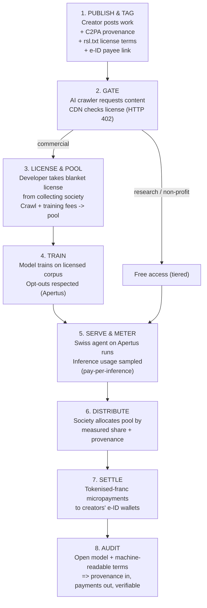

# A Sovereign Digital Model for Switzerland

_Open AI · self-sovereign identity · tokenised money · creator compensation · private payments — built for individuals and communities_

---

## Premise

If the dominant AI, identity, and payment infrastructure ends up owned by a single external power (US or otherwise), dependence becomes a strategic vulnerability: a hosted system can be paywalled, repointed, or switched off by its owner.

Switzerland is better positioned than most to resist this — not because it should build everything from scratch, but because the two hardest pieces **already exist** and simply aren’t yet connected into something citizens and communities own. The design goal is therefore _integration into a public stack_, not autarky. The defining principle: **you cannot be made dependent on something whose weights, code, and rails are open and sit on sovereign soil.**

---

## Part 1 — The Stack

A five-layer architecture, bottom to top.

### 1. Sovereign open foundation (AI layer)

- **Already exists:** _Apertus_, released 2 September 2025 by EPFL, ETH Zurich and the Swiss National Supercomputing Centre (CSCS), as part of the Swiss AI Initiative.
- Fully open under **Apache 2.0** — architecture, weights, training data and methods all public. Trained on 1,800+ languages incl. Swiss languages; available in 8B and 70B sizes.
- **Strategic point:** openness _is_ the sovereignty mechanism. An open-weight model on domestic compute can’t be revoked or paywalled the way a hosted API can.
- **Policy job:** fund the compute (CSCS) and successive model generations as **public infrastructure**, like roads.

### 2. Identity & data layer

- **Self-sovereign digital identity** (Switzerland’s e-ID): the credential and the data live with the person, not a platform.
- This is the **trust spine** everything else plugs into — and the precondition for protecting cultural identity and IP attribution. _(Detailed in Part 3.)_

### 3. IP + culture convergence layer

- Where Creative Commons, AI, and currency actually fuse.
- Apertus already respects **machine-readable opt-out** requests (even retroactively) and strips personal data before training. Make that a national standard.
- Creators tag work with **provenance** (C2PA) and a **license** (CC variants, or “trainable-with-compensation”); when a model uses the work, payment flows back. _(Mechanism in Part 2.)_

### 4. Money layer

- The central-bank franc rails are already partly digital — but **wholesale only**. The SNB’s _Project Helvetia_ issues a digital franc (wholesale CBDC) to financial institutions on SIX Digital Exchange, settling tokenised assets delivery-versus-payment; extended to at least mid-2027.
- The SNB has **declined to issue a retail digital franc**, citing privacy, security and financial-stability risks. So citizen-level money runs on **regulated deposit tokens** (bank-issued tokenised francs) and community currencies. _(Detailed in Part 3.)_

### 5. The Swiss agent layer

- A personal / community AI agent running on the open model, carrying your e-ID and wallet, keeping your data in-jurisdiction, acting **for you** rather than for an advertising platform.
- **Governance template = federalism.** Subsidiarity (canton → commune → individual) is already how Switzerland distributes power, so the agent layer is federated and cooperatively governed, not centralised.

---

## Part 2 — Creator Compensation Mechanism

A clean per-use payment is what everyone wants and nobody has built — because the hard part isn’t moving money, it’s **metering** and **attribution**. Design around what’s actually meterable.

### Where you meter — three points in the value chain

1. **Pay-per-crawl** — at ingestion/training. Easy to meter, but blunt.
2. **Subscription** — ongoing access to a catalogue.
3. **Pay-per-inference** — when content is used in an output. Fairer, but attribution is hard.

The _Really Simple Licensing_ standard (RSL 1.0, finalised Dec 2025) expresses all three via a small `rsl.txt` file (like `robots.txt`) and integrates with collective rights organisations. Cloudflare’s _Pay Per Crawl_ enforces via HTTP `402 Payment Required`.

### Don’t chase perfect attribution — pool it

- Tracing which training examples produced a given output is unsolved; influence-tracing exists but is imperfect and costly.
- **Use the music model:** radio/streaming pool revenue and distribute by _measured share_. Sample/estimate usage, pool, distribute proportionally.

### Who collects — Switzerland’s edge

- Individual licensing only works for giants. Creative Commons, which gave **cautious backing** to pay-to-crawl in late 2025, flagged the “long tail” problem.
- **Switzerland already has the institution:** collective-management societies — _ProLitteris_ (text), _SUISA_ (music), _SUISSIMAGE_ (audiovisual). Repurpose them as the AI **blanket-license clearinghouse**.

### How the money moves — the tokenised franc

- Micropayments die under traditional banking fees. Programmable tokenised-franc rails let the society settle **millions of tiny automated distributions**.

### Provenance spine

- Content credentials (**C2PA**) tag the work at creation; **e-ID** ties the tag to a real payee.

### The Swiss differentiator — make it law, keep it open

- Give machine-readable license terms **domestic legal force**: ignoring a valid declaration becomes infringement under Swiss law.
- Pair with CC’s condition — preserve **free/subsidised access for research, archiving and public-interest use** — to get **tiered licensing**: commercial AI pays; public-interest use stays free.

---

## Part 3 — The Citizen Wallet (Identity + Private Payments)

The wallet is the keystone that ties identity, money, creator payouts, and the agent together at the level of the individual. It works by holding **keys, not data** — so control is a property of cryptography and law, not a promise from whoever runs a server.

Switzerland’s actual design, the **swiyu** wallet, points the way: it follows self-sovereign-identity principles, credentials live on your own device with **no central data store**, and the link to you is a **private key generated in the phone’s secure element** that can’t easily be copied. Full state issuance is planned for **1 December 2026** (postponed after an audit flagged, among other things, an unfinished end-to-end encryption concept).

### Rights → mechanisms (identity)

- **Control / ownership** — you hold the private key in hardware; issuers sign credentials _into_ your wallet but never hold a copy of it.
- **Privacy via minimal disclosure** — verifiable credentials prove a fact without the data behind it (e.g. prove “over 18” by scanning a verifier’s QR code, revealing no birthdate); zero-knowledge proofs go further.
- **Non-correlation** — rotating, pairwise identifiers stop two services colluding to build one profile. Get this wrong and an identity wallet becomes a tracking rail.
- **Protection against over-asking** — verifiers are accredited, can request only entitled fields, must show what and why; “decline” is always real, backed by law.
- **Recovery without a backdoor** — social recovery: the key is split into shards held by trusted people or a cooperative; a threshold restores you, no single custodian can impersonate you.
- **Portability / openness** — open standards (W3C Verifiable Credentials, DIDs) and open-source code, so you can switch wallets and verify the privacy claims.
- **Inclusion** — optional, with physical fallbacks; works with intermittent connectivity; doesn’t assume the latest hardware. (The Swiss e-ID is explicitly voluntary.)

### Personal private payments

Reproducing **cash’s privacy** in digital form. Because the SNB has declined a retail digital franc, personal payments run on **regulated deposit tokens** (bank-issued tokenised francs, proven out by PostFinance, Sygnum and UBS with the Swiss Bankers Association in Sep 2025) and on community currencies — not central-bank retail money.

- **Payer-anonymous, payee-accountable** — the cash principle, digital. Blind-signature systems (the model behind GNU Taler) let the spender pay without revealing identity, while the merchant’s receipt is recorded for tax. Privacy is structural, not a courtesy.
- **Tiered privacy by amount** — unconditional anonymity isn’t legally available under AML rules, so: full cash-like privacy for small everyday payments, progressive identification as amounts rise (via the wallet’s selective disclosure and zero-knowledge proofs). Where the thresholds sit is a political choice.
- **No central who-paid-whom ledger** — the issuer mints and redeems tokens but cannot see a graph of personal payments; the unlinkable-identifier design carries through. This is the line between private money and a surveillance rail.
- **Offline / peer-to-peer** — value in the secure element moves device-to-device and reconciles later, like cash changing hands — privacy _and_ resilience.
- **No programmability-as-control (the key guardrail)** — personal funds can never be made to expire, be restricted to certain goods, or be switched off by the issuer. Programmability is **opt-in by the holder** only, and the prohibition on issuer-side control is written into law.
- **Bearer vs. recoverable (a genuine trade-off)** — true bearer privacy (lose the key = lose the money) and easy recovery pull opposite ways. Realistic design: a small cash-like bearer balance for privacy alongside a recoverable account balance, with the user choosing the mix.
- **Community & cooperative money** — local currencies and cooperative mutual-credit settle in the same wallet, optionally programmable by the community itself.

### Tiered privacy in law — a threshold sketch

Switzerland already runs a tiered AML system, and a notably strict one for digital value. Under **AMLO-FINMA** the customer-identification threshold for virtual-currency exchange is **CHF 1,000** (cut from CHF 5,000 in 2020), versus **CHF 5,000** for ordinary currency — and it applies to **linked transactions within 30 days**, not per day, as an explicit anti-structuring rule. The **Travel Rule** bites above CHF 1,000, and FINMA goes beyond FATF by restricting transfers to unhosted wallets absent proof of ownership. So “cash-like privacy” digitally must live inside an environment where **CHF 1,000 is already the anonymity ceiling** for digital value.

A workable ladder, anchored to those existing thresholds:

| Tier                                     | Amount band                              | Privacy                                                                                                                                          | Legal anchor                                                                                                                                          |
| ---------------------------------------- | ---------------------------------------- | ------------------------------------------------------------------------------------------------------------------------------------------------ | ----------------------------------------------------------------------------------------------------------------------------------------------------- |
| **0 — Digital cash** (bearer / offline)  | up to a low holding cap (~CHF 100–250)   | Full anonymity, offline, like notes & coins; no identification                                                                                   | _New_ legislative carve-out: a “digital cash” category exempt from due diligence below the cap (cf. low-value prepaid; EU digital-euro offline model) |
| **1 — Everyday pseudonymous**            | up to CHF 1,000                          | Payer-anonymous to the merchant (blind signatures); identity held only by your onboarding intermediary, disclosed to no one absent legal process | AMLO-FINMA CHF 1,000 / general CHF 5,000                                                                                                              |
| **2 — Identified & monitored**           | CHF 1,000 → ~15,000                      | Full customer due diligence; Travel Rule; monitoring — counterparties still don’t see each other                                                 | Travel Rule >CHF 1,000; occasional-transaction CHF 15,000                                                                                             |
| **3 — Enhanced due diligence**           | above ~15,000–25,000, or PEP / high-risk | Source-of-funds, EDD                                                                                                                             | AMLA enhanced-due-diligence provisions                                                                                                                |

**Make-or-break design points**

- **Anti-structuring without a surveillance ledger.** The 30-day linkage rule stops tiers being gamed by splitting payments — but tracking linkage fights unlinkability. Resolution: the _intermediary_ enforces a per-wallet **cumulative cap** (it knows your running total, not each counterparty), and zero-knowledge proofs let you prove “my 30-day total is under CHF X” without exposing the individual payments.
- **Identity in escrow, pierced only by due process.** The onboarding intermediary holds your identity; de-anonymisation requires a **judicial warrant or an MROS** suspicious-activity report — never bulk access. Because identity sits with _distributed private intermediaries_ rather than a central state ledger, there is **no single honeypot** — which is precisely why the SNB’s reluctance to issue a retail CBDC _helps_ the privacy story.
- **Direction of travel.** Thresholds are political and face FATF/EU pressure to fall further (the EU is tightening anonymous-crypto limits), so the privacy floor must be **written into law explicitly** or it erodes by default. Switzerland’s CHF 1,000 threshold is already unusually low by international standards — a real limit on how much digital anonymity is achievable.

### The agent extension

The wallet also authorises the Swiss agent on a **capability basis**: the agent acts only inside scopes you grant — a spending cap, a time limit, a specific task — every action is logged in a local audit trail only you can read, and any grant is instantly revocable.

---

## Part 4 — End-to-End Transaction Flow

A single creator’s work moving through the system: _publish → train → serve → settle._

**Narrative walk-through**

1. **Publish & tag.** Creator publishes; attaches C2PA credentials and a machine-readable license (`rsl.txt`-style). e-ID links the credential to a payout account.
2. **Gate.** A crawler requests the content; the CDN checks the license. Commercial without a license → `402 Payment Required`. Public-interest crawler → free under the tier.
3. **License & pool.** The developer takes a **blanket license** from the Swiss collecting society and pays into a shared pool.
4. **Train.** The model trains on the licensed corpus; machine-readable opt-outs honoured.
5. **Serve & meter.** Deployed as the Swiss agent on Apertus; output usage is **sampled** — no perfect per-token attribution.
6. **Distribute.** The society allocates the pool by measured share, using provenance to identify payees.
7. **Settle.** Payouts move as **tokenised-franc micropayments** to creators’ e-ID-linked wallets.
8. **Audit.** Open model + machine-readable terms make the whole loop verifiable.

---

## Part 5 — Honest Constraints

- **Compute & chips.** Switzerland can’t escape global semiconductor supply; frontier compute is costly to keep domestic.
- **Regulatory gravity.** EU and US rules exert pull; interoperability is unavoidable.
- **No central-bank retail money.** The SNB has declined a retail digital franc, so personal payments rely on **regulated bank/issuer rails** — less “pure” sovereign money than a CBDC, but it avoids concentrating surveillance capability in the state.
- **Privacy vs. AML.** True unconditional anonymity isn’t legally available; the tiered-privacy model is a compromise, and thresholds are a political decision.
- **Bearer vs. recoverable.** A real either/or for at least part of any private-money balance.
- **Offline double-spend.** Offline payments depend on trusted secure-element hardware.
- **Cross-border enforcement (hardest gap).** Domestic law and CDN gatekeeping can’t reach a model trained _outside_ Swiss jurisdiction on scraped Swiss work — needs **international reciprocity**.
- **Privacy is a property you keep, not ship once.** Switzerland’s own e-ID passed by only 50.39% and was delayed partly over unfinished encryption — the guarantees are only as strong as the cryptography, law, and governance sustaining them.

**Realistic meaning of “independence”:** own the layers that matter most — model, identity, provenance, governance — while staying interoperable with everyone else. Not isolation.

---

## References (key sourced facts)

- **Apertus** — open LLM, Apache 2.0, 1,800+ languages, 8B/70B, released 2 Sep 2025 by EPFL / ETH Zurich / CSCS; respects machine-readable opt-out incl. retroactively. ETH Zurich, EPFL, Swisscom, Wikipedia (Sep 2025).
- **Project Helvetia** — SNB wholesale CBDC on SIX Digital Exchange; DvP settlement of tokenised assets; extended to at least mid-2027. SNB (30 Jun 2025); snb.ch.
- **SNB retail stance** — SNB sees no clear public advantage in a digital franc; chairman warned retail-CBDC risks outweigh benefits. snb.ch (“Will the Swiss franc soon only exist digitally?”); SNB speeches (2024–2026).
- **Deposit token** — regulated tokenised bank deposit (digital franc); PoC by Swiss Bankers Association with PostFinance, Sygnum, UBS, Sep 2025; further work expected 2026. Yahoo Finance (Apr 2026).
- **swiyu (Swiss e-ID wallet)** — FOITT app; self-sovereign-identity principles; keys in device secure element; no central data store; selective disclosure (age-only proofs); public beta from 26 Mar 2025; full launch postponed to 1 Dec 2026 after audit (encryption concept unfinished); referendum passed 50.39%. Biometric Update, SwissInfo, ti8m, ki-ecke (2025–2026).
- **Retail-CBDC privacy design** — ZK proofs, private intermediaries, limited anonymity for small transactions. Salami & Buchanan (2025), via phys.org (Mar 2026).
- **RSL 1.0** — open licensing standard; `rsl.txt`; pay-per-crawl / pay-per-inference; integrates collective rights orgs. rslstandard.org; The Register; Search Engine Land (Sep–Dec 2025).
- **Cloudflare Pay Per Crawl** — HTTP 402 mechanism; AI-crawler blocking by default since Jul 2025. Shelly Palmer (Sep 2025).
- **Creative Commons** — “cautious” support for pay-to-crawl (late 2025), conditional on free/subsidised public-interest access. evolmagazine.com (Dec 2025).
- **Swiss collecting societies** — ProLitteris, SUISA, SUISSIMAGE (proposed as AI blanket-license clearinghouses).
- **C2PA** — content provenance / content-credentials standard.
- **GNU Taler** — blind-signature payment system: payer-anonymous, payee-accountable (referenced as a model for private payments).
- **Swiss AML thresholds** — AMLO-FINMA (GwV-FINMA): customer-identification threshold for virtual-currency exchange reduced from CHF 5,000 to CHF 1,000 (effective 2020/2021), applied to linked transactions within 30 days; Travel Rule above CHF 1,000; CHF 5,000 for ordinary currency. Library of Congress, Chambers (Blockchain 2025), Scorechain, Notabene, Sumsub (2020–2026).

_Prepared as a strategy sketch, not legal or financial advice._
