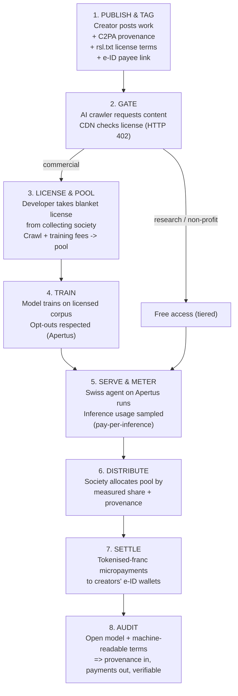

# A Sovereign Digital Model for Switzerland

_Open AI · self-sovereign identity · tokenised money · creator compensation — built for individuals and communities_

---

## Premise

If the dominant AI, identity, and payment infrastructure ends up owned by a single external power (US or otherwise), dependence becomes a strategic vulnerability: a hosted system can be paywalled, repointed, or switched off by its owner.

Switzerland is better positioned than most to resist this — not because it should build everything from scratch, but because the two hardest pieces **already exist** and simply aren’t yet connected into something citizens and communities own. The design goal is therefore _integration into a public stack_, not autarky. The defining principle: **you cannot be made dependent on something whose weights, code, and rails are open and sit on sovereign soil.**

---

## Part 1 — The Stack

A five-layer architecture, bottom to top.

### 1. Sovereign open foundation (AI layer)

- **Already exists:** _Apertus_, released 2 September 2025 by EPFL, ETH Zurich and the Swiss National Supercomputing Centre (CSCS), as part of the Swiss AI Initiative.
- Fully open under **Apache 2.0** — architecture, weights, training data and methods all public. Trained on 1,800+ languages incl. Swiss languages; available in 8B and 70B sizes.
- **Strategic point:** openness _is_ the sovereignty mechanism. An open-weight model on domestic compute can’t be revoked or paywalled the way a hosted API can.
- **Policy job:** fund the compute (CSCS) and successive model generations as **public infrastructure**, like roads.

### 2. Identity & data layer

- **Self-sovereign digital identity** (Switzerland’s e-ID): the credential and the data live with the person, not a platform.
- This is the **trust spine** everything else plugs into — and the precondition for protecting cultural identity and IP attribution (you can only protect provenance if you can prove who holds something).

### 3. IP + culture convergence layer

- Where Creative Commons, AI, and currency actually fuse.
- Apertus already respects **machine-readable opt-out** requests (even retroactively) and strips personal data before training. Make that a national standard.
- Creators tag work with **provenance** (C2PA) and a **license** (CC variants, or “trainable-with-compensation”); when a model uses the work, payment flows back.
- Result: open culture and creator compensation stop being opposites. _(Mechanism detailed in Part 2.)_

### 4. Money layer

- The franc rails are already partly digital — but **wholesale only**. The SNB’s _Project Helvetia_ issues a digital franc (wholesale CBDC) to financial institutions on SIX Digital Exchange, settling tokenised assets delivery-versus-payment; extended to at least mid-2027.
- **The gap = the citizen / community level.** Switzerland’s cooperative tradition (Raiffeisen, communal structures) maps naturally onto tokenised community currencies and programmable cooperative money — and is where Part 2’s micropayments settle.

### 5. The Swiss agent layer

- A personal / community AI agent running on the open model, carrying your e-ID and wallet, keeping your data in-jurisdiction, acting **for you** rather than for an advertising platform.
- **Governance template = federalism.** Subsidiarity (canton → commune → individual) is already how Switzerland distributes power, so the agent layer is federated and cooperatively governed, not centralised.

---

## Part 2 — Creator Compensation Mechanism

A clean per-use payment is what everyone wants and nobody has built — because the hard part isn’t moving money, it’s **metering** and **attribution**. Design around what’s actually meterable.

### Where you meter — three points in the value chain

Emerging standards have converged on:

1. **Pay-per-crawl** — at ingestion/training. Easy to meter, but blunt (paid once, regardless of usefulness).
2. **Subscription** — ongoing access to a catalogue.
3. **Pay-per-inference** — when content is used in an output. Fairer, but attribution is genuinely hard.

The _Really Simple Licensing_ standard (RSL 1.0, finalised Dec 2025) expresses all three via a small `rsl.txt` file (like `robots.txt`) and integrates with collective rights organisations. Cloudflare’s _Pay Per Crawl_ enforces via HTTP `402 Payment Required` — set a price; crawlers pay or walk away.

### Don’t chase perfect attribution — pool it

- Tracing which training examples produced a given output is unsolved; influence-tracing exists but is imperfect and costly.
- **Use the music model:** radio/streaming never track every play perfectly — they pool revenue and distribute by _measured share_. Sample/estimate usage, pool, distribute proportionally.

### Who collects — Switzerland’s edge

- Individual licensing only works for giants (the NYT can negotiate; a Bernese photographer can’t). Creative Commons, which gave **cautious backing** to pay-to-crawl in late 2025, flagged exactly this “long tail” problem.
- **Switzerland already has the institution:** established collective-management societies — _ProLitteris_ (text), _SUISA_ (music), _SUISSIMAGE_ (audiovisual). Repurpose them as the AI **blanket-license clearinghouse**: one license to developers, one pool, distribution to members. The layer global standards lack, Switzerland has had for a century.

### How the money moves — the tokenised franc

- Micropayments die under traditional banking fees: a 0.3-cent royalty can’t carry a 30-cent transaction cost.
- Programmable tokenised-franc rails let the society settle **millions of tiny automated distributions** — exactly what the wholesale tokenisation infrastructure was built for, pushed down to creator level.

### Provenance spine

- Content credentials (**C2PA**) tag the work at creation; **e-ID** ties the tag to a real payee. Without it, the pool has no one to pay.

### The Swiss differentiator — make it law, keep it open

- A standard like RSL is voluntary; enforcement today leans on CDN gatekeeping and AI-company goodwill.
- A **country** has a lever a standards body doesn’t: give machine-readable license terms **domestic legal force**, so ignoring a valid declaration is infringement under Swiss law.
- Pair with CC’s condition — preserve **free / subsidised access for research, archiving, and public-interest use** — to get **tiered licensing**: commercial AI pays into the pool; research, education and non-profit use stays free. This keeps the scheme consistent with Apertus’s public-good ethos rather than turning the open web into a tollbooth.

---

## Part 3 — End-to-End Transaction Flow

A single creator’s work moving through the system: _publish → train → serve → settle._

**Narrative walk-through**

1. **Publish & tag.** Creator publishes; attaches C2PA content credentials (who/when) and a machine-readable license (`rsl.txt`-style): e.g. _“AI training permitted — commercial: pay-per-crawl + inference share; research/non-profit: free.”_ e-ID links the credential to a payout account.
2. **Gate.** An AI developer’s crawler requests the content. The CDN/gateway checks the license. Commercial training without a license → `402 Payment Required` → pay or be blocked. Public-interest crawler → allowed free under the tier.
3. **License & pool.** Instead of negotiating per creator, the developer takes a **blanket license** from the Swiss collecting society and pays into a shared pool (crawl fee + training fee).
4. **Train.** The model trains on the licensed corpus; machine-readable opt-outs are honoured (as Apertus already does, even retroactively).
5. **Serve & meter.** The model is deployed (the Swiss agent on Apertus). When outputs draw on licensed material, usage is **sampled** — no attempt at perfect per-token attribution.
6. **Distribute.** The society allocates the pool by measured share, using provenance data to identify payees.
7. **Settle.** Payouts move as **tokenised-franc micropayments** to creators’ e-ID-linked wallets — millions of tiny automated transfers traditional rails couldn’t economically carry.
8. **Audit.** Because the model and the license terms are open and machine-readable, the whole loop is verifiable: provenance in, payments out.

---

## Part 4 — Honest Constraints

A clear-eyed view of where “sovereign” hits its limits:

- **Compute & chips.** Switzerland can’t escape global semiconductor supply; frontier compute is expensive to keep domestic.
- **Regulatory gravity.** EU and US rules exert pull regardless of Swiss preference; interoperability is unavoidable.
- **Retail-currency caution.** The SNB has deliberately kept the digital franc _wholesale_ — citizen-facing programmable money is not yet on offer and would be a policy decision, not a given.
- **Cross-border enforcement (the hardest gap).** Domestic law and CDN gatekeeping can’t reach a model trained _outside_ Swiss jurisdiction on scraped Swiss work. Closing this needs **international reciprocity**, not a national scheme alone.

**Realistic meaning of “independence”:** own the layers that matter most — model, identity, provenance, governance — while staying interoperable with everyone else. Not isolation.

---

## References (key sourced facts)

- **Apertus** — open LLM, Apache 2.0, 1,800+ languages, 8B/70B, released 2 Sep 2025 by EPFL / ETH Zurich / CSCS; respects machine-readable opt-out incl. retroactively. ETH Zurich, EPFL, Swisscom, Wikipedia (Sep 2025).
- **Project Helvetia** — SNB wholesale CBDC (digital franc) on SIX Digital Exchange; delivery-versus-payment settlement of tokenised assets; extended to at least mid-2027. SNB press release (30 Jun 2025); snb.ch.
- **RSL (Really Simple Licensing) 1.0** — open standard, finalised 10 Dec 2025; `rsl.txt`; supports attribution, pay-per-crawl, pay-per-inference; integrates collective rights orgs. rslstandard.org; The Register; Search Engine Land (Sep–Dec 2025).
- **Cloudflare Pay Per Crawl** — HTTP 402 payment mechanism; AI-crawler blocking by default since Jul 2025. Shelly Palmer (Sep 2025).
- **Creative Commons** — “cautious” support for pay-to-crawl (late 2025), conditional on preserving free/subsidised access for research, archiving and public-interest use; flagged the long-tail-publisher problem. evolmagazine.com (Dec 2025).
- **Swiss collective-management societies** — ProLitteris, SUISA, SUISSIMAGE (long-established collecting societies; proposed here as AI blanket-license clearinghouses).
- **C2PA** — content provenance / content-credentials standard.

_Prepared as a strategy sketch, not legal or financial advice._
