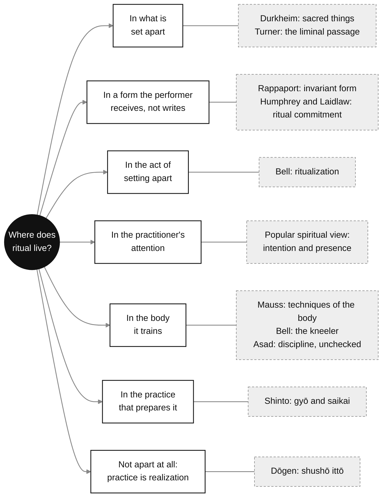
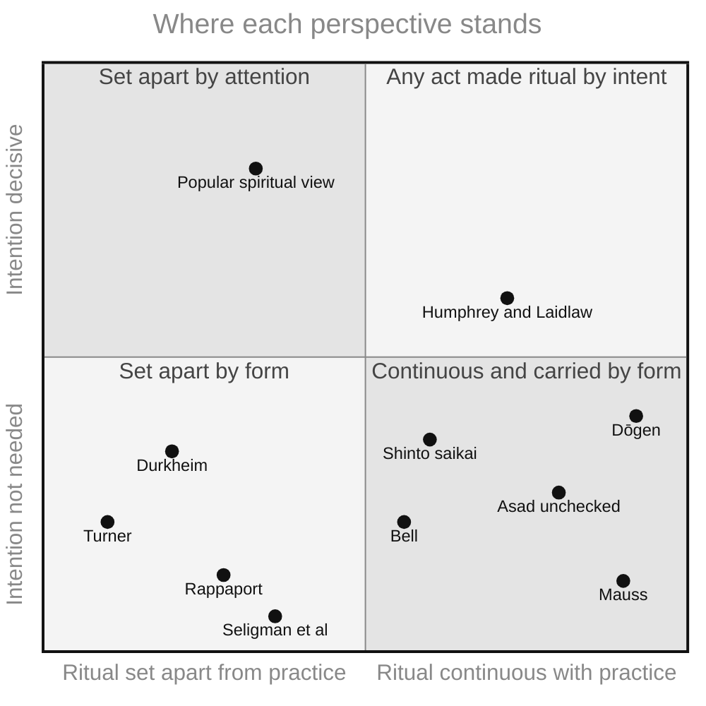

[[Ritual]] | [[Practice]] | [[catherine_bell_ritual_theory_comprehensive_notes-v3|Bell — Ritual Theory, Ritual Practice]]

_Source: Claude, Anthropic, conversation with author, 25 September 2026._[^1]

---

# Ritual vs. Practice: Perspectives

"Ritual" and "practice" overlap so much that most attempts to separate them say as much about the theorist as about the activity. This note gathers the main ways the line has been drawn, or refused, so they can be held side by side. Catherine Bell's account has its own note, [[catherine_bell_ritual_theory_comprehensive_notes-v3|Bell — Ritual Theory, Ritual Practice]]; here she is one voice among several.

## Contents

1. [[#1. Starting Definitions|Starting Definitions]]
2. [[#2. Ritual as What Is Set Apart|Ritual as What Is Set Apart]]
3. [[#3. Where Intention Goes|Where Intention Goes]]
4. [[#4. Practice as the Making of a Self|Practice as the Making of a Self]]
5. [[#5. Views from Japanese Practice|Views from Japanese Practice]]
6. [[#6. The Field-Level View|The Field-Level View]]
7. [[#7. Where the Perspectives Meet and Part|Where the Perspectives Meet and Part]]
8. [[#8. Summary Table|Summary Table]]
9. [[#9. Key Similarities|Key Similarities]]
10. [[#Questions to Carry|Questions to Carry]]

---

## 1. Starting Definitions

**Ritual.** A standard reference definition: "Ritual is rule-governed action, which is repeated on special occasions. It may sometimes be regarded as sacred and part of religion, but at other times may be seen as secular."[^2] Victor Turner's classic definition draws the line against work: ritual is "prescribed formal behavior for occasions not given over to technological routine, having reference to beliefs in mystical beings and powers."[^3]

**Practice.** Alasdair MacIntyre gives the most-cited philosophical definition: "any coherent and complex form of socially established cooperative human activity through which goods internal to that form of activity are realized."[^4] The goods of a practice are internal to it — reached by doing the thing, not by some other route. Writing on "practice" in Buddhist studies, Carl Bielefeldt separates four English senses of the word: active engagement in a vocation, applied theory as opposed to doctrine, training toward proficiency, and actual behaviour as opposed to professed ideals.[^5]

**The popular distinction** — the one this note began from — runs through intention:

<mark style="background: #FFB86CA6;">The true distinction between ritual and routine (or practice) lies deeper than habit versus ceremony — it rests on intention, awareness, emotional connection, and meaning.</mark>[^6]

The rest of this note tests that claim against the theories.

---

## 2. Ritual as What Is Set Apart

**Durkheim.** For Émile Durkheim, "a religion is a unified system of beliefs and practices relative to sacred things, that is to say, things set apart and forbidden." Rites, in turn, "are the rules of conduct which prescribe how a man should comport himself in the presence of these sacred objects."[^7] Practice is the general term; ritual is practice turned toward what has been set apart.

==The word \*sacred\* comes from the Latin \*sacer\*, meaning "set apart."== <mark style="background: #FFB86CA6;">A sacred ritual is set apart from ordinary routines</mark> — it is something secured against violation or infringement.[^8]

**Turner, after van Gennep.** Setting apart can be a passage. Following Arnold van Gennep, Turner described ritual in three phases, with a middle, liminal phase in which participants are "neither here nor there; they are betwixt and between the positions assigned and arrayed by law, custom, convention, and ceremonial."[^9] In that margin Turner located _communitas_, which Deflem glosses as "the feeling of comradeship among the liminal personae," set against ordinary social structure.[^10] The setting apart is temporary and has a direction — out of ordinary structure and back into it.

**Bell.** For Bell, the setting apart is itself the ritual act. Ritualization is a way of acting that distinguishes and privileges what is being done over more ordinary activity.[^11] ==The sacred is not found and then honoured; it is produced by the differentiation==.

---

## 3. Where Intention Goes

This is where theory pushes hardest against the popular view. Several accounts move intention away from the single act.

**Rappaport.** Roy Rappaport defines ritual as "the performance of more or less invariant sequences of formal acts and utterances not entirely encoded by the performers."[^12] The last clause matters: the performer does not write the rite. He also separates the public acceptance that performing signals from private belief — **not checked in the text**.[^13]

**Humphrey and Laidlaw.** Caroline Humphrey and James Laidlaw, working from the Jain rite of worship, argue that ritual is not a separate class of action but a quality that almost any action can take on. Ritualized action is, in their account, non-intentional — and, paradoxically, it becomes so through an intentional act, which they call the "ritual commitment."[^14] Intention does not vanish; it moves from each gesture to the decision to enter the rite.

**Seligman, Weller, Puett and Simon.** Ritual, like play, "creates 'as if' worlds," a "subjunctive universe." The authors set this against a "sincere" search for unity and wholeness, which treats fragmentation and incoherence as signs of inauthenticity to be overcome. "Our modern world has accepted the sincere viewpoint at the expense of ritual, dismissing ritual as mere convention."[^15]

**Bell.** Ritualization asks only for public consent to its outward forms — the bow, the unison chant — not inner conviction.[^16]

Against these stands the spiritual view:

From a spiritual perspective, the line is drawn not by formality or sacredness but by _quality of attention_. ==A ritual becomes spiritual when it is approached with intention and presence. Habit runs on automation, while ritual invites awareness and meaning into an action.==[^6]

==A routine is a habitual action performed regularly without deeper symbolic meaning, while a ritual carries significance beyond its practical function==. The boundary can blur: a family's Sunday dinner might start as routine and, over years, take on ritual-like qualities as it becomes tied to identity and belonging.

Set beside the theories, the spiritual view is a clear case of what Seligman and his co-authors call sincerity: it places the value of the act in the inner state that goes with it. The theorists do not deny that attention matters. They deny that attention is what makes an act a ritual. On their accounts an inattentive rite is still a rite, and still does its work.

---

## 4. Practice as the Making of a Self

**Mauss.** In "Techniques of the Body," Marcel Mauss treats everyday bodily skills as learned techniques, and refuses to separate them from ritual by kind: "I call technique an action which is effective and traditional (and you will see that in this it is no different from a magical, religious or symbolic action). It has to be effective and traditional. There is no technique and no transmission in the absence of tradition."[^17] Turner's line between ritual and "technological routine" does not survive this: both are traditional, both are effective, both pass through the body.

**Bourdieu, through Bell.** Moulding the body within a structured environment does not simply express inner states; it restructures the body in the doing. Required kneeling does not merely communicate subordination — it produces a subordinated kneeler.[^18]

**Asad.** Talal Asad's genealogy of the concept of ritual begins from the modern anthropologist's assumption that "ritual is symbolic activity as opposed to the instrumental behavior of everyday life," and sets out to trace where that assumption came from.[^19] **Not checked in the text:** his argument that in medieval Christian monasticism, rites were disciplines — the apt performance of what was prescribed — through which virtues were formed, rather than symbols to be read. If so, the contrast between "empty" ritual and "meaningful" practice is itself modern.

**MacIntyre.** On MacIntyre's definition, what a practice gives is internal to it: its goods come from doing the thing, not by some other route.[^4] That describes a craft well.

**Csordas.** Practice and performance run together. "Practice is structured in such a way that one knows intuitively what to do within a certain situation," while performance addresses an audience. Both, he writes, "are necessary features of prayer as ritual language."[^20]

---

## 5. Views from Japanese Practice

**Dōgen: practice is realization.** In 『辨道話』(_Bendōwa_, Negotiating the Way), answering a questioner, Dōgen writes: "In the Buddha Dharma, practice and realization are one and the same. As your present practice is practice within realization, your initial negotiation of the Way is in itself the whole of original realization."[^21] Sōtō teaching names this _shushō ittō_ (修証一等), the "oneness and equality of practice and realization."[^22] Zazen is then neither a technique for producing something later nor a symbol of something elsewhere. The distinction Turner draws between ritual and technique has nothing to hold on to.

**Keiko: practice as consulting the past.** The everyday word for practising an art, _keiko_ (稽古, practice, training), means literally "to consider the ancient" (古を稽える). The dictionaries give two senses: studying old books to learn principles and precedent, and training in the performing arts, martial arts and crafts.[^23] Mauss's point is built into the word: there is no technique without tradition.

**Shinto: practice as the way into the rite.** The _Encyclopedia of Shinto_ describes _gyō_ (行, religious practice) as found in every religion, and names among the characteristic ancient Shinto forms "purifying practices before or after participation in a shrine ceremony," such as _kessai_, _saikai_ or _monoimi_.[^24] In _saikai_ (斎戒, ritual abstinence), "the term _sai_ refers to a state that transcends the ordinary," and _kai_ to "the taboos (_kinki_) and regulations that have to be kept in relation to _sai_."[^25] A standard dictionary defines it as restraint in food, drink and conduct by those serving in sacred work, purifying body and mind.[^26] Here the set-apart state Durkheim calls sacred is reached through bodily discipline kept by the participant. Practice is the way into ritual, not its opposite.

**How the West narrowed "practice."** Bielefeldt observes that nineteenth-century Western Buddhist studies narrowed "practice" to contemplative disciplines, leaving out lay participation and ritual — "a theological choice about what Buddhism ought properly to be."[^27] Robert Sharf has argued that the modern stress on meditative _experience_ owes much to modern reformers, Asian and Western (**article not opened; unverified**).[^28] If they are right, the spiritual view of ritual — attention over form — is itself a modern position, not the tradition's own.

---

## 6. The Field-Level View

Through the 1970s and 1980s, scholarly theories of ritual began adopting the language of "action," "performance" and "practice," partly as a corrective to theory dominated by structuralism and communicative models.[^29]

==Scholars today largely resist a hard boundary: what most scholars now agree upon is that, for the purposes of study, ritual should not be clearly demarcated from other kinds of practice — it is not a strange "irrational" or merely symbolic action distinct from "rational" technical activity, but instead cross-cuts all aspects of human existence.==[^30]

---

## 7. Where the Perspectives Meet and Part

Three questions sort the views.

**Where does ritual live?**

- In what is set apart — Durkheim, the dictionaries' _sacred_, Shinto _sai_.
- In a form the performer receives rather than writes — Rappaport, Humphrey and Laidlaw.
- In the act of setting apart — Bell.
- In the practitioner's attention — the spiritual view.
- In the body it trains — Mauss, Bell's kneeler, and Asad if his monastic argument is confirmed.

**What does intention do?**

- It makes the act a ritual — the spiritual view.
- It enters once, as commitment, and the act then runs on what is laid down — Humphrey and Laidlaw.
- It is not required; public performance or consent is enough — Rappaport, Bell.
- Demanding that inner and outer match is the "sincere" orientation, and it tends to empty ritual out — Seligman et al.
- Nothing needs adding; the practice is already the realization — Dōgen.

**Is there a line between ritual and practice?**

- Yes, against work — Turner.
- Yes, against the ordinary — Durkheim, Bell.
- Not in kind, only in use — Mauss, Humphrey and Laidlaw; and, for the purposes of study, the field at large.
- Practice is the way into ritual — Shinto _saikai_.
- Practice and its fruit are one — Dōgen.

---

## 8. Summary Table

| Perspective | What makes an act ritual | What practice is | Place of intention |
| --- | --- | --- | --- |
| **Durkheim** | Orientation to sacred things, "set apart and forbidden" | The general category of religious conduct | Not central; rules of conduct |
| **Turner** (after van Gennep) | Prescribed formal behaviour outside technological routine; liminal passage | Implicitly, routine and technique | Not central |
| **Mauss** | Nothing in kind — technique is "effective and traditional," like religious action | Techniques of the body, passed on by tradition | Not central |
| **Rappaport** | Invariant formal sequences not encoded by the performer | — | Acceptance, not belief (**unchecked**) |
| **Humphrey & Laidlaw** | A quality any action can take on | Ordinary intentional action | Moves into the "ritual commitment" |
| **Asad** | Historically, disciplined performance forming virtue (**unchecked**) | Discipline | Formed by the practice |
| **Bell** | Strategic differentiation — ritualization | Situational, strategic action | Outward consent suffices |
| **Seligman et al.** | A subjunctive, "as if" world | — | Sincerity is a rival orientation |
| **MacIntyre** | — | Cooperative activity with internal goods | Learned inside the practice |
| **Dōgen** | — | Zazen as realization itself | Nothing to add |
| **Shinto** (_gyō_, _saikai_) | _Sai_, a state beyond the ordinary | Purification and abstinence that prepare it | Kept through bodily rules |
| **Popular spiritual view** | Intention and presence | Habit, routine | Decisive |

### Map of the Perspectives

_Positions are interpretive, read from the table above. Asad's position rests on an argument not yet checked in the text._

---

## 9. Key Similarities

- Both ritual and practice involve **repetition** and embodied, habitual action.
- Both are **socially embedded** — shaped by community, culture and shared meaning.
- Both can **constitute identity**, not merely express it.[^18]
- Both are **received before they are owned**: learned from others, not invented — Mauss's tradition, Rappaport's forms "not entirely encoded by the performers," the past inside _keiko_.[^17] [^12] [^23]

---

## Questions to Carry

- **Tattooing:** which parts of a session are technique and which are ritual — and does the difference hold once the needle is moving? Mauss would say it does not.
- **Zazen:** if practice is realization, is the attention the spiritual view asks for something added to the sitting, or the sitting itself?
- **At the shrine:** does _saikai_ make the rite possible, or does the rite give _saikai_ its meaning?

---

## Footnotes

[^1]: Claude, Anthropic, claude-opus-5-5, conversation with author, 25 September 2026.
[^2]: David J. Parkin, "Ritual," in _International Encyclopedia of the Social & Behavioral Sciences_, 2nd ed. (Elsevier, 2015), read in the publisher's excerpt on [ScienceDirect Topics](https://www.sciencedirect.com/topics/social-sciences/ritual), accessed 25 September 2026. **Volume and pages not confirmed.**
[^3]: Victor Turner, _The Forest of Symbols: Aspects of Ndembu Ritual_ (Cornell University Press, 1967), 19, quoted in Mathieu Deflem, "[Ritual, Anti-Structure, and Religion: A Discussion of Victor Turner's Processual Symbolic Analysis](https://doi.org/10.2307/1387146)," _Journal for the Scientific Study of Religion_ 30, no. 1 (1991): 1–25. Turner's own page not checked.
[^4]: Alasdair MacIntyre, _After Virtue: A Study in Moral Theory_, 2nd ed. (University of Notre Dame Press, 1984), 187. **Quotation and page checked only in a teaching transcription, not in the book.**
[^5]: Carl Bielefeldt, "Practice," in _Critical Terms for the Study of Buddhism_, ed. Donald S. Lopez Jr. (University of Chicago Press, 2005). Read in the author's uploaded copy; **pages not confirmed.**
[^6]: Source not identified. The wording matches popular self-help writing on habits and rituals found by search (e.g. _Brainz Magazine_, Ness Labs). Lead only, not citable; kept as the statement of the popular view this note examines.
[^7]: Émile Durkheim, _[The Elementary Forms of the Religious Life](https://www.gutenberg.org/ebooks/41360)_, trans. Joseph Ward Swain (George Allen & Unwin, 1915), bk. 1, chap. 1.
[^8]: _Merriam-Webster.com Dictionary_, s.v. "[sacred](https://www.merriam-webster.com/dictionary/sacred)," sense 1a, "dedicated or set apart for the service or worship of a deity," and etymology, from Latin _sacer_, accessed 25 September 2026; _Random House Unabridged Dictionary_ (2023), s.v. "sacred," "secured against violation, infringement, etc., as by reverence or sense of right," via Dictionary.com. The dictionaries give "set apart" as a sense of English _sacred_; **the gloss of Latin _sacer_ itself as "set apart" is unverified.**
[^9]: Victor Turner, _The Ritual Process: Structure and Anti-Structure_ (Aldine, 1969), 95, quoted in Deflem, "Ritual, Anti-Structure, and Religion." Deflem notes that Turner took the three-phase scheme from van Gennep's _Rites of Passage_.
[^10]: Deflem, "Ritual, Anti-Structure, and Religion," citing Turner, _Forest of Symbols_, 100. **Whether the phrase is Turner's or Deflem's own not confirmed.**
[^11]: Catherine Bell, _Ritual Theory, Ritual Practice_ (1992; repr., Oxford University Press, 2009), 73–74. Bell page numbers here and below come from the Gemini notebook behind [[catherine_bell_ritual_theory_comprehensive_notes-v3|the Bell note]] and **are unchecked against the book.**
[^12]: Roy A. Rappaport, _Ritual and Religion in the Making of Humanity_, Cambridge Studies in Social and Cultural Anthropology 110 (Cambridge University Press, 1999), 24, quoted in Richard Sosis, "[Ritual](https://doi.org/10.21428/e2759450.63b59680)," _Open Encyclopedia of Cognitive Science_, 27 May 2025.
[^13]: Rappaport, _Ritual and Religion_, chap. 4, section "Acceptance, Belief, and Conformity," beginning at 119, per the contents in the [Library of Congress sample](https://catdir.loc.gov/catdir/samples/cam032/98024494.pdf). The argument itself not read.
[^14]: Caroline Humphrey and James Laidlaw, _The Archetypal Actions of Ritual: A Theory of Ritual Illustrated by the Jain Rite of Worship_, Oxford Studies in Social and Cultural Anthropology (Clarendon Press, 1994). Summarised from the [publisher's description](https://global.oup.com/academic/product/the-archetypal-actions-of-ritual-9780198279471); **the book itself not opened, so no page is given.**
[^15]: Adam B. Seligman, Robert P. Weller, Michael J. Puett, and Bennett Simon, _Ritual and Its Consequences: An Essay on the Limits of Sincerity_ (Oxford University Press, 2008). Quoted from the [publisher's description](https://global.oup.com/academic/product/ritual-and-its-consequences-9780195336009); the argument is developed in chap. 1, "Ritual and the Subjunctive." **Book pages not checked.**
[^16]: Bell, _Ritual Theory_, 210.
[^17]: Marcel Mauss, "Techniques of the Body," _Economy and Society_ 2, no. 1 (1973): 75, https://doi.org/10.1080/03085147300000003. **Quotation read in a secondary transcription; page and translator not confirmed in the journal.**
[^18]: Bell, _Ritual Theory_, 99–100. See also Pierre Bourdieu, _Outline of a Theory of Practice_, trans. Richard Nice (Cambridge University Press, 1977).
[^19]: Talal Asad, "Toward a Genealogy of the Concept of Ritual," in _Genealogies of Religion: Discipline and Reasons of Power in Christianity and Islam_ (Johns Hopkins University Press, 1993). The quoted sentence is from the chapter's [reprint abstract](https://www.taylorfrancis.com/books/e/9781315244099/chapters/10.4324/9781315244099-13) (Routledge, 2017). **Page not confirmed; the monastic argument has not been checked in the text.**
[^20]: Thomas J. Csordas, "[Practice and Performance in Ritual Language](https://tif.ssrc.org/2017/05/30/practice-and-performance-in-ritual-language/)," _The Immanent Frame_, Social Science Research Council, 30 May 2017.
[^21]: Dōgen, _Bendōwa_, in _The Heart of Dōgen's Shōbōgenzō_, trans. Norman Waddell and Masao Abe (SUNY Press, 2002), 19. Read in an unofficial online copy; the volume and translators confirmed on the [SUNY Press page](https://sunypress.edu/Books/T/The-Heart-of-Dogen-s-Shobogenzo).
[^22]: Ishii Seijun, "[Shusho Itto (Oneness and Equality of Practice and Realization)](https://www.sotozen.com/eng/library/key_terms/pdf/key_terms07.pdf)," trans. Issho Fujita, SOTOZEN-NET, accessed 25 September 2026. Limited scope: cited for how the Sōtō school explains its own teaching.
[^23]: 『精選版 日本国語大辞典』(_Nihon Kokugo Daijiten_, Shōgakukan) and 『デジタル大辞泉』(_Digital Daijisen_, Shōgakukan), s.v. 稽古, read via [Kotobank](https://kotobank.jp/word/稽古-57863), accessed 25 September 2026. Print entries not checked.
[^24]: Tsushiro Hirofumi, "[Gyō](https://d-museum.kokugakuin.ac.jp/eos/detail/?id=8573)," _Encyclopedia of Shinto_, Kokugakuin University, accessed 25 September 2026.
[^25]: Sakurai Haruo, "[Saikai](https://d-museum.kokugakuin.ac.jp/eos/detail/?id=9067)," _Encyclopedia of Shinto_, Kokugakuin University, accessed 25 September 2026.
[^26]: 『デジタル大辞泉』(_Digital Daijisen_, Shōgakukan), s.v. 斎戒, read via [Kotobank](https://kotobank.jp/word/斎戒-68548), accessed 25 September 2026.
[^27]: Bielefeldt, "Practice."
[^28]: Robert H. Sharf, "Buddhist Modernism and the Rhetoric of Meditative Experience," _Numen_ 42, no. 3 (1995), https://doi.org/10.1163/1568527952598549. **Not opened; start page 228 and DOI from Brill and indexing records.**
[^29]: Barry Stephenson, "Ritual as Action, Performance, and Practice," in _The Oxford Handbook of Early Christian Ritual_, ed. Risto Uro, Juliette J. Day, Richard E. DeMaris, and Rikard Roitto (Oxford University Press, 2018), https://doi.org/10.1093/oxfordhb/9780198747871.013.3. Checked against the chapter abstract, which was only partly visible.
[^30]: Mary Ann Owoc, "Ritual, Religion, and Ideology," in _Encyclopedia of Archaeology_ (Elsevier, 2008), read in the publisher's excerpt on [ScienceDirect Topics](https://www.sciencedirect.com/topics/social-sciences/ritual). The earlier version of this highlight dropped Owoc's qualifier "for the purposes of study"; it is restored here. **Editor and pages not confirmed.**

## Bibliography

Asad, Talal. "Toward a Genealogy of the Concept of Ritual." In _Genealogies of Religion: Discipline and Reasons of Power in Christianity and Islam_. Johns Hopkins University Press, 1993.

Bell, Catherine. _Ritual Theory, Ritual Practice_. 1992. Reprint, Oxford University Press, 2009.

Bielefeldt, Carl. "Practice." In _Critical Terms for the Study of Buddhism_, edited by Donald S. Lopez Jr. University of Chicago Press, 2005.

Bourdieu, Pierre. _Outline of a Theory of Practice_. Translated by Richard Nice. Cambridge University Press, 1977.

Csordas, Thomas J. "Practice and Performance in Ritual Language." _The Immanent Frame_, Social Science Research Council, 30 May 2017. https://tif.ssrc.org/2017/05/30/practice-and-performance-in-ritual-language/.

Deflem, Mathieu. "Ritual, Anti-Structure, and Religion: A Discussion of Victor Turner's Processual Symbolic Analysis." _Journal for the Scientific Study of Religion_ 30, no. 1 (1991): 1–25. https://doi.org/10.2307/1387146.

Dōgen. _The Heart of Dōgen's Shōbōgenzō_. Translated by Norman Waddell and Masao Abe. SUNY Press, 2002.

Durkheim, Émile. _The Elementary Forms of the Religious Life_. Translated by Joseph Ward Swain. George Allen & Unwin, 1915.

Humphrey, Caroline, and James Laidlaw. _The Archetypal Actions of Ritual: A Theory of Ritual Illustrated by the Jain Rite of Worship_. Oxford Studies in Social and Cultural Anthropology. Clarendon Press, 1994.

Ishii Seijun. "Shusho Itto (Oneness and Equality of Practice and Realization)." Translated by Issho Fujita. SOTOZEN-NET. https://www.sotozen.com/eng/library/key\_terms/pdf/key\_terms07.pdf.

MacIntyre, Alasdair. _After Virtue: A Study in Moral Theory_. 2nd ed. University of Notre Dame Press, 1984.

Mauss, Marcel. "Techniques of the Body." _Economy and Society_ 2, no. 1 (1973): 70–88. https://doi.org/10.1080/03085147300000003.

Owoc, Mary Ann. "Ritual, Religion, and Ideology." In _Encyclopedia of Archaeology_. Elsevier, 2008.

Parkin, David J. "Ritual." In _International Encyclopedia of the Social & Behavioral Sciences_, 2nd ed. Elsevier, 2015.

Rappaport, Roy A. _Ritual and Religion in the Making of Humanity_. Cambridge Studies in Social and Cultural Anthropology 110. Cambridge University Press, 1999.

Sakurai Haruo. "Saikai." _Encyclopedia of Shinto_. Kokugakuin University. https://d-museum.kokugakuin.ac.jp/eos/detail/?id=9067.

Seligman, Adam B., Robert P. Weller, Michael J. Puett, and Bennett Simon. _Ritual and Its Consequences: An Essay on the Limits of Sincerity_. Oxford University Press, 2008.

Sharf, Robert H. "Buddhist Modernism and the Rhetoric of Meditative Experience." _Numen_ 42, no. 3 (1995). https://doi.org/10.1163/1568527952598549.

Sosis, Richard. "Ritual." _Open Encyclopedia of Cognitive Science_, 27 May 2025. https://doi.org/10.21428/e2759450.63b59680.

Stephenson, Barry. "Ritual as Action, Performance, and Practice." In _The Oxford Handbook of Early Christian Ritual_, edited by Risto Uro, Juliette J. Day, Richard E. DeMaris, and Rikard Roitto. Oxford University Press, 2018. https://doi.org/10.1093/oxfordhb/9780198747871.013.3.

Tsushiro Hirofumi. "Gyō." _Encyclopedia of Shinto_. Kokugakuin University. https://d-museum.kokugakuin.ac.jp/eos/detail/?id=8573.

Turner, Victor. _The Forest of Symbols: Aspects of Ndembu Ritual_. Cornell University Press, 1967.

Turner, Victor. _The Ritual Process: Structure and Anti-Structure_. Aldine, 1969.

### Further Reading

- Ronald L. Grimes, _Beginnings in Ritual Studies_ (1982) — carried over from the earlier version; details not checked.
- Robert H. Sharf, "Ritual," in _Critical Terms for the Study of Buddhism_, ed. Donald S. Lopez Jr. (University of Chicago Press, 2005) — confirmed in the publisher's contents list; not read.

### AI Source

Claude, Anthropic, claude-opus-5-5, conversation with author, 25 September 2026.
