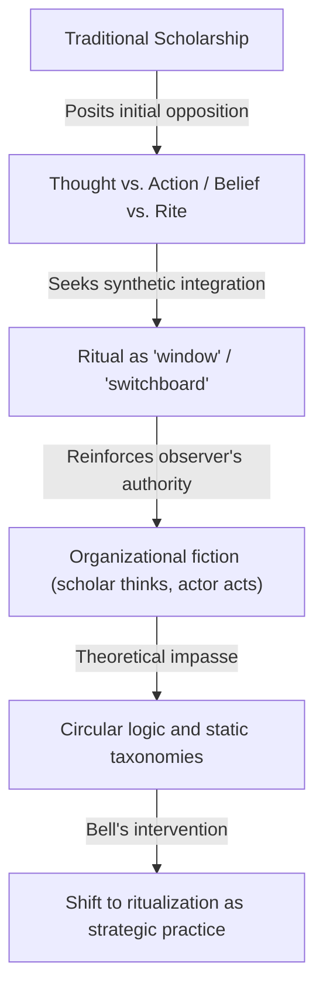
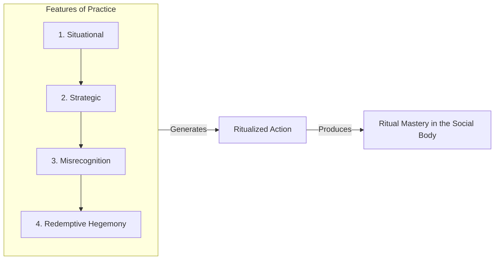
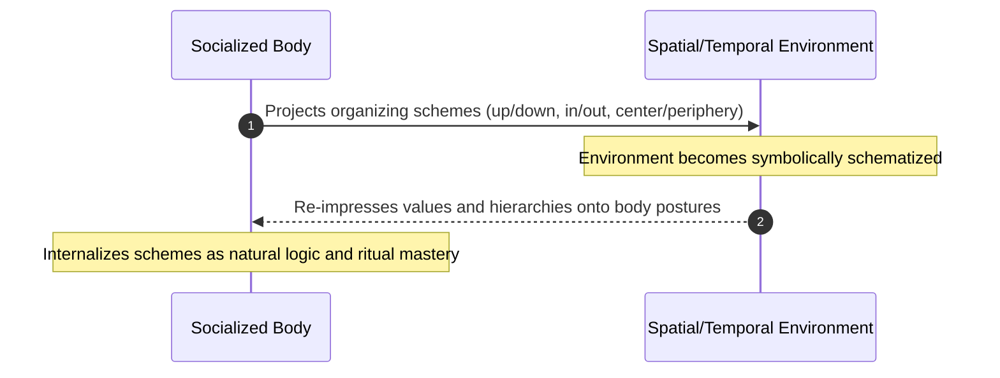
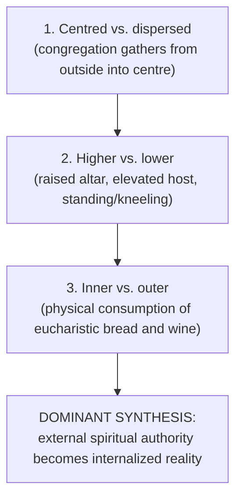
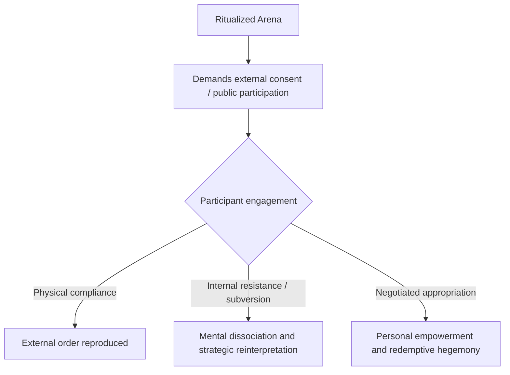
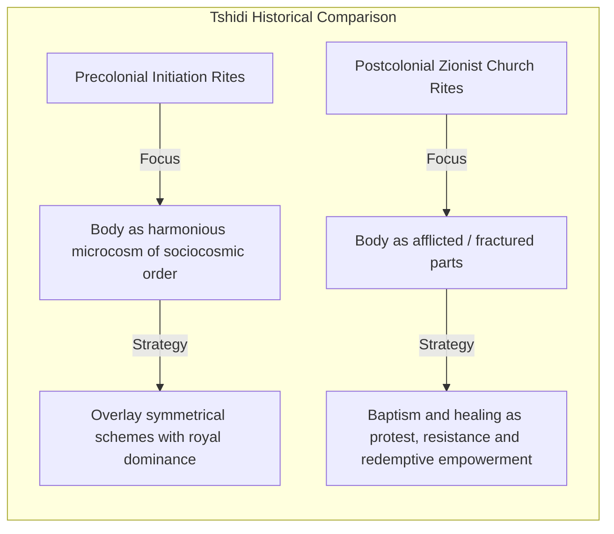
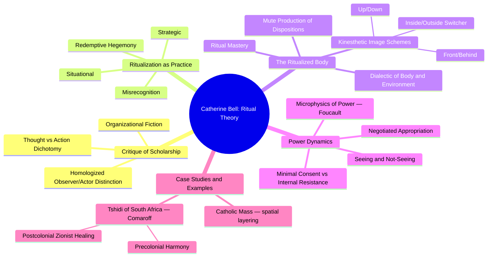
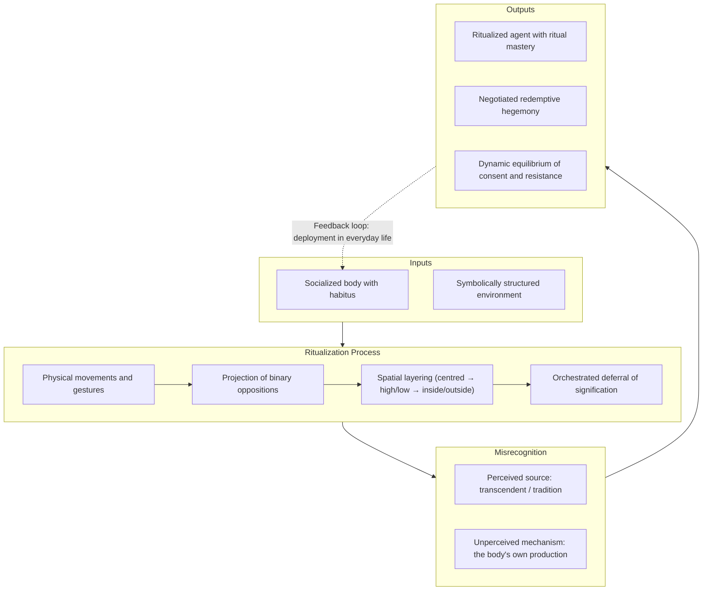

[[Ritual]] | [[Practice]]

# Catherine Bell: _Ritual Theory, Ritual Practice_

_A synthesis of Catherine Bell's_ Ritual Theory, Ritual Practice,[^1] _compiled with Gemini Notebook._[^2]

---

## Contents

1. [[#1. Core Theoretical Summary and Critique of Traditional Scholarship|Core Theoretical Summary and Critique of Traditional Scholarship]]
2. [[#2. The Shift to Ritualization and the Features of Practice|The Shift to Ritualization and the Features of Practice]]
3. [[#3. Body Kinetics, Spatial Orchestration, and Inside–Outside|Body Kinetics, Spatial Orchestration, and Inside–Outside]]
4. [[#4. Power Relationships, Control, and Redemptive Hegemony|Power Relationships, Control, and Redemptive Hegemony]]
5. [[#5. Ethnographic Case Study — The Tshidi of South Africa|Ethnographic Case Study — The Tshidi of South Africa]]
6. [[#6. Integrated Diagrams and Mindmaps|Integrated Diagrams and Mindmaps]]
7. [[#Footnotes|Footnotes]] · [[#Bibliography|Bibliography]]

---

## 1. Core Theoretical Summary and Critique of Traditional Scholarship

In _Ritual Theory, Ritual Practice_, Bell re-examines the academic study of ritual, arguing that traditional scholarship is built upon an implicit opposition between **thought and action**.[^3] Classical historians of religion, sociologists and anthropologists have isolated ritual as a nonthinking, behavioural phenomenon, only to then portray it as a synthetic mechanism that resolves or integrates conceptual dichotomies such as belief and behaviour, structure and antistructure, or ethos and worldview.[^4]

Bell contends that this conceptual loop functions as an **organizational fiction**.[^5] Rather than illuminating how ritual works in practice, the framework primarily serves the needs of the scholar, establishing a homologized distinction between a "thinking observer" and an "acting object."[^6]

To escape this impasse, Bell abandons the attempt to define ritual as a universal, autonomous category of human behaviour.[^7] She shifts the analytical focus to **ritualization** — a strategic, culturally specific way of acting that sets certain activities apart from everyday practices.[^8]

---

## 2. The Shift to Ritualization and the Features of Practice

Grounding her approach in practice theory — drawing on Bourdieu, Foucault, Gramsci and Althusser — Bell identifies four fundamental features of human social action:[^9]

1. **Situational** — Practice cannot be abstracted from the immediate spatial, temporal and historical context in which it occurs.[^10]
2. **Strategic** — Practice follows a practical, economical logic rather than a formal intellectualist one; it works through situationally effective tactics and regulated improvisation.[^11]
3. **Embedded in misrecognition** — Practice has an intrinsic "blindness" about its own ends and means. Participants misrecognize their own agency in constructing the ritualized order and perceive it instead as an authoritative reality imposed from transcendent sources.[^12]
4. **Oriented toward redemptive hegemony** — Practice reproduces or reconfigures a vision of power relations that gives actors a sense of personal empowerment and legitimate place within a cosmic or social hierarchy.[^13]

---

## 3. Body Kinetics, Spatial Orchestration, and Inside–Outside

A central contribution of Bell's work is her analysis of the **socialized body** within a symbolically structured spatial and temporal environment.[^14] Rather than treating the body as a passive vehicle that merely expresses prior beliefs, Bell shows how body kinetics, postures and movements actively produce the ritualized agent.[^15]

### A. The Dialectic of Body and Environment

- **Projection** — Through movements, postures, gestures and sounds, participants project organizing schemes of binary opposition onto their physical environment.[^16]
- **Embodiment** — As participants move within this newly structured space, the environment seems to turn back on them, impressing its rules, values and order upon their bodies.[^17]
- **Circular reinforcement** — Space and time are redefined through bodily movement, and those spatial schemes are reabsorbed by participants as the natural order of reality.[^18]

### B. Kinesthetic Image Schemes and Spatial Oppositions

Drawing on the cognitive linguistics of George Lakoff and Mark Johnson, Bell emphasizes that basic bodily orientations form the experiential foundation for abstract cultural ideas:[^19]

- **Kinesthetic schemes** — up–down, front–behind, centre–periphery, within–without (inside–outside), and part–whole.[^20]
- **Mute production of dispositions** — Bodily postures work below the threshold of explicit speech or conscious discourse. The command "Stand up straight!" instils an entire cosmology, and the act of **kneeling** does not merely communicate subordination — it _produces a subordinated kneeler_ in the doing.[^21]

### C. Layering of Oppositions — the Catholic Eucharist

Bell shows how spatial oppositions are orchestrated hierarchically, so that certain schemes come to dominate others:[^22]

1. **Centred vs. dispersed** — A scattered population congregates in a central sacred location.[^23]
2. **Higher vs. lower** — Overlaid with raised altars, the elevated host, lifted eyes and voices, and sequences of standing and kneeling (spiritual vs. mundane).[^24]
3. **Inner vs. outer** — Overlaid and dominant when participants physically consume the eucharistic bread and wine. External spiritual authority becomes an **internalized personal reality**.[^25]

### D. Inside–Outside as a Structural Switcher

The **inside–outside** (within–without) opposition acts as a crucial switcher, or linking mechanism, within cultural taxonomies:[^26]

- It connects lower-level bodily oppositions (front/back, right/left) with higher-level social and cosmological ones (male/female, body/soul, mundane/sacred).[^27]
- **Internal and external strategies:**[^28]
  - _External strategy_ — drawing a privileged boundary that sets ritualized activities apart from ordinary, quotidian practice.
  - _Internal strategy_ — generating binary oppositions, hierarchization and circular deferrals within the rite itself.

---

## 4. Power Relationships, Control, and Redemptive Hegemony

In part three of the book, Bell re-evaluates how ritual interacts with social power.[^29]

### A. Critique of Traditional Social-Control Models

Bell rejects classical, mechanistic models of social control:[^30]

- **Social solidarity thesis** (Durkheim) — ritual controls by instilling group consensus.[^31]
- **Channelling of conflict thesis** (Gluckman, Turner) — ritual acts as a safety valve or social drama that manages structural tensions.[^32]
- **Repression thesis** (Girard, Burkert) — ritual controls chaotic aggression through sacrificial substitution.[^33]
- **Definition of reality thesis** (Geertz, Lukes) — ritual models ideal social structures and defines authoritative reality.[^34]

These models, Bell argues, assume an oversimplified, top-down imposition of power. Ritual does not simply dictate thought or force passive compliance.[^35]

### B. Microphysics of Power and Strategic Misrecognition

Following Foucault, Bell defines power as **relational, strategic and microphysical**, rooted deep within the social body.[^36] Power in ritual operates through **strategic misrecognition** — a seeing and not-seeing:[^37]

- **What ritualization sees** — itself responding appropriately to an authoritative place, event, tradition or divine command.[^38]
- **What ritualization does not see** — how its own bodily actions generated and objectified those very hierarchies in the first place.[^39]

### C. Consent, Resistance, and Negotiated Appropriation

Because power is relational, ritual control is limited, flexible and inherently unstable:[^40]

- **Minimal consent** — Ritualization requires only public consent to external forms (bowing, singing in unison), not inner conviction or shared belief.[^41]
- **Space for resistance** — Participants bring a self-constituting history of compliance, resistance and misunderstanding.[^42] Someone compelled to attend a political rally may consent physically while resisting mentally.[^43]
- **Negotiated appropriation** — Subordinated groups deploy ritual schemes to negotiate their own **redemptive personal appropriation**, gaining relative autonomy and empowerment within their sphere of action.[^44]

---

## 5. Ethnographic Case Study — The Tshidi of South Africa

Bell draws on Jean Comaroff's ethnography of the Tshidi, _Body of Power, Spirit of Resistance_,[^45] as a concrete illustration of her framework.[^46]

### A. Two Historical Strategies

1. **Precolonial initiation rites (macrocosmic alignment)** — Inscribed the dominant social order directly on young bodies. Symmetrical social schemes (gender, individual vs. collective) were overlaid with asymmetrical structures of dominance emphasizing centrism and royal authority.[^47]
2. **Postcolonial Zionist church rites (protest and healing)** — Under colonial subjugation, Tshidi participants constructed the body as **afflicted, fractured and at war with itself**.[^48] Baptism and healing rites turned physical affliction into a metaphor for colonial intrusion, offering spiritual healing and resistance.[^49]

### B. Simultaneous Compliance and Resistance

The Zionist rites let the Tshidi accept white political dominance on one level while resisting ideological colonization on another, appropriating Christian symbols to build a path to personal and collective redemption.[^50]

### C. Bell's Caveat

Bell notes that Comaroff tends to read precolonial ritual through a Geertzian lens of monolithic moulding, whereas Bell holds that even precolonial ritual was strategic, dynamic and non-monolithic.[^51]

---

## 6. Integrated Diagrams and Mindmaps

### Mindmap of Bell's Theoretical Architecture

### Flowchart of Ritualization as a System

---

## Footnotes

[^1]: Catherine Bell, _Ritual Theory, Ritual Practice_ (1992; repr., New York: Oxford University Press, 2009).
[^2]: Gemini, Google, Gemini Notebook, synthesis of Bell, _Ritual Theory, Ritual Practice_, compiled for author, 25 September 2026. Page references were supplied by the notebook and have not yet been checked against the book.
[^3]: Bell, _Ritual Theory_, 19–22.
[^4]: Ibid., 20, 30–31, 38–42.
[^5]: Ibid., 8, 48–49.
[^6]: Ibid., 31, 47–49.
[^7]: Ibid., 7–8, 69.
[^8]: Ibid., 73–74, 88–92.
[^9]: Ibid., 81–88.
[^10]: Ibid., 81.
[^11]: Ibid., 82.
[^12]: Ibid., 82–83, 87.
[^13]: Ibid., 83–85.
[^14]: Ibid., 98–101.
[^15]: Ibid., 99–100.
[^16]: Ibid., 99.
[^17]: Ibid., 99–100.
[^18]: Ibid., 99, 115–116.
[^19]: Ibid., 103, 157–158n184. See also George Lakoff and Mark Johnson, _Metaphors We Live By_ (Chicago: University of Chicago Press, 1980).
[^20]: Bell, _Ritual Theory_, 103, 158n184.
[^21]: Ibid., 99–100.
[^22]: Ibid., 101–102.
[^23]: Ibid., 101.
[^24]: Ibid., 102.
[^25]: Ibid.
[^26]: Ibid., 103–106.
[^27]: Ibid., 106.
[^28]: Ibid.
[^29]: Ibid., 169–223.
[^30]: Ibid., 171–177.
[^31]: Ibid., 171–172.
[^32]: Ibid., 172–173.
[^33]: Ibid., 173–175.
[^34]: Ibid., 175–177.
[^35]: Ibid., 176–177, 209.
[^36]: Ibid., 197–204.
[^37]: Ibid., 82–83, 108–110, 207–208.
[^38]: Ibid., 108–110.
[^39]: Ibid., 108–110, 207.
[^40]: Ibid., 209–211.
[^41]: Ibid., 210.
[^42]: Ibid., 209–210.
[^43]: Ibid.
[^44]: Ibid., 111, 210–211.
[^45]: Jean Comaroff, _Body of Power, Spirit of Resistance: The Culture and History of a South African People_ (Chicago: University of Chicago Press, 1985).
[^46]: Bell, _Ritual Theory_, 209–210.
[^47]: Ibid., 210.
[^48]: Ibid., 209.
[^49]: Ibid., 209–210.
[^50]: Ibid.
[^51]: Ibid., 210.

## Bibliography

Bell, Catherine. _Ritual Theory, Ritual Practice_. 1992. Reprint, New York: Oxford University Press, 2009.

Bourdieu, Pierre. _Outline of a Theory of Practice_. Translated by Richard Nice. Cambridge: Cambridge University Press, 1977.

Comaroff, Jean. _Body of Power, Spirit of Resistance: The Culture and History of a South African People_. Chicago: University of Chicago Press, 1985.

Durkheim, Émile. _The Elementary Forms of the Religious Life_. Translated by Joseph Ward Swain. New York: Free Press, 1965.

Foucault, Michel. _Discipline and Punish: The Birth of the Prison_. Translated by Alan Sheridan. New York: Vintage Books, 1979.

Geertz, Clifford. _The Interpretation of Cultures_. New York: Basic Books, 1973.

Gramsci, Antonio. _The Modern Prince and Other Writings_. Translated by Louis Marks. New York: International Publishers, 1957.

Lakoff, George, and Mark Johnson. _Metaphors We Live By_. Chicago: University of Chicago Press, 1980.

### AI Source

Gemini, Google, Gemini Notebook, synthesis of Bell, _Ritual Theory, Ritual Practice_, compiled for author, 25 September 2026.
