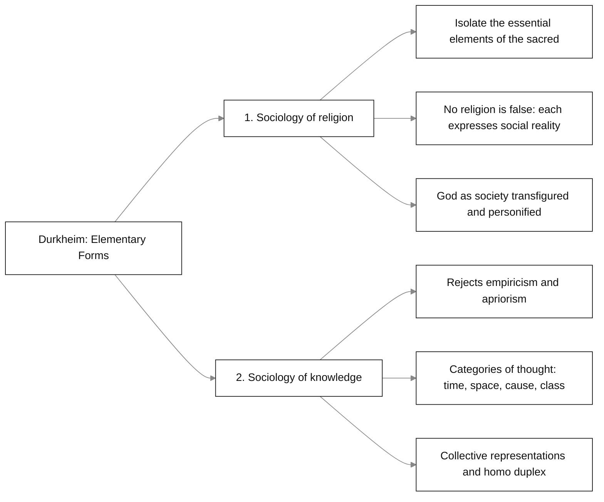
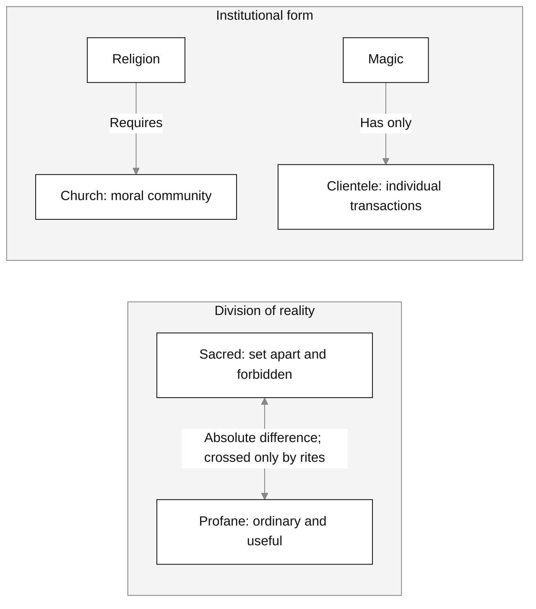
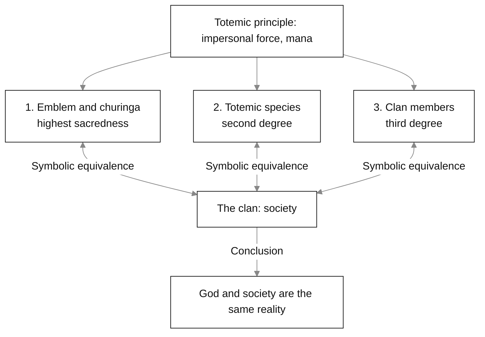
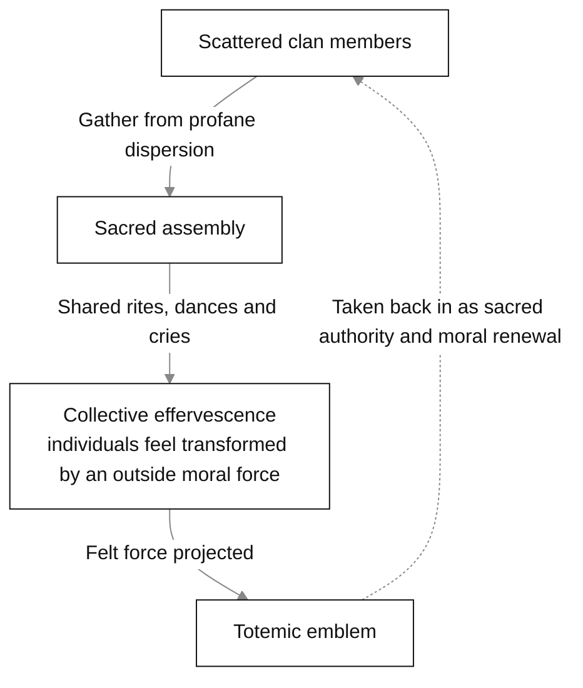
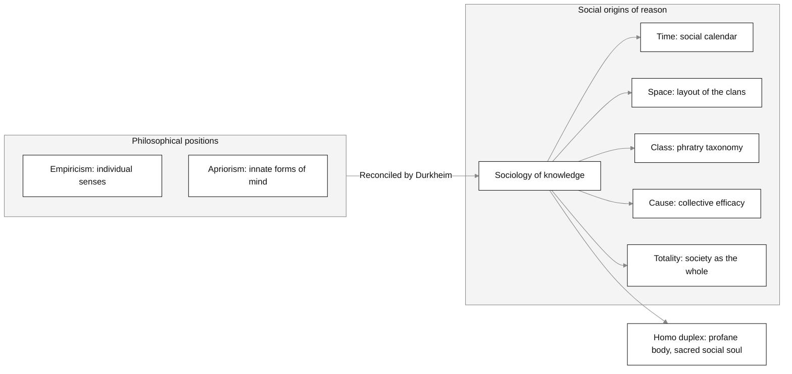
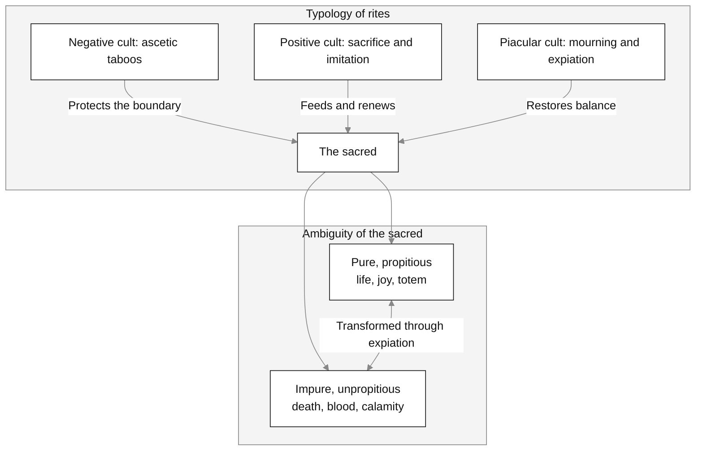
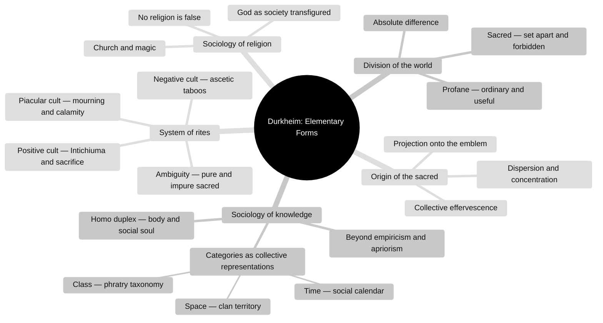

[[Ritual]] | [[Ritual vs Practice]] | [[marcel_mauss_techniques_of_the_body_comprehensive_notes|Mauss — Techniques of the Body]] | [[catherine_bell_ritual_theory_comprehensive_notes-v3|Bell — Ritual Theory, Ritual Practice]]

# Émile Durkheim: _The Elementary Forms of the Religious Life_

_A synthesis of Émile Durkheim's_ The Elementary Forms of the Religious Life,[^1] _compiled with Gemini Notebook._[^2]

---

## Contents

1. [[#1. Summary and Core Postulates|Summary and Core Postulates]]
2. [[#2. Defining Religion — Sacred, Profane and Church|Defining Religion — Sacred, Profane and Church]]
3. [[#3. Critique of Animism and Naturism|Critique of Animism and Naturism]]
4. [[#4. Totemism, Mana and the Totemic Principle|Totemism, Mana and the Totemic Principle]]
5. [[#5. Collective Effervescence and the Origin of the Sacred|Collective Effervescence and the Origin of the Sacred]]
6. [[#6. The Social Origin of the Categories and Homo Duplex|The Social Origin of the Categories and Homo Duplex]]
7. [[#7. The Typology of Rites and the Ambiguity of the Sacred|The Typology of Rites and the Ambiguity of the Sacred]]
8. [[#8. Integrated Diagrams|Integrated Diagrams]]
9. [[#Footnotes|Footnotes]] · [[#Bibliography|Bibliography]]

---

## 1. Summary and Core Postulates

In _The Elementary Forms of the Religious Life_ (1912), Émile Durkheim studies Australian totemism as "the most primitive and simple religion which is actually known."[^3] "Primitive" here means structurally elementary, not inferior: a society whose organization is unsurpassed in simplicity, and whose religion can be explained without borrowing elements from an earlier one.[^4]

Durkheim pursues two aims:

1. **A sociology of religion** — to isolate the permanent, essential elements of religious life in their simplest form, without later theological elaboration.[^5]
2. **A sociology of knowledge** — to show that the basic categories of thought (time, space, class, number, cause, substance, personality) are neither innate _a priori_ forms (Kant) nor abstractions from individual experience (Hume), but **social products**, formed in collective religious life.[^6]

### Core Postulates

- **"There are no religions which are false."** Every religion is true in its own fashion: it answers to real human conditions and expresses real forces, even under mythological forms.[^7]
- **God as society transfigured.** What religious symbols, gods and sacred forces ultimately represent is **society itself**. In worshipping the totem or the god, people worship, without knowing it, the moral and collective force of their own group.[^8]

---

## 2. Defining Religion — Sacred, Profane and Church

Durkheim rejects definitions of religion built on the "supernatural," the "mysterious" or "divinities."[^9]

### A. Two Preconceptions Rejected

- **Not the supernatural.** The idea of the supernatural presupposes a prior idea of natural law; for the peoples he studies, ritual acts are as natural and practical as farming techniques.[^10]
- **Not gods.** Buddhism and Jainism have no personal creator god; they consist of sacred truths and moral discipline.[^11]

### B. Sacred and Profane

The fundamental trait of all religious thought, Durkheim argues, is the **division of the world into two radically different domains**.[^12]

- **The sacred** (_le sacré_) — things set apart and protected by prohibitions: altars, totems, sacred stones, consecrated words, priests.[^13]
- **The profane** (_le profane_) — ordinary, useful activity tied to individual survival, daily routine and bodily appetite.[^14]

The difference between them is **absolute**: there is no logical or moral continuity from one to the other. Passing between them takes rites of initiation, purification or consecration.[^15]

### C. Religion and Magic: the Church

To separate religion from magic, Durkheim adds the criterion of the **church**, a single moral community of believers.[^16]

- **Religion** is collective: it unites believers into one moral community through shared collective representations.[^17]
- **Magic** is individual and utilitarian, even hostile to religion; the magician has a clientele, not a church.[^18]

**Durkheim's definition:** "A religion is a unified system of beliefs and practices relative to sacred things, that is to say, things set apart and forbidden — beliefs and practices which unite into one single moral community called a Church, all those who adhere to them."[^19]

---

## 3. Critique of Animism and Naturism

Before presenting totemism, Durkheim takes apart the two leading nineteenth-century theories of religion's origin.[^20]

### A. Animism (E. B. Tylor, Herbert Spencer)

- **The thesis** — religion began when early humans, reflecting on dreams, shadows and death, formed the idea of a double or soul, then projected it onto natural objects as spirits.[^21]
- **Durkheim's objections**
  1. Dreams are ordinary experiences; they cannot account for the **majesty and moral authority** of religious forces.[^22]
  2. Animism reduces religion to "a system of hallucinations." It is hard to see how an illusion could have shaped human society and law for millennia.[^23]

### B. Naturism (Max Müller)

- **The thesis** — religion arose from awe and fear before overwhelming natural forces: storms, stars, fire, the sea.[^24]
- **Durkheim's objections**
  1. Nature is marked by regularity, not sudden mystery.[^25]
  2. Admiration or surprise is not sacredness; naturism cannot explain why humble plants and animals — the totems — were made sacred before great cosmic phenomena.[^26]

---

## 4. Totemism, Mana and the Totemic Principle

Durkheim finds the elementary form of religion in **totemism**, tied to the simplest social unit known, the **clan**.[^27]

### A. The Structure of Totemic Belief

- **The totem as name and emblem** — the totem is the clan's collective name and emblem, carved or painted on sacred objects such as the _churinga_ and _nurtunja_.[^28]
- **Degrees of sacredness**
  1. _Highest:_ the totemic emblem and sacred instruments (_churinga_).[^29]
  2. _Second:_ the totemic species, animal or plant.[^30]
  3. _Third:_ the human members of the clan.[^31]

### B. The Totemic Principle (_Mana_)

Totemism, Durkheim argues, is not the worship of animals or plants. The cult is addressed to an anonymous, impersonal, diffuse force — **mana**, or the **totemic principle** — that runs through the members of the clan and the species alike.[^32]

- **Immanent and transcendent** — the totemic principle belongs to no individual; it precedes the generations and outlives them.[^33]
- **The sociological conclusion** — since the totem is at once the symbol of the sacred force and the symbol of the clan, **god and society are one and the same reality**.[^34]

---

## 5. Collective Effervescence and the Origin of the Sacred

To explain where the idea of the sacred comes from, Durkheim turns to the two alternating phases of Australian social life.[^35]

### A. Two Phases of Social Life

1. **Dispersion (profane)** — the population breaks into small, scattered family groups to hunt and gather. Life is dull, individual and monotonous.[^36]
2. **Concentration (sacred, the _corrobbori_)** — the whole clan assembles at set places to perform its rites. The gathering produces intense excitement and emotional contagion.[^37]

### B. How Effervescence Works

- **Emotional surge** — in the crowded assembly, gestures, cries and dances produce **collective effervescence**.[^38]
- **Transformed consciousness** — individuals feel carried outside themselves, possessed by an extraordinary force that raises their vitality.[^39]
- **Projection onto the emblem** — because the moral pressure of the group is abstract, people fix the force they feel on the nearest visible thing: the **totemic emblem**.[^40]

---

## 6. The Social Origin of the Categories and Homo Duplex

Durkheim's sociology of knowledge is offered as a way out of the dispute between **empiricism** and **apriorism**.[^41]

### A. The Epistemological Impasse

- **Empiricism** (Hume) reduces reason to individual sense impressions, and so strips knowledge of necessity and universality.[^42]
- **Apriorism** (Kant) rightly sees that the categories shape experience, but treats them as innate or given, and cannot explain how they change over time.[^43]
- **The sociological answer** — the categories are **collective representations**, made by society. They are necessary and universal because they express collective realities that stand above individual minds.[^44]

### B. The Social Origin of the Categories

- **Time** — from the recurring rhythm of feasts, assemblies and collective calendars.[^45]
- **Space** — modelled on the layout and territory of clans and phratries.[^46]
- **Class** — classification into genus and species began when people first sorted natural things into clans and phratries.[^47]
- **Cause** — from the moral efficacy and compulsion felt in collective action.[^48]
- **Totality** — the idea of "the whole" reflects society as the all-encompassing reality.[^49]

### C. _Homo Duplex_

Human beings, Durkheim holds, are divided between two irreducible sides:[^50]

1. **The individual body** — organic, sensory, self-interested, profane.
2. **The social soul** — moral, conceptual, altruistic, sacred; instilled by society through collective representations.

---

## 7. The Typology of Rites and the Ambiguity of the Sacred

"The rites are the rules of conduct which prescribe how a man should comport himself in the presence of these sacred objects."[^51] They are regulated ways of acting that maintain and renew the sacred order.[^52]

### A. Three Classes of Rites

1. **The negative cult (ascetic rites)** — prohibitions and taboos that keep the sacred apart from the profane. Ascetic practices — fasting, pain, isolation — prepare a person to enter the sacred.[^53]
2. **The positive cult**
   - _Sacrifice and communion_ — periodic offerings and shared eating (the _Intichiuma_) that renew the bond between the group and the totem.[^54]
   - _Imitative rites_ — based on "like produces like," such as imitating an animal's cries to promote its increase.[^55]
   - _Commemorative rites_ — dramatic performances of mythic history that reaffirm the group's identity.[^56]
3. **Piacular rites (mourning and expiation)** — performed in calamity, grief, drought or death. Sorrow is expressed together to restore the group's balance.[^57]

### B. The Ambiguity of the Sacred

Durkheim finds two opposite poles within the sacred:[^58]

- **The pure, or propitious, sacred** — sources of life, health, authority and shared joy.
- **The impure, or unpropitious, sacred** — sources of fear, death, blood, the pollution of corpses, evil powers.

The two are not separate kinds: through expiatory rites, an impure force can turn into a pure and protective one.[^59]

---

## 8. Integrated Diagrams

### Mindmap of the Book

---

## Footnotes

[^1]: Émile Durkheim, _[The Elementary Forms of the Religious Life](https://www.gutenberg.org/ebooks/41360)_, trans. Joseph Ward Swain (George Allen & Unwin, 1915); originally _Les formes élémentaires de la vie religieuse_ (Félix Alcan, 1912). The notebook gave the publisher as "New York: George Allen & Unwin Ltd. / The Free Press," which mixes in a different publisher; the Project Gutenberg front matter gives George Allen & Unwin, London. **French edition details are the notebook's, unchecked.**
[^2]: Gemini, Google, Gemini Notebook, synthesis of Durkheim, _Elementary Forms_, compiled for author from the Project Gutenberg edition, 25 September 2026. Page references were supplied by the notebook. Those on pages 1–36, and the "system of hallucinations" quotation on page 68, were checked against the Gutenberg page markers on 25 September 2026; one was corrected (2 to 3). **Other pages after 36 are unchecked.**
[^3]: Durkheim, _Elementary Forms_, 1.
[^4]: Ibid.
[^5]: Ibid., 415–416.
[^6]: Ibid., 9–11, 439–445.
[^7]: Ibid., 3, 417.
[^8]: Ibid., 206, 221, 347.
[^9]: Ibid., 24, 29.
[^10]: Ibid., 26–27.
[^11]: Ibid., 30–33.
[^12]: Ibid., 36–38.
[^13]: Ibid., 37, 300.
[^14]: Ibid., 38, 212.
[^15]: Ibid., 39, 311.
[^16]: Ibid., 42–47.
[^17]: Ibid., 47.
[^18]: Ibid., 44–45.
[^19]: Ibid., 47.
[^20]: Ibid., 48–87.
[^21]: Ibid., 49–54.
[^22]: Ibid., 55–60.
[^23]: Ibid., 68–70.
[^24]: Ibid., 71–75.
[^25]: Ibid., 78–80.
[^26]: Ibid., 84–86.
[^27]: Ibid., 88, 102.
[^28]: Ibid., 103, 113, 119.
[^29]: Ibid., 122, 133.
[^30]: Ibid., 128, 133.
[^31]: Ibid., 134–138.
[^32]: Ibid., 188–190.
[^33]: Ibid., 189.
[^34]: Ibid., 206.
[^35]: Ibid., 214–219.
[^36]: Ibid., 214–215.
[^37]: Ibid., 215–217.
[^38]: Ibid., 216.
[^39]: Ibid., 217.
[^40]: Ibid., 219–220.
[^41]: Ibid., 13–18, 431–445.
[^42]: Ibid., 13–14.
[^43]: Ibid., 14–15.
[^44]: Ibid., 15–18, 435–437.
[^45]: Ibid., 10–11, 440.
[^46]: Ibid., 11–12, 441.
[^47]: Ibid., 141–148, 442–443.
[^48]: Ibid., 362–368.
[^49]: Ibid., 441–442.
[^50]: Ibid., 262–264, 444–445.
[^51]: Ibid., bk. 1, chap. 1.
[^52]: Ibid., 36, 299.
[^53]: Ibid., 299–317.
[^54]: Ibid., 326–340.
[^55]: Ibid., 351–361.
[^56]: Ibid., 371–382.
[^57]: Ibid., 389–408.
[^58]: Ibid., 409–414.
[^59]: Ibid., 412–414.

## Bibliography

Durkheim, Émile. _The Elementary Forms of the Religious Life_. Translated by Joseph Ward Swain. George Allen & Unwin, 1915. https://www.gutenberg.org/ebooks/41360. Originally published as _Les formes élémentaires de la vie religieuse_ (Félix Alcan, 1912).

### Related Works

Listed by the notebook; **Durkheim and Mauss not checked.**

Durkheim, Émile, and Marcel Mauss. _Primitive Classification_. Translated by Rodney Needham. University of Chicago Press, 1963. Originally published in _L'Année sociologique_ 6 (1903): 1–72.

Mauss, Marcel. "Techniques of the Body." Translated by Ben Brewster. _Economy and Society_ 2, no. 1 (1973): 70–88. See [[marcel_mauss_techniques_of_the_body_comprehensive_notes|the Mauss note]].

Bell, Catherine. _Ritual Theory, Ritual Practice_. 1992. Reprint, Oxford University Press, 2009. See [[catherine_bell_ritual_theory_comprehensive_notes-v3|the Bell note]].

### AI Source

Gemini, Google, Gemini Notebook, synthesis of Durkheim, _Elementary Forms_, compiled for author, 25 September 2026.
