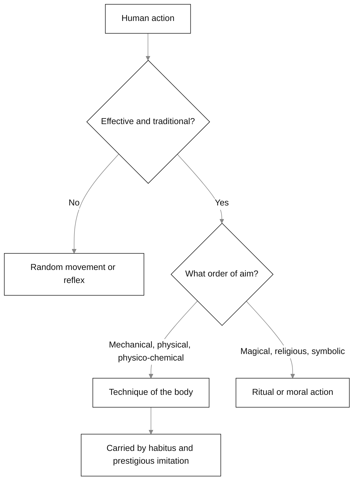
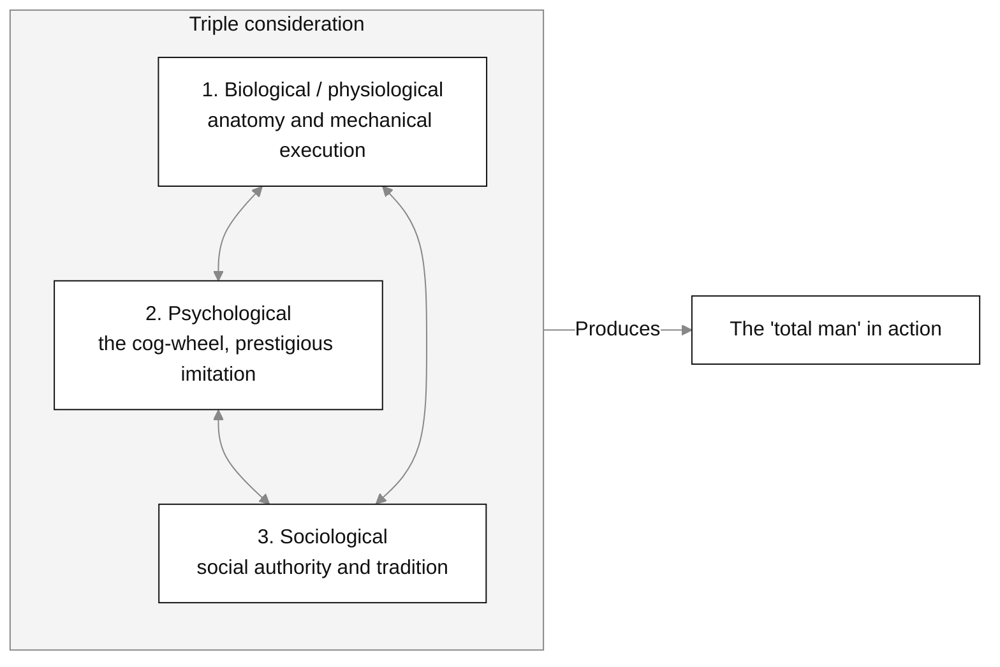
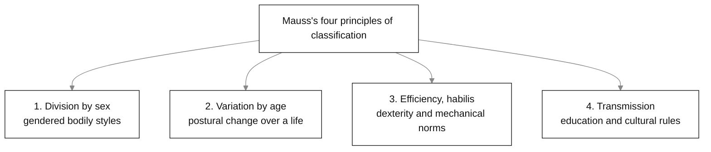
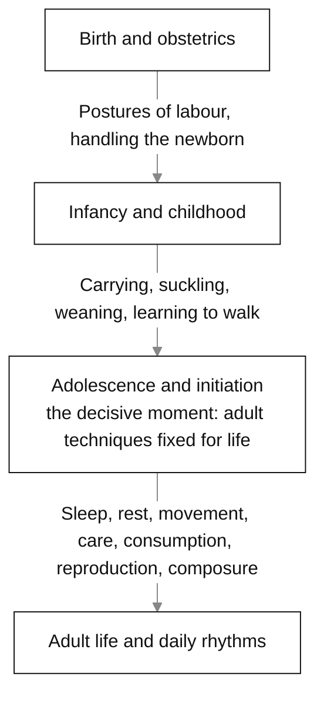
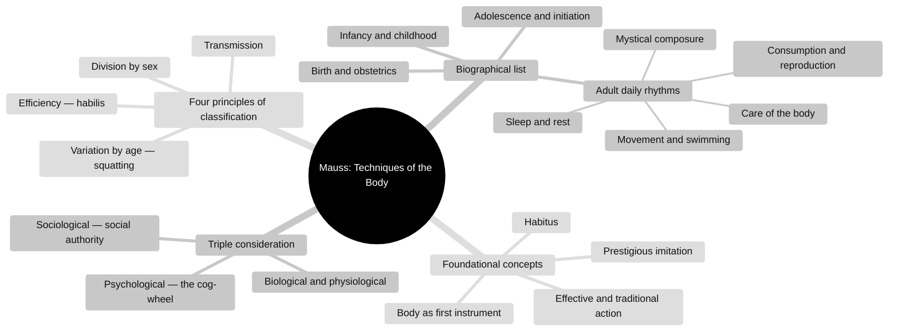
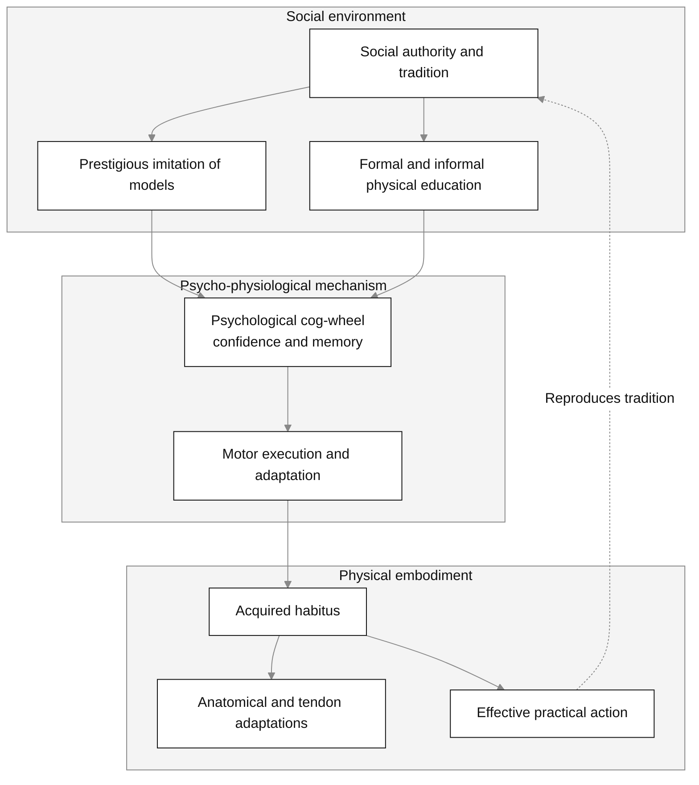

[[Ritual]] | [[Practice]] | [[Ritual vs Practice]] | [[catherine_bell_ritual_theory_comprehensive_notes-v3|Bell — Ritual Theory, Ritual Practice]]

# Marcel Mauss: "Techniques of the Body"

_A synthesis of Marcel Mauss's "Techniques of the Body,"[^1] compiled with Gemini Notebook._[^2]

---

## Contents

1. [[#1. Summary and Foundational Concepts|Summary and Foundational Concepts]]
2. [[#2. The Triple Consideration|The Triple Consideration]]
3. [[#3. Four Principles of Classification|Four Principles of Classification]]
4. [[#4. A Biographical List of Techniques|A Biographical List of Techniques]]
5. [[#5. General Considerations|General Considerations]]
6. [[#6. Integrated Diagrams|Integrated Diagrams]]
7. [[#Footnotes|Footnotes]] · [[#Bibliography|Bibliography]]

---

## 1. Summary and Foundational Concepts

In his 1934 lecture "Techniques of the Body" (_Les techniques du corps_), Marcel Mauss treats the body as **"man's first and most natural instrument"** — his first technical object.[^3] Rejecting the assumption that a technique needs a tool or weapon, Mauss argues that physical habits such as walking, running, swimming, sitting, sleeping and squatting are neither biological reflexes nor individual quirks. They are **effective and traditional actions**, acquired through social education and collective discipline.[^4]

### Key Terms

- **Techniques of the body** — "the ways in which from society to society men know how to use their bodies."[^5]
- **Effective and traditional action** — a technique differs from random movement by being _effective_ (aimed at a mechanical, physical or physico-chemical end) and _traditional_ (handed down through social authority and education).[^6]
- _**Habitus**_ — Mauss borrows the Latin _habitus_, which he glosses through Aristotle's _hexis_, for acquired abilities, faculties and bodily dispositions. These vary with society, education, fashion and prestige, rather than being a matter of memory or unlearned instinct.[^7]
- **Prestigious imitation** — the mechanism by which a person imitates actions that have succeeded when performed by people they trust and who hold authority or prestige.[^8]

---

## 2. The Triple Consideration

Mauss holds that no technique of the body can be understood through one discipline alone. Every physical habit is a **physio-psycho-sociological assemblage**:[^9]

1. **Biological and physiological** — the anatomical structure, skeletal frame, muscles and mechanical apparatus of the body.[^10]
2. **Psychological, "the cog-wheel"** — the link between social demand and physical execution, working through the confidence and momentum that social authority and **prestigious imitation** give.[^11]
3. **Sociological** — the social authority, tradition, education and propriety that decide which movements are encouraged, forbidden or refined.[^12]

---

## 3. Four Principles of Classification

In the second part of the lecture, Mauss sets out four principles for classifying techniques of the body.[^13]

| Principle | Description | Examples |
| :--- | :--- | :--- |
| **1. Division by sex** | Bodily habits differ between men and women, through gendered upbringing and separate "societies of men and women." | Closing the fist with the thumb outside (men) or inside (women); how a punch is delivered; throwing a stone horizontally or vertically.[^14] |
| **2. Variation by age** | Postures change across life stages and historical periods; Western upbringing unlearns some natural postures. | Squatting, kept by children and in many non-Western societies (Australian soldiers resting on their heels in mud) but unlearned with chairs; the bone and tendon curvature of Neanderthals from lifelong squatting.[^15] |
| **3. Efficiency (_habilis_)** | Techniques ranked by dexterity, competence and mechanical effectiveness gained through training.[^16] | _Habilis_, Latin for dexterous or clever: movements assembled deliberately, like a machine; human norms of physical training.[^17] |
| **4. Transmission** | Classified by the forms of training, social rules and cultural choices through which techniques are handed on. | Training for ambidexterity; Muslim practice reserving the right hand for eating and for touching the body.[^18] |

---

## 4. A Biographical List of Techniques

In the third part, Mauss lists techniques in the order of an ordinary life, showing how bodily discipline follows the life course.[^19]

### A. Birth and Obstetrics

- **Postures of labour** vary widely: the Buddha born to Māyā standing and holding the branch of a tree; Indian women giving birth standing or on all fours; Western women lying on their backs.[^20]
- **Care of mother and child** — how the infant is held, how the cord is cut.[^21]

### B. Infancy and Childhood

- **Carrying** — children carried against the mother's skin, astride her hip, acquire different physical and mental habits from infants kept in cradles.[^22]
- **Weaning and cradles** — suckling for two or three years; societies classed as with or without cradles, and the head deformations that go with some cradles.[^23]
- **Walking and movement** — children are trained in walking, gait, sight, hearing, rhythm and movement, as when Māori mothers drill their daughters in the swinging hip gait called _onioni_.[^24]

### C. Adolescence and Initiation

- **The decisive moment** — puberty and initiation are the most important moment in bodily education, when adult techniques are fixed for life.[^25]
- **Gendered education** — girls often receive continuous training from their mothers, while boys' education intensifies at puberty as they enter the society of men and learn its crafts and arts of war.[^26]

### D. Adult Life and Daily Rhythms

Mauss runs through adult techniques in the order of a day of movement and rest.[^27]

1. **Sleep** — a learned technique, with aids (mats, pillows, wooden neck-rests) or directly on the ground, including sleeping standing up (Maasai) or on horseback (Huns).[^28]
2. **Rest** — "squatting mankind" and "sitting mankind" (chairs versus floor mats), and the one-legged, stork-like resting stance of Nilotic Africa.[^29]
3. **Movement**
   - _Walking_ — posture, arm swing, foot position and military marches, such as the German goose-step against the French march.[^30]
   - _Running, jumping, climbing_ — running with fists at the chest versus the modern arm swing; the side jump versus the springboard; climbing trees with a belt versus crampons.[^31]
   - _Swimming_ — from breaststroke with the head above water to the crawl, and diving with eyes open.[^32]
   - _Dancing_ — dances at rest and dances in motion; gendered styles; the couple dance as a modern European invention.[^33]
4. **Care of the body** — soaping, including with barks; care of the mouth; learned ways of coughing and spitting.[^34]
5. **Consumption** — eating with the fingers or with cutlery (the Shah of Persia refusing a fork); drinking straight from a stream.[^35]
6. **Reproduction** — cultural variation in sexual positions, where mechanics meet sexual morals.[^36]
7. **Composure and mystical techniques** — cultivated composure and endurance, and the breathing techniques of yoga and Daoism.[^37]

---

## 5. General Considerations

In the last part, Mauss draws broader sociological conclusions.[^38]

- **Sociological causality** — social life requires order and education; bodily habits are assembled for the individual by society and its authorities.[^39]
- **No "natural" adult body** — there is no natural way for an adult to move, rest or act; all such behaviour is acquired _habitus_.[^40]
- **Biological effects** — techniques imposed by society shape the body itself: the curvature of bone, the form of tendons, physical endurance.[^41]

---

## 6. Integrated Diagrams

### Mindmap of the Lecture

### Flowchart of How Habitus Is Acquired

---

## Footnotes

[^1]: Marcel Mauss, "Techniques of the Body," trans. Ben Brewster, _Economy and Society_ 2, no. 1 (1973): 70–88, https://doi.org/10.1080/03085147300000003. First given as a lecture to the Société de Psychologie on 17 May 1934 and published as "Les techniques du corps," _Journal de psychologie normale et pathologique_ 32 (1935): 271–93. **Translator and French publication details confirmed only through a lead (Monoskop), which dates the French issue 1936.**
[^2]: Gemini, Google, Gemini Notebook, synthesis of Mauss, "Techniques of the Body," compiled for author, 25 September 2026. Page references were supplied by the notebook and have not yet been checked against the article.
[^3]: Mauss, "Techniques of the Body," 75.
[^4]: Ibid.
[^5]: Ibid., 70.
[^6]: Ibid., 75.
[^7]: Ibid., 73.
[^8]: Ibid., 73–74.
[^9]: Ibid., 74, 85.
[^10]: Ibid., 73–74.
[^11]: Ibid., 73, 85.
[^12]: Ibid., 73–74.
[^13]: Ibid., 76–78.
[^14]: Ibid., 76–77.
[^15]: Ibid., 77.
[^16]: Ibid., 77–78.
[^17]: Ibid., 78.
[^18]: Ibid.
[^19]: Ibid., 78–85.
[^20]: Ibid., 79.
[^21]: Ibid.
[^22]: Ibid., 79–80.
[^23]: Ibid.
[^24]: Ibid., 74, 80.
[^25]: Ibid., 80.
[^26]: Ibid.
[^27]: Ibid., 80–85.
[^28]: Ibid., 80–81.
[^29]: Ibid., 81–82.
[^30]: Ibid., 82.
[^31]: Ibid., 82–83.
[^32]: Ibid., 71, 83.
[^33]: Ibid., 82.
[^34]: Ibid., 84.
[^35]: Ibid.
[^36]: Ibid., 84–85.
[^37]: Ibid., 80, 85.
[^38]: Ibid., 85–86.
[^39]: Ibid., 85.
[^40]: Ibid., 74.
[^41]: Ibid., 77, 81.

## Bibliography

### Primary Source

Mauss, Marcel. "Techniques of the Body." Translated by Ben Brewster. _Economy and Society_ 2, no. 1 (1973): 70–88. https://doi.org/10.1080/03085147300000003. Originally "Les techniques du corps," _Journal de psychologie normale et pathologique_ 32 (1935): 271–93.

### Works Mauss Draws On

Listed by the notebook; **not checked against Mauss's own references.** The Hertz and Sachs editions given are English translations published after the lecture.

Best, Elsdon. _The Maori_. 2 vols. Memoirs of the Polynesian Society 5. Board of Maori Ethnological Research, 1924.

Hertz, Robert. "The Pre-eminence of the Right Hand: A Study in Religious Polarity." Translated by Rodney Needham. In _Right and Left: Essays on Dual Symbolic Classification_, edited by Rodney Needham, 3–31. University of Chicago Press, 1973.

Sachs, Curt. _World History of the Dance_. Translated by Bessie Schönberg. George Allen and Unwin, 1938.

### Later Works Drawing on Mauss

Bell, Catherine. _Ritual Theory, Ritual Practice_. 1992. Reprint, Oxford University Press, 2009.

Bourdieu, Pierre. _Outline of a Theory of Practice_. Translated by Richard Nice. Cambridge University Press, 1977.

### AI Source

Gemini, Google, Gemini Notebook, synthesis of Mauss, "Techniques of the Body," compiled for author, 25 September 2026.
