[[_Kokoro]] | [[Kokoro Index]]

# Kokoro — Vault Map

Where the _kokoro_ (心, heart-mind) material currently sits. Solid boxes are inside `_ Dojo/Persoral Practice/Kokoro/`; dashed boxes are elsewhere in the vault and are candidates for linking or moving.

```mermaid
flowchart TD
    HUB["_Kokoro<br/>(folder hub)"]
    IDX["Kokoro Index"]

    HUB --- IDX

    subgraph HOME["Kokoro folder"]
        direction TB
        RAW["Sources / 01 Raw"]
        CLEAN["Sources / 00 Cleaned<br/>(empty)"]
        RMK["files / remarkable"]

        CORE["Kokoro/<br/>Soseki · Spirit · Liquid Reality ·<br/>Body-Heart-Mind · Daily Life ·<br/>Buddhism · Relevant Concept? ·<br/>Unite Essay · Unite personal ·<br/>Bibliography · Imagining Union"]
        BUD["Kokoro — Japanese Buddhism<br/>Heart-Mind in Doctrine and Practice"]
        UNITE["Unite in Kokoro — 心<br/>+ Flowchart / Mindmap / Concept Graph"]
        SIDE["Gassho · Intention ·<br/>Consciousness · Drop · artwork ·<br/>Gratitude · Presence · Honour Each Cell"]

        RAW --> CORE
        RAW --> BUD
        RAW --> UNITE
        RAW --> SIDE
    end

    HUB --> HOME

    subgraph OUT["Elsewhere in the vault"]
        direction TB
        NODES["Nodes/<br/>Kokoro Bibliography ·<br/>Kokoro and Shraddha ·<br/>Unite in Kokoro Draft Before review ·<br/>99 Files / kokoro in daily life"]
        LIQ["Nodes / Liquid Reality / Kokoro / Concepts/<br/>kokoro in gratitude ·<br/>Kokoro in Japanese Thought"]
        PROJ["Projects / The Dojo of Enlightenment/<br/>07 — Kokoro"]
        AI["AI/<br/>Unite in Kokoro Glitch"]
        DN["Daily Notes / Unique Notes/<br/>2026-09-02-1111 kokoro-shinsei-dojo-challenge"]
        DASH["_ Dashboard/<br/>Kokoro — Navigation Research<br/>and Mapping Canvas"]
        ADJ["Adjacent threads<br/>Buddhism / Heart Sutra ·<br/>Nodes / 00 Union · Mind · Spirit ·<br/>Heart to Heart · Original mind ai ·<br/>Practice / Gassho 合掌"]
    end

    HUB -.-> NODES
    HUB -.-> LIQ
    HUB -.-> PROJ
    HUB -.-> AI
    HUB -.-> DN
    HUB -.-> DASH
    HUB -.-> ADJ

    classDef home fill:#1f2a24,stroke:#4c7a5d,color:#e8f0ea;
    classDef away fill:#2a241f,stroke:#8a6a3d,color:#f0ead8,stroke-dasharray:4 3;
    class RAW,CLEAN,RMK,CORE,BUD,UNITE,SIDE home;
    class NODES,LIQ,PROJ,AI,DN,DASH,ADJ away;
```

---

## Outside the Kokoro folder

Named for _kokoro_:

- [[Kokoro Bibliography]] — `Nodes/` (a second copy also sits in the Kokoro folder)
- [[Kokoro and Shraddha claude|Kokoro and Shraddha]] — `Nodes/`
- [[Unite in Kokoro Draft Before review]] — `Nodes/`
- [[kokoro in daily life]] — `Nodes/99 Files/` (duplicate of the Kokoro folder copy)
- [[kokoro in gratitude]] — `Nodes/Liquid Reality/Kokoro/Concepts/`
- [[Kokoro in Japanese Thought, The Unifying Field of Reality and Experience]] — `Nodes/Liquid Reality/Kokoro/Concepts/`
- [[07 - Kokoro]] — `Projects/The Dojo of Enlightenment/Chapters/`
- [[Unite in Kokoro Glitch]] — `AI/`
- [[2026-09-02-1111-kokoro-shinsei-dojo-challenge]] — `Daily Notes/Unique Notes/`
- [[Kokoro - Navigation Research and Mapping Canvas.canvas|Kokoro — Navigation Research and Mapping Canvas]] — `_ Dashboard/`

Adjacent threads worth linking rather than moving:

- [[The Heart Sutra, Also known as the PrajnaParamita]], [[Demon's Hands, Buddha's Heart]] — `Buddhism/`
- [[00 Union]], [[Mind]], [[Spirit, Soul, Consciousness]], [[Heart to Heart]], [[Original mind ai]], [[Japanese Spirituality]] — `Nodes/`
- [[Gassho 合掌]], [[Spiritual Art]] — `Nodes/Practice/`
- [[Original mind]], [[_Shinsei]] — `_ Dojo/Persoral Practice/Shinsei/`
- [[A Buddhist Theory of Unconscious Mind]], [[Understanding Our Mind - 51 Verses on Buddhist Psychology]] — `Sources/Books/`

---

## Notes

- Three notes exist in two places at once — _Kokoro Bibliography_, _kokoro in daily life_, and the _Unite in Kokoro_ drafts. Worth resolving before the folder is cleaned.
- `Sources/00 Cleaned` is empty; `01 Raw` holds everything.
- This map was built from filenames across the vault, not a full-text search, so notes that discuss _kokoro_ without naming it are not listed. Four deep subfolders were not walked (`AI/_ AI/Spectrum/Stories/_Now/Sensei`, two `Nodes/Online Files/Log/2025/03/` day folders, and `Seasonal/01 Spring/Sakura/.../Haikus & Koans`).
