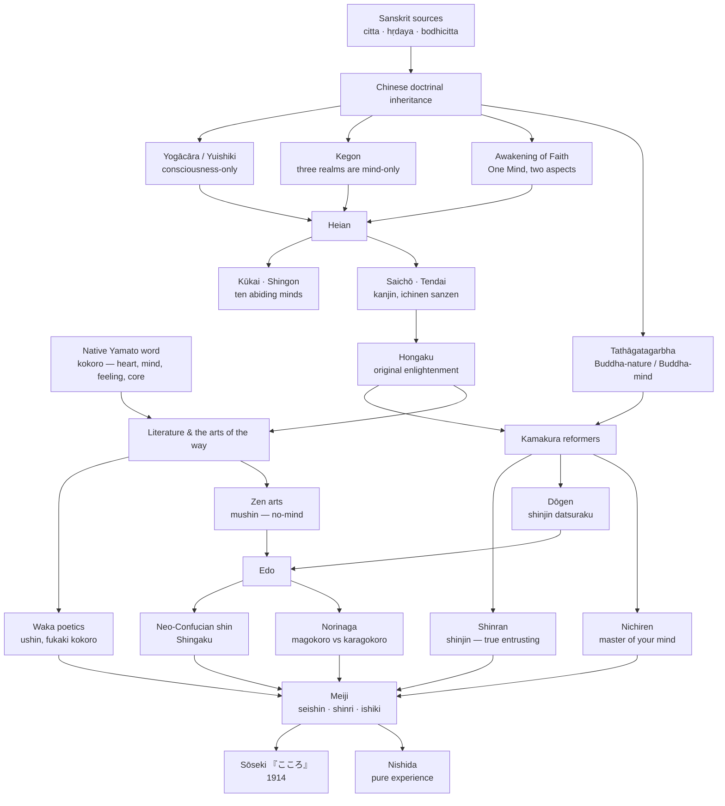

[[_Kokoro]] | [[_Kokoro Index]] | [[Kokoro - The Word and Its Range]] | [[Kokoro in Practice]]

# Kokoro in Japanese Buddhism

> **Scope.** A working overview of how the word _kokoro_ (心, heart-mind) functions in Japanese Buddhist thought, from the Nara and Heian schools through the Kamakura reformers to Edo and Meiji reworkings, with the literary and aesthetic uses that sit alongside the doctrinal ones. Written as background for the Sōseki 『こころ』(_Kokoro_, Heart) project; the closing section sketches the bridge. Sections 1–7 rest on the cited scholarship; section 8 is working hypothesis.

> **Revision note (13 September 2026).** Checked against the sources. Dates and attributions held throughout. Three changes: a paragraph on Zeami and Noh was added to §5, where it had been missing from an account of "the arts of the way"; the Wikipedia citations paired with Tanahashi's Dōgen translations were dropped as redundant; and §1 now points to [[Kokoro - The Word and Its Range]] for the philology of the native word, which that note has since corrected.

---

## Overview: the lineage of _kokoro_

---

## 1. The word: one graph, two readings, several Sanskrit sources

The character 心 carries two readings in Japanese, and the split matters. The Sino-Japanese _shin_ is the reading used in technical Buddhist compounds — _shinjin_ (信心, entrusting heart), _isshin_ (一心, One Mind), _busshin_ (仏心, Buddha-mind), _bodaishin_ (菩提心, mind of awakening), _mushin_ (無心, no-mind) — while the native _kokoro_ is the everyday Yamato word, older than the writing system, meaning at once heart, mind, feeling, intention, core, and disposition. Buddhist translators used the single graph to render several distinct Sanskrit terms, and Japanese inherited that compression from Chinese.[^1]

The most important underlying terms are:

- **citta** — "mind" as the stream of cognitive-affective events; in Abhidharma and Yogācāra the term for consciousness as such, contrasted with _manas_ (意, the sense of "I") and _vijñāna_ (識, discriminating awareness). This is the _shin_ of "the three realms are mind-only" and of Dōgen's essays.
- **hṛdaya** — "heart" as the physical organ and, by extension, the essential core of something. This is the _shin_ of the 『般若心経』(_Hannya shingyō_, Heart Sutra), whose title means "the heart (essence) of the Prajñāpāramitā," not "the mind sutra."[^2]
- **bodhicitta** (_bodaishin_) — the "mind of awakening," the aspiration for enlightenment for the sake of all beings; _hosshin_ (発心, arousing the mind) is the standard Japanese term for the moment of religious conversion.

==Because \*kokoro\* already meant "heart-mind" before Buddhism arrived==, the Yamato word could absorb all three senses without strain. Ki no Tsurayuki's kana preface to the 『古今和歌集』(_Kokin wakashū_, Collection of Poems Ancient and Modern, 905) opens by declaring that ==Japanese poetry "takes the human heart as its seed and grows into myriad leaves of words"== — an entirely non-Buddhist use, but one that shows the word already ==functioning as the seat of feeling, thought, and expression== together.[^3] Thomas Kasulis's shorthand is useful here: _kokoro_ names an "intimacy" between affect and cognition that Western vocabularies tend to split into "heart" and "mind," and the ==Japanese Buddhist tradition builds on that non-split rather than fighting it==.[^4]

---

## 2. Doctrinal inheritance from China: mind-only, One Mind, Buddha-mind

Japanese Buddhism did not have to invent a philosophy of mind; it received three fully developed ones in the seventh and eighth centuries, and later Japanese thinkers work largely by recombining them.

**Yogācāra (Hossō, 法相).** The Nara school of Hossō, transmitted through Xuanzang's line and centred at Kōfukuji and Yakushiji, taught the eight-consciousness model culminating in the _araya-shiki_ (阿頼耶識, storehouse consciousness) — mind as a karmic seed-bed from which the apparent world is projected. The slogan _yuishiki_ (唯識, consciousness-only) made _shin_ the whole field of reality.[^5]

**Huayan (Kegon, 華厳) and "the three realms are mind-only."** The _Avataṃsaka_ line _sangai yuishin_ (三界唯心) — that ==the three realms of desire, form, and formlessness are nothing but mind== — became a stock phrase across all schools. Kegon at Tōdaiji, the state temple of the Nara period, gave it institutional weight.[^6]

**The _Awakening of Faith_ and the One Mind.** The 『大乗起信論』(_Daijō kishinron_, Awakening of Faith in the Mahāyāna), attributed to Aśvaghoṣa but almost certainly Chinese, proposed the One Mind with two aspects: mind as suchness (_shinnyo_, 真如) and mind as arising-and-ceasing (_shōmetsu_, 生滅). ==Ordinary deluded mind and enlightened mind are one mind seen two ways==. This text, more than any sutra, underwrites the later Japanese conviction that ==the enlightened \*kokoro\* is not somewhere else but is the ordinary \*kokoro\* rightly seen==.[^7]

**Tathāgatagarbha and Buddha-nature.** Alongside the One Mind runs the _tathāgatagarbha_ ("womb of the Tathāgata") doctrine, in Japan usually discussed as _busshō_ (仏性, Buddha-nature) and its Zen variant _busshin_, Buddha-mind. The Chan/Zen school in China styled itself the "Buddha-mind school" (_busshin-shū_) as against the "teaching schools," and the slogan _ishin denshin_ (以心伝心, transmission from mind to mind) outside the scriptures encodes the claim that what is transmitted is _shin_ itself.[^8]

These three positions — mind-only, One Mind, Buddha-mind — are the background against which every Japanese treatment of _kokoro_ below should be read.

---

## 3. Heian: Kūkai's ten minds and Tendai's contemplation of mind

**Kūkai (774–835).** The founder of Shingon organised the whole of religious life as a hierarchy of _minds_. His 『十住心論』(_Jūjūshinron_, Treatise on the Ten Stages of Mind, c. 830) and its abridgment 『秘蔵宝鑰』(_Hizō hōyaku_, Precious Key to the Secret Treasury) rank ten _jūshin_ (住心, abiding minds, or mindsets) from the "goatish mind" of pure appetite, through Confucian ethics and Daoist longevity, up through the Hīnayāna and Mahāyāna positions, to the tenth, the "glorious mind, most secret and sacred," which is Shingon.[^9] The scheme is an early and explicit statement that spiritual progress is a transformation of _kokoro_, and that the schools of Buddhism can be sorted by the kind of mind they produce.

It is worth noticing, though, that Kūkai's most famous doctrine is not about mind but body: _sokushin jōbutsu_ (即身成仏, becoming Buddha in this very body). The _shin_ here is 身 (body), not 心 (mind) — a homophone that Japanese writers have played on ever since. Kūkai's point is that awakening is enacted through the "three mysteries" (_sanmitsu_, 三密) of body, speech, and mind together, in mudra, mantra, and visualisation. Mind is one third of the practice, not its whole.[^10]

**Saichō and Tendai.** Tendai (Chinese Tiantai), established by Saichō (767–822) on Mt Hiei, brought the meditative system of Zhiyi's 『摩訶止観』(_Makashikan_, Great Calming and Contemplation), which Japanese writers cited constantly for centuries. Its core is _kanjin_ (観心, contemplating the mind) and the doctrine of _ichinen sanzen_ (一念三千, three thousand realms in a single thought-moment). Every _kokoro_ in every instant is the whole cosmos.[^11]

**Original enlightenment (_hongaku_, 本覚).** Out of Tendai's _Awakening of Faith_ inheritance grew the medieval doctrine of _hongaku_: that beings are enlightened _originally_, prior to any practice, and that delusion and awakening are two modes of one mind. Jacqueline Stone's study shows how thoroughly this idea saturated medieval Japanese religion — including, in her argument, the Kamakura reformers who are often presented as reacting against it.[^12] For the concept of _kokoro_, _hongaku_ thought is decisive: it makes the ordinary heart-mind itself the site of Buddhahood, and thereby licenses the poetic, aesthetic, and even secular uses of _kokoro_ that follow.

---

## 4. Kamakura: three reformers, three theories of mind

### 4.1 Shinran and _shinjin_

In Hōnen's Pure Land movement and above all in Shinran (1173–1263), the key term becomes _shinjin_ — literally "believing mind" or "faithful heart." The English "faith" is now generally avoided by Shin scholars because Shinran's _shinjin_ is not a mental act the practitioner performs. It is, in Shinran's own reading, the mind of Amida Buddha (the "true and real mind," _shinjitsu shin_, 真実心) given to and realised in the practitioner; the standard translation in _The Collected Works of Shinran_ is therefore "true entrusting," or _shinjin_ left untranslated.[^13] The practitioner's own _kokoro_ is described by Shinran without illusion: it is the mind of the _bonbu_ (凡夫, foolish ordinary being), "full of blind passions." The whole drama of Shin Buddhism is the meeting of these two minds — the given, diamond-like _shinjin_ and the deluded _kokoro_ that receives it — within one person.[^14]

Shinran also inherits and radicalises the Pure Land reading of _hosshin_: in the Primal Vow the aspiring mind is itself Amida's, directed toward beings (_ekō_, 回向, merit-transference), rather than generated from the self.[^15]

### 4.2 Dōgen and the mind that is walls, tiles, and pebbles

Dōgen (1200–1253) wrote more about _shin_ than any other Japanese Buddhist, and his 『正法眼蔵』(_Shōbōgenzō_, Treasury of the True Dharma Eye) contains a cluster of fascicles whose titles contain the graph:

- **"Sokushin zebutsu"** (即心是仏, Mind itself is Buddha, 1239), on Mazu's famous phrase. Dōgen's move is to deny that the phrase endorses the ordinary consciousness of sentient beings as Buddha (he explicitly attacks the "Senika heresy" of an eternal spiritual self inhabiting a perishable body), and to reread _shin_ as "aspiration, practice, awakening, and nirvana" enacted together.[^16]
- **"Shin fukatoku"** (心不可得, The mind cannot be grasped, 1241), on the _Diamond Sutra_'s "past mind, present mind, future mind cannot be grasped" and the story of the scholar Deshan and the rice-cake seller.[^17]
- **"Kobusshin"** (古仏心, The old Buddha-mind), where Dōgen quotes the Chan master Huizhong: "What is the old Buddha-mind? — Fences, walls, tiles, and pebbles" (_shōheki garyaku_, 牆壁瓦礫). Mind is not an inner substance; it is the world's concrete particulars.[^18]
- **"Shinjin gakudō"** (身心学道, Body-and-mind studying the Way), which insists that the Way is studied with the body as fully as with the mind — and, in a famous passage, that "mind is mountains, rivers, and the great earth; it is the sun, moon, and stars."[^19]

Behind all of these stands Dōgen's phrase for his own awakening under Rujing: _shinjin datsuraku_ (身心脱落, body and mind cast off). Hee-Jin Kim's reading is still standard: Dōgen's _shin_ is neither a mentalism nor a materialism but the "mystical realism" of a practice in which subject and world are not two.[^20] Yuasa Yasuo used Dōgen (with Kūkai) as the centrepiece of his argument that the Japanese tradition treats the mind–body relation as something _achieved_ through cultivation rather than given by metaphysics — _shinjin ichinyo_ (身心一如, body-mind as one suchness).[^21]

### 4.3 Nichiren: be the master of your mind

Nichiren (1222–1282) works from the Tendai apparatus — his 『観心本尊抄』(_Kanjin honzon shō_, On ==the Object of Devotion for Observing the Mind==, 1273) takes _kanjin_ as its first term, and reinterprets _ichinen sanzen_ so that the whole is contained in the _daimoku_ rather than in silent contemplation.[^22] The sentence of Nichiren's about _kokoro_ that has entered ordinary Japanese speech comes from the 『兄弟抄』(_Kyōdai shō_, Letter to the Brothers, 1275): "==Become the master of your mind; do not let your mind be your master==" (心の師とはなるとも心を師とせざれ). Nichiren himself attributes the line to the 『六波羅蜜経』(\*==Rokuharamitsu-kyō\*, Sutra of the Six Perfections==), and it circulated widely in medieval didactic literature as a compact ethics of _kokoro_.[^23]

---

## 5. Kokoro in literature, poetics, and the arts of the way

Because _hongaku_ thought had already sacralised the ordinary heart, medieval writers could treat literary and artistic activity as Buddhist practice, and _kokoro_ is the hinge term.

**Waka and Tendai meditation.** Fujiwara no Shunzei (1114–1204), in the 『古来風体抄』(_Korai fūteishō_, Notes on Poetic Style through the Ages, 1197), explicitly compares the composition and reception of waka to Tendai _shikan_ (止観, calming and contemplation): the "deep heart" (_fukaki kokoro_) of a poem is reached by the same stilling of the heart as meditation. William LaFleur made this the centre of his account of medieval Japanese literature, and Esperanza Ramirez-Christensen reads Shunzei's and Teika's poetics of _ushin_ (有心, having heart — the mode of deep feeling) as a poetic process modelled on meditation.[^24] The famous verse of Saigyō (1118–1190) in the 『新古今和歌集』(_Shinkokinshū_, New Collection of Poems Ancient and Modern) — _kokoro naki mi ni mo aware wa shirarekeri_, "even to a body without heart, _aware_ is known" — plays on _kokoro_ as the affective capacity the monk has supposedly renounced and yet still finds in himself.[^25]

**Tales of awakening.** Kamo no Chōmei's 『発心集』(_Hosshinshū_, Collection of Tales of the Arousing of the Mind, c. 1215) takes _hosshin_ as its organising principle: each anecdote turns on the moment an ordinary _kokoro_ turns toward the Way. Mujū Ichien's 『沙石集』(_Shasekishū_, Sand and Pebbles, 1279–83) and Yoshida Kenkō's 『徒然草』(_Tsurezuregusa_, Essays in Idleness, c. 1330) belong to the same lineage, in which _kokoro_ is both the problem (attachment, delusion) and the instrument (resolution, insight).[^26]

**Noh and Zeami.** Zeami Motokiyo (c. 1363–c. 1443) made _kokoro_ the foundation of Noh, and his treatises — the 『風姿花伝』(_Fūshikaden_, Transmission of the Flower of Style) and 『花鏡』(_Kakyō_, Mirror of the Flower) above all — are the most sustained pre-modern analysis of the term in an art. Richard Pilgrim's study distinguishes several senses at work: the performer's mind in training, the mind that must be forgotten in performance, the mind of the audience, and the _kokoro_ that is the source of the play's deepest effect — the ground of _yūgen_ and of the charged stillness Zeami called the interval of no-action (_senu hima_). Zeami's slogan _kabu-isshin_ (歌舞一心, song-dance-one-heart) and his image of the flower (_hana_, 花) that opens between actor and audience carry the medieval doctrine of the unified heart-mind onto the stage; and the Buddhist roots are explicit, since Zeami himself was a Sōtō Zen practitioner and the treatises borrow freely from Zen vocabulary.[^26a] The practical side of this material is developed in [[Kokoro in Practice]] §3.

**Zen and the arts: _mushin_.** In Muromachi and early Edo Zen the term shifts to _mushin_, "no-mind," as the description of the freely responsive heart. Takuan Sōhō's 『不動智神妙録』(_Fudōchi shinmyōroku_, The Mysterious Record of Immovable Wisdom), written for the swordsman Yagyū Munenori, is the classic statement: the mind that "stops" (_tomaru_) on anything is bound; the unfettered mind rests nowhere and is therefore everywhere.[^27] Hakuin Ekaku (1686–1769) put the same _hongaku_ conviction into vernacular verse in his 『坐禅和讃』(_Zazen wasan_, Song of Zazen): "All sentient beings are from the very beginning Buddhas."[^28] Through _chadō_, _shodō_, _budō_, and Noh, _mushin_ and _kokoro_ became the vocabulary of every "way" (_dō_, 道), and it is in this diffused form that most modern Japanese people encounter the Buddhist theory of mind.

---

## 6. Edo: Confucian _shin_, Shingaku, and the nativist heart

**Neo-Confucian _xin_.** Tokugawa orthodoxy brought the Neo-Confucian discourse of _xin_ (心, heart-mind), and with it the Wang Yangming "learning of the mind" (_xinxue_, Japanese _shingaku_, 心学) taken up by Nakae Tōju and Kumazawa Banzan. Confucian _shin_ is ethical rather than soteriological — the seat of the innate moral knowing (_ryōchi_, 良知) — but Japanese readers found it easy to fuse with Buddhist _hongaku_.[^29]

**Sekimon Shingaku.** Ishida Baigan (1685–1744) founded a popular movement literally called _Shingaku_, "heart-learning," blending Zen-style practice of "knowing the _kokoro_" (_kokoro o shiru_) with Confucian ethics and Shinto, aimed at merchants and townspeople. Robert Bellah famously read it as a Japanese analogue to the Protestant ethic; Janine Sawada's study gives the fuller picture of its Zen debts.[^30]

**Nativism and _magokoro_.** Against both Buddhist and Confucian theories, Motoori Norinaga (1730–1801) set the native _magokoro_ (真心, true heart), which he located in the spontaneous responsiveness to _mono no aware_, and which he opposed to _karagokoro_ (漢意, the Chinese mind) of imported rationalism and moralism. The point for the present project is that by the late Edo period _kokoro_ had become a contested word — Buddhist, Confucian, and nativist thinkers each claiming to say what the true _kokoro_ was.[^31]

---

## 7. Meiji and the modern _kokoro_: Sōseki's inheritance

The Meiji period added a new set of terms — _seishin_ (精神, translating _Geist_/spirit), _shinri_ (心理, psychology), _ishiki_ (意識, consciousness) — that pulled the technical vocabulary of mind away from _kokoro_ and toward Western categories. _Kokoro_ remained the vernacular word for the inner life, now carrying a residue of the whole history above.[^32]

Natsume Sōseki (1867–1916) stands exactly at that junction. He sat a Zen retreat at Engakuji in Kamakura in the winter of 1894–95 under the abbot Shaku Sōen, an experience he later fictionalised in 『門』(_Mon_, The Gate, 1910), and his personal library, his _kanshi_, and his late slogan _sokuten kyoshi_ (則天去私, follow heaven, depart from the self) all show a continued engagement with Zen and Confucian vocabularies of mind.[^33] The title of 『こころ』(_Kokoro_, 1914) — written in hiragana with the repetition mark on the original edition — is untranslatable for precisely the reasons set out in section 1: it names heart, mind, feeling, and inner core at once. Edwin McClellan left it as _Kokoro_; Meredith McKinney's introduction glosses it as "the thinking and feeling heart."[^34]

Nishida Kitarō's 『善の研究』(_Zen no kenkyū_, An Inquiry into the Good, 1911) is the philosophical counterpart: ==an attempt to ground all knowledge in "pure experience" prior to the subject–object split==, drawing openly on Zen. Nishida and Sōseki were contemporaries who never wrote about each other, but they are two answers to the same Meiji question — what becomes of the Buddhist _kokoro_ once it has to coexist with modern individuality.[^35]

---

## 8. Bridge to the novel (tentative)

Three threads from the above bear on the project's "union" theme.

1. **The impossibility of _ishin denshin_.** Zen's claim that mind can be transmitted directly to mind is the exact inverse of the novel's structure, in which Sensei's _kokoro_ can only reach the narrator as a written testament, after death, and Shizu is left outside the transmission altogether. Sōseki's title may name the very thing the book shows cannot be shared.
2. **K as a failed _hosshin_.** K's vocabulary — his self-discipline, his "the Way," his refusal of the ordinary — is the medieval vocabulary of _hosshin_ and _shugyō_ (修行, practice). His catastrophe reads as a collapse of the aspiring mind under the weight of the ordinary _kokoro_ that Shinran describes so unsparingly: this supports the reading of K's death as spiritual rather than romantic.
3. **The mind that cannot be grasped.** Dōgen's "Shin fukatoku" and Sensei's repeated confession that he does not understand his own heart are structurally similar. Whether Sōseki knew the fascicle is beside the point; the Zen problem of an interior that cannot be located is the soil in which Karatani's "discovered interiority" grows.

> **Note.** These are working hypotheses for the vault, not claims from the literature.

---

## Suggested reading order

Kasulis (2018) for the map; Stone (1999) for _hongaku_; Kim (2004) and Tanahashi (2010) for Dōgen; Ueda and Hirota (1989) for Shinran; LaFleur (1983) and Ramirez-Christensen (2008) for the literary side; Yuasa (1987) for the mind–body question.

---

## Footnotes

[^1]: A. Charles Muller, ed., "[心](http://www.buddhism-dict.net/ddb/)," _Digital Dictionary of Buddhism_, accessed 10 September 2026. For the philology of the native word — its undetermined etymology, its Old Japanese sense as the physical heart, and the Heian narrowing to the mental sense — see [[Kokoro - The Word and Its Range]] §1.
[^2]: Kazuaki Tanahashi, _The Heart Sutra: A Comprehensive Guide to the Classic of Mahayana Buddhism_ (Boulder: Shambhala, 2014); Jan Nattier, "The Heart Sūtra: A Chinese Apocryphal Text?" _Journal of the International Association of Buddhist Studies_ 15, no. 2 (1992): 153–223.
[^3]: Ki no Tsurayuki, Kana Preface, in _Kokin Wakashū: The First Imperial Anthology of Japanese Poetry_, trans. Helen Craig McCullough (Stanford: Stanford University Press, 1985), 3.
[^4]: Thomas P. Kasulis, _Intimacy or Integrity: Philosophy and Cultural Difference_ (Honolulu: University of Hawaiʻi Press, 2002); Thomas P. Kasulis, _[Engaging Japanese Philosophy: A Short History](https://uhpress.hawaii.edu/title/engaging-japanese-philosophy-a-short-history/)_ (Honolulu: University of Hawaiʻi Press, 2018), introduction.
[^5]: Kasulis, _Engaging Japanese Philosophy_, chap. 3.
[^6]: Muller, _Digital Dictionary of Buddhism_, s.v. 三界唯心.
[^7]: Yoshito S. Hakeda, trans., _The Awakening of Faith, Attributed to Aśvaghosha_ (New York: Columbia University Press, 1967).
[^8]: Heinrich Dumoulin, _Zen Buddhism: A History_, vol. 2, _Japan_, trans. James W. Heisig and Paul Knitter (Bloomington: World Wisdom, 2005).
[^9]: Yoshito S. Hakeda, _Kūkai: Major Works_ (New York: Columbia University Press, 1972); Kasulis, _Engaging Japanese Philosophy_, chap. 4.
[^10]: Hakeda, _Kūkai: Major Works_, "Attaining Enlightenment in This Very Existence."
[^11]: Paul L. Swanson, trans., _Clear Serenity, Quiet Insight: T'ien-t'ai Chih-i's Mo-ho chih-kuan_, 3 vols. (Honolulu: University of Hawaiʻi Press, 2018).
[^12]: Jacqueline I. Stone, _Original Enlightenment and the Transformation of Medieval Japanese Buddhism_ (Honolulu: University of Hawaiʻi Press, 1999).
[^13]: Dennis Hirota et al., trans., _The Collected Works of Shinran_, 2 vols. (Kyoto: Jōdo Shinshū Hongwanji-ha, 1997), s.v. "[shinjin](https://shinranworks.com/glossary/)."
[^14]: Yoshifumi Ueda and Dennis Hirota, _Shinran: An Introduction to His Thought_ (Kyoto: Hongwanji International Center, 1989); Dennis Hirota, ed., _Toward a Contemporary Understanding of Pure Land Buddhism_ (Albany: SUNY Press, 2000).
[^15]: Shinran, _Kyōgyōshinshō_, chap. on Shinjin, in _Collected Works of Shinran_, vol. 1.
[^16]: Dōgen, "Sokushin zebutsu," in _Treasury of the True Dharma Eye: Zen Master Dogen's Shobo Genzo_, ed. Kazuaki Tanahashi (Boston: Shambhala, 2010).
[^17]: Dōgen, "Shin fukatoku," in Tanahashi, _Treasury_.
[^18]: Dōgen, "Kobusshin," in Tanahashi, _Treasury_.
[^19]: Dōgen, "Shinjin gakudō," in Tanahashi, _Treasury_.
[^20]: Hee-Jin Kim, _Eihei Dōgen: Mystical Realist_, rev. ed. (Boston: Wisdom, 2004).
[^21]: Yuasa Yasuo, _The Body: Toward an Eastern Mind-Body Theory_, ed. Thomas P. Kasulis, trans. Nagatomo Shigenori and Thomas P. Kasulis (Albany: SUNY Press, 1987).
[^22]: Nichiren, "The Object of Devotion for Observing the Mind," in _The Writings of Nichiren Daishonin_, vol. 1 (Tokyo: Soka Gakkai, 1999); Stone, _Original Enlightenment_, chap. 6.
[^23]: Nichiren, "[Kyōdai shō](https://gosho-search.sokanet.jp/page.php?n=1025)," _Gosho zenshū_, Soka Gakkai, accessed 10 September 2026: 「心の師とはなるとも心を師とせざれとは六波羅蜜経の文ぞかし」.
[^24]: William R. LaFleur, _The Karma of Words: Buddhism and the Literary Arts in Medieval Japan_ (Berkeley: University of California Press, 1983), chap. 5; Esperanza Ramirez-Christensen, "Ushin: Poetic Process as Meditation," in _[Emptiness and Temporality: Buddhism and Medieval Japanese Poetics](https://stanford.universitypressscholarship.com/view/10.11126/stanford/9780804748889.001.0001/upso-9780804748889-chapter-12)_ (Stanford: Stanford University Press, 2008).
[^25]: _Shinkokinshū_ 362; LaFleur, _Karma of Words_, chap. 1.
[^26]: Mujū Ichien, _Sand and Pebbles (Shasekishū)_, trans. Robert E. Morrell (Albany: SUNY Press, 1985); Yoshida Kenkō, _Essays in Idleness: The Tsurezuregusa of Kenkō_, trans. Donald Keene (New York: Columbia University Press, 1967).
[^26a]: Richard B. Pilgrim, "[Some Aspects of Kokoro in Zeami](https://www.jstor.org/stable/2383880)," _Monumenta Nipponica_ 24, no. 4 (1969): 393–401; Zeami Motokiyo, _On the Art of the Nō Drama: The Major Treatises of Zeami_, trans. J. Thomas Rimer and Yamazaki Masakazu (Princeton: Princeton University Press, 1984).
[^27]: Takuan Sōhō, _The Unfettered Mind: Writings of the Zen Master to the Sword Master_, trans. William Scott Wilson (Tokyo: Kodansha International, 1986).
[^28]: Hakuin, "Song of Zazen," in Philip Kapleau, _The Three Pillars of Zen_, rev. ed. (New York: Anchor, 1989).
[^29]: Wm. Theodore de Bary, Carol Gluck, and Arthur E. Tiedemann, eds., _Sources of Japanese Tradition_, 2nd ed., vol. 2 (New York: Columbia University Press, 2005), sections on Nakae Tōju and Kumazawa Banzan.
[^30]: Robert N. Bellah, _Tokugawa Religion: The Values of Pre-Industrial Japan_ (Glencoe, IL: Free Press, 1957); Janine Anderson Sawada, _Confucian Values and Popular Zen: Sekimon Shingaku in Eighteenth-Century Japan_ (Honolulu: University of Hawaiʻi Press, 1993).
[^31]: Michael F. Marra, _The Poetics of Motoori Norinaga: A Hermeneutical Journey_ (Honolulu: University of Hawaiʻi Press, 2007).
[^32]: Douglas R. Howland, _Translating the West: Language and Political Reason in Nineteenth-Century Japan_ (Honolulu: University of Hawaiʻi Press, 2002).
[^33]: John Nathan, _Sōseki: Modern Japan's Greatest Novelist_ (New York: Columbia University Press, 2018).
[^34]: Natsume Sōseki, _Kokoro_, trans. Meredith McKinney (London: Penguin Classics, 2010), introduction; Natsume Sōseki, _Kokoro_, trans. Edwin McClellan (Chicago: Regnery, 1957).
[^35]: Nishida Kitarō, _An Inquiry into the Good_, trans. Masao Abe and Christopher Ives (New Haven: Yale University Press, 1990); Kasulis, _Engaging Japanese Philosophy_, chap. 11.

---

## Bibliography

Bellah, Robert N. _Tokugawa Religion: The Values of Pre-Industrial Japan_. Glencoe, IL: Free Press, 1957.

de Bary, Wm. Theodore, Carol Gluck, and Arthur E. Tiedemann, eds. _Sources of Japanese Tradition_. 2nd ed. Vol. 2. New York: Columbia University Press, 2005.

Dōgen. _Treasury of the True Dharma Eye: Zen Master Dogen's Shobo Genzo_. Edited by Kazuaki Tanahashi. Boston: Shambhala, 2010.

Dumoulin, Heinrich. _Zen Buddhism: A History_. Vol. 2, _Japan_. Translated by James W. Heisig and Paul Knitter. Bloomington: World Wisdom, 2005.

Hakeda, Yoshito S., trans. _The Awakening of Faith, Attributed to Aśvaghosha_. New York: Columbia University Press, 1967.

Hakeda, Yoshito S. _Kūkai: Major Works_. New York: Columbia University Press, 1972.

Hirota, Dennis, ed. _Toward a Contemporary Understanding of Pure Land Buddhism_. Albany: SUNY Press, 2000.

Hirota, Dennis, et al., trans. _The Collected Works of Shinran_. 2 vols. Kyoto: Jōdo Shinshū Hongwanji-ha, 1997.

Howland, Douglas R. _Translating the West: Language and Political Reason in Nineteenth-Century Japan_. Honolulu: University of Hawaiʻi Press, 2002.

Kapleau, Philip. _The Three Pillars of Zen_. Rev. ed. New York: Anchor, 1989.

Kasulis, Thomas P. _Engaging Japanese Philosophy: A Short History_. Honolulu: University of Hawaiʻi Press, 2018.

Kasulis, Thomas P. _Intimacy or Integrity: Philosophy and Cultural Difference_. Honolulu: University of Hawaiʻi Press, 2002.

Kim, Hee-Jin. _Eihei Dōgen: Mystical Realist_. Rev. ed. Boston: Wisdom, 2004.

LaFleur, William R. _The Karma of Words: Buddhism and the Literary Arts in Medieval Japan_. Berkeley: University of California Press, 1983.

Marra, Michael F. _The Poetics of Motoori Norinaga: A Hermeneutical Journey_. Honolulu: University of Hawaiʻi Press, 2007.

McCullough, Helen Craig, trans. _Kokin Wakashū: The First Imperial Anthology of Japanese Poetry_. Stanford: Stanford University Press, 1985.

Mujū Ichien. _Sand and Pebbles (Shasekishū)_. Translated by Robert E. Morrell. Albany: SUNY Press, 1985.

Muller, A. Charles, ed. _Digital Dictionary of Buddhism_. http://www.buddhism-dict.net/ddb/.

Nathan, John. _Sōseki: Modern Japan's Greatest Novelist_. New York: Columbia University Press, 2018.

Natsume Sōseki. _Kokoro_. Translated by Edwin McClellan. Chicago: Regnery, 1957.

Natsume Sōseki. _Kokoro_. Translated by Meredith McKinney. London: Penguin Classics, 2010.

Nattier, Jan. "The Heart Sūtra: A Chinese Apocryphal Text?" _Journal of the International Association of Buddhist Studies_ 15, no. 2 (1992): 153–223.

Nichiren. _The Writings of Nichiren Daishonin_. Vol. 1. Tokyo: Soka Gakkai, 1999.

Nishida Kitarō. _An Inquiry into the Good_. Translated by Masao Abe and Christopher Ives. New Haven: Yale University Press, 1990.

Pilgrim, Richard B. "Some Aspects of Kokoro in Zeami." _Monumenta Nipponica_ 24, no. 4 (1969): 393–401.

Ramirez-Christensen, Esperanza. _Emptiness and Temporality: Buddhism and Medieval Japanese Poetics_. Stanford: Stanford University Press, 2008.

Sawada, Janine Anderson. _Confucian Values and Popular Zen: Sekimon Shingaku in Eighteenth-Century Japan_. Honolulu: University of Hawaiʻi Press, 1993.

Stone, Jacqueline I. _Original Enlightenment and the Transformation of Medieval Japanese Buddhism_. Honolulu: University of Hawaiʻi Press, 1999.

Swanson, Paul L., trans. _Clear Serenity, Quiet Insight: T'ien-t'ai Chih-i's Mo-ho chih-kuan_. 3 vols. Honolulu: University of Hawaiʻi Press, 2018.

Takuan Sōhō. _The Unfettered Mind: Writings of the Zen Master to the Sword Master_. Translated by William Scott Wilson. Tokyo: Kodansha International, 1986.

Tanahashi, Kazuaki. _The Heart Sutra: A Comprehensive Guide to the Classic of Mahayana Buddhism_. Boulder: Shambhala, 2014.

Ueda, Yoshifumi, and Dennis Hirota. _Shinran: An Introduction to His Thought_. Kyoto: Hongwanji International Center, 1989.

Yoshida Kenkō. _Essays in Idleness: The Tsurezuregusa of Kenkō_. Translated by Donald Keene. New York: Columbia University Press, 1967.

Yuasa Yasuo. _The Body: Toward an Eastern Mind-Body Theory_. Edited by Thomas P. Kasulis. Translated by Nagatomo Shigenori and Thomas P. Kasulis. Albany: SUNY Press, 1987.

Zeami Motokiyo. _On the Art of the Nō Drama: The Major Treatises of Zeami_. Translated by J. Thomas Rimer and Yamazaki Masakazu. Princeton: Princeton University Press, 1984.

---

## Source

Claude, Anthropic, claude-sonnet-5, conversation with author, 10 September 2026.
