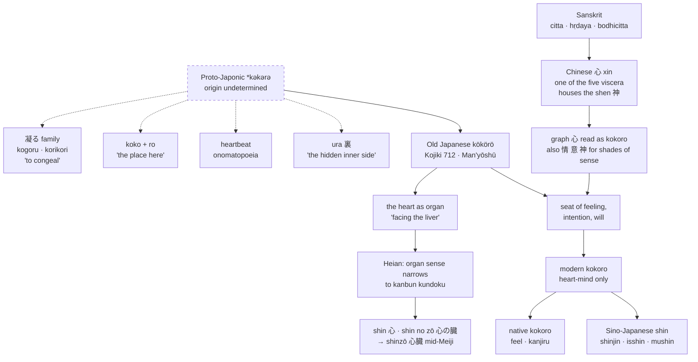

[[_Kokoro]] | [[_Kokoro Index]] | [[Kokoro - Japanese Buddhism - Heart-Mind in Doctrine and Practice]]

# _Kokoro_ — The Word and Its Range

> **Scope.** This note consolidates the lexical, etymological, and modern-scholarship material that was previously spread across eight overlapping source notes in `01 Raw`. It covers what the word _means_ and how it is currently used. Doctrinal history sits in [[Kokoro - Japanese Buddhism - Heart-Mind in Doctrine and Practice]]; cultivation in [[Kokoro - Cultivation - Merit and Energy]]; the novel in [[Kokoro - Soseki - Union Across Three Axes]]; practice in [[Kokoro in Practice]]. See [[Kokoro - Consolidation Log]] for what was merged and what was dropped.

> **Revision note (13 September 2026).** Section 1 was rewritten against Japanese philological sources. Two earlier claims were corrected: (a) the etymology previously rested on two popular articles and presented one theory as settled; it is now given as the four competing theories the standard dictionaries actually list, with the exact origin marked as undetermined; (b) the earlier statement that _kokoro_ "does not denote the physical organ" was true only of modern Japanese — in Old Japanese it plainly did. The Sasaki citation has also been corrected (author's given name and page range).

---

## 1. One graph, two readings

The character 心 carries two readings in Japanese, and the split matters.

- **Sino-Japanese _shin_** — the reading used in technical compounds: _shinjin_ (信心, entrusting heart), _isshin_ (一心, One Mind), _busshin_ (仏心, Buddha-mind), _bodaishin_ (菩提心, mind of awakening), _mushin_ (無心, no-mind).
- **Native _kokoro_** — the Yamato word, older than the writing system, meaning at once heart, mind, feeling, intention, core, and disposition.

### The heart as organ: a historical correction

In **modern** Japanese, _kokoro_ does not name the physical organ; that sense belongs to the Sino-Japanese _shinzō_ (心臓).[^1] But this is a Heian-period development, not an original feature of the word. In Old Japanese, _kokoro_ plainly did refer to the heart, or the region around it. The earliest attestation is a song in the _Kojiki_ (712):

> 御諸の 其の高城なる 大猪子が原 腹にある 肝向ふ 許々呂をだにか 相患はずあらむ
> _In the belly (hara) — the kokoro that faces the liver (kimo) — could we at least not share the pain?_[^2]

Here _kokoro_ is located inside the belly, "facing the liver," as a bodily organ — and in the same breath is made the seat of shared feeling. The _Man'yōshū_ pillow-word _murakimo no_ (村肝の, "of the clustered organs") attaches to _kokoro_ on the same logic.[^2] Miyaji's historical study of body-and-mind vocabulary traces how this organ sense narrowed: by the Heian period it survived mainly in _kanbun kundoku_ (Japanese readings of Chinese texts) and in dictionaries, while ordinary speech kept only the mental sense. The anatomical heart was then named by the Chinese-derived _shin_ (心) and _shinzō_ (心臓), later also _shin no zō_ (心の臓); _shin no zō_ was the common form from the medieval period into early Meiji, and _shinzō_ became standard from mid-Meiji, reinforced by its use as the Edo-period translation of the Western anatomical "heart."[^2]

One further nuance: the Chinese 心 that Japanese inherited was not the anatomical heart of Western medicine either. In classical Chinese medicine it is one of the five viscera (五臓), the organ that governs both physiological and mental function, and in which the _shen_ (神, spirit) resides.[^2] So the Japanese word absorbed a heart that was already a heart-mind.

### Etymology

The exact origin of the Yamato word is **undetermined** (未詳) — this is the verdict of the standard etymological references, and any source that states a single origin as fact is overstating.[^3] Gotō's survey of the dictionaries groups the proposals into four families:[^2]

1. **The 凝る family** — from words meaning "to gather and solidify": _korikori_ (凝々), _korokoro_ (凝々), _kogoru_ (凝る). The idea is that something formless inside the body congealed into a _kokoro_. This is the most widely repeated theory, appearing in Motoori Norinaga's _Kojiki-den_ and in the _Daigenkai_, and it is the one the Sōgakukan _Nihon gogen daijiten_ leads with. Gotō notes that even on this theory it is unclear whether the "congealed thing" was understood as the heart organ.
2. **A locative compound** — _koko_ (here, this place) + _ro_ (a suffix for place): "the place here," the inner locus.
3. **Heartbeat onomatopoeia** — from a sound such as _kok-kok_.
4. **The 裏 (_ura_) sense** — _kokoro_ as "the inner side that does not show." Modern Japanese still uses _ura_ (心) for the hidden interior, and _ura_ (心) and _ura_ (裏, reverse side) are treated as cognate.

The popular gloss that _kokoro_ means "that which changes _korokoro_" (rolling, fickle) is a folk reinterpretation of theory 1, not a separate etymology.[^3]

Historical linguistics gives the shape, if not the meaning: Old Japanese _kökörö_, reconstructed to Proto-Japonic _\*kəkərə_.[^4] Ken-ichi Sasaki's study of "mind" in the _Man'yōshū_ argues that in the earliest poetry _kokoro_ denoted affection and feeling first — a "place of feeling," tied to bodily sensation and turned toward others — rather than a faculty of reason.[^5]

**What the graphs show.** _Kokoro_ appears some 286 times in the _Man'yōshū_. It is written more often with Chinese graphs read in Japanese (心, 情, 意, 神, 景迩) than phonetically in _man'yōgana_ (許己呂, 己許呂). The choice of graph is itself evidence: 心 for psychological function in general, 情 for the emotional and non-rational side, 意 for the rational and volitional side (in the _Nihon shoki_). That the Nara-period scribes reached for all of these tells us the word was already centred on the mental sense, with the organ sense present but secondary.[^2]

### Sanskrit inheritance

Buddhist translators used the single graph 心 to render several distinct Sanskrit terms, and Japanese inherited that compression from Chinese.[^6]

- _**citta**_ — mind as the stream of cognitive-affective events; contrasted with _manas_ (意, the sense of "I") and _vijñāna_ (識, discriminating awareness).
- _**hṛdaya**_ — heart as the physical organ and, by extension, the essential core of a thing. This is the _shin_ of the 『般若心経』(_Hannya shingyō_, Heart Sutra), whose title means "the heart (essence) of the Prajñāpāramitā," not "the mind sutra."[^7]
- _**bodhicitta**_ (_bodaishin_) — the mind of awakening; _hosshin_ (発心, arousing the mind) is the standard Japanese term for religious conversion.

Because _kokoro_ already meant "heart-mind" before Buddhism arrived — organ and feeling in one word — the Yamato word absorbed all three senses without strain.

### The word's layers at a glance

Dotted lines mark the four competing etymological theories; none is settled. Solid lines mark attested history.

---

## 2. The dictionary definitions

Two standard Japanese dictionaries anchor the range:[^1]

- **Kōjien** — "the source of, or prerequisite for, a person's mental processes, or those processes themselves," encompassing the complex of knowledge, feeling, and will.
- **Nihon kokugo daijiten** — "the organ controlling rational (intellectual) and mental (emotional) processes in a human being, or these processes themselves." Frequently used in opposition to body (_karada_, 体) and thing (_mono_, 物), and extended metaphorically to phenomena corresponding to a person's soul or heart.

The _Nihon kokugo daijiten_ entry is worth reading in full: it organises the senses under three heads — mental activity as a whole; particular aspects of knowing, feeling, and willing; and specialised uses (duplicity, religious faith, worldly attachment) — and for most of them the earliest attestation is already in the _Kojiki_ or _Man'yōshū_. The whole modern range was present, in outline, in the eighth century.[^2]

Listed synonyms: _seishin_ (精神, soul, psyche) and _tamashii_ (魂, soul, spirit, willpower, vitality). _Seishin_ is a Sino-Japanese compound built from two of the "three treasures" of Chinese medicine (精, 気, 神), which acquired its modern sense as the antonym of "matter" when it was adopted in the Meiji period to translate German _Geist_.[^2]

**Modern collocation.** Native speakers tend to pair _kokoro_ with _kanjiru_ (感じる, to feel) and _atama_ (頭, head) with _kangaeru_ (考える, to think) — the Japanese "feel with _kokoro_ and think with the head." Nakano Shigeru notes that _kokoro_ leans toward the emotional sense of heart rather than the rational sense of mind.[^1] In scholarly discourse, however — psychology, philosophy — _kokoro_ functions as the standard equivalent for "mind." Gotō's corpus work adds a historical footnote: before _atama_ acquired its "seat of reason" sense in the late Edo period, _kokoro_ carried that role too, and older idioms such as _kokoro o mawasu_ (to turn the mind over) survive from that period.[^2]

**English equivalents**, context-dependent: heart, feeling, emotion, mentality, psyche, soul, mind, spirit, psychology, way of thinking, sentiment, personality, thought, attention, will, mood. No single English term carries all senses simultaneously.

The Czech Japanologist Zdeňka Švarcová glosses it as "a mental space in which the cognitive processes of a Japanese person take place," while noting that usage extends by metaphorical projection to animals and abstract objects.[^1]

---

## 3. The integration thesis — and the caveat

The _Routledge Encyclopedia of Philosophy_ treats _kokoro_ as a comprehensive term spanning mind, wisdom, aspiration, essence, attention, sincerity, and sensibility — the seat of human awareness, declining to settle on one English word.[^8] In pre-modern poetics it names at once the artist's capacity to respond to the world, the audience's answering response, and the judgment that a work possesses the right conception (_kokoro ari_, _ushin_).

Thomas Kasulis's shorthand is useful: _kokoro_ names an "intimacy" between affect and cognition that Western vocabularies tend to split into "heart" and "mind," and the Japanese tradition builds on that non-split rather than fighting it.[^9] The philosophical claim follows: _kokoro_ merges emotion, intellect, and will, treating as inseparable what the post-Cartesian Western tradition divides.

The philology in §1 gives this thesis a firmer base than the "untranslatable word" argument usually does. The claim is not that Japanese happens to lack a heart/mind split; it is that the word began as an organ-and-feeling term and grew its cognitive senses without ever shedding the bodily ones. Gotō's comparison with _mune_ (胸, chest) shows the bodily basis is still active: _kokoro_ shares with _mune_ the whole repertoire of physiological metaphors — pain, constriction, palpitation, heat, nausea — that map onto grief, anxiety, excitement, longing, and disgust.[^2]

> **Caveat.** The holistic, "untranslatable" account of _kokoro_ is itself contested. Romanticising single untranslatable Japanese words is a recognised _nihonjinron_ tendency — Takeo Doi's _amae_ work is frequently classified that way — which risks overstating cultural uniqueness.[^10] Treat the integration thesis as a live interpretive position, not a neutral fact. The strongest version of the claim ("kokoro is a holographic principle binding aesthetics, ethics, language and the nation into one whole") appears in the raw notes but is not supported by the scholarship cited there; it is an essayistic extrapolation and should be handled as such.

---

## 4. Where the word is doing live work

Elizabeth Sherlock's dissertation and the Consensus literature scan converge on four active domains.[^11]

| Domain | How _kokoro_ functions |
|---|---|
| Moral education | The inner state; attitude toward self, others, nature, and community; character and essence |
| Spiritual care and religion | Seat of emotion, reflection, and will; focus of meditation and of end-of-life "spiritual care" |
| Mental health and disaster response | Basis of _kokoro no kea_ (心のケア, care for the heart-mind) after trauma |
| Science–religion dialogue | Bridge concept linking mind, emotion, spirit, and consciousness |

**Moral education.** In _kokoro no kyōiku_ (心の教育), the Ministry of Education's _Kokoro no nōto_ (こころのノート) materials aim to foster a "rich _kokoro_" (_yutaka na kokoro_) and a "beautiful _kokoro_" (_utsukushii kokoro_) — introspection, kindness, being touched by beauty, altruism. Teresa Nakaya's axiological study notes that the concept is deployed almost exclusively in positive terms, which is itself the finding: _kokoro_ is a word with a built-in positive charge, used freely in slogans, proverbs, advertising, song lyrics, and given names.[^1]

**Spiritual care.** Timothy Benedict's work on Japanese hospice chaplaincy traces how _kokoro_ organises a vocabulary of care that sits outside institutional religion.[^12]

**Disaster mental health.** Shiori Yamaguchi's studies of _kokoro no kea_ after the Great East Japan Earthquake argue that the term's ambiguity cuts both ways: its breadth enables wide adoption, and the same breadth complicates stigma reduction and help-seeking.[^13]

**Mind science.** Kyoto University's Kokoro Research Center, founded in 2007, retained the untranslated term in its English name and combined neuroscience, Buddhist studies, clinical psychology, and aesthetics; it was reorganised in 2022 as the Institute for the Future of Human Society. Toshio Kawai has traced a historical shift in _kokoro_ from an open system — connected to nature and the divine — toward a closed, individualistic consciousness.[^14]

---

## 5. _Kokoro_ in ordinary speech

**[[Gratitude]].** The term intensifies thanks by locating it in the inner self rather than merely asserting it:

- 心から感謝しています (_kokoro kara kansha shite imasu_) — "grateful from the heart"
- 心よりお礼を申し上げます (_kokoro yori orei o mōshiagemasu_) — "I offer my heartfelt thanks," the _keigo_ register

Where _hontō ni_ (本当に, truly) and _makoto ni_ (誠に, sincerely) assert sincerity, _kokoro kara_ situates it in the speaker's whole being. The distinction matters in use: _kokoro_-phrases are reserved for substantial gestures, and sound melodramatic in trivial exchanges. Non-verbal complements — the depth and duration of a bow (_ojigi_), the thoughtfulness of _omiyage_ — carry the same content without words, consistent with the value placed on _enryo_ (遠慮, restraint).[^15]

**Cultural key words.** ==\*Wa no kokoro\* (和の心, the heart of harmony)== and _Nihon no kokoro_ (日本の心, the heart of Japan) treat a whole way of being as resting inside the word.[^1]

**Body idioms.** 心身一如 (_shinshin ichinyo_, body and mind as one suchness), 腹が立つ (_hara ga tatsu_, literally "the belly stands," meaning anger), 心を込める (_kokoro o komeru_, to put one's heart into something). Gotō's survey lists a fuller idiom set organised by bodily source: pain (_kokoro itashi_), constriction (_kokoro kurushi_), palpitation (_kokoro odoru_, _kokoro tokimeku_), heat (_kokoro o kogasu_), and — distinctively for _kokoro_ over _mune_ — shattering (_kokoro o kudaku_), which he reads as retaining the sense of a discrete inner organ that can break.[^2]

---

## 6. Adjacent concepts

Terms that consistently appear alongside _kokoro_ and shape how it is understood:

- _**wa**_ (和, harmony) — group cohesion, consensus, indirect communication
- _**wabi-sabi**_ (侘び寂び) — the aesthetic acceptance of transience and imperfection
- _**mono no aware**_ (物の哀れ) — the pathos of things, emotional response to the fleeting
- _**makoto**_ (誠) — sincerity; the quality of a _kokoro_ fully turned toward what is before it
- _**mushin**_ (無心) — no-mind; the unattached, freely responsive heart-mind. See [[Kokoro in Practice]]
- _**kotodama**_ (言霊) — the spiritual power of words; the proto-Shintō sense that speech resonates with the essence of things
- _**omoiyari**_ (思いやり) — empathy, thoughtfulness
- _**kokorozashi**_ (志) — personal mission or aspiration; _kokoro_ directed toward a purpose
- _**mune**_ (胸, chest) and _**hara**_ (腹, belly) — the adjacent body-words with which _kokoro_ shares most of its physiological idioms; see §5 and Gotō.[^2]

---

## 7. Cross-tradition note

_Kokoro_ sits inside a wider family of heart-mind concepts. Ning Yu's cognitive study of Chinese _xin_ establishes the same affect–cognition unity in the classical Chinese heart.[^16] The Indic comparison is developed separately in [[Kokoro and Shraddha]]: _śraddhā_ derives from the Proto-Indo-European compound _ḱred-dʰeh₁-_, "to place one's heart," so that where _kokoro_ names the field, _śraddhā_ names the placing. Japanese Buddhism renders _śraddhā_ as 信 (_shin_) — a homophone of 心 (_shin_).

---

## Footnotes

[^1]: Teresa Nakaya, "[The Japanese Concept KOKORO and Its Axiological Aspects in the Discourse of Moral Education](https://doi.org/10.11649/a.1651)," _Adeptus_ (2019). Nakaya is the source for the Kōjien and Nihon kokugo daijiten glosses, the Nakano Shigeru observation, the Švarcová definition, the modern _shinzō_ distinction, the moral-education material, and the cultural key words.
[^2]: Gotō Hideki 後藤秀貴, "[「こころ」の理解考 — 「むね」との比較を通じて](https://doi.org/10.18910/77040)" \[Understanding _kokoro_ through a comparison with _mune_], _Gengo bunka kyōdō kenkyū purojekuto_ 言語文化共同研究プロジェクト 2019 (Osaka University, 2020): 43–58. The _Kojiki_ song, the _Man'yōshū_ graph counts (citing Ikezoe 2013 and Itagaki 1988), the four etymological theories, the _seishin_/_Geist_ note, and the _kokoro_/_mune_ idiom comparison are all from this paper. The history of the organ sense is Gotō's summary of Miyaji Atsuko 宮地敦子, _Shinshin goi no shiteki kenkyū_ 身心語彙の史的研究 (Tokyo: Meiji Shoin, 1979). The dictionaries Gotō consults for the etymology are _Kurashi no kotoba shin gogen jiten_, _Koten kisogo jiten_ (ed. Ōno Susumu), _Nihon kokugo daijiten_ (2nd ed.), _Nihon gogen daijiten_, and _Nihon gogen kōjiten_ (expanded ed.).
[^3]: "[心／こころ](https://gogen-yurai.jp/kokoro/)," _Gogen yurai jiten_ 語源由来辞典, accessed 13 September 2026: "the exact etymology is undetermined" (正確な語源は未詳である). For the _Kojiki-den_ and _Daigenkai_ attributions of the 凝る theory as reported in the Shōgakukan _Nihon gogen daijiten_ (2005, ed. Maeda Tomiyoshi), see Gotō, above.
[^4]: "[こころ](https://ja.wiktionary.org/wiki/こころ)," _Wiktionary_ (Japanese edition), accessed 13 September 2026, giving Old Japanese _kökörö_ < Proto-Japonic _\*kəkərə_. A wiki, cited only for the reconstruction, which follows the standard historical-phonology treatment of the _kō/otsu_ vowel distinction.
[^5]: Ken-ichi Sasaki 佐々木健一, "[‘Mind' in Ancient Japanese: The Primitive Perception of Its Existence](https://doi.org/10.1177/0392192110415763)," _Diogenes_ 57, no. 3 (2010): 3–19. French original: "L'‘esprit' dans le japonais ancien," _Diogène_ 227 (2009): 3–25, https://doi.org/10.3917/dio.227.0003. (Earlier versions of this note gave the author as "Kōichi" and the pages as 19–33; both were errors.)
[^6]: A. Charles Muller, ed., _[Digital Dictionary of Buddhism](http://www.buddhism-dict.net/ddb/)_, s.v. 心, accessed 13 September 2026.
[^7]: Kazuaki Tanahashi, _The Heart Sutra: A Comprehensive Guide to the Classic of Mahayana Buddhism_ (Boulder: Shambhala, 2014); Jan Nattier, "The Heart Sūtra: A Chinese Apocryphal Text?" _Journal of the International Association of Buddhist Studies_ 15, no. 2 (1992): 153–223.
[^8]: John C. Maraldo, "[Kokoro](https://www.rep.routledge.com/articles/thematic/kokoro/v-1)," _Routledge Encyclopedia of Philosophy_, accessed 13 September 2026. Note: the raw notes attribute this entry to both Maraldo and Meera Viswanathan — the attribution needs checking against the encyclopedia itself.
[^9]: Thomas P. Kasulis, _Intimacy or Integrity: Philosophy and Cultural Difference_ (Honolulu: University of Hawaiʻi Press, 2002); Thomas P. Kasulis, _Engaging Japanese Philosophy: A Short History_ (Honolulu: University of Hawaiʻi Press, 2018), introduction.
[^10]: Takeo Doi, _The Anatomy of Dependence_, trans. John Bester (Tokyo: Kōdansha, 1973).
[^11]: Elizabeth Sherlock, "[Kokoro as Ecological Insight: The Concept of Heart in Japanese Literature](https://doi.org/10.14288/1.0096388)" (PhD diss., University of British Columbia, 2015); Consensus AI, "[Is Kokoro a Relevant Concept?](https://consensus.app/search/is-kokoro-a-relevant-concept/-mp1cRxoTIKCsObE5cV8iw/)," search response, 1 June 2026.
[^12]: Timothy O. Benedict, "[The Kokoro in Japanese Spiritual Care](https://doi.org/10.1177/10892680241269280)," _Review of General Psychology_ 29 (2024): 151–159.
[^13]: Shiori Yamaguchi, "[Rethinking the Concept of _Kokoro no Kea_ (Care for Mind) for Disaster Victims in Japan](https://doi.org/10.1080/17542863.2017.1404116)," _International Journal of Culture and Mental Health_ 11 (2018): 406–416; Shiori Yamaguchi, "[The Faultline of Kokoro no Kea](https://doi.org/10.1177/10892680241306053)," _Review of General Psychology_ 29 (2024): 199–210.
[^14]: "[Kokoro Research Center](http://kokoro.kyoto-u.ac.jp/en2/aboutus/greetings/)," Kyoto University, accessed 13 September 2026; "[Kyoto Kokoro Initiative](https://www.kyoto-u.ac.jp/en/news/2015-12-17)," Kyoto University, 17 December 2015.
[^15]: "[Showing Gratitude in Japanese](https://www.valiantjapanese.jp/blog/showing-gratitude-in-japanese/)," Valiant Japanese, accessed 13 September 2026; "[How to Say Thank You in Japanese](https://matcha-jp.com/en/2577)," _Matcha_, accessed 13 September 2026. Popular-language sources, adequate for usage but not for scholarly claims.
[^16]: Ning Yu, _The Chinese HEART in a Cognitive Perspective: Culture, Body, and Language_ (Berlin: Mouton de Gruyter, 2009), 302–303.

---

## Bibliography

Benedict, Timothy O. "The Kokoro in Japanese Spiritual Care." _Review of General Psychology_ 29 (2024): 151–159.

Doi, Takeo. _The Anatomy of Dependence_. Translated by John Bester. Tokyo: Kōdansha, 1973.

Gotō, Hideki 後藤秀貴. "「こころ」の理解考 — 「むね」との比較を通じて" \[Understanding _kokoro_ through a comparison with _mune_]. _Gengo bunka kyōdō kenkyū purojekuto_ 言語文化共同研究プロジェクト 2019 (2020): 43–58. https://doi.org/10.18910/77040.

Kasulis, Thomas P. _Engaging Japanese Philosophy: A Short History_. Honolulu: University of Hawaiʻi Press, 2018.

Kasulis, Thomas P. _Intimacy or Integrity: Philosophy and Cultural Difference_. Honolulu: University of Hawaiʻi Press, 2002.

Maeda, Tomiyoshi 前田富祺, ed. _Nihon gogen daijiten_ 日本語源大辞典. Tokyo: Shōgakukan, 2005.

Maraldo, John C. "Kokoro." _Routledge Encyclopedia of Philosophy_, 1998.

Miyaji, Atsuko 宮地敦子. _Shinshin goi no shiteki kenkyū_ 身心語彙の史的研究. Tokyo: Meiji Shoin, 1979.

Muller, A. Charles, ed. _Digital Dictionary of Buddhism_. http://www.buddhism-dict.net/ddb/.

Nakaya, Teresa. "The Japanese Concept KOKORO and Its Axiological Aspects in the Discourse of Moral Education." _Adeptus_ (2019).

Nattier, Jan. "The Heart Sūtra: A Chinese Apocryphal Text?" _Journal of the International Association of Buddhist Studies_ 15, no. 2 (1992): 153–223.

Ōno, Susumu 大野晋, ed. _Koten kisogo jiten_ 古典基礎語辞典. Tokyo: Kadokawa Gakugei Shuppan, 2011.

Sasaki, Ken-ichi 佐々木健一. "'Mind' in Ancient Japanese: The Primitive Perception of Its Existence." _Diogenes_ 57, no. 3 (2010): 3–19.

Sherlock, Elizabeth. "Kokoro as Ecological Insight: The Concept of Heart in Japanese Literature." PhD diss., University of British Columbia, 2015.

Tanahashi, Kazuaki. _The Heart Sutra: A Comprehensive Guide to the Classic of Mahayana Buddhism_. Boulder: Shambhala, 2014.

Yamaguchi, Shiori. "Rethinking the Concept of _Kokoro no Kea_ (Care for Mind) for Disaster Victims in Japan." _International Journal of Culture and Mental Health_ 11 (2018): 406–416.

Yamaguchi, Shiori. "The Faultline of Kokoro no Kea: Mental Distress and Post-Disaster Psychosocial Care After the Great East Japan Earthquake." _Review of General Psychology_ 29 (2024): 199–210.

Yu, Ning. _The Chinese HEART in a Cognitive Perspective: Culture, Body, and Language_. Berlin: Mouton de Gruyter, 2009.

---

## Source

Consolidated by Claude, Anthropic, claude-opus-5, conversation with author, 13 September 2026, from eight source notes in `Sources/01 Raw/Kokoro/`. Underlying material originated with Perplexity AI (2025–2026) and Consensus AI (1 June 2026). Section 1 rewritten the same day against Japanese philological sources (Gotō 2020; Miyaji 1979; _Gogen yurai jiten_; _Nihon gogen daijiten_) by Claude, Anthropic, claude-sonnet-4-6; the Sasaki citation was corrected in the same pass. Scholarly citations carried forward from the raw notes have been retained and are flagged where verification is still needed.
