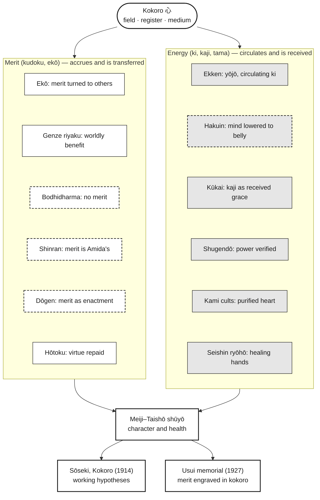

[[Kokoro]] | [[Kokoro - Cultivation - Merit and Energy]] | [[Kokoro - Japanese Buddhism - Heart-Mind in Doctrine and Practice]]

# Cultivating _Kokoro_: Two Models

> **Scope.** These are the two figures from [[Kokoro - Cultivation - Merit and Energy]], drawn in monochrome and presented with their reading notes. Both show the same argument. The linear model reads as a sequence, from _kokoro_ through the idioms to their modern outcomes. The circular model reads as a structure, with _kokoro_ at the centre and _shūyō_ as the boundary. Section numbers (§) refer to the essay.

**Key (both models)**

- **White box, fine line:** merit (_kudoku_, 功徳; _ekō_, 回向) — what accrues and can be transferred.
- **Grey box:** energy (_ki_, 気; _kaji_, 加持; _tama_, 魂) — what circulates and can be received.
- **Dashed border:** an internal critique that relocates the idiom rather than abolishing it.
- **White box, heavy line:** structural nodes — _kokoro_, Meiji–Taishō _shūyō_, and the two modern outcomes.

---

## Figure 1. Linear model

![[_ Dojo/Practice/Kokoro/Sources/01 Raw/Kokoro/Kokoro - Cultivation - Linear Model.svg|1160]]

_Figure 1._ Linear model of the argument. _Kokoro_ is cultivated through two idioms, merit and energy, each carried by distinct traditions; dashed borders mark internal critiques that relocate rather than abolish the idiom (§6.2). Both idioms converge in Meiji–Taishō _shūyō_ (§5). Author's schema.

### Reading the linear model

This is the essay's argument as one map. _Kokoro_ sits at the top. Merit and energy branch beneath it, with their traditions stacked below. Both columns then converge on Meiji _shūyō_ and its two modern outcomes.

The dashed boxes mark the essay's second claim. Bodhidharma, Shinran, Dōgen, and Hakuin don't abolish merit or energy; they each move it somewhere else. The bottom row shows the two modern outcomes of the _shūyō_ synthesis. The Sōseki box stays a working hypothesis, as it is in the essay.

---

## Figure 2. Circular model

![[_ Dojo/Practice/Kokoro/Sources/01 Raw/Kokoro/Kokoro - Cultivation - Circular Model.svg|1160]]

_Figure 2._ Circular model. _Kokoro_ at the centre; merit and energy as the two halves of the inner ring; traditions positioned on the side of their idiom, with internal critiques dashed; Meiji–Taishō _shūyō_ as the outer boundary through which the idioms pass into modern forms. Author's schema.

### Reading the circular model

_Kokoro_ sits at the centre, merit and energy form the two halves of the inner ring, and the traditions orbit on the side of their idiom. Meiji _shūyō_ is the outer boundary that holds both, with the two modern outcomes leaving through the bottom.

Read this way, the centre corresponds to the essay's first claim: _kokoro_ as field, register, and medium (§6.1). The inner ring shows the two idioms as halves of one practice rather than rival systems. The dashed nodes cluster where the critiques sit — Bodhidharma, Shinran, and Dōgen on the merit side, Hakuin on the energy side (§6.2). The outer boundary corresponds to the third claim: _shūyō_ as the shared "grammar" through which both idioms passed into modern forms (§5).

---

## Key to the nodes

| Node | Idiom | Critique | Essay section |
|---|---|---|---|
| _Ekō_: merit turned to others | Merit | — | §3.1 |
| _Genze riyaku_: worldly benefit | Merit | — | §3.2 |
| Bodhidharma: no merit | Merit | Refusal | §3.3 |
| Shinran: merit is Amida's | Merit | Reversal | §3.4 |
| Dōgen: merit as enactment | Merit | Enactment | §3.5 |
| _Hōtoku_: virtue repaid | Merit | — | §3.6 |
| Ekken: _yōjō_, circulating _ki_ | Energy | — | §4.2 |
| Hakuin: mind lowered to belly | Energy | Diagnosis | §4.3 |
| Kūkai: _kaji_ as received grace | Energy | — | §4.4 |
| Shugendō: power verified | Energy | — | §4.5 |
| Kami cults: purified heart | Energy | — | §4.6 |
| _Seishin ryōhō_: healing hands | Energy | — | §5.3 |
| Meiji–Taishō _shūyō_ | Both | — | §5.1–5.4 |
| Sōseki, 『こころ』(_Kokoro_, 1914) | Outcome | Hypothesis | §7 |
| Usui memorial (1927) | Outcome | — | §5.3 |

---

## Editable Mermaid version

The linear model as native Mermaid, in the same monochrome scheme.

---

## Source

Claude, Anthropic, claude-opus-5, conversation with author, 11 September 2026.
