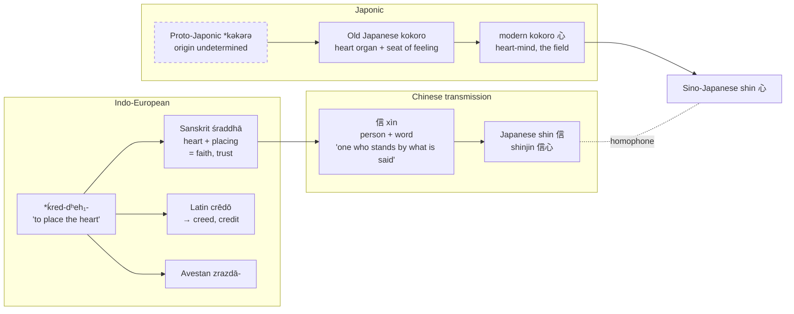

[[_Kokoro]] | [[_Kokoro Index]] | [[Kokoro - The Word and Its Range]]

# Kokoro and Śraddhā

_Two heart-words. One names the heart as a standing field; the other names the heart in the act of being placed. This note sets them side by side — where they converge, where they part, and the philological accident in Japanese Buddhism that makes them rhyme._

> **Revision note (13 September 2026).** The June draft asserted a "field vs. placing" contrast in four lines without developing it. This version builds the comparison out: morphology, grammar, semantic range, textual anchors, and the points where the two words genuinely diverge. The Nakaya citation has been corrected (Teresa, not Tomáš; _Adeptus_ 2019, not 2017), Minoru Hara's standard study has been added, and the sources have been put into Chicago form.

---

## 1. The two words at a glance

| | _Kokoro_ 心 | _Śraddhā_ श्रद्धा |
|---|---|---|
| **Language family** | Japonic (native Yamato word) | Indo-European (Sanskrit) |
| **Morphology** | Simplex; etymology undetermined, most-cited theory links it to _kogoru_ 凝る "to congeal"[^1] | Transparent compound: _śrad-_ (heart) + _dhā-_ (to place)[^2] |
| **Grammatical nature** | Noun of state — a thing, a locus, a faculty | Verbal noun of action — a placing, an entrusting |
| **Core sense** | The undivided seat of feeling, thought, and will | Trustful confidence directed at something |
| **Earliest attestation** | _Kojiki_ 712, _Man'yōshū_ 8th c. | _Ṛgveda_, esp. the Śraddhā hymn 10.151 |
| **Body reference** | In Old Japanese, also the heart organ (later lost) | Only through etymology; in use, already abstract |
| **Standard English** | heart, mind, spirit — no single equivalent | faith, trust, confidence — "faith" is the conventional but contested gloss |
| **Buddhist rendering** | 心 _shin_ / _kokoro_ | 信 _shin_ / _shinjin_ 信心 |
| **What it names** | The **field** | The **placing** |

---

## 2. Śraddhā — the heart set down

### Etymology

Śraddhā is one of the clearest compounds in the Indo-European lexicon. It resolves into two elements: _śrad-_ (Vedic _śrat-_), the old word for "heart," and _dhā-_, "to place, to put." The Proto-Indo-European reconstruction is _\*ḱred-dʰeh₁-_, "to place one's heart," and the compound is preserved across the family: Latin _crēdō_ ("I believe"), Old Avestan _zrazdā-_ ("trusting, devoted"), Old Irish _creitid_ ("believes"), and through Latin, English _creed_, _credit_, _credence_.[^2] The first element belongs with Latin _cor_, Greek _kardía_, English _heart_.

The compound tells us what the Indo-Europeans thought faith was: not a proposition held true but a heart set down somewhere. To believe was to deposit one's heart — the metaphor is spatial and transactional. Émile Benveniste reads the Vedic usage as an act of confidence extended to a god with the expectation of return, and connects it to the vocabulary of pledge and credit.[^3] Minoru Hara's philological survey, the standard treatment, shows the term denoting trustful confidence in ritual efficacy and sacred authority across the Vedic and classical corpus — closer to "reliance" than to doctrinal assent.[^4]

### The textual anchors

Two passages fix the sense. The _Bṛhadāraṇyaka Upaniṣad_ keeps the etymology alive: asked where śraddhā rests, Yājñavalkya answers that its resting ground is the heart (_hṛdaya_) — to hold faith is to be established in the heart.[^5] The _Bhagavad Gītā_ carries the thought to its conclusion: _śraddhā-mayo 'yaṃ puruṣaḥ_ (17.3), "a person is made of śraddhā; as one's śraddhā is, so one is."[^6] The heart placed determines the person who results.

So śraddhā reads as a verb wearing the clothes of a noun. It is the heart in the act of orienting, entrusting, committing. Its grammar is directional: one has śraddhā _in_ or _toward_ something.

---

## 3. Kokoro — the heart that stands

### Etymology

Kokoro is the opposite kind of word. It is a simplex, not a compound, and its origin is undetermined. The most-repeated theory — found in Motoori Norinaga's _Kojiki-den_ and the _Daigenkai_, and led with in the Shōgakukan _Nihon gogen daijiten_ — links it to _kogoru_ 凝る, "to congeal, to gather and set," so that _kokoro_ would be the formless interior that has solidified into a locus. Three other theories compete (a locative compound _koko_ + _ro_, heartbeat onomatopoeia, and derivation from _ura_ 裏, "the hidden inner side"), and the standard references decline to choose.[^1]

Whichever theory holds, the grammatical result is the same: _kokoro_ is a noun of state. It names a thing, a place, a faculty — not an act. In Old Japanese it also named the physical heart: the _Kojiki_ song locates _kokoro_ "in the belly, facing the liver."[^1] That organ sense narrowed away during the Heian period and was taken over by Sino-Japanese _shinzō_ 心臓, leaving modern _kokoro_ wholly on the mental side.[^1]

### What it holds

The word gathers what English keeps apart. The _Routledge Encyclopedia of Philosophy_ treats it as spanning mind, heart, inner nature, wisdom, aspiration, sincerity, and sensibility — the seat of sentience, and in poetics both the artist's capacity to feel and the felt essence of the thing.[^7] Ning Yu's cognitive study of the Chinese _xin_ 心, which supplied the graph, finds the same unity: affect and cognition held in a single locus where Western habit keeps feeling apart from reason.[^8] Teresa Nakaya's study of the word in Japanese moral education documents its built-in positive charge and its use as a cultural key word.[^9]

_Kokoro_ is not directional. One does not have _kokoro toward_ something; one has _kokoro_, and then does things with it — puts it into (_kokoro o komeru_), turns it (_kokoro o mukeru_), gives it (_kokoro o yaru_), has it stolen (_kokoro o ubawareru_). The directing is done by the verb, not by the noun.

---

## 4. The comparison proper

### 4.1 Same root image, opposite grammar

Both words begin from the heart. But they are built in opposite directions:

- **Śraddhā builds the action into the noun.** Heart + placing → "a placing of the heart." The direction is inside the word. You cannot say śraddhā without already saying _toward_.
- **Kokoro leaves the action outside.** The word names the heart as a standing thing; any placing must be supplied by a separate verb.

This is why the June draft's formula holds, once it is spelled out: _kokoro_ names the field, _śraddhā_ names the placing. But the point is not poetic. It is a difference in what the two languages chose to lexicalise. Sanskrit made "faith" a single word by fusing the heart with a verb of deposit. Japanese kept the heart as a noun and left "faith" to be expressed periphrastically — or borrowed it.

### 4.2 Where they converge

1. **Both are somatic at root.** Śraddhā by etymology, kokoro by attested Old Japanese usage. Neither tradition began with faith or mind as a disembodied faculty; both began in the chest.
2. **Both resist the reason/feeling split.** Śraddhā is not belief-that (propositional assent) but trust-in (relational confidence) — Hara's finding. Kokoro holds knowing, feeling, and willing as one — the integration thesis. Neither maps onto a post-Cartesian "mind."
3. **Both are made, not given.** The _Gītā_ says the person is _made of_ śraddhā. Japanese Buddhist practice speaks of cultivating _kokoro_ (see [[Kokoro - Cultivation - Merit and Energy]]). In both, the heart-word names something that shapes the person and can be shaped in turn.
4. **Both are positively charged.** Śraddhā is a virtue-term throughout Hindu, Jain, and Buddhist usage. Nakaya shows _kokoro_ is deployed almost exclusively in positive registers.[^9]

### 4.3 Where they part

1. **Directionality.** Already stated: śraddhā is inherently transitive in sense; kokoro is not.
2. **Object.** Śraddhā takes an object — a god, a teacher, a practice, the efficacy of a rite. Kokoro has no object; it is the subject's own interior.
3. **Scope.** Śraddhā is one mental posture among many (Buddhist Abhidharma lists it as one of the wholesome factors, alongside energy, mindfulness, concentration, wisdom). Kokoro is the whole interior in which all such postures occur. The two words are on different levels: śraddhā is a _state of_ kokoro, not a parallel to it.
4. **Translatability.** Śraddhā has a conventional English gloss ("faith") that scholars contest but can use. Kokoro has none; every gloss loses a sense.

### 4.4 The philological accident

Here the comparison closes into a circle. When Buddhism carried śraddhā into China, the translators rendered it with 信 _xìn_ — a graph composed of person 人 beside word 言: one who stands by what is said, one whose word can be trusted. Japanese inherited this as _shin_ 信, and _shinjin_ 信心 became the standard term for the entrusting heart, central to Shinran's Pure Land thought.[^10]

But 信 _shin_ is a homophone of 心 _shin_, the Sino-Japanese reading of the _kokoro_ graph. Faith and heart-mind ring with the same sound. _Shinjin_ 信心 — "faith-heart" — puts the two graphs side by side and the two readings on top of each other: _shin_ (faith) _shin_ (heart). A Japanese ear hears śraddhā and kokoro as a single syllable doubled.

This is an accident of transmission, not an etymological relation — 信 and 心 have nothing to do with each other in Chinese. But it is the kind of accident that a tradition builds on. The Japanese Buddhist vocabulary arrived at, by a route neither language planned, a phonetic form in which the placing and the field are indistinguishable.

---

## 5. Diagram

The two lineages never touch etymologically. They meet only in Japanese, through the homophony of 信 and 心 — marked with the dotted line.

---

## 6. For the practice

Śraddhā reads as _kokoro_ in motion. The morning bodhisattva vow has exactly this shape: the heart-mind (心) placing itself (_śrad-dhā_) toward awakening, renewed each day. The vow is not a belief held but a heart set down — and set down again tomorrow, because the setting is the practice. See [[Kokoro in Practice]] and [[Kokoro - Cultivation - Merit and Energy]].

---

## Footnotes

[^1]: For the etymology, the Old Japanese organ sense, and the Heian narrowing, see [[Kokoro - The Word and Its Range]] §1, which draws on Gotō Hideki 後藤秀貴, "[「こころ」の理解考 — 「むね」との比較を通じて](https://doi.org/10.18910/77040)," _Gengo bunka kyōdō kenkyū purojekuto_ 2019 (Osaka University, 2020): 43–58, and Miyaji Atsuko 宮地敦子, _Shinshin goi no shiteki kenkyū_ 身心語彙の史的研究 (Tokyo: Meiji Shoin, 1979).
[^2]: "[Creed](https://www.etymonline.com/word/creed)," _Online Etymology Dictionary_, accessed 13 September 2026, giving PIE _\*kerd-dhe-_ "to put one's heart" from the root _\*kerd-_ "heart," with Sanskrit _śrad-dhā-_, Old Irish _cretim_, and Welsh _credu_ as cognates. The laryngeal notation _\*ḱred-dʰeh₁-_ is the current standard form of the same reconstruction.
[^3]: Émile Benveniste, _Indo-European Language and Society_, trans. Elizabeth Palmer (London: Faber, 1973), bk. 1, ch. 15, "Credence and Belief."
[^4]: Minoru Hara, "Note on Two Sanskrit Religious Terms: _bhakti_ and _śraddhā_," _Indo-Iranian Journal_ 7, no. 2/3 (1964): 124–145; and Hans-Werbin Köhler, _Śrad-dhā in der vedischen und altbuddhistischen Literatur_ (Göttingen diss. 1948; Wiesbaden: Steiner, 1973). Hara's is the standard philological survey; Köhler's the earlier monograph.
[^5]: _Bṛhadāraṇyaka Upaniṣad_ 3.9.21, in _The Early Upaniṣads_, trans. Patrick Olivelle (New York: Oxford University Press, 1998).
[^6]: _Bhagavad Gītā_ 17.3, in _The Bhagavad Gita_, trans. Eknath Easwaran, 2nd ed. (Tomales, CA: Nilgiri Press, 2007).
[^7]: John C. Maraldo, "[Kokoro](https://www.rep.routledge.com/articles/thematic/kokoro/v-1)," _Routledge Encyclopedia of Philosophy_, accessed 13 September 2026.
[^8]: Ning Yu, _The Chinese HEART in a Cognitive Perspective: Culture, Body, and Language_ (Berlin: Mouton de Gruyter, 2009), 302–303.
[^9]: Teresa Nakaya, "[The Japanese Concept KOKORO and Its Axiological Aspects in the Discourse of Moral Education](https://doi.org/10.11649/a.1651)," _Adeptus_ (2019). (The June draft gave the author as "Tomáš" and the year as 2017; both were errors.)
[^10]: Robert E. Buswell Jr. and Donald S. Lopez Jr., _The Princeton Dictionary of Buddhism_ (Princeton: Princeton University Press, 2013), s.v. _śraddhā_ and 信. On _shinjin_ in Shinran, see [[Kokoro - Japanese Buddhism - Heart-Mind in Doctrine and Practice]] §4.

---

## Bibliography

Benveniste, Émile. _Indo-European Language and Society_. Translated by Elizabeth Palmer. London: Faber, 1973.

Buswell, Robert E., Jr., and Donald S. Lopez Jr. _The Princeton Dictionary of Buddhism_. Princeton: Princeton University Press, 2013.

Easwaran, Eknath, trans. _The Bhagavad Gita_. 2nd ed. Tomales, CA: Nilgiri Press, 2007.

Gotō, Hideki 後藤秀貴. "「こころ」の理解考 — 「むね」との比較を通じて." _Gengo bunka kyōdō kenkyū purojekuto_ 言語文化共同研究プロジェクト 2019 (2020): 43–58. https://doi.org/10.18910/77040.

Hara, Minoru. "Note on Two Sanskrit Religious Terms: _bhakti_ and _śraddhā_." _Indo-Iranian Journal_ 7, no. 2/3 (1964): 124–145.

Köhler, Hans-Werbin. _Śrad-dhā in der vedischen und altbuddhistischen Literatur_. Wiesbaden: Steiner, 1973.

Maraldo, John C. "Kokoro." _Routledge Encyclopedia of Philosophy_, 1998.

Miyaji, Atsuko 宮地敦子. _Shinshin goi no shiteki kenkyū_ 身心語彙の史的研究. Tokyo: Meiji Shoin, 1979.

Nakaya, Teresa. "The Japanese Concept KOKORO and Its Axiological Aspects in the Discourse of Moral Education." _Adeptus_ (2019).

Olivelle, Patrick, trans. _The Early Upaniṣads_. New York: Oxford University Press, 1998.

Yu, Ning. _The Chinese HEART in a Cognitive Perspective: Culture, Body, and Language_. Berlin: Mouton de Gruyter, 2009.

---

## Source

Original draft by Claude, Anthropic, conversation with author, 19 June 2026. Restructured and expanded by Claude, Anthropic, claude-sonnet-4-6, conversation with author, 13 September 2026: comparison developed from four lines into §4, table and diagram added, Hara added, Nakaya corrected, sources put into Chicago form.
