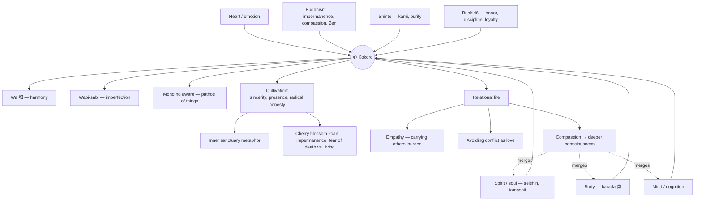

Flowchart companion to [[Unite in Kokoro - 心]], [[Unite in Kokoro - Concept Graph b 0.1.canvas]], and [[Unite in Kokoro - Mindmap b 0.1]].

```mermaid
flowchart TD
    Heart[Heart / emotion]
    Mind[Mind / cognition]
    Spirit[Spirit / soul — seishin, tamashii]
    Body[Body — karada 体]

    Heart --> K((心 Kokoro))
    Mind --> K
    Spirit --> K
    Body --> K

    K --> Wa[Wa 和 — harmony]
    K --> Wabi[Wabi-sabi — imperfection]
    K --> Mono[Mono no aware — pathos of things]

    Buddhism[Buddhism — impermanence, compassion, Zen]
    Shinto[Shinto — kami, purity]
    Bushido[Bushidō — honor, discipline, loyalty]

    Buddhism --> K
    Shinto --> K
    Bushido --> K

    K --> Practice[Cultivation:\nsincerity, presence, radical honesty]
    Practice --> Sanctuary[Inner sanctuary metaphor]
    Practice --> Blossom[Cherry blossom koan —\nimpermanence, fear of death vs. living]

    K --> Relational[Relational life]
    Relational --> Empathy[Empathy — carrying others' burden]
    Relational --> Conflict[Avoiding conflict as love]
    Relational --> Compassion[Compassion → deeper consciousness]

    Compassion -.merges.-> Spirit
    Compassion -.merges.-> Body
    Compassion -.merges.-> Mind
```
