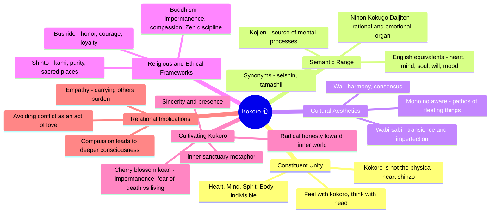

Mindmap companion to [[Unite in Kokoro - 心]] and [[Unite in Kokoro - Concept Graph.canvas]].

```mermaid
mindmap
  root((Kokoro 心))
    Constituent Unity
      Heart, Mind, Spirit, Body - indivisible
      Feel with kokoro, think with head
      Kokoro is not the physical heart shinzo
    Semantic Range
      Kojien - source of mental processes
      Nihon Kokugo Daijiten - rational and emotional organ
      Synonyms - seishin, tamashii
      English equivalents - heart, mind, soul, will, mood
    Cultural Aesthetics
      Wa - harmony, consensus
      Wabi-sabi - transience and imperfection
      Mono no aware - pathos of fleeting things
    Religious and Ethical Frameworks
      Buddhism - impermanence, compassion, Zen discipline
      Shinto - kami, purity, sacred places
      Bushido - honor, courage, loyalty
    Cultivating Kokoro
      Sincerity and presence
      Radical honesty toward inner world
      Inner sanctuary metaphor
      Cherry blossom koan - impermanence, fear of death vs living
    Relational Implications
      Empathy - carrying others burden
      Avoiding conflict as an act of love
      Compassion leads to deeper consciousness
```
