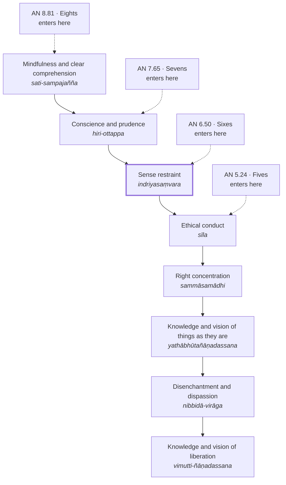
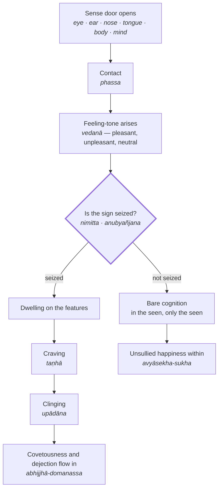

[[Mind]]

# Guarding the Senses

_indriyasaṃvara_ / _indriyesu guttadvāratā_

## The term

Two Pali expressions carry the idea. _Indriyasaṃvara_ (restraint of the sense faculties) is the technical term used in the monastic training sequence. _Indriyesu guttadvāratā_ (being one who guards the doors of the sense faculties) is the more pictorial alternative, and the source of the English phrase "guarding the sense doors." Both appear across the four main Nikāyas; one scholarly count lists the guarded-doors phrasing in over two dozen discourses and the restraint phrasing in roughly forty more, which makes it one of the most heavily repeated practice instructions in the canon.[^1]

==The faculties in question are six: eye, ear, nose, tongue, body, and mind. Mind (\*mano\*) is counted as a sense door alongside the five physical ones==, so thought and memory arrive through a door that needs guarding exactly as sight does.

## The canonical formula

The instruction is stereotyped and almost always given in the same words. On seeing a form with the eye, the practitioner does not grasp at the sign (_nimitta_) or the secondary features (_anubyañjana_), since leaving that faculty unguarded allows covetousness and dejection (_abhijjhā-domanassa_) and other unwholesome states to flow in. So one practises restraint, guards the faculty, undertakes restraint of it. The formula then repeats for ear, nose, tongue, body, and mind.[^2]

Two things are worth holding onto here.

The guarding happens at a specific moment: after contact, before elaboration. Something is seen; what is refused is the second move, the seizing of the image as attractive or repellent and the subsequent dwelling on its details.

What is guarded against is named as an inflow — _anvāssaveyyuṃ_, "might flow in." The metaphor throughout is hydraulic and architectural: doors, gates, leaks. Not combat.

Anālayo makes the crucial qualification. _Nimitta_ is an indispensable ingredient of perception itself, so restraint cannot mean avoiding all signs, which would simply be dysfunction. What is at stake is the narrower class of sign that triggers lust or aversion — and the Mahāvedalla Sutta (MN 44) says exactly this, that lust, anger and delusion are themselves "makers of signs."[^3]

## Where it sits in the path

Sense restraint has a fixed position in the gradual training (_anupubbasikkhā_) laid out in the Sāmaññaphala Sutta (DN 2) and repeated through the Majjhima Nikāya: ethical conduct, then restraint of the faculties, then mindfulness and clear comprehension, then contentment with little, then the removal of the hindrances, then the jhānas.[^2] It is preparatory, and it is not optional.

The Indriyasaṃvara Sutta (AN 6.50) states the dependency as a cascade with a botanical simile. Without sense restraint, the precondition for ethical conduct is ruined; without ethical conduct, the precondition for right concentration; and so on up to liberation, like a tree lacking branches and foliage, whose shoots, bark, softwood and heartwood never grow to fullness.[^4] That sutta repays a closer look than a single paragraph gives it.

## The upanisā cascade of AN 6.50

### The operative word

_Upanisā_ is not ordinary causal vocabulary. The dictionaries give cause, basis, condition, prerequisite; Bodhi renders it proximate cause, Gethin specific basis, Sujato vital condition. Dhivan Thomas Jones, in the fullest study of the term, argues for _precondition_, and shows that Pali _upanisā_ is cognate with Sanskrit _upaniṣad_, emerging from a live ascetic debate about what genuinely supports liberation rather than from any neutral theory of causation.[^20]

The negative form is _hatūpanisa_ — _hata_ (past participle of _hanati_, from √han, to strike down) plus _upanisā_: whose precondition is ruined. Handle the force of that word carefully. The Manorathapūraṇī glosses the compound as _hataupanissayo hatakāraṇo_, swapping synonyms for _upanisā_ and leaving _hata_ untouched, which suggests the participle was not felt to need unpacking; Bodhi translates flatly as lacking its proximate cause, Jones simply as lacking.[^20] Two things nonetheless keep the stronger reading alive. The clause already contains a plain negation (_asati_) and _vipanna_ (spoilt, failed), so a third word meaning merely absent would be redundant. And the positive counterpart is _sampannūpanisa_, fulfilled or complete — a ruined-against-complete polarity, not a present-against-absent one.

One point of grammar limits how far the violence can be pushed. In AN 7.65, _hatūpaniso_ is nominative, agreeing with _indriyasaṃvaro_. What has its support wrecked is the downstream factor, not the person; there is no agent in the Pali doing any wrecking.

### The simile is about maturation, not triggering

A tree lacking branches and foliage does not fail to _have_ shoots, bark, softwood and heartwood. It fails to bring them to fullness. The mechanism is nutritive: the canopy feeds the trunk, and the innermost tissue matures last and slowest.

This matters for reading the chain. Sense restraint is not a switch that fires ethical conduct. It is the photosynthetic surface, the part in contact with the world, without which nothing inward thickens. The tree in the simile is damaged, not unborn — which is also the best argument for reading _hatūpanisa_ as ruined rather than absent.

The same five tree-parts carry a different load in the _Sāropama_ discourses, where they rank attainments by depth rather than condition one another:[^22]

| Pali | Ñāṇamoli and Bodhi | MN 29 stands for | Role in AN 6.50 |
| --- | --- | --- | --- |
| _sākhāpalāsa_ | twigs and leaves | Gain, honour, renown | The precondition that feeds everything |
| _papaṭika_ | outer bark | Attainment of virtue | Brought to fullness, or not |
| _taca_ | inner bark | Attainment of concentration | Brought to fullness, or not |
| _pheggu_ | sapwood | Knowledge and vision | Brought to fullness, or not |
| _sāra_ | heartwood | Unshakeable deliverance of mind | Matures last |

Translators vary on the middle three: Thanissaro has outer bark, inner bark, sapwood; Suddhāso has outer bark, inner bark, softwood; translations of AN 6.50 often give _papaṭika_ as shoots. The Pali is the stable spine. Both discourses agree that heartwood is innermost and last.

### AN 6.50 is one member of a family

The identical cascade appears across four _nipātas_, each prefixing a new head-term and pushing the root precondition further upstream. The numerical organisation of the Aṅguttara either generated or preserved the expansion.[^21]

Every version shares the same four-term tail. Only the reach of the head varies. Three consequences follow.

**Sense restraint's position is a hinge, not a fixture.** In the Fives it does not appear; ethical conduct is the root. In the Sixes it becomes that conduct's precondition. In the Sevens it is itself conditioned by conscience, and in the Eights by mindfulness and clear comprehension. The tradition is not fixed about where the bottom of the ladder sits.

**The series moves one way only.** Each expansion pushes the intervention point earlier. Nothing in the family ever appends a term at the liberation end. This is the cost gradient of the methods diagram below, arrived at independently by the compilers: the further upstream a precondition can be located, the more it explains.

**The Eights version complicates the Sixes.** If _sati-sampajañña_ conditions sense restraint, mindfulness is not something restraint builds toward — it is underneath it. That matches SN 35.247, where the stout post is mindfulness of the body, and Buddhaghosa's assignment of mindfulness as the faculty by which restraint is undertaken.[^8] The apparent circle, in which mindfulness enables restraint and restraint enables the concentration that develops mindfulness, is likely the point rather than a defect.

### The conflict with the gradual training

DN 2 places ethical conduct **before** restraint of the faculties. AN 6.50 makes restraint of the faculties the precondition **for** ethical conduct. These are not the same ordering, and nothing above resolves it.

Two candidate readings, neither yet sourced:

1. **Different senses of _sīla_.** In DN 2 it is the Pātimokkha rules undertaken on entry, a thing one adopts. In AN 6.50 it may be ethical integrity as an achieved condition, a thing one comes to have. Adoption precedes restraint; achievement depends on it.
2. **Different genres of ordering.** DN 2 gives a pedagogical sequence of undertaking; AN 6.50 gives a conditional dependency. Neither claims to be the other.

Buddhaghosa places sense restraint _inside_ the fourfold purification of virtue rather than before or after it, which suggests the commentarial tradition felt the same pressure and resolved it by nesting. Check the Manorathapūraṇī on AN 6.50 before committing to either reading.

## What it is not

Two misreadings are ruled out inside the canon itself.

**Not sensory deprivation.** The Indriyabhāvanā Sutta (MN 152) opens with a brahmin student claiming that his teacher trains the faculties by not seeing forms with the eye and not hearing sounds with the ear. The Buddha's reply is essentially a reductio: in that case the blind and the deaf would be accomplished practitioners.[^5] The cultivation being taught is a transformation of response, not a withdrawal of input.

**Not suppression.** The Mālukyaputta instruction, given also to Bāhiya, sets the target as a mode of cognition rather than a clamped-down one: in the seen, only the seen; in the heard, only the heard; in the sensed, only the sensed; in the cognised, only the cognised.[^6] The verses attached to the Mālukyaputta exchange describe the failure case precisely — having seen a form, mindfulness is lost, attention goes to the attractive sign, feeling is experienced with an infatuated mind, and one remains holding on.

## The similes

The Saḷāyatana-saṃyutta supplies the images that later commentary and practice traditions lean on.

**Six animals bound together** (SN 35.247). A man catches a snake, a crocodile, a bird, a dog, a jackal and a monkey, ties each with a strong rope, knots the ropes together at the centre and lets them go. Each pulls toward its own feeding ground; when they tire, whichever is strongest drags the rest. That is non-restraint. Tie the same rope to a stout post and the animals eventually settle beside it. The sutta then names the post: mindfulness directed to the body (_kāyagatā sati_).[^7] The restraint is not achieved by shortening the ropes but by giving them an anchor.

The same discourse opens with a man whose limbs are already wounded entering a thicket of thorny reeds, so that every contact aggravates what is already raw — an image of unguarded faculties meeting the world.

**The tortoise** (SN 35.240). A tortoise draws its limbs into its shell when a jackal approaches, and the jackal, finding no opening, loses interest and leaves.[^1]

**The red-hot iron nail** (SN 35.235). It would be better for the eye faculty to be mutilated by a burning iron nail than to be caught in the features and details of forms cognisable by the eye. This is a separate discourse from the famous Fire Sermon (SN 35.28), though both carry the title _Āditta_. The line is stark enough that Buddhaghosa quotes it when explaining why restraint has to be undertaken with mindfulness.[^8]

## The commentarial elaboration

In the _Visuddhimagga_, restraint of the faculties is the second of the four purifications of virtue, after Pātimokkha restraint and before purification of livelihood and of requisites. Buddhaghosa assigns each a faculty by which it is accomplished: Pātimokkha restraint is undertaken by faith, restraint of the sense faculties by mindfulness, because when the faculties' functioning is founded on mindfulness there is no liability to invasion by covetousness.[^8]

His illustration is the Elder Mahātissa. Walking for alms from Cetiyapabbata to Anurādhapura, he meets a woman who has quarrelled with her husband, dressed up and leaving town; she laughs loudly at him; he looks up, finds in the bones of her teeth the perception of foulness, and attains arahantship. Asked by the pursuing husband whether he has seen a woman, he answers that he does not know whether a man or a woman went by, only that a collection of bones went along the road.[^9]

This passage is where the doctrine becomes uncomfortable and where critical scholarship belongs alongside it — see below.

## Mahayana: guarding the mind rather than the doors

Śāntideva's _Bodhicaryāvatāra_, chapter 5, redirects the whole apparatus inward. Whoever wishes to guard the training must guard the mind; an unguarded mind makes every other observance unstable. The mind is figured as a maddened elephant that must be tied to the post of the Dharma, and the guarding is performed by a pair of faculties: mindfulness (_smṛti_), which holds the instruction in place, and introspective alertness (_samprajanya_), which checks the current state of body and mind. Physical discipline of the eyes — walking with the gaze settled, not scanning without purpose — is retained, but as an expression of the inner guard rather than the substance of it.[^10]

The underlying logic is the one usually summarised as: you cannot cover the earth in leather, so cover your own feet.

## East Asia and Japan

Chinese Buddhist literature inherits the six faculties as the six roots (六根, _liùgēn_ / Jp. _rokkon_) and their objects as the six dusts (六塵), with a recurring image of the six senses as thieves robbing the treasure of the mind.

The decisive East Asian shift is that the six faculties become objects of purification rather than only restraint. Chapter 19 of the _Lotus Sūtra_ (法師功徳品, "The Benefits Obtained by an Expounder of the Dharma") promises the practitioner eight hundred qualities of the eye, twelve hundred of the ear, eight hundred of the nose, twelve hundred of the tongue, eight hundred of the body and twelve hundred of the mind, which adorn the six faculties and cause them all to become pure.[^11] The closing text of the threefold Lotus, the Samantabhadra contemplation sutra, converts this into a repentance practice organised faculty by faculty.[^12]

That phrase — _rokkon shōjō_ (六根清浄, purification of the six roots) — becomes the standard chant of Japanese mountain pilgrimage. Fuji-kō pilgrims in white robes ascend chanting it; Shugendō practitioners use it entering the mountain at Mitoku-san and elsewhere; and it also appears inside Shinto _misogi_ practice in the formula _harae tamae kiyome tamae rokkon shōjō_. Guarding the senses, in the Japanese landscape, has become a purification rite performed with the feet and the voice rather than a monastic gate-keeping procedure. **The textual ancestry above is sourced; the claims in this paragraph about ritual usage are not yet — see "Still to verify."**

## Psychological correlates

Three research literatures line up with the canonical formula unusually well, each mapping to a different part of it.

**The moment of grasping is real and is pre-volitional.** Anderson, Laurent and Yantis demonstrated _value-driven attentional capture_: a physically inconspicuous, task-irrelevant stimulus that was briefly paired with monetary reward goes on capturing attention involuntarily, persisting through extinction, independent of goals and of salience. Vulnerability to this capture covaried with working memory capacity and trait impulsivity, and the authors propose it as a model for failures of cognitive control in addiction and obesity.[^13] This is a laboratory description of the _nimitta_ that has been made attractive by prior conditioning and now seizes the eye before any decision is taken.

**Guarding the door beats fighting in the room.** Duckworth, Gendler and Gross organise self-control strategies along the timeline of a developing tempting impulse — situation, attention, appraisal, response — and argue that situational strategies, which nip the impulse in the bud, are more effective than later, response-stage strategies. Their examples are almost a modern monastic rule: sit away from where the drinks are poured, tell the waiter not to bring the dessert cart, go to the library without a phone.[^14] The process model predicts that the earlier the cycle is interrupted, the better the outcome — which is precisely the claim the gradual training makes by placing sense restraint before, not after, the work on mental states.

**Resisting temptation does not predict success; encountering less of it does.** Milyavskaya and Inzlicht ran experience sampling, daily diary and prospective measures across a semester. Goal attainment was predicted by how many temptations people experienced, not by how much effortful self-control they exerted; merely experiencing temptation produced depletion, and depletion mediated the link to failure. Bayesian analysis indicated effortful self-control was consistently unrelated to goal attainment.[^15]

Read together, these give the tradition's claim an empirical shape. The bhikkhu who does not grasp the sign is not winning a struggle; he is not having one.

A fourth thread is weaker and should be handled with care. Gross's process model treats attentional deployment as an antecedent-focused strategy, and antecedent-focused regulation outperforms response-focused suppression in his experimental work.[^16] But attentional bias modification as a clinical intervention has a mixed and contested record: a meta-analysis of 49 trials found small effects overall and mostly non-significant ones in patient samples, a result that was itself disputed in print.[^17] The "train attention away from the cue" line should not be overstated.

## The process, mapped

The canonical formula locates guarding at one precise joint in a causal sequence. Everything upstream of that joint is unavoidable; everything downstream is progressively more expensive to undo.

The branch point is the whole doctrine. Contact is not optional and the feeling-tone is not chosen; the seizing is. This is why MN 152 can reject sensory deprivation without weakening the teaching — the instruction was never aimed at the arrow into the diagram, only at the fork inside it.

## The methods, by where they act

Grouping the tradition's actual techniques by the stage at which each intervenes shows the cost gradient plainly. The earlier a method acts, the less effort it asks and the more reliably it works.

```mermaid
flowchart LR
    subgraph S1["1 · Before contact"]
        A1["Seclusion; choice of dwelling,<br>route and company"]
        A2["Moderation in eating<br><i>bhojane mattaññutā</i>"]
        A3["Tortoise: withdraw the limbs<br>SN 35.240"]
    end

    subgraph S2["2 · At contact"]
        B1["Do not seize the sign<br>or the features"]
        B2["Anchor: mindfulness of the body —<br>the stout post · SN 35.247"]
    end

    subgraph S3["3 · Sign already taken"]
        C1["Contemplate impermanence of<br>faculty, object, contact, feeling<br>SN 35.235"]
        C2["Foulness contemplation<br><i>asubha</i> · Vism I.55 — see caution"]
        C3["Introspective alertness<br><i>samprajanya</i> · BCA 5"]
    end

    subgraph S4["4 · Craving already arisen"]
        D1["Restraint of act and speech<br>Pātimokkha"]
        D2["Forceful suppression<br>MN 20, fifth and last method"]
    end

    S1 --> S2 --> S3 --> S4
    S4 -.->|"cost rises, reliability falls"| S1
```

### Notes on the two diagrams

**The four-stage grid is imported, not indigenous.** The tradition does not organise its methods this way. The columns are Duckworth, Gendler and Gross's impulse timeline — situation, attention, appraisal, response — laid over Pali and Mahayana material because the fit is unusually close.[^14] The fit is a finding worth noting and an argument worth making, but the grid is our scaffolding, not the canon's, and the note should say so wherever the diagram travels.

**Stage 2 is the doctrine proper.** _Indriyasaṃvara_ in the strict sense is the second column alone. Stages 1, 3 and 4 are adjacent practices that the same texts prescribe, drawn in here because they show what guarding is being contrasted with.

**Mindfulness of the body runs under all four.** _Kāyagatā sati_ appears in stage 2 in the diagram because that is where SN 35.247 places the post, but it is the condition for every other column working at all. Buddhaghosa makes the same point from the other side: restraint of the faculties is the purification undertaken _by means of_ mindfulness.[^8] The AN 8.81 version of the _upanisā_ cascade says it a third way, by making mindfulness and clear comprehension the precondition of sense restraint itself.[^21]

**Stage 4 is real and is the least recommended.** MN 20 lists forceful suppression — mind pressed down by mind, teeth clenched, tongue against the palate — as the fifth and final method, to be used when the four gentler ones have failed.[^19] Its position in the list is the teaching. The modern literature reaches the same conclusion by a different route: effortful resistance predicts depletion, not attainment.[^15]

**The dotted return arrow is the practical instruction.** Repeatedly finding oneself in stage 4 is information about stage 1. The response is to change the situation, not to build a stronger clench.

## Critical scholarship and open tensions

**The gendered content of the classical examples.** The Mahātissa story is not incidental. Liz Wilson examines how Indian Buddhist hagiographic literature stages the female body as the privileged object of foulness contemplation for a male monastic audience, and argues that the woman in such narratives functions as a didactic instrument rather than a subject. She notes finding no comparable practice recorded among female saints.[^18] Any use of the _Visuddhimagga_ material should carry this alongside it.

**Restraint versus cultivation.** MN 152 is titled _the development of the faculties_, not their restraint, and its positive instruction concerns the ability to establish equanimity toward what is agreeable, disagreeable and both. There is a real doctrinal question about whether the canon holds two models — an ascetic gate-keeping model and a non-reactivity model — or one model at two stages of maturity.

**Two orderings of sīla and sense restraint.** See "The conflict with the gradual training" above. Unresolved.

**Layperson applicability.** The formula is addressed to monastics, and the commentarial tradition notes that a householder's observances cannot simply be identified with a bhikkhu's. How the instruction transposes to a life of deliberate sensory engagement, including artistic work, is an interpretive question the texts do not settle.

**The "attention economy" framing.** Contemporary presentations map sense restraint onto digital media consumption readily, and the situational self-control literature supports the mapping structurally. It is still an analogy imported by us, not a claim the sources make, and should be marked as such.

## Questions to carry into practice

Where is the moment of grasping, as distinct from the moment of seeing?

Which passages of a day are the thorny thicket, and which is the stout post?

What is being anchored — the six ropes, or the animals?

Is a given practice guarding the door, or fighting in the room?

## Still to verify

- **六賊, the six thieves.** No academic source located. Widely repeated in Chan-influenced writing and attributed to the _Śūraṅgama Sūtra_, but nothing citable found for its earliest locus. Check the Taishō text before using.
- **_Rokkon shōjō_ in Shugendō and Fuji-kō.** Everything found so far is lead-only. H. Byron Earhart, _Mount Fuji: Icon of Japan_ (Columbia: University of South Carolina Press, 2011) is confirmed to exist and to cover Shugendō, Kakugyō, Fujidō and the pilgrimage confraternities, but not confirmed to discuss the chant itself. Miyake Hitoshi unchecked.
- **AN 7.65 and AN 8.81.** Verified only through sites quoting the Pali and Sujato's English, not at SuttaCentral directly.
- **MN 30.** The Cūḷasāropama extension of the heartwood scheme is unchecked. MN 29 is now verified.
- **Manorathapūraṇī on AN 6.50.** Needed to test the two readings of the DN 2 conflict.
- **Gabriel Ellis article.** Volume/year ambiguity (vol. 21, nos. 1–2; published online 2021). Confirm pagination before citing.
- **Anālayo.** The Barre Center piece is a teacher's essay, not peer-reviewed. His equivalent argument in _Mindfulness_ or _JOCBS_ would be the citable form.

## Changelog

- 19 September 2026 — note created.
- 19 September 2026 — added the two process diagrams and the _upanisā_ cascade section; corrected the _Sāropama_ tree-part table after verification; reformatted frontmatter.

## References

[^1]: Gabriel Ellis, "[Dependent Origination as Emergence of the Subject: A Cognitive-Psychological Approach](https://doi.org/10.1080/14639947.2021.1988214)," _Contemporary Buddhism_ 21, nos. 1–2. Note 30 lists the occurrences of _indriyesu guttadvāro_ across the Nikāyas, including SN 35.240 for the tortoise.

[^2]: Sāmaññaphala Sutta, DN 2, §§63–64. Pali text: Mahāsaṅgīti Tipiṭaka Buddhavasse 2500, via [SuttaCentral](https://suttacentral.net/dn2). English: Maurice Walshe, trans., _The Long Discourses of the Buddha: A Translation of the Dīgha Nikāya_ (Boston: Wisdom Publications, 1995). The key terms are _na nimittaggāhī hoti nānubyañjanaggāhī_ — not a seizer of the sign, not a seizer of the features. The same sequence recurs at MN 27, MN 38, MN 39, MN 51, MN 53, MN 107 and elsewhere.

[^3]: Bhikkhu Anālayo, "[The Potential of Pleasant Feelings](https://www.buddhistinquiry.org/article/the-potential-of-pleasant-feelings/)," Barre Center for Buddhist Studies. Limited scope: cite for Anālayo's own interpretive position, not as peer-reviewed scholarship.

[^4]: Indriyasaṃvara Sutta, AN 6.50, [SuttaCentral](https://suttacentral.net/an6.50).

[^5]: Indriyabhāvanā Sutta, MN 152, [SuttaCentral](https://suttacentral.net/mn152).

[^6]: Mālukyaputta Sutta, SN 35.95, [SuttaCentral](https://suttacentral.net/sn35.95); Bāhiya Sutta, Udāna 1.10, [SuttaCentral](https://suttacentral.net/ud1.10).

[^7]: Chappāṇakopama Sutta, SN 35.247, trans. Bhikkhu Bodhi, [SuttaCentral](https://suttacentral.net/sn35.247/en/bodhi). Numbered SN 35.206 in the PTS sequence, trans. Thanissaro Bhikkhu, [Access to Insight](https://accesstoinsight.org/tipitaka/sn/sn35/sn35.206.than.html).

[^8]: Bhadantācariya Buddhaghosa, _The Path of Purification (Visuddhimagga)_, trans. Bhikkhu Ñāṇamoli, 5th ed. (Kandy: Buddhist Publication Society, 1991), I.100. Scope note: BPS is a dhamma publisher, not a university press; Ñāṇamoli's is nonetheless the standard scholarly English _Visuddhimagga_. Pali–English parallel for checking: [tipitaka.theravada.su](https://tipitaka.theravada.su/other/vism/1/part/8/table).

[^9]: Buddhaghosa, _Path of Purification_, I.55.

[^10]: Śāntideva, _The Bodhicaryāvatāra_, trans. Kate Crosby and Andrew Skilton, with a general introduction by Paul Williams, Oxford World's Classics (Oxford: Oxford University Press, 1996), chapter 5. Reviewed by Rupert Gethin, _Bulletin of the School of Oriental and African Studies_ 62, no. 1 (1999): 152–53. The Padmakara rendering remains useful where the Tibetan commentarial reading matters, but Crosby and Skilton is the philological citation.

[^11]: _The Lotus Sutra_ (Taishō vol. 9, no. 262), trans. Tsugunari Kubo and Akira Yuyama from Kumārajīva's Chinese, rev. 2nd ed., BDK English Tripiṭaka Series (Berkeley: Numata Center for Buddhist Translation and Research, 2007), chapter 19, 251–64. Free official PDF: [BDK](https://www.bdk.or.jp/document/dgtl-dl/dBET_T0262_LotusSutra_2007.pdf). The translators worked from the Kasuga edition of Kumārajīva rather than the Taishō, consulting the Central Asian Sanskrit recension where the Chinese was unclear.

[^12]: _The Sutra Expounded by the Buddha on Practice of the Way through Contemplation of the Bodhisattva All-embracing Goodness_ (Taishō vol. 9, no. 277; 觀普賢菩薩行法經, _Kan Fugen bosatsu gyōbō kyō_), trans. Tsugunari Kubo and Joseph M. Logan, in _Tiantai Lotus Texts_, BDK English Tripiṭaka Series (Berkeley: BDK America, 2013), 45–84. Chinese translation by Dharmamitra, 424–442 CE; no Sanskrit original extant.

[^13]: Brian A. Anderson, Patryk A. Laurent and Steven Yantis, "[Value-Driven Attentional Capture](https://doi.org/10.1073/pnas.1104047108)," _Proceedings of the National Academy of Sciences_ 108, no. 25 (2011): 10367–71.

[^14]: Angela L. Duckworth, Tamar Szabó Gendler and James J. Gross, "[Situational Strategies for Self-Control](https://doi.org/10.1177/1745691615623247)," _Perspectives on Psychological Science_ 11, no. 1 (2016): 35–55.

[^15]: Marina Milyavskaya and Michael Inzlicht, "[What's So Great About Self-Control? Examining the Importance of Effortful Self-Control and Temptation in Predicting Real-Life Depletion and Goal Attainment](https://doi.org/10.1177/1948550616679237)," _Social Psychological and Personality Science_ 8, no. 6 (2017): 603–11.

[^16]: James J. Gross, "The Emerging Field of Emotion Regulation: An Integrative Review," _Review of General Psychology_ 2, no. 3 (1998): 271–99, for the process model; and Gross, "Antecedent- and Response-Focused Emotion Regulation: Divergent Consequences for Experience, Expression, and Physiology," _Journal of Personality and Social Psychology_ 74, no. 1 (1998): 224–37, for the experimental contrast. Note the limit: the 1998 experiment tested reappraisal against suppression, not attentional deployment specifically.

[^17]: Ioana A. Cristea, Robin N. Kok and Pim Cuijpers, "[Efficacy of Cognitive Bias Modification Interventions in Anxiety and Depression: Meta-analysis](https://doi.org/10.1192/bjp.bp.114.146761)," _British Journal of Psychiatry_ 206, no. 1 (2015): 7–16. Contested: see Grafton et al., _British Journal of Psychiatry_ 211 (2017): 266–71, and Cristea et al.'s reply, 272–73.

[^18]: Liz Wilson, _Charming Cadavers: Horrific Figurations of the Feminine in Indian Buddhist Hagiographic Literature_, Women in Culture and Society (Chicago: University of Chicago Press, 1996), esp. chapter 3, "False Advertising Exposed: Horrific Figurations of the Feminine in Pali Hagiography."

[^19]: Vitakkasaṇṭhāna Sutta, MN 20, [SuttaCentral](https://suttacentral.net/mn20). The five methods run from substituting a different object of attention to, in the last resort, restraining mind with mind.

[^20]: Dhivan Thomas Jones, "'Preconditions': The Upanisā Sutta in Context," _Journal of the Oxford Centre for Buddhist Studies_ 17 (November 2019): 30–62, [OCBS](https://www.ocbs.org/jocbs.org/index.php/jocbs/article/view/202); open access via the [University of Chester repository](https://chesterrep.openrepository.com/entities/publication/6e335d0c-cedc-446d-9ce6-df4a01c24702). The Manorathapūraṇī glosses are at Mp iii.229 on AN 5.24 and Mp iv.50 on AN 7.65, cited in Jones's note 33.

[^21]: Dussīla Sutta, AN 5.24; Indriyasaṃvara Sutta, AN 6.50; Hirīottappa Sutta, AN 7.65 (_hirottappe asati hirottappavipannassa hatūpaniso hoti indriyasaṃvaro_); Satisampajañña Sutta, AN 8.81. The same structure recurs at AN 10.3 and AN 11.3 with further terms inserted between ethical conduct and concentration, and in transcendental form at SN 12.23, the Upanisā Sutta.

[^22]: Mahāsāropama Sutta, MN 29. The five-part scheme and its referents are stated in the sutta's own summary: the holy life does not have gain, honour and renown for its benefit, nor the attainment of virtue, nor of concentration, nor knowledge and vision, but unshakeable deliverance of mind, which is its heartwood and its end. Verified against Bhikkhu Ñāṇamoli and Bhikkhu Bodhi, trans., _The Middle Length Discourses of the Buddha_ (Boston: Wisdom Publications, 1995), as quoted across multiple mirrors, and against Thanissaro Bhikkhu's rendering. **MN 30 (Cūḷasāropama) not checked** — it extends the scheme through the jhānas and immaterial attainments, so do not assume the mapping is identical.

[^23]: Claude, Anthropic, claude-opus-5, conversation with author, 19 September 2026. AI output is not cited as scholarship here; each source above was checked against publisher, catalogue or canonical records, and unverified claims are listed under "Still to verify."
